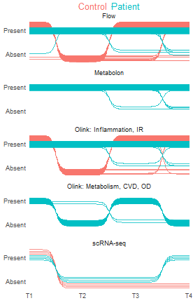
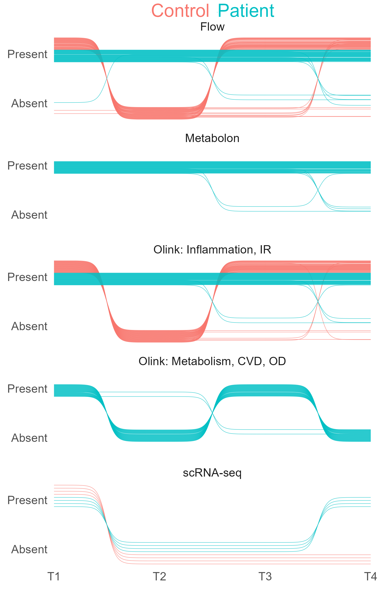
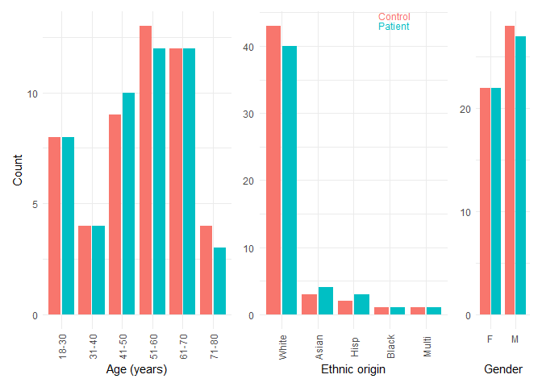
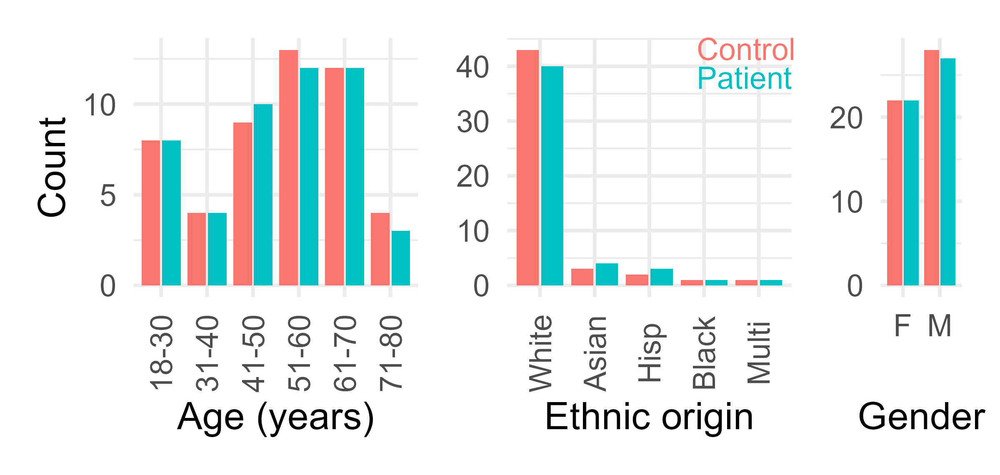
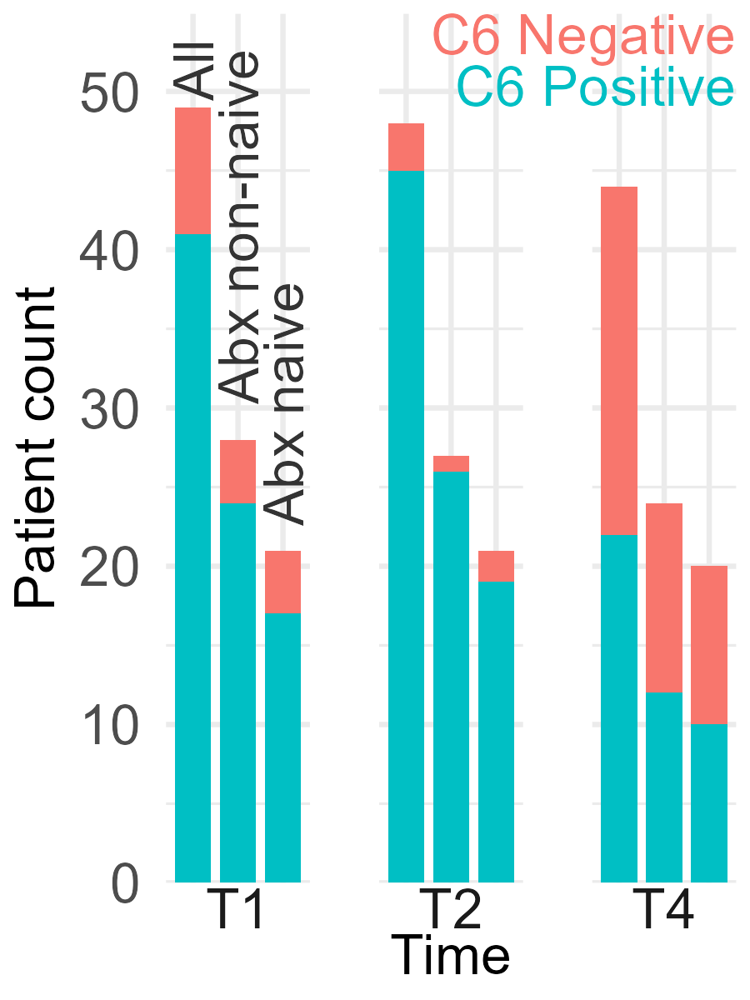
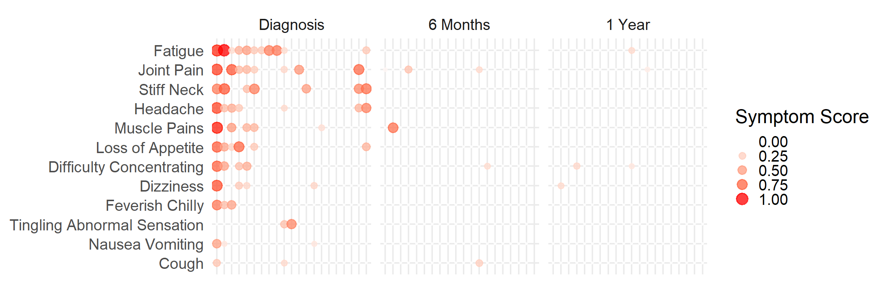
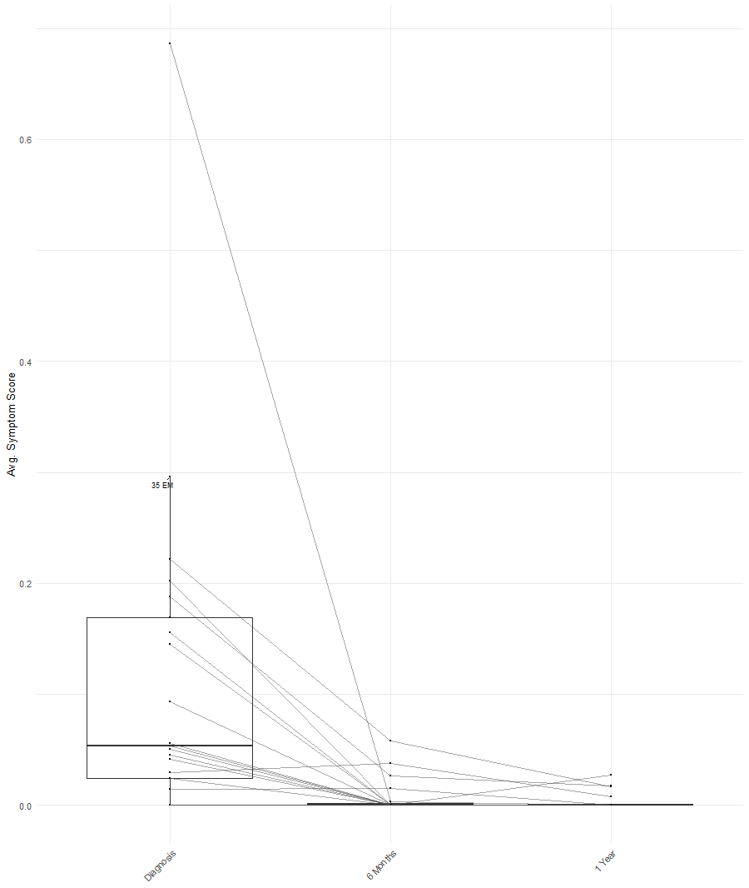
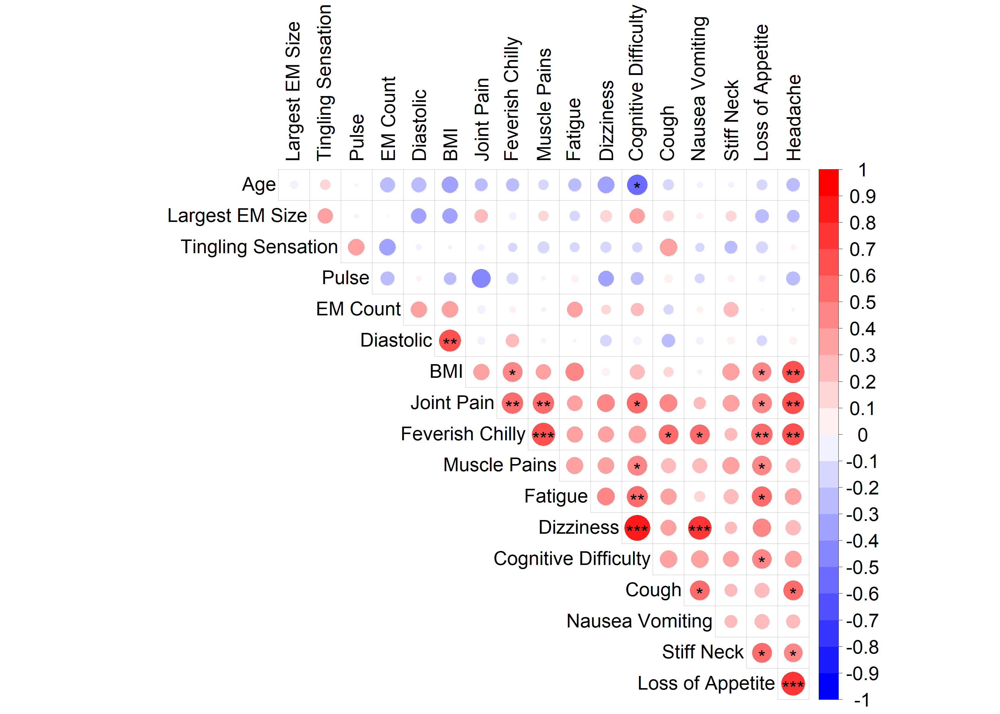

# Figure 1


<details class="code-fold">
<summary>Code</summary>

``` r
if (!requireNamespace("pacman", quietly = TRUE)) install.packages("pacman")

pacman::p_load(
  # Data wrangling and visualization
  tidyverse, # Core data wrangling and plotting
  ggrepel, # Repel overlapping text labels in ggplot2
  ggstance, # Horizontal geoms for ggplot2
  gghighlight, # Highlight ggplot2 layers based on conditions
  ggbump, # Curved bump trajectories for sample availability
  ggnewscale, # Multiple color/size scales in ggplot2
  geomtextpath,
  patchwork, # Combine multiple ggplots
  cowplot, # Additional plot layout tools
  camcorder, # Review plot proportionality before saving
  RColorBrewer, # Color palettes for plots
  Hmisc, # Various utilities (summary stats, tables, plots)
  ggpubr, # Publication-ready ggplot2 enhancements
  ggplotify, # Convert plots into ggplot objects
  conflicted, # Manage function conflicts

  # Bulk RNA-seq and statistical modeling
  # limma, # Linear models for microarray and RNA-seq
  # edgeR, # Differential expression for count data
  # DESeq2, # Differential expression for RNA-seq

  # Enrichment analysis and gene sets
  # clusterProfiler, # GO/KEGG enrichment analysis
  # enrichR, # Enrichment analysis via web APIs
  # msigdbr, # Molecular Signatures Database (MSigDB) in R
  # DOSE, # Disease Ontology Semantic and Enrichment analysis
  # org.Hs.eg.db, # Human gene annotation database
  # GEOquery

  # Heatmaps and Venn diagrams
  ComplexHeatmap, # Advanced customizable heatmaps
  pheatmap, # Simple heatmaps
  VennDiagram, # Venn diagram drawing
  UpSetR, # Set visualization (UpSet plots)
  factoextra, # Visualization for multivariate data (PCA, clustering)

  # Network and graph analysis
  # ggraph, # Graph/network visualization
  # tidygraph, # Tidy interface for graph data
  # igraph, # Core graph algorithms

  # # Machine learning
  # caret,             # Machine learning training and tuning
  # glmnet,            # Elastic-net regression (lasso + ridge)
  # glmmLasso,
  # e1071,             # SVM and other ML algorithms
  # mice,              # Multivariate imputation of missing values
  # matrixStats,       # Fast row/column computations
  # progress,          # Progress bars for loops
  # multtest
  # metap
  # Matrix.utils

  # # Single-cell RNA-seq analysis
  # DropletUtils,     # Handling droplet scRNA-seq outputs
  # Seurat,           # Single-cell RNA-seq toolkit
  # scater,           # SingleCellExperiment QC and plotting
  # scuttle,          # Utilities for SingleCellExperiment objects
  # SingleR,          # Automated cell type labeling
  # celldex,          # Reference datasets for SingleR
  # cellassign        # Probabilistic cell assignment (needs tensorflow)
  # tensorflow,       # TensorFlow backend for deep learning (needed by cellassign)
  # scCATCH

  # Table formatting and reports
  # kableExtra,        # Enhanced tables in HTML and LaTeX
  # officer,           # Create/edit Word and PowerPoint documents
  # openxlsx,          # Read/write Excel files
  ggtext,
  here,
  datapasta # Copy-paste data into Excel
)
```

</details>

<details class="code-fold">
<summary>Code</summary>

``` r
# Resolve conflicts
conflicts_prefer(dplyr::select,
                 dplyr::filter,
                 dplyr::slice,
                 dplyr::count,
                 dplyr::rename,
                 dplyr::desc)
```

</details>

    [conflicted] Will prefer dplyr::select over any other package.
    [conflicted] Will prefer dplyr::filter over any other package.
    [conflicted] Will prefer dplyr::slice over any other package.
    [conflicted] Will prefer dplyr::count over any other package.
    [conflicted] Will prefer dplyr::rename over any other package.
    [conflicted] Will prefer dplyr::desc over any other package.

<details class="code-fold">
<summary>Code</summary>

``` r
# Set a global theme and base size
theme_set(
  theme_minimal()
)

update_geom_defaults("text", list(size = 8, family = "Arial"))
```

</details>

### Panel B: Sample Availability Timeline

<details class="code-fold">
<summary>Code</summary>

``` r
time_levels <- c("T1", "T2", "T3", "T4")
dataset_levels <- c(
  "Flow",
  "Metabolon",
  "Olink: Inflammation, IR",
  "Olink: Metabolism, CVD, OD",
  "scRNA-seq"
)
condition_colors <- c(Control = "#F8766D", Patient = "#00BFC4")

processed_env <- new.env()
load(
  here("data", "processed", "01_proteomics_metabolomics", "Data.RData"),
  envir = processed_env
)
processed_data <- processed_env$data
sample_data <- processed_data$sampleData |>
  as_tibble() |>
  mutate(
    sample = as.character(sample),
    Subject_ID = as.character(Subject_ID),
    Condition = as.character(Condition),
    time = as.character(time)
  )

samples_with_data <- function(x) {
  rownames(as.data.frame(x))[rowSums(!is.na(as.data.frame(x))) > 0]
}

make_presence_table <- function(sample_table) {
  sample_table |>
    mutate(
      Subject_ID = as.character(Subject_ID),
      Condition = as.character(Condition),
      time = as.character(time),
      presence = 1L
    ) |>
    filter(
      Condition %in% names(condition_colors),
      time %in% time_levels
    ) |>
    distinct(Subject_ID, Condition, time, presence) |>
    complete(
      nesting(Subject_ID, Condition),
      time = time_levels,
      fill = list(presence = 0L)
    ) |>
    group_by(Subject_ID, Condition) |>
    filter(any(presence == 1L)) |>
    ungroup() |>
    mutate(
      Condition = factor(Condition, levels = names(condition_colors)),
      time = factor(time, levels = time_levels),
      presence = as.integer(presence)
    )
}

flow_panels <- c("bcell", "dcnk", "monocyte", "tcell")
flow_props_long <- purrr::map_dfr(flow_panels, function(panel_name) {
  panel_env <- new.env()
  load(
    here("data", "intermediate", "flow_gating", paste0(panel_name, ".RData")),
    envir = panel_env
  )
  panel_env[[panel_name]]$propsLong
})

flow_minimal <- flow_props_long |>
  inner_join(sample_data, by = c("id" = "sample")) |>
  distinct(Subject_ID, Condition, time) |>
  make_presence_table()

olink_old_minimal <- sample_data |>
  filter(sample %in% samples_with_data(processed_data$data)) |>
  distinct(Subject_ID, Condition, time) |>
  make_presence_table()

olink_new_minimal <- sample_data |>
  filter(sample %in% samples_with_data(processed_data$olinkNew)) |>
  distinct(Subject_ID, Condition, time) |>
  make_presence_table()

metabolon_minimal <- sample_data |>
  filter(sample %in% samples_with_data(processed_data$metabolon$pat_data)) |>
  distinct(Subject_ID, Condition, time) |>
  make_presence_table()

sc_minimal <- readr::read_csv(
  here("data", "metadata", "sc_sampleData.csv"),
  show_col_types = FALSE
) |>
  select(Subject_ID, Condition, time) |>
  make_presence_table() |>
  mutate(dataset = "scRNA-seq")

all_data <- bind_rows(
  flow_minimal |> mutate(dataset = "Flow"),
  metabolon_minimal |> mutate(dataset = "Metabolon"),
  olink_old_minimal |> mutate(dataset = "Olink: Inflammation, IR"),
  olink_new_minimal |> mutate(dataset = "Olink: Metabolism, CVD, OD"),
  sc_minimal
) |>
  mutate(dataset = factor(dataset, levels = dataset_levels)) |>
  group_by(dataset, Subject_ID, Condition) |>
  filter(any(presence == 1L)) |>
  ungroup()

make_lane_map <- function(dat, band_width = 0.30) {
  dat |>
    mutate(stream_id = interaction(dataset, Subject_ID, drop = TRUE)) |>
    distinct(dataset, stream_id, Condition) |>
    group_by(dataset, Condition) |>
    arrange(stream_id, .by_group = TRUE) |>
    mutate(
      lane_index = row_number(),
      lane_n = n(),
      block_base = if_else(Condition == "Control", 0, band_width / 2),
      lane = block_base + (lane_index - 0.5) * (band_width / 2) / lane_n
    ) |>
    ungroup() |>
    select(dataset, stream_id, Condition, lane)
}

lane_map <- make_lane_map(all_data, band_width = 0.30)

df_bump <- all_data |>
  mutate(
    x = as.integer(time),
    stream_id = interaction(dataset, Subject_ID, drop = TRUE)
  ) |>
  left_join(lane_map, by = c("dataset", "stream_id", "Condition")) |>
  mutate(y = if_else(presence == 1L, 1 - lane, lane)) |>
  arrange(dataset, stream_id, x) |>
  distinct(dataset, stream_id, x, y, Condition)

sample_availability_timeline <- ggplot() +
  facet_wrap(~ dataset, ncol = 1, strip.position = "top") +
  scale_x_continuous(
    breaks = seq_along(time_levels),
    labels = time_levels,
    expand = c(0, 0)
  ) +
  scale_y_continuous(
    limits = c(0, 1),
    breaks = c(0.2, 0.8),
    labels = c("Absent", "Present"),
    expand = c(0, 0)
  ) +
  scale_color_manual(
    name = NULL,
    labels = paste0(
      "<span style='color:",
      condition_colors,
      "'>",
      names(condition_colors),
      "</span>"
    ),
    values = condition_colors,
    guide = guide_legend(
      keywidth = grid::unit(0, "pt"),
      keyheight = grid::unit(1, "pt")
    )
  ) +
  theme_minimal(base_size = 8, base_family = "Arial") +
  theme(
    panel.grid = element_blank(),
    axis.title = element_blank(),
    legend.position = "top",
    legend.direction = "horizontal",
    legend.title = element_blank(),
    legend.text = ggtext::element_markdown(
      size = 10,
      margin = margin(0, 0, 0, 0)
    ),
    legend.box.margin = margin(-6, 0, -15, 0),
    legend.key = element_blank()
  ) +
  geom_bump(
    data = df_bump |> filter(Condition == "Control"),
    aes(x = x, y = y, group = stream_id, color = Condition),
    smooth = 12,
    linewidth = 0.1,
    alpha = 0.8,
    lineend = "round"
  ) +
  geom_bump(
    data = df_bump |> filter(Condition == "Patient"),
    aes(x = x, y = y, group = stream_id, color = Condition),
    smooth = 12,
    linewidth = 0.1,
    alpha = 0.8,
    lineend = "round"
  )

sample_availability_timeline
```

</details>

    Warning in grid.Call(C_stringMetric, as.graphicsAnnot(x$label)): font family
    not found in Windows font database

    Warning in grid.Call(C_textBounds, as.graphicsAnnot(x$label), x$x, x$y, : font
    family not found in Windows font database

    Warning in grid.Call.graphics(C_text, as.graphicsAnnot(x$label), x$x, x$y, :
    font family not found in Windows font database
    Warning in grid.Call.graphics(C_text, as.graphicsAnnot(x$label), x$x, x$y, :
    font family not found in Windows font database



<details class="code-fold">
<summary>Code</summary>

``` r
if (!fs::dir_exists("fig_1_files")) {
  fs::dir_create("fig_1_files")
}

pngfile <- fs::path("fig_1_files", "figure_01b_sample_availability_timeline.png")

ggsave(
  pngfile,
  sample_availability_timeline,
  device = ragg::agg_png,
  width = 2.88,
  height = 4.5,
  units = "in",
  dpi = 600
)

knitr::include_graphics(pngfile)
```

</details>



### Panel C: Prospective Cohort Demographics

<details class="code-fold">
<summary>Code</summary>

``` r
sampleData <- read_csv(
  here("data", "metadata", "sampleData.csv"),
  show_col_types = FALSE
) |>
  mutate(Subject_ID = Subject_ID |>
    as.character())
```

</details>

    New names:
    • `` -> `...1`

<details class="code-fold">
<summary>Code</summary>

``` r
condition_colors <- c(
  Control = "#F8766D",
  Patient = "#00BFC4"
)

condition_legend_labels <- paste0(
  "<span style='color:",
  unname(condition_colors),
  ";'>",
  names(condition_colors),
  "</span>"
)

prospective <- sampleData |>
  filter(time == "T1") |>
  dplyr::rename(
    `Ethnic origin` = `Ethnic_Origin`,
    `Age (years)` = Age_at_Time_of_Study_Entry
  ) |>
  dplyr::select(Subject_ID, Condition, `Ethnic origin`, Gender, `Age (years)`) |>
  mutate(
    Condition = factor(Condition, levels = c("Control", "Patient")),
    `Ethnic origin` = case_when(`Ethnic origin` == "W" ~ "White",
      `Ethnic origin` == "H" ~ "Hisp",
      `Ethnic origin` == "A" ~ "Asian",
      `Ethnic origin` == "B" ~ "Black",
      .default = "Multi"
    ),
    Gender = case_when(
      Gender == "Male" ~ "M",
      Gender == "Female" ~ "F"
    ),
    `Age (years)` = as.numeric(`Age (years)`)
  ) |>
  mutate(
    `Ethnic origin` = factor(
      `Ethnic origin`,
      levels = c("White", "Asian", "Hisp", "Black", "Multi", "Unk")
    ),
    Gender = factor(Gender, levels = c("F", "M")),
    age_interval = cut(
      `Age (years)`,
      breaks = c(18, 30, 40, 50, 60, 70, 80),
      labels = c("18-30", "31-40", "41-50", "51-60", "61-70", "71-80"),
      include.lowest = TRUE
    ) |>
      factor(levels = c("18-30", "31-40", "41-50", "51-60", "61-70", "71-80"))
  )

age_counts <- prospective |>
  count(age_interval, Condition, name = "n") |>
  complete(age_interval, Condition, fill = list(n = 0))

ethnicity_counts <- prospective |>
  count(`Ethnic origin`, Condition, name = "n") |>
  complete(`Ethnic origin`, Condition, fill = list(n = 0)) |> 
  filter(n > 0) |> 
  droplevels()

gender_counts <- prospective |>
  count(Gender, Condition, name = "n") |>
  complete(Gender, Condition, fill = list(n = 0))

prospective_age <- age_counts |>
  ggplot(aes(age_interval, n, fill = Condition)) +
  geom_col(position = position_dodge2(width = 0.9, preserve = "single")) +
  scale_fill_manual(
    values = condition_colors,
    breaks = names(condition_colors),
    labels = condition_legend_labels,
    drop = FALSE,
    guide = "none"
  ) +
  scale_x_discrete(drop = FALSE) +
  labs(x = "Age (years)", y = "Count") +
  theme(
    axis.text.x = element_text(angle = 90, vjust = 0.5),
    legend.position = "none"
  )

prospective_ethnicity <- ethnicity_counts |>
  ggplot(aes(`Ethnic origin`, n, fill = Condition)) +
  geom_col(position = position_dodge2(width = 0.9, preserve = "single")) +
  geom_point(
    aes(color = Condition),
    alpha = 0,
    size = 0,
    position = position_dodge2(width = 0.9, preserve = "single"),
    show.legend = TRUE
  ) +
  scale_fill_manual(
    values = condition_colors,
    breaks = names(condition_colors),
    labels = condition_legend_labels,
    drop = FALSE,
    guide = "none"
  ) +
  scale_color_manual(
    values = condition_colors,
    breaks = names(condition_colors),
    labels = condition_legend_labels,
    guide = guide_legend(
      override.aes = list(alpha = 0, size = 0),
      keyheight = grid::unit(0.01, "pt"),
      keywidth = grid::unit(0.01, "pt")
    )
  ) +
  scale_x_discrete(drop = FALSE) +
  labs(x = "Ethnic origin", y = "Count") +
  theme(
    axis.title.y = element_blank(),
    axis.text.x = element_text(angle = 90, vjust = 0.5),
    legend.position = c(0.6, 1),
    legend.justification = c(0, 1),
    legend.margin = margin(0, 0, 0, 0),
    legend.key = element_blank(),
    legend.key.height = grid::unit(0.01, "pt"),
    legend.key.width = grid::unit(0.01, "pt"),
    legend.text = ggtext::element_markdown(),
    legend.title = element_blank()
  )

prospective_gender <- gender_counts |>
  ggplot(aes(Gender, n, fill = Condition)) +
  geom_col(position = position_dodge2(width = 0.9, preserve = "single")) +
  scale_fill_manual(
    values = condition_colors,
    breaks = names(condition_colors),
    labels = condition_legend_labels,
    drop = FALSE,
    guide = "none"
  ) +
  scale_x_discrete(drop = FALSE) +
  labs(x = "Gender", y = "Count") +
  theme(
    axis.title.y = element_blank(),
    legend.position = "none"
  )

prospective_demographics <- prospective_age + prospective_ethnicity + prospective_gender +
  plot_layout(widths = c(3.5, 3.5, 1))

prospective_demographics
```

</details>



<details class="code-fold">
<summary>Code</summary>

``` r
# Save the plot as PNG
pngfile <- fs::path("fig_1_files/figure_01c_cohort_demographics.png")

ggsave(
  pngfile,
  prospective_demographics,
  device = ragg::agg_png,
  width = 4,
  height = 1.9,
  units = "in",
  dpi = 600
)

knitr::include_graphics(pngfile)
```

</details>



### Panel D: Lyme C6 Serology by Timepoint

<details class="code-fold">
<summary>Code</summary>

``` r
load(here("data", "raw", "01_proteomics_metabolomics", "OlinkPreprocessed.RData"))

text_size_pt <- 8
text_size_geom <- text_size_pt / ggplot2::.pt

c6_colors <- c(
  `C6 Negative` = "#F8766D",
  `C6 Positive` = "#00BFC4"
)

c6_legend_labels <- paste0(
  "<span style='color:",
  unname(c6_colors),
  ";'>",
  names(c6_colors),
  "</span>"
)

c6_by_antibiotic_group <- data |>
  purrr::pluck("sampleData") |>
  filter(
    Condition == "Patient",
    time == "T1"
  ) |>
  select(
    Subject_ID,
    days_of_prior_antibiotics,
    T1_lyme_disease_result,
    T2_lyme_disease_result,
    T4_lyme_disease_result
  ) |>
  mutate(
    `All` = TRUE,
    `Abx naive` = days_of_prior_antibiotics == 0,
    `Abx non-naive` = days_of_prior_antibiotics > 0
  ) |>
  pivot_longer(
    cols = c(`All`, `Abx naive`, `Abx non-naive`),
    names_to = "antibiotic_group",
    values_to = "include_group"
  ) |>
  filter(include_group) |>
  mutate(
    antibiotic_group = factor(
      antibiotic_group,
      levels = c("All", "Abx non-naive", "Abx naive")
    )
  ) |>
  group_by(antibiotic_group) |>
  mutate(group_denominator = n_distinct(Subject_ID)) |>
  ungroup() |>
  pivot_longer(
    cols = c(T1_lyme_disease_result, T2_lyme_disease_result, T4_lyme_disease_result),
    names_to = "time",
    values_to = "lyme_disease_result"
  ) |>
  mutate(
    time = str_remove(time, "_lyme_disease_result"),
    time = factor(time, levels = c("T1", "T2", "T4")),
    lyme_disease_result = str_squish(coalesce(as.character(lyme_disease_result), "")),
    C6 = case_when(
      str_detect(lyme_disease_result, regex("^Positive$", ignore_case = TRUE)) ~ "C6 Positive",
      str_detect(lyme_disease_result, regex("^Negative$", ignore_case = TRUE)) ~ "C6 Negative",
      lyme_disease_result == "" ~ NA_character_
    ),
    C6 = factor(C6, levels = c("C6 Negative", "C6 Positive"))
  ) |>
  filter(!is.na(C6)) |>
  count(time, antibiotic_group, group_denominator, C6, name = "n") |>
  group_by(time, antibiotic_group) |>
  mutate(antibiotic_group_label = as.character(antibiotic_group)) |>
  ungroup()

update_geom_defaults("text", list(size = text_size_geom, color = "black"))

group_label_df <- c6_by_antibiotic_group |>
  group_by(time, antibiotic_group_label) |>
  summarise(bar_top = sum(n), .groups = "drop") |>
  filter(time == "T1") |>
  mutate(
    antibiotic_group_label = factor(
      antibiotic_group_label,
      levels = c("All", "Abx non-naive", "Abx naive")
    )
  )

p <- c6_by_antibiotic_group |>
  mutate(
    antibiotic_group_label = factor(
      antibiotic_group_label,
      levels = unique(antibiotic_group_label)
    )
  ) |>
  ggplot(aes(x = antibiotic_group_label, y = n, fill = C6)) +
  geom_col(position = "stack", width = 0.8) +
  geom_point(
    aes(color = C6),
    alpha = 0,
    size = 0,
    show.legend = TRUE
  ) +
  # geom_text(stat = "identity", aes(label = n), position = position_stack(vjust = 0.5)) +
  geom_text(
    data = group_label_df,
    aes(x = antibiotic_group_label, y = bar_top, label = antibiotic_group_label),
    inherit.aes = FALSE,
    angle = 90,
    vjust = 0.5,
    hjust = -0.1,
    size = text_size_geom,
    color = "grey20"
  ) +
  facet_wrap(~ time, nrow = 1, scales = "fixed", strip.position = "bottom") +
  theme_minimal(base_size = text_size_pt) +
  scale_fill_manual(
    values = c6_colors,
    breaks = names(c6_colors),
    labels = c6_legend_labels,
    guide = "none"
  ) +
  scale_color_manual(
    values = c6_colors,
    breaks = names(c6_colors),
    labels = c6_legend_labels,
    guide = guide_legend(
      override.aes = list(alpha = 0, size = 0),
      keyheight = grid::unit(0.01, "pt"),
      keywidth = grid::unit(0.01, "pt")
    )
  ) +
  scale_y_continuous(
    limits = c(0, 54.9),
    expand = expansion(mult = c(0, 0), add = c(0, 0))
  ) +
  ylab("Patient count") +
  xlab("Time") +
  theme(
    panel.spacing.x = unit(10, "pt"),
    strip.background = element_blank(),
    strip.text.x.bottom = element_text(size = text_size_pt, margin = margin(t = 0)),
    axis.text.x = element_blank(),
    axis.text.y = element_text(size = text_size_pt, margin = margin(r = 0)),
    axis.title.x = element_text(size = text_size_pt, margin = margin(t = 0, b = 0)),
    axis.title.y = element_text(size = text_size_pt),
    axis.ticks = element_blank(),
    legend.position = c(1, 1),
    legend.direction = "vertical",
    legend.justification = c(1, 1),
    legend.title = element_blank(),
    legend.key = element_blank(),
    legend.key.height = grid::unit(0.01, "pt"),
    legend.key.width = grid::unit(0.01, "pt"),
    legend.text = ggtext::element_markdown(size = text_size_pt, hjust = 1),
    legend.spacing.y = unit(0.5, "pt"),
    legend.box.spacing = unit(0.2, "lines"),
    legend.margin = margin(0, 0, 0, 0),
    legend.box.margin = margin(0, 0, 0, 0),
    plot.margin = margin(2, 2, 2, 2, "pt")
  )

# create the directory if it doesn't exist
if (!fs::dir_exists("fig_1_files")) {
  fs::dir_create("fig_1_files")
}

p
```

</details>

    Warning in grid.Call.graphics(C_text, as.graphicsAnnot(x$label), x$x, x$y, :
    font family not found in Windows font database
    Warning in grid.Call.graphics(C_text, as.graphicsAnnot(x$label), x$x, x$y, :
    font family not found in Windows font database
    Warning in grid.Call.graphics(C_text, as.graphicsAnnot(x$label), x$x, x$y, :
    font family not found in Windows font database
    Warning in grid.Call.graphics(C_text, as.graphicsAnnot(x$label), x$x, x$y, :
    font family not found in Windows font database
    Warning in grid.Call.graphics(C_text, as.graphicsAnnot(x$label), x$x, x$y, :
    font family not found in Windows font database
    Warning in grid.Call.graphics(C_text, as.graphicsAnnot(x$label), x$x, x$y, :
    font family not found in Windows font database


<details class="code-fold">
<summary>Code</summary>

``` r
# Save the plot as PNG
pngfile <- fs::path("fig_1_files/figure_01d_c6_serology_by_timepoint.png")

ggsave(
  pngfile,
  p,
  device = ragg::agg_png,
  width = 1.5,
  height = 2,
  units = "in",
  dpi = 600
)

knitr::include_graphics(pngfile)
```

</details>



### Panel E: Symptom Severity Bubble Map

<details class="code-fold">
<summary>Code</summary>

``` r
load(here("data", "raw", "01_proteomics_metabolomics", "OlinkPreprocessed.RData"))

sams <- data$sampleData$time %in% c("T1", "T3", "T4") & data$sampleData$days_of_prior_antibiotics == 0 & data$sampleData$Condition == "Patient"
direct <- data$directSymptoms[sams, ]
time <- data$sampleData[sams, "time"]
d <- direct
colnames(d)[grep("Difficult", colnames(d))] <- "Difficulty Concentrating"
colnames(d) <- gsub("\\.", " ", colnames(d))
d2 <- d
d2 <- d2 / 7.6
d2 <- d2[order(time), ]
time <- sort(time)
rn <- rownames(d2)
d2 <- split(d2, time)
d2 <- lapply(d2, function(x) {
  x$`Avg. Symptom Score` <- rowMeans(x)
  x
})
d2 <- data.frame(do.call(rbind, d2))
rownames(d2) <- rn
d3 <- d2
d3[is.na(d3)] <- 0
hc1 <- rownames(d3)[time == "T1"][hclust(dist(d3[time == "T1", ]))$order]
# hc3 = rownames(d3)[time=="T3"][hclust(dist(d3[time=="T3",]))$order]
# hc4 = rownames(d3)[time=="T4"][hclust(dist(d3[time=="T4",]))$order]
hc3 <- na.omit(rownames(d3)[time == "T3"][match(gsub(" T.*", "", hc1), gsub(" T.*", "", rownames(d3)[time == "T3"]))])
hc4 <- na.omit(rownames(d3)[time == "T4"][match(gsub(" T.*", "", hc1), gsub(" T.*", "", rownames(d3)[time == "T4"]))])
hc1 <- c(hc1, hc3, hc4)
# hc2 = colnames(d3)[hclust(dist(t(d2)))$order]
hc2 <- names(sort(colSums(d3), decreasing = F))
d2 <- data.frame(cbind(id = rownames(d2), time = c("Diagnosis", "6 Months", "1 Year")[match(time, unique(time))], d2))
d2 <- pivot_longer(d2, cols = 3:ncol(d2), values_to = "Symptom Score")
d2$name <- gsub("\\.([A-Z])", " \\1", d2$name)
d2$name <- gsub("\\.([a-z])", " \\1", d2$name)
d2$id <- factor(d2$id, levels = hc1, ordered = T)
levs <- gsub("\\.([A-Z])", " \\1", hc2)
levs <- gsub("\\.([a-z])", " \\1", levs)
d2$name <- factor(d2$name, levels = levs, ordered = T)
d2$time <- factor(d2$time, levels = c("Diagnosis", "6 Months", "1 Year"), ordered = T)
d2 <- d2[order(d2$id), ]
p <- ggplot(d2[d2$name != "Avg. Symptom Score", ], aes(x = id, y = name, size = `Symptom Score`, col = `Symptom Score`)) +
  geom_point(alpha = 0.75) +
  scale_color_gradient(low = "white", high = "red", limits = c(0, 1), breaks = seq(0, 1, by = 0.25)) +
  guides(color = guide_legend(), size = guide_legend()) +
  scale_size_continuous(range = c(1, 10), limits = c(0, 1), breaks = seq(0, 1, by = 0.25)) +
  theme_minimal(base_size = 38) +
  theme(
    axis.text.x = element_blank(),
    axis.title.x = element_blank(),
    axis.title.y = element_blank()
  ) +
  facet_wrap(vars(time), nrow = 1, drop = TRUE, scales = "free_x")
# png("figures_final/Demographics/Symptom time bubble plot skinny.png",width = 600*3,height = 225*2)
# print(p)
# dev.off()

p
```

</details>

    Warning: Removed 12 rows containing missing values or values outside the scale range
    (`geom_point()`).



### Panel F: Average Symptom Score Over Time

<details class="code-fold">
<summary>Code</summary>

``` r
d2$id2 <- gsub(" T.*", "", d2$id)
outlier_35em <- d2 |>
  dplyr::filter(
    name == "Avg. Symptom Score",
    stringr::str_detect(as.character(id), "^201455( |$)"),
    time == "Diagnosis"
  )

p2 <- ggplot(d2[d2$name == "Avg. Symptom Score", ], aes(x = time, y = `Symptom Score`)) +
  geom_boxplot(show.legend = F, outlier.shape = NA, size = 0.5) +
  geom_point(alpha = 1, size = 0.5) +
  geom_line(aes(group = id2), show.legend = F, alpha = .5, size = 0.5, color = "grey30") +
  ggrepel::geom_text_repel(
    data = outlier_35em,
    aes(label = "35 EM"),
    size = 2.4,
    min.segment.length = 0,
    box.padding = 0.2,
    point.padding = 0.1,
    seed = 1,
    show.legend = FALSE
  ) +
  ylab("Avg. Symptom Score") +
  theme_minimal(base_size = 10) +
  theme(
    axis.text.x = element_text(angle = 45, hjust = 1),
    axis.title.x = element_blank()
  )
```

</details>

    Warning: Using `size` aesthetic for lines was deprecated in ggplot2 3.4.0.
    ℹ Please use `linewidth` instead.

<details class="code-fold">
<summary>Code</summary>

``` r
# png("figures_final/Demographics/Avg sym score boxplot.png",width = 225*3,height = 400*2)
# print(p2)
# dev.off()
#


pngfile <- fs::path("fig_1_files", "figure_01f_average_symptom_score_by_timepoint.png")
ggsave(
  pngfile,
  p2,
  device = ragg::agg_png,
  width = 1.35,
  height = 1.97,
  units = "in",
  dpi = 300
)
```

</details>

    Warning: Removed 1 row containing non-finite outside the scale range
    (`stat_boxplot()`).

    Warning: Removed 1 row containing missing values or values outside the scale range
    (`geom_point()`).

<details class="code-fold">
<summary>Code</summary>

``` r
p2
```

</details>

    Warning: Removed 1 row containing non-finite outside the scale range (`stat_boxplot()`).
    Removed 1 row containing missing values or values outside the scale range
    (`geom_point()`).



### Panel G: Symptom-Clinical Correlation Matrix

<details class="code-fold">
<summary>Code</summary>

``` r
pacman::p_load(corrplot)

# Match the old script's duplicate-collapsing preprocessing before selecting
# samples for the symptom-clinical correlation matrix.
samples <- gsub("_.$", "", rownames(data$assayData))
duplicated <- samples[duplicated(samples)]
cat(duplicated, sep = ", ")
```

</details>

    100452 T3, 101388 T1, 101388 T3, 101388 T4, 101388 T2, 102969 T3, 102969 T1, 111395 T3, 113162 T3, 115038 T1, 115038 T3, 115038 T4, 204177 T2

<details class="code-fold">
<summary>Code</summary>

``` r
data$assayData <- aggregate(data$assayData, by = list(Name = samples), FUN = mean, na.remove = TRUE)
rownames(data$assayData) <- gsub("_.$", "", data$assayData$Name)
data$assayData <- data$assayData[, -1]
featureData <- data$featureData
data[!names(data) %in% c("featureData", "featureDataNew", "samples_to_remove")] <- lapply(
  data[!names(data) %in% c("featureData", "featureDataNew", "samples_to_remove")],
  function(x) return(x[rownames(data$assayData), ])
)
data$featureData <- featureData
rm("duplicated", "samples", "featureData")

s <- data$sampleData
keep <- s$days_of_prior_antibiotics == 0 & s$Condition == "Patient" & s$time == "T1"
s <- s[keep, ]

# Exclude the 35-EM patient. Comment this block out to include them.
s <- s |>
  tibble::rownames_to_column("sample_rowname") |>
  dplyr::filter(
    as.character(Subject_ID) != "201455",
    !as.character(sample) %in% c("201455 T1", "201455 T2")
  )
s <- s |>
  tibble::column_to_rownames("sample_rowname")

sample_rows <- rownames(s)
s <- cbind(s, data$emData[sample_rows, ])
d <- data$directSymptoms[sample_rows, ]
s <- s[, c("Age_at_Time_of_Study_Entry", "Diastolic", "Pulse", "BMI", "largest_EM_Dimension", "Number_of_EM_at_Baseline")]
# cor(d,s,use='na.or.complete')
c <- Hmisc::rcorr(x = as.matrix(d), y = as.matrix(s), type = "spearman")

r <- c$r
p <- c$P

inner_join(
r  |> as.data.frame()  |> rownames_to_column(var = "variable1") |>  
  pivot_longer(cols = -1, values_to = "correlation", names_to = "variable2"),
p  |> as.data.frame()  |> rownames_to_column(var = "variable1") |>  
  pivot_longer(cols = -1, values_to = "p_value", names_to = "variable2"),
by = c("variable1", "variable2")
           ) |> filter(p_value <= 0.05) |> arrange(abs(correlation)) 
```

</details>

    # A tibble: 54 × 4
       variable1                                 variable2       correlation p_value
       <chr>                                     <chr>                 <dbl>   <dbl>
     1 Headache                                  Stiff.Neck            0.452  0.0454
     2 Stiff.Neck                                Headache              0.452  0.0454
     3 Loss.of.Appetite                          BMI                   0.461  0.0472
     4 BMI                                       Loss.of.Appeti…       0.461  0.0472
     5 Loss.of.Appetite                          Muscle.Pains          0.488  0.0289
     6 Muscle.Pains                              Loss.of.Appeti…       0.488  0.0289
     7 Loss.of.Appetite                          Difficulty.Con…       0.496  0.0262
     8 Difficulty.Concentrating..Memory.Problems Loss.of.Appeti…       0.496  0.0262
     9 Feverish.Chilly                           BMI                   0.497  0.0304
    10 BMI                                       Feverish.Chilly       0.497  0.0304
    # ℹ 44 more rows

<details class="code-fold">
<summary>Code</summary>

``` r
names <- colnames(r)
names <- levs <- gsub("\\.([A-Z])", " \\1", names)
names <- gsub("\\.([a-z])", " \\1", names)
names <- gsub("_", " ", names)
names <- gsub("\\. ", "/", names)
names[grep("^larg", names)] <- "Largest EM Size"
names[grep("^Age", names)] <- "Age"
names[grep("^Diffi", names)] <- "Cognitive Difficulty"
names[grep("^Tingling", names)] <- "Tingling Sensation"
names[grep("^Number", names)] <- "EM Count"

colnames(r) <- names
rownames(r) <- names
colnames(p) <- names
rownames(p) <- names

col <- colorRampPalette(c("blue", "white", "red"))(20)

png("fig_1_files/figure_01g_symptom_clinical_correlation_matrix.png", width = 2100, height = 600 * 3)

# significance stars
sig_stars <- ifelse(p <= 0.001, "***",
             ifelse(p <= 0.01,  "**",
             ifelse(p <= 0.05,  "*", "")))

# first draw the correlation plot
# base plot
corrplot(
  r,
  type = "upper", order = "hclust", col = col,
  tl.cex = 4, cl.cex = 4, tl.col = "black",
  diag = FALSE,
  p.mat = p,                                 # your Hmisc::rcorr() p-values
  sig.level = c(0.001, 0.01, 0.05),          # cutpoints for ***, **, *
  insig = "label_sig",                       # draw asterisks on significant cells
  pch.cex = 4,                               # asterisk size
  pch.col = "black",                        # asterisk color,
  mar = c(l = 0, 0, 0, 0) # This line removes the whitespace margins
)

# corrplot(r,type="upper", order="hclust", col=col,tl.cex = 3,cl.cex = 3,tl.col = 'black',diag = F,
#          p.mat = c$p, sig.level = 0.05, insig = "blank")
dev.off()
```

</details>

    png 
      2 

<details class="code-fold">
<summary>Code</summary>

``` r
# corrplot(r,
#   type = "upper", order = "hclust", col = col, tl.cex = 3, cl.cex = 3, tl.col = "black", diag = F,
#   p.mat = c$p, sig.level = 0.05, insig = "blank"
# )

corrplot_panel <- corrplot(
  r,
  type = "upper", order = "hclust", col = col,
  tl.cex = 4, cl.cex = 4, tl.col = "black",
  diag = FALSE,
  p.mat = p,
  sig.level = c(0.001, 0.01, 0.05),
  insig = "label_sig",
  pch.cex = 4,
  pch.col = "black",
  mar = c(l = 0, 0, 0, 0)
)
```

</details>



<details class="code-fold">
<summary>Code</summary>

``` r
invisible(corrplot_panel)
```

</details>

<details class="code-fold">
<summary>Code</summary>

``` r
sessionInfo()
```

</details>

    R version 4.4.1 (2024-06-14 ucrt)
    Platform: x86_64-w64-mingw32/x64
    Running under: Windows 11 x64 (build 22631)

    Matrix products: default


    locale:
    [1] LC_COLLATE=English_United States.utf8 
    [2] LC_CTYPE=English_United States.utf8   
    [3] LC_MONETARY=English_United States.utf8
    [4] LC_NUMERIC=C                          
    [5] LC_TIME=English_United States.utf8    

    time zone: America/Los_Angeles
    tzcode source: internal

    attached base packages:
    [1] grid      stats     graphics  grDevices utils     datasets  methods  
    [8] base     

    other attached packages:
     [1] corrplot_0.95         datapasta_3.1.0       here_1.0.1           
     [4] ggtext_0.1.2          factoextra_1.0.7      UpSetR_1.4.0         
     [7] VennDiagram_1.7.3     futile.logger_1.4.3   pheatmap_1.0.12      
    [10] ComplexHeatmap_2.20.0 conflicted_1.2.0      ggplotify_0.1.2      
    [13] ggpubr_0.6.0          Hmisc_5.1-3           RColorBrewer_1.1-3   
    [16] camcorder_0.1.0       cowplot_1.1.3         patchwork_1.3.0      
    [19] geomtextpath_0.1.4    ggnewscale_0.5.1      ggbump_0.1.0         
    [22] gghighlight_0.4.1     ggstance_0.3.7        ggrepel_0.9.5        
    [25] lubridate_1.9.3       forcats_1.0.0         stringr_1.5.1        
    [28] dplyr_1.1.4           purrr_1.0.2           readr_2.1.5          
    [31] tidyr_1.3.1           tibble_3.2.1          ggplot2_4.0.0        
    [34] tidyverse_2.0.0      

    loaded via a namespace (and not attached):
     [1] rstudioapi_0.16.0    jsonlite_1.8.9       shape_1.4.6.1       
     [4] magrittr_2.0.3       magick_2.8.4         farver_2.1.2        
     [7] rmarkdown_2.29       GlobalOptions_0.1.2  fs_1.6.6            
    [10] ragg_1.3.2           vctrs_0.6.5          memoise_2.0.1       
    [13] base64enc_0.1-3      rstatix_0.7.2        htmltools_0.5.8.1   
    [16] lambda.r_1.2.4       broom_1.0.6          Formula_1.2-5       
    [19] gridGraphics_0.5-1   htmlwidgets_1.6.4    plyr_1.8.9          
    [22] futile.options_1.0.1 cachem_1.1.0         commonmark_1.9.1    
    [25] lifecycle_1.0.4      iterators_1.0.14     pkgconfig_2.0.3     
    [28] R6_2.5.1             fastmap_1.2.0        clue_0.3-65         
    [31] digest_0.6.37        rsvg_2.6.0           colorspace_2.1-1    
    [34] S4Vectors_0.42.1     rprojroot_2.0.4      textshaping_0.4.0   
    [37] labeling_0.4.3       timechange_0.3.0     abind_1.4-5         
    [40] compiler_4.4.1       bit64_4.0.5          withr_3.0.2         
    [43] doParallel_1.0.17    htmlTable_2.4.3      S7_0.2.0            
    [46] backports_1.5.0      carData_3.0-5        ggsignif_0.6.4      
    [49] rjson_0.2.23         tools_4.4.1          foreign_0.8-86      
    [52] nnet_7.3-19          glue_1.8.0           gridtext_0.1.5      
    [55] checkmate_2.3.2      cluster_2.1.6        generics_0.1.3      
    [58] gtable_0.3.6         tzdb_0.4.0           data.table_1.15.4   
    [61] hms_1.1.3            utf8_1.2.4           xml2_1.3.6          
    [64] car_3.1-2            BiocGenerics_0.50.0  foreach_1.5.2       
    [67] pillar_1.10.1        markdown_1.13        yulab.utils_0.1.7   
    [70] vroom_1.6.5          circlize_0.4.16      bit_4.0.5           
    [73] tidyselect_1.2.1     knitr_1.49           gridExtra_2.3       
    [76] IRanges_2.38.1       svglite_2.1.3        stats4_4.4.1        
    [79] xfun_0.48            matrixStats_1.4.1    stringi_1.8.4       
    [82] yaml_2.3.10          pacman_0.5.1         evaluate_1.0.1      
    [85] codetools_0.2-20     cli_3.6.3            rpart_4.1.23        
    [88] systemfonts_1.1.0    Rcpp_1.0.13          png_0.1-8           
    [91] parallel_4.4.1       gifski_1.12.0-2      scales_1.4.0        
    [94] crayon_1.5.3         GetoptLong_1.0.5     rlang_1.1.4         
    [97] formatR_1.14        
