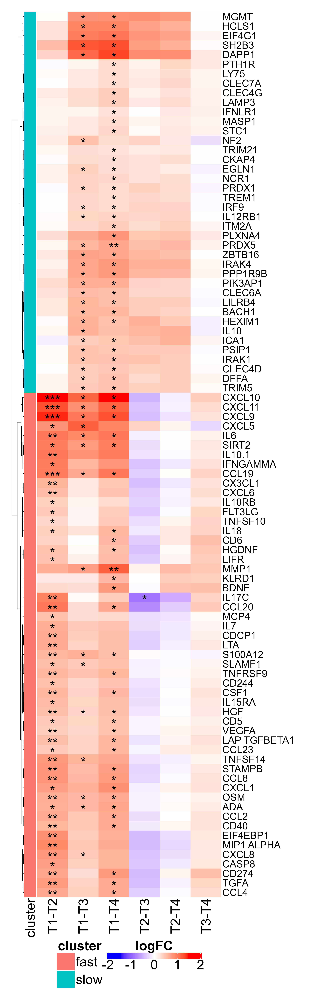
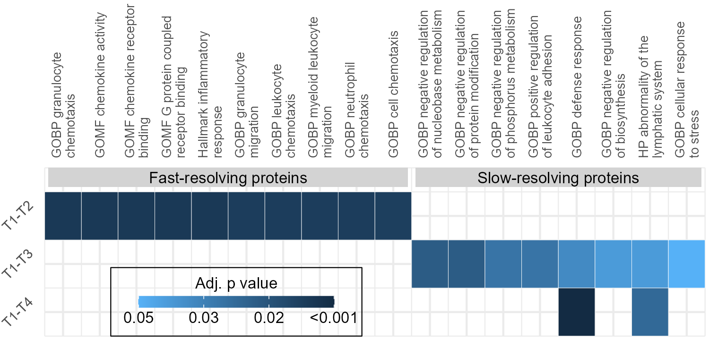
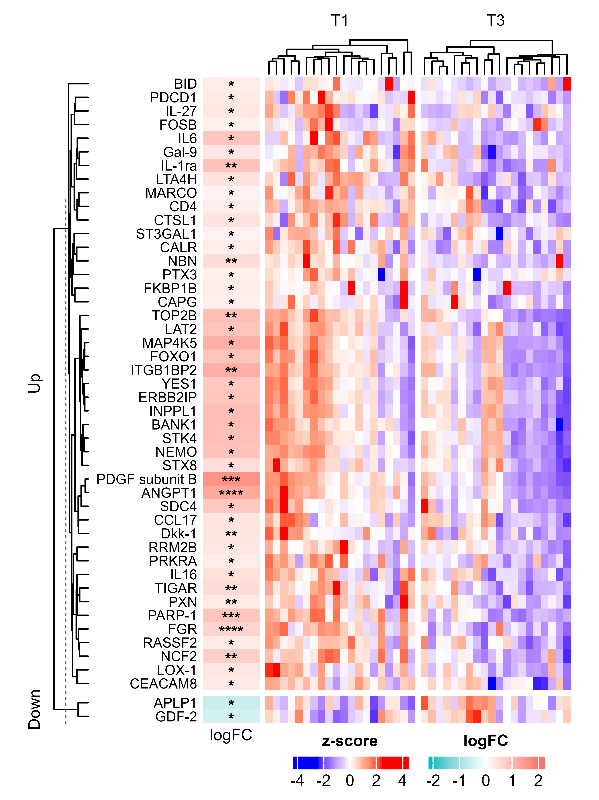
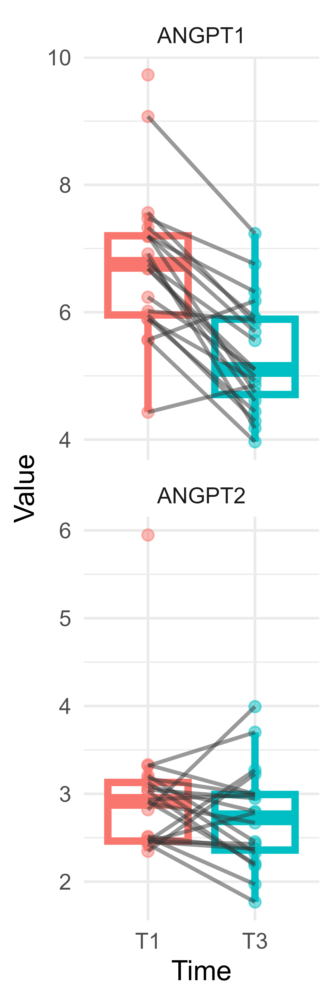
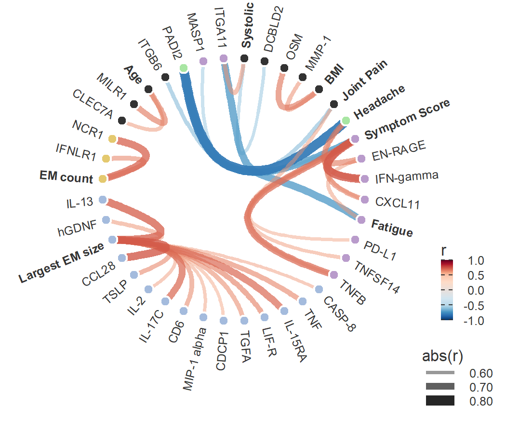

# Figure 2


## Setup

### Libraries

<details class="code-fold">
<summary>Code</summary>

``` r
options(repos = c(CRAN = "https://cran.rstudio.com"))
if (!requireNamespace("pacman", quietly = TRUE)) install.packages("pacman", repos = "https://cran.rstudio.com")

pacman::p_load(
  # Data wrangling and visualization
  tidyverse, # Core data wrangling and plotting
  ggrepel, # Repel overlapping text labels in ggplot2
  ggstance, # Horizontal geoms for ggplot2
  gghighlight, # Highlight ggplot2 layers based on conditions
  ggnewscale, # Multiple color/size scales in ggplot2
  patchwork, # Combine multiple ggplots
  cowplot, # Additional plot layout tools
  datapasta, # Paste dataframes directly into scripts
  camcorder, # Review plot proportionality before saving
  RColorBrewer, # Color palettes for plots
  Hmisc, # Various utilities (summary stats, tables, plots)
  ggpubr, # Publication-ready ggplot2 enhancements
  ggplotify, # Convert plots into ggplot objects

  # Bulk RNA-seq and statistical modeling
  limma, # Linear models for microarray and RNA-seq
  edgeR, # Differential expression for count data
  DESeq2, # Differential expression for RNA-seq

  # Enrichment analysis and gene sets
  clusterProfiler, # GO/KEGG enrichment analysis
  enrichR, # Enrichment analysis via web APIs
  enrichplot, # Visualization for enrichment results
  msigdbr, # Molecular Signatures Database (MSigDB) in R
  DOSE, # Disease Ontology Semantic and Enrichment analysis
  org.Hs.eg.db, # Human gene annotation database

  # Heatmaps and Venn diagrams
  ComplexHeatmap, # Advanced customizable heatmaps
  pheatmap, # Simple heatmaps
  VennDiagram, # Venn diagram drawing
  UpSetR, # Set visualization (UpSet plots)
  factoextra, # Visualization for multivariate data (PCA, clustering)

  # Network and graph analysis
  ggraph, # Graph/network visualization
  igraph, # Core graph algorithms
  sva, # Batch correction with ComBat

  # # Machine learning
  # caret,             # Machine learning training and tuning
  # glmnet,            # Elastic-net regression (lasso + ridge)
  # e1071,             # SVM and other ML algorithms
  # mice,              # Multivariate imputation of missing values
  # matrixStats,       # Fast row/column computations
  # progress,          # Progress bars for loops

  # # Single-cell RNA-seq analysis
  # DropletUtils,     # Handling droplet scRNA-seq outputs
  # Seurat,           # Single-cell RNA-seq toolkit
  # scater,           # SingleCellExperiment QC and plotting
  # scuttle,          # Utilities for SingleCellExperiment objects
  # SingleR,          # Automated cell type labeling
  # celldex,          # Reference datasets for SingleR
  # cellassign        # Probabilistic cell assignment (needs tensorflow)
  # tensorflow,       # TensorFlow backend for deep learning (needed by cellassign)

  # Table formatting and reports
  # kableExtra,        # Enhanced tables in HTML and LaTeX
  # officer,           # Create/edit Word and PowerPoint documents
  # openxlsx,          # Read/write Excel files
  install = FALSE
)

# Attach conflicted only after pacman has finished loading the other packages;
# otherwise pacman's internal filter() call is ambiguous.
library(conflicted)
conflicted::conflict_prefer("setdiff", "base", quiet = TRUE)
```

</details>

### Conflicts and Themes

<details class="code-fold">
<summary>Code</summary>

``` r
# Resolve conflicts
conflicted::conflicts_prefer(dplyr::select,
                             dplyr::filter,
                             dplyr::slice,
                             dplyr::rename,
                             dplyr::desc,
                             base::setdiff,
                             base::cbind,
                             base::rbind,
                             base::intersect,
                             base::union,
                             enrichplot::dotplot)

# Set a global theme and base size
theme_set(
  theme_minimal()
)
```

</details>

### Functions

<details class="code-fold">
<summary>Code</summary>

``` r
fixNames = function(x){
  x = gsub("\\..*","",x)
  x = gsub("-","",x)
  x = gsub("/.*","",x)
  x = gsub("\\(.*","",x)
  x = toupper(x)
  alias = alias2SymbolTable(x)
  x[!is.na(alias)] = alias[!is.na(alias)]
  x
}

returnSigStars = function(x){
  x2 = x
  x2[is.numeric(x) & x > 0.05] = "ns"
  x2[is.numeric(x) & x < 0.05] = "*"
  x2[is.numeric(x) & x < 0.01] = "**"
  x2[is.numeric(x) & x < 0.001] = "***"
  x2[is.numeric(x) & x < 0.0001] = "****"
  x2
}

gg_color_hue <- function(n) {
  hues = seq(15, 375, length = n + 1)
  hcl(h = hues, l = 65, c = 100)[1:n]
}
```

</details>

### Data Loading and Wrangling

<details class="code-fold">
<summary>Code</summary>

``` r
load(here::here("data", "raw", "01_proteomics_metabolomics", "OlinkPreprocessed.RData"))
data_unfiltered <- data

# Exclude the 35-EM patient. Comment this block out to include them.
samples_without_35EM <- data$sampleData |>
  tibble::rownames_to_column("sample_rowname") |>
  dplyr::filter(
    as.character(Subject_ID) != "201455",
    !as.character(sample) %in% c("201455 T1", "201455 T2")
  ) |>
  dplyr::pull(sample_rowname)

data$sampleData <- data$sampleData[samples_without_35EM, , drop = FALSE]
data$assayData <- data$assayData[samples_without_35EM, , drop = FALSE]
data$data <- data$data[samples_without_35EM, , drop = FALSE]
data$directSymptoms <- data$directSymptoms[samples_without_35EM, , drop = FALSE]
data$confoundingSymptoms <- data$confoundingSymptoms[samples_without_35EM, , drop = FALSE]
data$emData <- data$emData[samples_without_35EM, , drop = FALSE]
data$symptomData <- data$symptomData[samples_without_35EM, , drop = FALSE]
data$treatmentData <- data$treatmentData[samples_without_35EM, , drop = FALSE]
data$olinkNew <- data$olinkNew[samples_without_35EM, , drop = FALSE]
data$olinkNewFail <- data$olinkNewFail[samples_without_35EM, , drop = FALSE]

# Match the original Olink preprocessing used for the manuscript protein analyses.
Inflammation = data$assayData[, data$featureData$panel == "Inflammation"]
ImmuneResponse = data$assayData[, data$featureData$panel == "ImmuneResponse"]
Inflammation = Inflammation[apply(Inflammation, 1, function(x) sum(is.na(x)) == 0), ]
ImmuneResponse = ImmuneResponse[apply(ImmuneResponse, 1, function(x) sum(is.na(x)) == 0), ]

inf_batch = data$sampleData[rownames(Inflammation), "InflammationBatch"]
ir_batch = data$sampleData[rownames(ImmuneResponse), "ImmuneResponseBatch"]

mm1 = model.matrix(
  ~ Condition:days_post_ab + Gender + Age_at_Time_of_Study_Entry,
  data$sampleData[rownames(Inflammation), ]
)
mm2 = model.matrix(
  ~ Condition:days_post_ab + Gender + Age_at_Time_of_Study_Entry,
  data$sampleData[rownames(ImmuneResponse), ]
)

Inflammation = invisible(as.data.frame(t(sva::ComBat(t(Inflammation), inf_batch, mod = mm1))))
ImmuneResponse = invisible(as.data.frame(t(sva::ComBat(t(ImmuneResponse), ir_batch))))

data$assayData[rownames(Inflammation), colnames(Inflammation)] = Inflammation
data$assayData[rownames(ImmuneResponse), colnames(ImmuneResponse)] = ImmuneResponse

samples = gsub("_.$", "", rownames(data$assayData))
duplicated = samples[duplicated(samples)]
cat(duplicated, sep = ", ")
```

</details>

    100452 T3, 101388 T1, 101388 T3, 101388 T4, 101388 T2, 102969 T3, 102969 T1, 111395 T3, 113162 T3, 115038 T1, 115038 T3, 115038 T4, 204177 T2

<details class="code-fold">
<summary>Code</summary>

``` r
data$assayData = aggregate(data$assayData, by = list(Name = samples), FUN = mean, na.remove = T)
rownames(data$assayData) = gsub("_.$", "", data$assayData$Name)
data$assayData = data$assayData[, -1]
featureData = data$featureData
data[!names(data) %in% c("featureData", "featureDataNew", "samples_to_remove")] = lapply(
  data[!names(data) %in% c("featureData", "featureDataNew", "samples_to_remove")],
  function(x) return(x[rownames(data$assayData), ])
)
data$featureData = featureData

rm(
  "duplicated", "featureData", "ImmuneResponse", "Inflammation",
  "inf_batch", "ir_batch", "mm1", "mm2", "samples"
)

factors = data$sampleData[!is.na(data$sampleData$time), c("Subject_ID","time","days_post_ab")]
colnames(factors) = c("Patient","Time","DaysPostAB")
factors$Patient = as.factor(factors$Patient)
factors$Time = as.factor(factors$Time)
factors$Type = rep("p",dim(factors)[1])
factors$Type[grep("^11|^21",rownames(factors))] = "c"
factors$Type = as.factor(factors$Type)
factors$naive = rep(F,dim(factors)[1])
factors$naive[factors$Patient%in%unique(factors$Patient[factors$DaysPostAB==0])] = T
levels(factors$Time) = c(levels(factors$Time),"TC")
factors$Time[factors$Type=="c"] = "TC"
factors$number_of_em = data$emData[rownames(factors),"Number_of_EM_at_Baseline"]
factors$em_dimension = data$emData[rownames(factors),"largest_EM_Dimension"]
factors$age = data$sampleData[rownames(factors),"Age_at_Time_of_Study_Entry"]
factors$gender = data$sampleData[rownames(factors),"Gender"]
factors$serology = data$sampleData[rownames(factors),"T1_lyme_disease_result"]
factors = cbind(factors,data$sampleData[rownames(factors),c("Systolic","Diastolic","Pulse","BMI")])

sams = data$sampleData$time%in%c("T1","T3","T4")&data$sampleData$days_of_prior_antibiotics==0&data$sampleData$Condition=="Patient"
direct = data$directSymptoms[sams,]
```

</details>

## Figure Panels

### Panel A: Pairwise Protein Differential Expression Heatmap

<details class="code-fold">
<summary>Code</summary>

``` r
# Pairwise DE ----
times = c("T1","T2","T3","T4")
timeComps = list()
for(i in 1:length(times)){
  for(j in 1:length(times)){
    if(i!=j&i<j){
      timeComps[[length(timeComps)+1]] = c(times[i],times[j])
      names(timeComps)[length(timeComps)] = paste0(times[i],"-",times[j])
    }
  }
}

proteins = colnames(data$assayData)

pFrame = data.frame(proteins = proteins)
adj_pFrame = data.frame(proteins = proteins)
logFCFrame = data.frame(proteins = proteins)

rownames(pFrame) = proteins
rownames(adj_pFrame) = proteins
rownames(logFCFrame) = proteins

de_list = list()
fit_list = list()

for(i in 1:length(timeComps)){
  comparison = timeComps[[i]]
  naive = c(TRUE)
  type = c("p")
  
  factorSub = factors[factors$Type%in%type&factors$Time%in%comparison&factors$naive%in%naive,]
  factorSub = lapply(factorSub,FUN = factor)
  ids = paste0(factorSub$Patient," ",factorSub$Time)
  
  patient = factorSub$Patient
  time = factorSub$Time
  naive = factorSub$naive
  type = factorSub$Type
  daysPostAB = factorSub$DaysPostAB
  age = data$sampleData[ids,"Age_at_Time_of_Study_Entry"]
  sero = data$sampleData[ids,"T1_lyme_disease_result"]
  gender = data$sampleData[ids,"Gender"]
  
  # if(!"T2"%in%comparison){
  #   systolic = data$sampleData[ids,"Sytolic"]
  #   diastolic = data$sampleData[ids,"Diastolic"]
  #   pulse = data$sampleData[ids,"Pulse"]
  #   bmi = data$sampleData[ids,"BMI"]
  #   
  #   mm = model.matrix(~0+patient+time+age+sero+gender+systolic+diastolic+pulse+bmi)
  # }else{
  mm = model.matrix(~0+patient+time+age+sero+gender)
  # }
  
  invisible(capture.output(
    fit <- suppressWarnings(
      lmFit(t(data$assayData[paste0(as.character(patient), " ", as.character(time)), ]), mm)
    )
  ))
  fit <- eBayes(fit)
  
  fit_list[[i]] = fit
  
  top = limma::topTable(fit, coef=paste0("time",comparison[2]),number = Inf)
  
  de_list[[i]] = top
  
  top = top[proteins,]
  
  pFrame[,names(timeComps)[i]] = top$P.Val
  adj_pFrame[,names(timeComps)[i]] = top$adj.P.Val
  logFCFrame[,names(timeComps)[i]] = top$logFC
}
names(de_list) = unlist(lapply(timeComps, paste, collapse = "-"))
names(fit_list) = unlist(lapply(timeComps, paste, collapse = "-"))

#Clean up differential expression results ~~~~~~~

logFCFrame = logFCFrame[,-1]
pFrame = pFrame[,-1]
adj_pFrame = adj_pFrame[,-1]
pairwise = list(logFC = logFCFrame, p = pFrame, p.adj = adj_pFrame)
logFCFrame = logFCFrame[!apply(adj_pFrame,MARGIN = 1,function(x) sum(x<.05) == 0),]
logFCFrame = logFCFrame[order(rowSums(logFCFrame,na.rm = T),decreasing = T),]
adj_pFrame = adj_pFrame[rownames(logFCFrame), colnames(logFCFrame)]
rownames(logFCFrame) = gsub("\\.", " ", rownames(logFCFrame))
rownames(adj_pFrame) = gsub("\\.", " ", rownames(adj_pFrame))
panel = data$featureData$panel[match(rownames(logFCFrame),data$featureData$protein)]
rownames(logFCFrame) = make.unique(fixNames(rownames(logFCFrame)))
rownames(adj_pFrame) = make.unique(fixNames(rownames(adj_pFrame)))

# Plot Heatmap ~~~~~~~~~~~~~~~~~~~~~~~~~~~~~~~~~~
col_fun = circlize::colorRamp2(c(-1.5, 0, 1.5), c("blue", "white","red"))

cell_fun = function(j, i, x, y, width, height, fill) {
  txt = returnSigStars(adj_pFrame[i, j])
  if(txt=="ns")txt = ""
  grid.text(txt, x, y, gp = gpar(fontsize = 32),vjust=.8)
}
hc1 = hclust(dist(-1*logFCFrame),method = "ward.D2")
infimm_clust = paste0("c",cutree(hc1,2))
infimm_clust[infimm_clust=="c1"] = 'fast'
infimm_clust[infimm_clust=="c2"] = 'slow'
names(infimm_clust) = rownames(logFCFrame)

# Keep clustering based on the current data, but rotate the dendrogram so
# the fast-resolving cluster is displayed at the bottom, matching the manuscript layout.
row_dend_2a <- reorder(
  as.dendrogram(hc1),
  wts = ifelse(infimm_clust[rownames(logFCFrame)] == "fast", 1, 0),
  agglo.FUN = mean
)

pairwise$cluster = rep("none",nrow(pairwise$logFC))
pairwise$cluster[names(infimm_clust)] = infimm_clust
rowanno = rowAnnotation(cluster = infimm_clust,
                        col=list(cluster=c(fast="#F8766D",slow="#00BFC4")),
                        annotation_name_gp = gpar(fontsize=32),
                        # width = unit(5000,"cm"),
                        simple_anno_size = unit(1,"cm"),
                        annotation_legend_param = list(legend_width=unit(10,"cm"),
                                                       labels_gp=gpar(fontsize=32),
                                                       grid_height = unit(15, "mm"),
                                                       grid_width = unit(15, "mm"),
                                                       title_gap = unit(30, "mm"),
                                                       title_position = "topcenter",
                                                       title_gp = gpar(fontsize = 32, fontface = "bold")))
hm = Heatmap(matrix = -1*logFCFrame,
             cluster_columns = F,
             cell_fun = cell_fun,
             col = col_fun,
             cluster_rows = row_dend_2a,
             left_annotation = rowanno,
             row_names_gp = gpar(fontsize=24),
             column_names_gp = gpar(fontsize=32),
             heatmap_legend_param = list(title="logFC",legend_height=unit(10,"cm"),
                                         title_gap = unit(300, "mm"),
                                         legend_height=unit(5,"mm"),
                                         legend_width=unit(80,"mm"),
                                         legend_direction = "horizontal",
                                         labels_gp=gpar(fontsize=32),
                                         grid_height = unit(5, "mm"),
                                         grid_width = unit(80, "mm"),
                                         title_position = "topcenter",
                                         title_gp = gpar(fontsize = 32, fontface = "bold")),
             name = "logFC")

figure2a <- here::here("fig_2_files", "figure_02a_pairwise_protein_differential_expression_heatmap.png")

ragg::agg_png(
  filename = figure2a,
  width = 10.42,
  height = 33.33,
  units = "in",
  res = 300,
  scaling = 1
)

de_olink_new <- ComplexHeatmap::draw(
  hm,
  padding = unit(c(1, 1, 1, 1.5), "cm"),
  heatmap_legend_side = "bottom"
)

grDevices::dev.off() |> invisible()

knitr::include_graphics(figure2a)
```

</details>



### Panel B: GSEA Pathway Enrichment Heatmap

<details class="code-fold">
<summary>Code</summary>

``` r
background = rownames(pairwise$p)

if (requireNamespace("BiocParallel", quietly = TRUE)) {
  BiocParallel::register(BiocParallel::SerialParam(), default = TRUE)
}

m_df = msigdbr(species = "Homo sapiens")
m_df = as.data.frame(m_df)
m_t2g = m_df |>
  dplyr::filter(
    gs_cat == "H" |
      (gs_cat == "C5" & gs_subcat %in% c("GO:BP", "GO:MF", "HPO")) #|
    # (gs_cat == "C2" & gs_subcat == "CP:REACTOME")
  ) |>
  dplyr::select(gs_name, human_gene_symbol) |>
  dplyr::filter(human_gene_symbol %in% background) |>
  dplyr::distinct()

geneList = 1-pairwise$p$`T1-T2`
names(geneList) = rownames(pairwise$logFC)
geneList = sort(geneList,decreasing = T)
gseaRes12 = suppressMessages(clusterProfiler::GSEA(geneList,  pAdjustMethod = "BH", TERM2GENE = m_t2g, eps = 0, seed = TRUE, verbose = FALSE))

geneList = 1-pairwise$p$`T1-T3`
names(geneList) = rownames(pairwise$logFC)
geneList = sort(geneList,decreasing = T)
gseaRes13 = suppressMessages(clusterProfiler::GSEA(geneList,  pAdjustMethod = "BH",
 TERM2GENE = m_t2g, eps = 0, seed = TRUE, verbose = FALSE))

geneList = 1-pairwise$p$`T1-T4`
names(geneList) = rownames(pairwise$logFC)
geneList = sort(geneList,decreasing = T)
gseaRes14 = suppressMessages(clusterProfiler::GSEA(geneList,  pAdjustMethod = "BH", TERM2GENE = m_t2g, eps = 0, seed = TRUE, verbose = FALSE))

t12 = as.data.frame(gseaRes12)
t13 = as.data.frame(gseaRes13)
t14 = as.data.frame(gseaRes14)
if (!"ID" %in% colnames(t12)) t12$ID = rownames(t12)
if (!"ID" %in% colnames(t13)) t13$ID = rownames(t13)
if (!"ID" %in% colnames(t14)) t14$ID = rownames(t14)
if (nrow(t12) == 0 && nrow(t13) > 0) {
  t12 = t13[FALSE, , drop = FALSE]
}
if (nrow(t12) == 0 && nrow(t14) > 0) {
  t12 = t14[FALSE, , drop = FALSE]
}
if (nrow(t13) == 0) {
  t13 = t12[FALSE, , drop = FALSE]
}
if (nrow(t14) == 0) {
  t14 = t12[FALSE, , drop = FALSE]
}
if (nrow(t12) == 0 && nrow(t13) == 0 && nrow(t14) == 0) {
  stop("No enriched pathways were found for T1-T2, T1-T3, or T1-T4.")
}

# Match dotplot()'s default display cap while using the full GSEA result table.
t12 = t12 |>
  dplyr::filter(p.adjust < 0.05) |>
  dplyr::arrange(p.adjust, ID) |>
  dplyr::slice_head(n = 10)
t13 = t13 |>
  dplyr::filter(p.adjust < 0.05) |>
  dplyr::arrange(p.adjust, ID) |>
  dplyr::slice_head(n = 10)
t14 = t14 |>
  dplyr::filter(p.adjust < 0.05) |>
  dplyr::semi_join(
    dplyr::bind_rows(
      t12 |> dplyr::filter(p.adjust < 0.05) |> dplyr::select(ID),
      t13 |> dplyr::filter(p.adjust < 0.05) |> dplyr::select(ID)
    ) |>
      dplyr::distinct(ID),
    by = "ID"
  ) |>
  dplyr::arrange(p.adjust, ID)

t12$comparison = rep("T1-T2", nrow(t12))
t13$comparison = rep("T1-T3", nrow(t13))
t14$comparison = rep("T1-T4", nrow(t14))

d = do.call(rbind,list(t12, t13, t14))
format_gsea_pathway_label <- function(pathway_id) {
  pathway_label <- gsub("_", " ", pathway_id)
  known_shortforms <- c(
    GOBP = "GOBP", GOCC = "GOCC", GOMF = "GOMF", HP = "HP",
    DNA = "DNA", RNA = "RNA", MRNA = "mRNA", MIRNA = "miRNA",
    T = "T", B = "B", G = "G", NK = "NK", MHC = "MHC", HLA = "HLA", II = "II",
    IL1 = "IL1", IL2 = "IL2", IL4 = "IL4", IL6 = "IL6", IL10 = "IL10", IL12 = "IL12", IL17 = "IL17", IL18 = "IL18",
    TNF = "TNF", TNFA = "TNFA", IFN = "IFN", IFNA = "IFNA", IFNB = "IFNB", IFNG = "IFNG",
    NF = "NF", KB = "KB", NFKB = "NFKB", JAK = "JAK", STAT = "STAT", STAT1 = "STAT1", STAT2 = "STAT2", STAT3 = "STAT3", STAT4 = "STAT4", STAT5 = "STAT5", STAT6 = "STAT6",
    TGF = "TGF", TGFB = "TGFB",
    EGF = "EGF", FGF = "FGF", VEGF = "VEGF", MAPK = "MAPK", PI3K = "PI3K", AKT = "AKT", MTOR = "MTOR", ERK = "ERK", JNK = "JNK",
    ER = "ER", UPR = "UPR", ROS = "ROS", ATP = "ATP", ADP = "ADP", AMP = "AMP", GTP = "GTP", GDP = "GDP",
    NAD = "NAD", NADH = "NADH", NADP = "NADP", NADPH = "NADPH"
  )
  shortforms <- pathway_label |>
    stringr::str_extract_all("\\b[A-Za-z0-9]+\\b") |>
    unlist() |>
    stringr::str_to_upper() |>
    (\(x) unique(known_shortforms[x[x %in% names(known_shortforms)]]))()

  pathway_label <- pathway_label |>
    stringr::str_to_lower() |>
    stringr::str_to_sentence()

  for (shortform in shortforms) {
    pathway_label <- stringr::str_replace_all(
      pathway_label,
      stringr::regex(paste0("\\b", stringr::str_to_lower(shortform), "\\b"), ignore_case = TRUE),
      shortform
    )
  }

  pathway_label
}

d$ID = vapply(d$ID, format_gsea_pathway_label, character(1))
d$ID[d$ID == "GOBP positive regulation of leukocyte cell cell adhesion"] <-
  "GOBP positive regulation of leukocyte adhesion"

d$ID[d$ID == "GOBP negative regulation of protein modification process"] <-
  "GOBP negative regulation of protein modification"

d$ID[d$ID == "GOBP negative regulation of phosphorus metabolic process"] <-
  "GOBP negative regulation of phosphorus metabolism"

d$ID[d$ID == "GOBP negative regulation of nucleobase containing compound metabolic process"] <-
  "GOBP negative regulation of nucleobase metabolism"

d$ID[d$ID == "GOBP negative regulation of biosynthetic process"] <-
  "GOBP negative regulation of biosynthesis"

d$comparison = factor(d$comparison, levels = c("T1-T2", "T1-T3", "T1-T4"))

d$ID = factor(d$ID,levels = unique(c(d$ID[d$comparison=="T1-T2"], d$ID[d$comparison=="T1-T3"],
                                     d$ID[d$comparison=="T1-T4"])),ordered = T)

pathway_levels <- levels(d$ID)
pathway_labels <- vapply(
  strwrap(pathway_levels, width = 25, simplify = FALSE),
  paste,
  character(1),
  collapse = "\n"
)

d <- d |>
  mutate(
    pathway_x = match(as.character(ID), pathway_levels),
    comparison_y = dplyr::case_match(
      as.character(comparison),
      "T1-T2" ~ 3,
      "T1-T3" ~ 2,
      "T1-T4" ~ 1
    )
  )

pathway_groups <- tibble::tibble(
  ID = pathway_levels,
  pathway_x = seq_along(pathway_levels)
) |>
  mutate(
    protein_resolution = if_else(
      ID %in% as.character(unique(d$ID[d$comparison == "T1-T2"])),
      "Fast-resolving proteins",
      "Slow-resolving proteins"
    )
  )

x_annotations <- pathway_groups |>
  group_by(protein_resolution) |>
  summarise(
    xmin = min(pathway_x) - 0.4,
    xmax = max(pathway_x) + 0.4,
    x = mean(c(xmin, xmax)),
    .groups = "drop"
  ) |>
  mutate(
    protein_resolution = factor(
      protein_resolution,
      levels = c("Fast-resolving proteins", "Slow-resolving proteins")
    )
  ) |>
  arrange(protein_resolution)

p_adjust_limits <- range(d$p.adjust, na.rm = TRUE)
p_adjust_breaks <- c(
  p_adjust_limits[1],
  seq(p_adjust_limits[1], p_adjust_limits[2], length.out = 4)[2:3],
  p_adjust_limits[2]
)

olink_gsea <- ggplot(d,aes(x=pathway_x,y=comparison_y))+
  geom_tile(aes(fill=p.adjust), width = 1, height = 1, colour = "white", linewidth = 0.1)+
  geom_rect(
    data = x_annotations,
    aes(xmin = xmin, xmax = xmax, ymin = 3.6, ymax = 4.0),
    inherit.aes = FALSE,
    fill = "lightgray",
    colour = NA
  )+
  geom_text(
    data = x_annotations,
    aes(x = x, y = 3.8, label = protein_resolution),
    inherit.aes = FALSE,
    size = 2.8
  )+
  scale_fill_gradient(
    breaks = p_adjust_breaks,
    labels = function(x) ifelse(
      x > 0 & round(x, 2) == 0,
      "<0.001",
      sprintf("%.2f", x)
    ),
    guide = guide_colorbar(
      title = "Adj. p value",
      direction = "horizontal",
      reverse = TRUE,
      draw.llim = TRUE,
      draw.ulim = TRUE,
      title.position = "top",
      title.hjust = 0.5,
      barwidth = unit(100, "pt"),
      barheight = unit(6, "pt")
    )
  )+
  scale_x_continuous(
    position = "top",
    breaks = seq_along(pathway_levels),
    labels = pathway_labels,
    # limits = c(0.5, length(pathway_levels) + 0.5),
    expand = c(0, 0)
  )+
  scale_y_continuous(
    breaks = c(1, 2, 3),
    labels = c("T1-T4", "T1-T3", "T1-T2"),
    limits = c(0.5, 4),
    expand = c(0, 0)
  )+
  coord_cartesian(clip = "off")+
  theme_minimal()+
  theme(
    legend.position = c(0.1, 0.00),
    legend.justification = c(0, 0),
    legend.margin = margin(4, 14, 5, 14),
    legend.box.margin = margin(0, 0, 0, 0),
    legend.background = element_rect(fill = NA, colour = "black", linewidth = 0.25),
    legend.key.size = unit(8,'pt'),
    legend.text = element_text(size = 8, margin = margin(t = 2)),
    legend.title = element_text(size= 8, lineheight = 0.9, margin = margin(b = 3)),
    axis.text.x.top = element_text(size = 6.5, angle = 90, hjust = 0, vjust = 0.5),
    axis.text.x.bottom = element_blank(),
    axis.text.y = element_text(size = 7, angle = 45, hjust = 0.5),
    axis.title = element_blank(),
    axis.ticks = element_blank(),
    plot.margin = margin(t = 2, r = 2, b = 2, l = 0))

figure2b <- here::here("fig_2_files", "figure_02b_protein_gsea_pathway_enrichment_heatmap.png")

ragg::agg_png(
  filename = figure2b,
  width = 5,
  height = 2.4,
  units = "in",
  res = 300
)

print(olink_gsea)

grDevices::dev.off() |> invisible()

knitr::include_graphics(figure2b)
```

</details>



### Panel C: New Olink Differential Expression Heatmap

<details class="code-fold">
<summary>Code</summary>

``` r
# New Olink Data

# Pairwise DE ----

d = na.omit(as.matrix(data$olinkNew[sams,]))
colnames(d) = fixNames(colnames(d))


time = data$sampleData[rownames(d),"time"]
id = gsub(" T.$","",rownames(d))
groups = factor(time,levels = c("T1","T3"))
design = model.matrix(~0+groups+id)
colnames(design) = gsub("groups","",colnames(design))
fit <- lmFit(t(d),design)

cont = makeContrasts(
  T13 = T1-T3,
  levels = design
)
fit2 = contrasts.fit(fit, cont)
fit2 = eBayes(fit2)
topNew = limma::topTable(fit2,adjust.method = "BH",number = Inf,p.value = 1)


# save(list = c("pairwise","topNew","data","topAll"),file = "./Data/Prospective/Processed/olink_results_new.RData")

# Heatmap ----

sig = topNew$ID[topNew$adj.P.Val<0.05]
filt = data$sampleData$days_of_prior_antibiotics==0&data$sampleData$time%in%c("T1","T3")&data$sampleData$Condition=="Patient"
pd = data$sampleData[filt,]
pd$time = factor(pd$time, levels = c("T1", "T3"))
d = data$olinkNew[filt, match(sig, fixNames(colnames(data$olinkNew)))]
dn = dimnames(d)
d = apply(d,2,scale)
dimnames(d) = dn
col_fun = circlize::colorRamp2(c(-2.5, 0, 2.5), c("blue", "white","red"))
col_fun2 = circlize::colorRamp2(c(-2, 0, 2), c(gg_color_hue(2)[2], "white",gg_color_hue(2)[1]))

# cell_fun = function(j, i, x, y, width, height, fill) {
#   txt = returnSigStars(adj_pFrame[i, j])
#   if(txt=="ns")txt = ""
#   grid.text(txt, x, y, gp = gpar(fontsize = 18),vjust=.8)
# }
rs = rep("Up",ncol(d))
rs[colnames(d)%in%c("GDF-2","APLP1")] = "Down"
rs = factor(rs, levels = c("Down", "Up"))

olNew_lfc = as.numeric(topNew$logFC[match(sig,topNew$ID)])
names(olNew_lfc) = colnames(d)
olNew_stars = returnSigStars(topNew$adj.P.Val[match(sig,topNew$ID)])
olNew_stars[olNew_stars == "ns"] = ""
names(olNew_stars) = colnames(d)
star_y_nudge_2c = unit(-0.5, "mm")

logfc_star_anno = AnnotationFunction(
  which = "row",
  width = unit(1, "cm"),
  fun = function(index) {
    n = length(index)
    y = n - seq_len(n) + 1
    pushViewport(viewport(xscale = c(0, 1), yscale = c(0.5, n + 0.5)))
    grid.rect(
      x = unit(0.5, "native"),
      y = unit(y, "native"),
      width = unit(1, "native"),
      height = unit(1, "native"),
      gp = gpar(fill = col_fun2(olNew_lfc[index]), col = NA)
    )
    grid.text(
      olNew_stars[index],
      x = unit(0.5, "native"),
      y = unit(y, "native") + star_y_nudge_2c,
      just = "center",
      gp = gpar(fontsize = 8, fontface = "bold", col = "black")
    )
    popViewport()
  }
)

rowanno = HeatmapAnnotation(logFC = logfc_star_anno,
                            which = 'row',
                        annotation_name_gp = gpar(fontsize=8),annotation_name_rot = 0
                        )

lgd_lfc = Legend(title = "logFC", col_fun = col_fun2, 
                 at = c(-2,-1,0,1,2),
                 legend_height=unit(2,"mm"),
                 legend_width=unit(20,"mm"),
                 labels_gp=gpar(fontsize=8),
                 grid_height = unit(2, "mm"),
                 direction = "horizontal",
                 grid_width = unit(2,"mm"),
                 title_position = "topcenter",
                 title_gp = gpar(fontsize = 8, fontface = "bold"))

hm = Heatmap(matrix = as.matrix(t(d)),
             cluster_columns = T,
             left_annotation = rowanno,
             # cell_fun = cell_fun,
             column_split = pd$time,
             cluster_column_slices = FALSE,
             row_split = rs,
             col = col_fun,
             cluster_rows = T,
             row_dend_side = "left",
             row_dend_width = unit(6, "mm"),
             row_names_side = "left",
             row_names_gp = gpar(fontsize=7),
             column_title_gp = gpar(fontsize=8),
             column_dend_height = unit(6, "mm"),
             row_title_gp = gpar(fontsize=8),
             show_column_names = F,
             column_names_gp = gpar(fontsize=8),
             heatmap_legend_param = list(title="z-score",
                                         legend_height=unit(1,"mm"),
                                         legend_width=unit(20,"mm"),
                                         labels_gp=gpar(fontsize=8),
                                         grid_height = unit(2, "mm"),
                                         legend_direction = "horizontal",
                                         grid_width = unit(2, "mm"),
                                         title_position = "topcenter",
                                         title_gp = gpar(fontsize = 8, fontface = "bold")),
             name = "z-score")

figure2c <- here::here("fig_2_files", "figure_02c_differential_protein_zscore_heatmap.png")

ragg::agg_png(
  filename = figure2c,
  width = 12.5,
  height = 16.67,
  units = "in",
  res = 300,
  scaling = 3
)

de_olink_new <- ComplexHeatmap::draw(
  hm,
  padding = unit(c(0.25, 0.5, 0.25, 0.5), "cm"),
  annotation_legend_list = list(lgd_lfc),
  annotation_legend_side = "bottom",
  heatmap_legend_side = "bottom",
  merge_legends = TRUE
)

grDevices::dev.off() |> invisible()

knitr::include_graphics(figure2c)
```

</details>



### Panel D: ANGPT1 and ANGPT2 Longitudinal Boxplots

<details class="code-fold">
<summary>Code</summary>

``` r
data_panel2d <- data_unfiltered

filt = data_panel2d$sampleData$time%in%c("T1","T3")&data_panel2d$sampleData$days_of_prior_antibiotics==0&data_panel2d$sampleData$Condition=="Patient"
prots = c("ANGPT1","ANGPT2"#,"PDGF subunit B","GDF-2"
          )
d = data_panel2d$olinkNew[filt, prots]
sd = data_panel2d$sampleData[filt,]
d = cbind(d,sd) %>% pivot_longer(cols = all_of(prots),names_to = "Protein")

d <- d |> mutate(time = time |> factor(levels = c("T1", "T3")))

olink_angpt_t1t2 = ggplot(d,aes(x=time,y=value, color = time))+
  geom_boxplot(outlier.shape = NA,size=1.5)+
  geom_point(alpha=.5,size=2)+
  geom_line(aes(group=Subject_ID), color = "grey20", size=.8,alpha=.5)+
  labs(x="Time",y="Value")+
  facet_wrap(vars(Protein),scales = "free_y", ncol = 1)+
  theme_minimal(base_size = 12) +
  theme(legend.position = "none")

figure2d <- here::here("fig_2_files", "figure_02d_angiopoietin_longitudinal_boxplots.png")

ragg::agg_png(
  filename = figure2d,
  width = 6,
  height = 18,
  units = "in",
  res = 300,
  scaling = 3
)

olink_angpt_t1t2

grDevices::dev.off() |> invisible()

knitr::include_graphics(figure2d)
```

</details>



### Panel E: Symptom-Protein Correlation Network

<details class="code-fold">
<summary>Code</summary>

``` r
edge_color_palette_bundle <- rev(RColorBrewer::brewer.pal(11, "RdBu"))[c(1:5, 7:11)]
edge_color_palette_values_bundle <- scales::rescale(c(-1, -0.75, -0.5, 0.5, 0.75, 1))
node_radius_bundle <- 1.2
label_radius_bundle <- 1.29
node_edge_gap_mask_size_bundle <- 2.4
edge_endpoint_radius_bundle <- node_radius_bundle
correlation_edge_threshold_bundle <- 0.6

filt = data$sampleData$days_post_ab == 0 & data$sampleData$Condition == "Patient"

all_na = function(x) { sum(is.na(x)) == length(x) }
filt[apply(data$assayData[filt, ], 1, all_na)] = FALSE
filt[apply(data$olinkNew[filt, ], 1, all_na)] = FALSE

syms = colnames(data$directSymptoms)[colSums(data$directSymptoms[filt, ] > 0, na.rm = TRUE) > 5]
ad = data$assayData[filt, ]
s = data$directSymptoms[filt, syms, drop = FALSE]
s$Symptom.Score = rowSums(s / (length(syms) * max(data$directSymptoms, na.rm = TRUE)))
syms = c(syms, "Symptom.Score")
sd = data.frame(
  Age = data$sampleData[filt, "Age_at_Time_of_Study_Entry"],
  BMI = data$sampleData[filt, "BMI"],
  Pulse = data$sampleData[filt, "Pulse"],
  Systolic = data$sampleData[filt, "Systolic"],
  Diastolic = data$sampleData[filt, "Diastolic"]
)
em = data.frame(
  `Number of EM` = data$emData$Number_of_EM_at_Baseline[filt],
  `Largest EM Dimension` = data$emData$largest_EM_Dimension[filt],
  check.names = FALSE
)
syms = c(syms, "Age", "BMI", "Pulse", "Systolic", "Diastolic", "Number of EM", "Largest EM Dimension")
d = cbind(ad, s, sd, em)
corr_bundle = Hmisc::rcorr(as.matrix(d))
r = as.data.frame(corr_bundle$r)
p = as.data.frame(corr_bundle$P)
r_long_base = as.data.frame(tibble::rownames_to_column(r) |> tidyr::pivot_longer(cols = -rowname))
p_long = as.data.frame(tibble::rownames_to_column(p) |> tidyr::pivot_longer(cols = -rowname))
r_long_base = r_long_base[p_long$value < 0.05, ]
r_long_base = r_long_base[abs(r_long_base$value) > correlation_edge_threshold_bundle, ]
r_long_base = r_long_base[!is.na(r_long_base[, 1]), ]
r_long_base = as.data.frame(r_long_base)
r_long_base = r_long_base[!r_long_base$name %in% colnames(ad), ]
r_long_base = r_long_base[!r_long_base$rowname %in% syms, ]
colnames(r_long_base)[1:2] = c("from", "to")
sub = unique(c(r_long_base$from, r_long_base$to))
r2_bundle = r[sub, sub]
r_long_base$from = gsub("\\.", " ", r_long_base$from)
r_long_base$to = gsub("\\.", " ", r_long_base$to)
rownames(r2_bundle) = gsub("\\.", " ", rownames(r2_bundle))
colnames(r2_bundle) = gsub("\\.", " ", colnames(r2_bundle))
syms = gsub("\\.", " ", syms)

hc_bundle = stats::hclust(stats::dist(r2_bundle))
hc_bundle_dendrogram <- stats::as.dendrogram(hc_bundle)
k_bundle = 5
cut_bundle = stats::cutree(hc_bundle, k = k_bundle)

target_nodes_bundle <- labels(hc_bundle_dendrogram)
phenotype_nodes_bundle <- syms[syms %in% target_nodes_bundle]

phenotype_connection_groups_bundle <- list(
  "Fatigue/Symptom Score" = c("Fatigue", "Symptom Score"),
  "Largest EM size" = "Largest EM Dimension",
  "EM count" = "Number of EM",
  "Headache/Loss of Appetite" = c("Headache", "Loss of Appetite")
)
phenotype_connection_lookup_bundle <- tibble::tibble(
  to = unlist(phenotype_connection_groups_bundle, use.names = FALSE),
  color_group = rep(names(phenotype_connection_groups_bundle), lengths(phenotype_connection_groups_bundle)),
  group_rank = rep(seq_along(phenotype_connection_groups_bundle), lengths(phenotype_connection_groups_bundle))
)
connection_group_edges_bundle <- r_long_base |>
  dplyr::filter(to %in% phenotype_connection_lookup_bundle$to) |>
  dplyr::left_join(phenotype_connection_lookup_bundle, by = "to") |>
  dplyr::arrange(from, dplyr::desc(abs(value)), group_rank) |>
  dplyr::group_by(from) |>
  dplyr::slice(1) |>
  dplyr::ungroup() |>
  dplyr::transmute(name = from, color_group)
connection_phenotype_self_bundle <- phenotype_connection_lookup_bundle |>
  dplyr::transmute(name = to, color_group)
connection_color_group_bundle <- stats::setNames(rep("Other", length(target_nodes_bundle)), target_nodes_bundle)
connection_color_lookup_bundle <- dplyr::bind_rows(
  connection_group_edges_bundle,
  connection_phenotype_self_bundle
) |>
  dplyr::distinct(name, .keep_all = TRUE)
connection_color_group_bundle[connection_color_lookup_bundle$name] <- connection_color_lookup_bundle$color_group
connection_color_values_bundle <- c(
  "Fatigue/Symptom Score" = "#B99BCB",
  "Largest EM size" = "#A4BBDD",
  "EM count" = "#E4C96F",
  "Headache/Loss of Appetite" = "#A8E6A3",
  "Other" = "grey20"
)

score_color_compactness_bundle <- function(dend, color_lookup, color_weights) {
  leaf_order <- labels(dend)
  leaf_colors <- color_lookup[leaf_order]

  color_penalty <- vapply(names(color_weights), function(color_group) {
    color_positions <- which(leaf_colors == color_group)
    if (length(color_positions) < 2) {
      return(0)
    }

    color_weights[[color_group]] *
      ((max(color_positions) - min(color_positions) + 1) - length(color_positions))
  }, numeric(1))

  -sum(color_penalty, na.rm = TRUE)
}

internal_node_paths_bundle <- function(dend, path = integer()) {
  if (is.leaf(dend)) {
    return(list())
  }

  child_paths <- unlist(
    lapply(seq_along(dend), function(child_i) {
      internal_node_paths_bundle(dend[[child_i]], c(path, child_i))
    }),
    recursive = FALSE
  )

  c(list(path), child_paths)
}

flip_node_bundle <- function(dend) {
  dend[seq_along(dend)] <- dend[rev(seq_along(dend))]
  dend
}

flip_at_path_bundle <- function(dend, path) {
  if (length(path) == 0) {
    return(flip_node_bundle(dend))
  }

  dend[[path[1]]] <- flip_at_path_bundle(dend[[path[1]]], path[-1])
  dend
}

optimize_color_rotation_bundle <- function(dend, color_lookup, color_weights, max_iter = 100) {
  current_dend <- dend
  current_score <- score_color_compactness_bundle(
    current_dend,
    color_lookup,
    color_weights
  )

  for (iter_i in seq_len(max_iter)) {
    best_dend <- current_dend
    best_score <- current_score

    for (node_path in internal_node_paths_bundle(current_dend)) {
      candidate_dend <- flip_at_path_bundle(current_dend, node_path)
      candidate_score <- score_color_compactness_bundle(
        candidate_dend,
        color_lookup,
        color_weights
      )

      if (candidate_score > best_score + 1e-8) {
        best_dend <- candidate_dend
        best_score <- candidate_score
      }
    }

    if (best_score <= current_score + 1e-8) {
      break
    }

    current_dend <- best_dend
    current_score <- best_score
  }

  current_dend
}

color_group_counts_bundle <- table(
  connection_color_group_bundle[labels(hc_bundle_dendrogram)]
)
size_weighted_weights_bundle <- as.numeric(color_group_counts_bundle)
names(size_weighted_weights_bundle) <- names(color_group_counts_bundle)

hc_bundle_dendrogram <- optimize_color_rotation_bundle(
  hc_bundle_dendrogram,
  connection_color_group_bundle,
  size_weighted_weights_bundle
)
target_nodes_bundle <- labels(hc_bundle_dendrogram)
phenotype_nodes_bundle <- syms[syms %in% target_nodes_bundle]

node_label_recode_bundle <- c(
  "Largest EM Dimension" = "Largest EM size",
  "Number of EM" = "EM count"
)

draw_key_edge_width <- function(data, params, size) {
  if (!is.null(data$edge_width)) data$linewidth <- data$edge_width
  if (is.null(data$linewidth)) data$linewidth <- if (!is.null(data$size)) data$size else 0.5
  if (!is.null(data$edge_colour)) data$colour <- data$edge_colour
  if (is.null(data$colour)) data$colour <- "black"
  if (!is.null(data$edge_alpha)) data$alpha <- data$edge_alpha
  if (is.null(data$alpha)) data$alpha <- 1
  if (is.null(data$linetype)) data$linetype <- 1
  ggplot2::draw_key_path(data, params, size)
}

node_frame_bundle <- data.frame(
  name = target_nodes_bundle,
  display_group = paste0("group", cut_bundle[target_nodes_bundle]),
  stringsAsFactors = FALSE
)
display_group_levels_bundle <- unique(node_frame_bundle$display_group)
display_group_ids_bundle <- stats::setNames(display_group_levels_bundle, display_group_levels_bundle)
node_frame_bundle <- do.call(
  rbind,
  lapply(display_group_levels_bundle, function(display_group) {
    node_frame_bundle[node_frame_bundle$display_group == display_group, ]
  })
)

edges_bundle <- rbind(
  data.frame(from = "origin", to = unname(display_group_ids_bundle)),
  data.frame(
    from = unname(display_group_ids_bundle[node_frame_bundle$display_group]),
    to = node_frame_bundle$name
  )
)
connect_bundle <- r_long_base[order(abs(r_long_base$value)), ]
connect_negative_bundle <- connect_bundle[connect_bundle$value < 0, , drop = FALSE]
connect_positive_bundle <- connect_bundle[connect_bundle$value >= 0, , drop = FALSE]
verts_bundle <- data.frame(name = unique(c(as.character(edges_bundle$from), as.character(edges_bundle$to))))
verts_bundle$group <- edges_bundle$from[match(verts_bundle$name, edges_bundle$to)]
verts_bundle$type <- dplyr::case_when(
  verts_bundle$name %in% phenotype_nodes_bundle ~ "Phenotype",
  verts_bundle$name %in% target_nodes_bundle ~ "Protein",
  TRUE ~ "Branch"
)
verts_bundle$color_group <- connection_color_group_bundle[verts_bundle$name]
verts_bundle$color_group[is.na(verts_bundle$color_group)] <- "Other"
verts_bundle$label <- verts_bundle$name
recode_idx_bundle <- match(verts_bundle$name, names(node_label_recode_bundle))
recoded_bundle <- !is.na(recode_idx_bundle)
verts_bundle$label[recoded_bundle] <- unname(node_label_recode_bundle[recode_idx_bundle[recoded_bundle]])

mg_bundle <- igraph::graph_from_data_frame(edges_bundle, vertices = verts_bundle)
connection_data_bundle <- function(connect_data) {
  fr_bundle <- match(connect_data$from, verts_bundle$name)
  to_bundle <- match(connect_data$to, verts_bundle$name)
  val_bundle <- connect_data$value

  function(layout) {
    connection_data <- ggraph::get_con(
      from = fr_bundle,
      to = to_bundle,
      value = val_bundle
    )(layout)
    connection_type <- attr(connection_data, "type")

    connection_data <- connection_data |>
      dplyr::group_by(con.id) |>
      dplyr::mutate(
        connection_endpoint = dplyr::row_number() %in% c(1L, dplyr::n()),
        x = ifelse(connection_endpoint, x * edge_endpoint_radius_bundle, x),
        y = ifelse(connection_endpoint, y * edge_endpoint_radius_bundle, y)
      ) |>
      dplyr::select(-connection_endpoint) |>
      dplyr::ungroup()

    attr(connection_data, "type") <- connection_type
    connection_data
  }
}
connection_negative_data_bundle <- connection_data_bundle(connect_negative_bundle)
connection_positive_data_bundle <- connection_data_bundle(connect_positive_bundle)
edge_width_alpha_limits_bundle <- c(
  correlation_edge_threshold_bundle,
  ceiling(max(abs(r_long_base$value), na.rm = TRUE) * 20) / 20
)
edge_width_alpha_breaks_bundle <- seq(
  ceiling(correlation_edge_threshold_bundle * 20) / 20,
  edge_width_alpha_limits_bundle[2],
  length.out = 3
)
edge_width_alpha_legend_alpha_bundle <- scales::rescale(
  edge_width_alpha_breaks_bundle,
  to = c(0.45, 0.95),
  from = edge_width_alpha_limits_bundle
)
edge_width_alpha_legend_width_bundle <- scales::rescale(
  edge_width_alpha_breaks_bundle,
  to = c(0.8, 2.4),
  from = edge_width_alpha_limits_bundle
)

edge_bundle_plot <- ggraph::ggraph(mg_bundle, layout = "dendrogram", 
offset = 180 * pi/180,
circular = TRUE
) +
  ggraph::geom_conn_bundle(
    data = connection_negative_data_bundle,
    ggplot2::aes(color = value, alpha = abs(value), width = abs(value)),
    tension = 0.9,
    key_glyph = draw_key_edge_width,
    show.legend = FALSE
  ) +
  ggraph::geom_conn_bundle(
    data = connection_positive_data_bundle,
    ggplot2::aes(color = value, alpha = abs(value), width = abs(value)),
    tension = 0.9,
    key_glyph = draw_key_edge_width
  ) +
  ggraph::scale_edge_alpha(
    range = c(0.45, 0.95),
    limits = edge_width_alpha_limits_bundle,
    guide = "none"
  ) +
  ggraph::scale_edge_width(
    range = c(0.8, 2.4),
    limits = edge_width_alpha_limits_bundle,
    breaks = edge_width_alpha_breaks_bundle,
    labels = scales::label_number(accuracy = 0.01),
    name = "abs(r)",
    guide = ggplot2::guide_legend(
      order = 2,
      position = "right",
      override.aes = list(
        edge_colour = "grey10",
        edge_width = edge_width_alpha_legend_width_bundle,
        edge_alpha = edge_width_alpha_legend_alpha_bundle,
        colour = "grey10",
        linewidth = edge_width_alpha_legend_width_bundle,
        alpha = edge_width_alpha_legend_alpha_bundle,
        shape = NA,
        linetype = 1
      ),
      theme = ggplot2::theme(
        legend.key.width = grid::unit(18, "pt"),
        legend.key.height = grid::unit(7, "pt"),
        legend.title = ggplot2::element_text(
          size = 8,
          margin = ggplot2::margin(b = 1.5, unit = "pt")
        )
      )
    )
  ) +
  ggraph::scale_edge_colour_gradientn(
    colours = edge_color_palette_bundle,
    values = edge_color_palette_values_bundle,
    limits = c(-1, 1),
    breaks = c(-1, -0.5, 0, 0.5, 1),
    labels = c("-1.0", "-0.5", "0.0", "0.5", "1.0"),
    name = "r",
    guide = ggraph::guide_edge_colourbar(
      order = 1,
      position = "right",
      draw.ulim = TRUE,
      draw.llim = TRUE,
      theme = ggplot2::theme(
        legend.margin = ggplot2::margin(0, 0, 7, 5, unit = "pt"),
        legend.ticks = ggplot2::element_line(color = "grey20", linewidth = 0.25),
        legend.ticks.length = grid::unit(2, "pt"),
        legend.text = ggplot2::element_text(size = 6, hjust = 1),
        legend.title = ggplot2::element_text(
          size = 8,
          margin = ggplot2::margin(b = 1.5, unit = "pt")
        )
      )
    )
  ) +
  ggraph::geom_node_point(
    ggplot2::aes(
      filter = leaf,
      x = x * node_radius_bundle,
      y = y * node_radius_bundle
    ),
    color = "white",
    size = node_edge_gap_mask_size_bundle,
    show.legend = FALSE
  ) +
  ggraph::geom_node_point(
    ggplot2::aes(
      filter = leaf,
      x = x * node_radius_bundle,
      y = y * node_radius_bundle,
      color = color_group
    ),
    show.legend = FALSE
  ) +
  ggraph::geom_node_text(
    ggplot2::aes(
      x = x * label_radius_bundle,
      y = y * label_radius_bundle,
      filter = leaf,
      angle = ggraph::node_angle(x, y),
      label = label,
      fontface = ifelse(type == "Phenotype", "bold", "plain")
    ),
    hjust = "outward",
    color = "grey20",
    size = 6 / ggplot2::.pt,
    show.legend = FALSE
  ) +
  ggplot2::scale_color_manual(values = connection_color_values_bundle, guide = "none") +
  coord_fixed(xlim = c(-1.95, 1.45), ylim = c(-2.05, 1.55), clip = "off") +
  ggplot2::theme(
    plot.background = ggplot2::element_rect(fill = "white", color = NA),
    panel.background = ggplot2::element_rect(fill = "white", color = NA),
    legend.background = ggplot2::element_rect(fill = "white", color = NA),
    legend.key = ggplot2::element_rect(fill = "white", color = NA),
    text = ggplot2::element_text(size = 6, color = "grey20"),
    legend.title = ggplot2::element_text(
      size = 6,
      margin = ggplot2::margin(b = 1.5, unit = "pt")
    ),
    legend.text = ggplot2::element_text(size = 6),
    legend.key.size = grid::unit(6, "pt"),
    legend.spacing.x = grid::unit(1, "pt"),
    legend.spacing.y = grid::unit(1, "pt"),
    legend.box = "vertical",
    legend.justification = c(0.5, 0),
    legend.box.just = "bottom",
    legend.justification.right = c(0.5, 0.06),
    legend.location = "plot",
    legend.box.spacing = grid::unit(0, "pt"),
    legend.box.margin = ggplot2::margin(0, 0, 0, 0, unit = "pt"),
    plot.margin = grid::unit(c(0, 0, 0, 0), "pt")
  )

ggplot2::ggsave(
  filename = here::here("fig_2_files", "figure_02e_protein_clinical_correlation_edge_bundle.png"),
  plot = edge_bundle_plot,
  device = ragg::agg_png,
  width = 3.49,
  height = 2.95,
  units = "in",
  dpi = 600
)

edge_bundle_plot
```

</details>



<details class="code-fold">
<summary>Code</summary>

``` r
if (!exists("hc_bundle")) {
  stop("Run the Figure 2E edge-bundle chunk before plotting the hclust tree.")
}

if (!exists("hc_bundle_dendrogram")) {
  hc_bundle_dendrogram <- stats::as.dendrogram(hc_bundle)
}

figure2e_hclust_tree <- here::here("fig_2_files", "figure_02e_protein_clinical_correlation_hclust_tree.png")

ragg::agg_png(
  filename = figure2e_hclust_tree,
  width = 8,
  height = 8,
  units = "in",
  res = 600
)

op <- par(mar = c(4, 1, 1, 10), xpd = NA)
plot(
  hc_bundle_dendrogram,
  horiz = TRUE,
  leaflab = "perpendicular",
  cex = 0.55,
  axes = FALSE,
  xlab = "",
  ylab = ""
)
leaf_order_bundle <- labels(hc_bundle_dendrogram)
leaf_color_bundle <- connection_color_values_bundle[
  connection_color_group_bundle[leaf_order_bundle]
]
leaf_color_bundle[is.na(leaf_color_bundle)] <- connection_color_values_bundle[["Other"]]
points(
  rep(0, length(leaf_order_bundle)),
  seq_along(leaf_order_bundle),
  pch = 21,
  bg = leaf_color_bundle,
  col = "white",
  cex = 0.9
)
par(op)

grDevices::dev.off() |> invisible()

knitr::include_graphics(figure2e_hclust_tree)
```

</details>

<details class="code-fold">
<summary>Code</summary>

``` r
sessionInfo()
```

</details>

    R version 4.4.1 (2024-06-14 ucrt)
    Platform: x86_64-w64-mingw32/x64
    Running under: Windows 11 x64 (build 22631)

    Matrix products: default


    locale:
    [1] LC_COLLATE=English_United States.utf8 
    [2] LC_CTYPE=English_United States.utf8   
    [3] LC_MONETARY=English_United States.utf8
    [4] LC_NUMERIC=C                          
    [5] LC_TIME=English_United States.utf8    

    time zone: America/Los_Angeles
    tzcode source: internal

    attached base packages:
    [1] grid      stats4    stats     graphics  grDevices utils     datasets 
    [8] methods   base     

    other attached packages:
     [1] conflicted_1.2.0            sva_3.52.0                 
     [3] BiocParallel_1.38.0         genefilter_1.86.0          
     [5] mgcv_1.9-3                  nlme_3.1-164               
     [7] igraph_2.0.3                ggraph_2.2.2               
     [9] factoextra_1.0.7            UpSetR_1.4.0               
    [11] VennDiagram_1.7.3           futile.logger_1.4.3        
    [13] pheatmap_1.0.12             ComplexHeatmap_2.20.0      
    [15] org.Hs.eg.db_3.19.1         AnnotationDbi_1.66.0       
    [17] DOSE_3.30.5                 msigdbr_7.5.1              
    [19] enrichplot_1.24.4           enrichR_3.4                
    [21] clusterProfiler_4.12.6      DESeq2_1.44.0              
    [23] SummarizedExperiment_1.34.0 Biobase_2.64.0             
    [25] MatrixGenerics_1.16.0       matrixStats_1.4.1          
    [27] GenomicRanges_1.56.1        GenomeInfoDb_1.40.1        
    [29] IRanges_2.38.1              S4Vectors_0.42.1           
    [31] BiocGenerics_0.50.0         edgeR_4.2.2                
    [33] limma_3.60.4                ggplotify_0.1.2            
    [35] ggpubr_0.6.0                Hmisc_5.1-3                
    [37] RColorBrewer_1.1-3          camcorder_0.1.0            
    [39] datapasta_3.1.0             cowplot_1.1.3              
    [41] patchwork_1.3.0             ggnewscale_0.5.1           
    [43] gghighlight_0.4.1           ggstance_0.3.7             
    [45] ggrepel_0.9.5               lubridate_1.9.3            
    [47] forcats_1.0.0               stringr_1.5.1              
    [49] dplyr_1.1.4                 purrr_1.0.2                
    [51] readr_2.1.5                 tidyr_1.3.1                
    [53] tibble_3.2.1                ggplot2_4.0.0              
    [55] tidyverse_2.0.0            

    loaded via a namespace (and not attached):
      [1] fs_1.6.6                httr_1.4.7              doParallel_1.0.17      
      [4] tools_4.4.1             backports_1.5.0         R6_2.5.1               
      [7] lazyeval_0.2.2          GetoptLong_1.0.5        withr_3.0.2            
     [10] gridExtra_2.3           textshaping_0.4.0       cli_3.6.3              
     [13] pacman_0.5.1            formatR_1.14            scatterpie_0.2.4       
     [16] labeling_0.4.3          S7_0.2.0                systemfonts_1.1.0      
     [19] yulab.utils_0.1.7       gson_0.1.0              foreign_0.8-86         
     [22] svglite_2.1.3           R.utils_2.12.3          WriteXLS_6.7.0         
     [25] rstudioapi_0.16.0       RSQLite_2.3.7           generics_0.1.3         
     [28] gridGraphics_0.5-1      shape_1.4.6.1           car_3.1-2              
     [31] GO.db_3.19.1            Matrix_1.7-0            abind_1.4-5            
     [34] R.methodsS3_1.8.2       lifecycle_1.0.4         yaml_2.3.10            
     [37] carData_3.0-5           qvalue_2.36.0           SparseArray_1.4.8      
     [40] blob_1.2.4              crayon_1.5.3            lattice_0.22-6         
     [43] annotate_1.80.0         KEGGREST_1.44.1         magick_2.8.4           
     [46] pillar_1.10.1           knitr_1.49              fgsea_1.30.0           
     [49] rjson_0.2.23            codetools_0.2-20        fastmatch_1.1-4        
     [52] glue_1.8.0              ggfun_0.1.6             data.table_1.15.4      
     [55] gifski_1.12.0-2         vctrs_0.6.5             png_0.1-8              
     [58] treeio_1.28.0           gtable_0.3.6            cachem_1.1.0           
     [61] xfun_0.48               S4Arrays_1.4.1          tidygraph_1.3.1        
     [64] survival_3.6-4          iterators_1.0.14        statmod_1.5.0          
     [67] ggtree_3.12.0           bit64_4.0.5             rprojroot_2.0.4        
     [70] rpart_4.1.23            colorspace_2.1-1        DBI_1.2.3              
     [73] nnet_7.3-19             tidyselect_1.2.1        bit_4.0.5              
     [76] compiler_4.4.1          curl_5.2.1              httr2_1.0.5            
     [79] htmlTable_2.4.3         DelayedArray_0.30.1     shadowtext_0.1.4       
     [82] checkmate_2.3.2         scales_1.4.0            rappdirs_0.3.3         
     [85] digest_0.6.37           rmarkdown_2.29          XVector_0.44.0         
     [88] htmltools_0.5.8.1       pkgconfig_2.0.3         base64enc_0.1-3        
     [91] fastmap_1.2.0           rlang_1.1.4             GlobalOptions_0.1.2    
     [94] htmlwidgets_1.6.4       UCSC.utils_1.0.0        farver_2.1.2           
     [97] jsonlite_1.8.9          GOSemSim_2.30.2         R.oo_1.27.0            
    [100] magrittr_2.0.3          Formula_1.2-5           GenomeInfoDbData_1.2.12
    [103] Rcpp_1.0.13             ape_5.8                 babelgene_22.9         
    [106] viridis_0.6.5           stringi_1.8.4           zlibbioc_1.50.0        
    [109] MASS_7.3-60.2           plyr_1.8.9              parallel_4.4.1         
    [112] Biostrings_2.72.1       graphlayouts_1.1.1      splines_4.4.1          
    [115] hms_1.1.3               circlize_0.4.16         locfit_1.5-9.10        
    [118] ggsignif_0.6.4          reshape2_1.4.4          futile.options_1.0.1   
    [121] XML_3.99-0.17           evaluate_1.0.1          lambda.r_1.2.4         
    [124] tzdb_0.4.0              foreach_1.5.2           tweenr_2.0.3           
    [127] polyclip_1.10-7         clue_0.3-65             ggforce_0.4.2          
    [130] broom_1.0.6             xtable_1.8-4            rsvg_2.6.0             
    [133] tidytree_0.4.6          rstatix_0.7.2           ragg_1.3.2             
    [136] viridisLite_0.4.2       aplot_0.2.3             memoise_2.0.1          
    [139] cluster_2.1.6           timechange_0.3.0        here_1.0.1             
