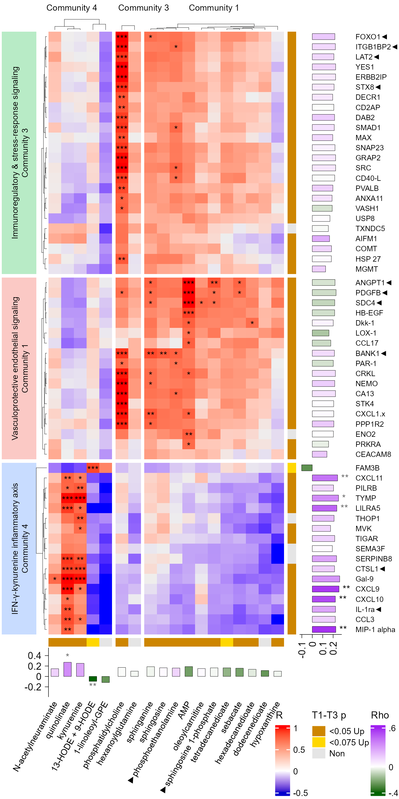
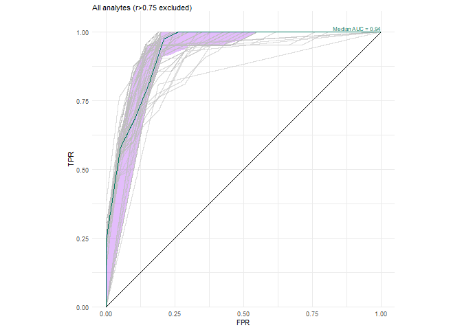
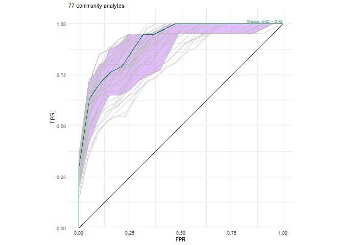
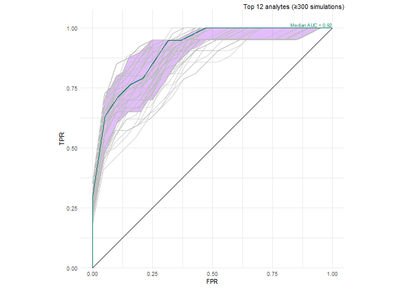
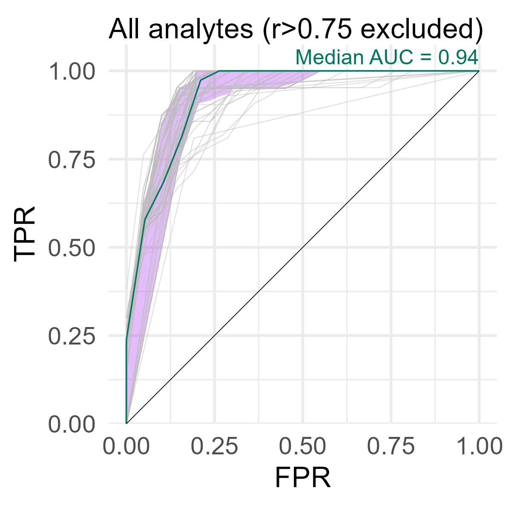

# Figure 3


### Panel B: Protein-Metabolite Community Heatmap

``` r
# ============================================================
# 1. INPUTS & HELPERS
# ============================================================

# Inputs
wb_path <- here::here(
  "data", "intermediate", "04_integrative_modeling",
  "T1_T3_Multiomics_Community_Results.xlsx"
)
load(here::here("data", "processed", "01_proteomics_metabolomics", "Data.RData")) 
data_with35EM <- data

# Exclude the 35-EM patient. Comment this block out to include them.
samples_without_35EM <- data$sampleData |>
  tibble::rownames_to_column("sample_rowname") |>
  dplyr::filter(
    as.character(Subject_ID) != "201455",
    !as.character(sample) %in% c("201455 T1", "201455 T2")
  ) |>
  dplyr::pull(sample_rowname)

data$sampleData <- data$sampleData[samples_without_35EM, , drop = FALSE]
data$assayData <- data$assayData[samples_without_35EM, , drop = FALSE]
data$data <- data$data[samples_without_35EM, , drop = FALSE]
data$directSymptoms <- data$directSymptoms[samples_without_35EM, , drop = FALSE]
data$confoundingSymptoms <- data$confoundingSymptoms[samples_without_35EM, , drop = FALSE]
data$emData <- data$emData[samples_without_35EM, , drop = FALSE]
data$symptomData <- data$symptomData[samples_without_35EM, , drop = FALSE]
data$treatmentData <- data$treatmentData[samples_without_35EM, , drop = FALSE]
data$olinkNew <- data$olinkNew[samples_without_35EM, , drop = FALSE]
data$olinkNewFail <- data$olinkNewFail[samples_without_35EM, , drop = FALSE]

# Helpers
`%||%` <- function(a, b) if (!is.null(a)) a else b

canon <- function(x) {
  x <- as.character(x)
  pref <- if_else(str_detect(x, "^prots\\."), "prots.",
           if_else(str_detect(x, "^mets\\."),  "mets.",  ""))
  core <- str_replace(x, "^(prots|mets)\\.", "")
  core <- make.names(core) |> tolower()
  paste0(pref, core)
}

strip_prefix <- function(x) str_replace(x, "^(prots|mets)\\.", "")

pick_patient_col <- function(meta) {
  cand <- c("Subject_ID","subject_id","SubjectID","patient_id","PatientID","patient","Patient",
            "subject","Subject","participant_id","ParticipantID","participant","Participant","ID","Id")
  hit <- cand[cand %in% names(meta)]
  if (length(hit)) return(hit[1])
  stop("Could not find a patient/subject ID column.")
}

fit_feature_lmm_pid <- function(df) {
  df <- df %>%
    mutate(value = suppressWarnings(as.numeric(value))) %>%
    filter(!is.na(time_f), is.finite(value))

  paired_pids <- df %>%
    distinct(pid, time_f) %>%
    count(pid) %>%
    filter(n == 2) %>%
    pull(pid)

  if (length(paired_pids) < 5) {
    return(tibble(n_pairs = length(paired_pids), beta = NA_real_, p = NA_real_))
  }
  
  tryCatch({
    fit <- lmer(value ~ time_f + (1 | pid), data = df, REML = FALSE)
    co  <- summary(fit)$coefficients
    if (!"time_fT1" %in% rownames(co)) {
      return(tibble(n_pairs = length(paired_pids), beta = NA_real_, p = NA_real_))
    }
    tibble(
      n_pairs = length(paired_pids),
      beta = unname(co["time_fT1", "Estimate"]),
      p = unname(co["time_fT1", "Pr(>|t|)"])
    )
  }, error = function(e) {
    tibble(n_pairs = length(paired_pids), beta = NA_real_, p = NA_real_)
  })
}

label_sig <- function(p_value, beta) {
  case_when(
    is.na(p_value) | is.na(beta) ~ "Non",
    p_value <= 0.05 & beta > 0  ~ "<0.05 Up",
    p_value < 0.075 & beta > 0  ~ "<0.075 Up",
    TRUE                         ~ "Non"
  )
}

adjust_bh <- function(p) {
  p_adj <- rep(NA_real_, length(p))
  tested <- is.finite(p)
  p_adj[tested] <- p.adjust(p[tested], method = "BH")
  p_adj
}

# ============================================================
# 2. DATA IMPORT (Clean Names)
# ============================================================
sampleData <- data$sampleData
meta <- sampleData %>% rename(SampleID = sample)
pid_col <- pick_patient_col(meta)
T1_ids <- meta %>% filter(Condition == "Patient", time == "T1") %>% pull(SampleID)

# Import Raw Data with check.names=FALSE to preserve "IL-1ra"
prots1 <- data$olinkNew  |> data.frame(check.names = FALSE) |> tibble::rownames_to_column("SampleID")
prots2 <- data$assayData |> data.frame(check.names = FALSE) |> tibble::rownames_to_column("SampleID")
prots  <- merge(prots1, prots2, by = "SampleID", all = TRUE)

mets_full <- data$metabolon$pat_data |> data.frame(check.names = FALSE) |> tibble::rownames_to_column("SampleID")
mets      <- mets_full %>% select(-contains("X-"))

IDS <- Reduce(intersect, list(T1_ids, prots$SampleID, mets$SampleID))
prots_Fz <- prots %>% filter(SampleID %in% IDS)
mets_Fz  <- mets  %>% filter(SampleID %in% IDS)

# Apply prefixes
colnames(prots_Fz)[-1] <- paste0("prots.", colnames(prots_Fz)[-1])
colnames(mets_Fz)[-1]  <- paste0("mets.",  colnames(mets_Fz)[-1])
colnames(prots)[-1]    <- paste0("prots.", colnames(prots)[-1])
colnames(mets)[-1]     <- paste0("mets.",  colnames(mets)[-1])

# ============================================================
# 3. HEATMAP MATRICES
# ============================================================
# Recompute sample-dependent quantities after excluding 35-EM while retaining
# the communities reported in the primary analysis as a fixed reference.
t1_protein_test_matrix <- prots_Fz |>
  dplyr::select(-SampleID) |>
  dplyr::select(where(~ mean(is.na(.x)) < 0.5)) |>
  as.matrix()

t1_metabolite_test_matrix <- mets_Fz |>
  dplyr::select(-SampleID) |>
  dplyr::select(where(~ mean(is.na(.x)) < 0.5)) |>
  as.matrix()

t1_correlation_tests <- psych::corr.test(
  x = t1_protein_test_matrix,
  y = t1_metabolite_test_matrix,
  use = "pairwise",
  method = "spearman",
  adjust = "BH",
  ci = FALSE
)

target_communities <- c(3, 1, 4)

# Map the original 77 community analytes to the current column names. The
# community assignments are deliberately fixed for a direct sensitivity test.
feature_map <- bind_rows(
  tibble(Node = colnames(t1_protein_test_matrix)),
  tibble(Node = colnames(t1_metabolite_test_matrix))
) |>
  mutate(k = canon(Node)) |>
  distinct(k, .keep_all = TRUE)

communities <- read_excel(wb_path, sheet = "Communities") |>
  filter(Community_T1 %in% target_communities) |>
  transmute(
    original_Node = Node,
    Community_T1,
    k = canon(Node)
  ) |>
  left_join(feature_map, by = "k") |>
  select(Node, Community_T1, original_Node, k)

if (nrow(communities) != 77 || anyNA(communities$Node)) {
  stop("The fixed primary-analysis structure did not map to all 77 analytes.")
}

communities_prot <- communities |>
  filter(str_starts(Node, "prots."))

communities_met <- communities |>
  filter(str_starts(Node, "mets."))

prot_feats <- communities_prot$Node
met_feats <- communities_met$Node

mat1 <- as.matrix(t1_correlation_tests$r)[
  prot_feats,
  met_feats,
  drop = FALSE
]
mat1[is.na(mat1)] <- 0

# Recreate the original all-patient correlation matrix for the fixed
# dendrogram topology, analyte order, and displayed cell colors.
sampleData_with35EM <- data_with35EM$sampleData
T1_ids_with35EM <- sampleData_with35EM |>
  filter(Condition == "Patient", time == "T1") |>
  pull(sample)

prots1_with35EM <- data_with35EM$olinkNew |>
  data.frame(check.names = FALSE) |>
  tibble::rownames_to_column("SampleID")
prots2_with35EM <- data_with35EM$assayData |>
  data.frame(check.names = FALSE) |>
  tibble::rownames_to_column("SampleID")
prots_with35EM <- merge(
  prots1_with35EM,
  prots2_with35EM,
  by = "SampleID",
  all = TRUE
)

mets_with35EM <- data_with35EM$metabolon$pat_data |>
  data.frame(check.names = FALSE) |>
  tibble::rownames_to_column("SampleID") |>
  select(-contains("X-"))

IDS_with35EM <- Reduce(
  intersect,
  list(T1_ids_with35EM, prots_with35EM$SampleID, mets_with35EM$SampleID)
)
prots_with35EM <- prots_with35EM |>
  filter(SampleID %in% IDS_with35EM)
mets_with35EM <- mets_with35EM |>
  filter(SampleID %in% IDS_with35EM)

names(prots_with35EM)[-1] <- paste0("prots.", names(prots_with35EM)[-1])
names(mets_with35EM)[-1] <- paste0("mets.", names(mets_with35EM)[-1])

t1_correlation_tests_with35EM <- psych::corr.test(
  x = prots_with35EM |>
    select(-SampleID) |>
    select(where(~ mean(is.na(.x)) < 0.5)) |>
    as.matrix(),
  y = mets_with35EM |>
    select(-SampleID) |>
    select(where(~ mean(is.na(.x)) < 0.5)) |>
    as.matrix(),
  use = "pairwise",
  method = "spearman",
  adjust = "BH",
  ci = FALSE
)

mat1_reference <- as.matrix(t1_correlation_tests_with35EM$r)[
  prot_feats,
  met_feats,
  drop = FALSE
]
mat1_reference[is.na(mat1_reference)] <- 0

# Recompute PC1 loadings from the no-35EM T1 samples within the fixed original
# communities. PC signs are aligned to the original loadings because PCA signs
# are otherwise arbitrary.
t1_combined_no35 <- inner_join(prots_Fz, mets_Fz, by = "SampleID")

recomputed_loadings_no35 <- map_dfr(target_communities, function(community_id) {
  community_features <- communities |>
    filter(Community_T1 == community_id) |>
    pull(Node)

  community_matrix <- t1_combined_no35 |>
    select(all_of(community_features)) |>
    as.matrix()

  imputed_matrix <- impute::impute.knn(community_matrix, k = 5)$data
  community_pca <- prcomp(imputed_matrix, center = TRUE, scale. = TRUE)

  tibble(
    Feature = rownames(community_pca$rotation),
    Recomputed_Loading = unname(community_pca$rotation[, 1]),
    Community = community_id
  )
}) |>
  mutate(k = canon(Feature))

original_loadings <- read_excel(wb_path, sheet = "Loadings") |>
  transmute(
    k = canon(Feature),
    Original_Loading = Loadings,
    old_community = community
  )

# PCA loading vectors are directions through the origin. Align their arbitrary
# signs to the original loading vectors using a dot product/cosine similarity;
# centered Pearson correlation can select the wrong sign for such vectors.
loading_orientation_no35 <- recomputed_loadings_no35 |>
  left_join(original_loadings, by = "k") |>
  group_by(Community) |>
  summarise(
    loading_dot_product = sum(
      Recomputed_Loading * Original_Loading,
      na.rm = TRUE
    ),
    loading_cosine = loading_dot_product / sqrt(
      sum(Recomputed_Loading[is.finite(Original_Loading)]^2) *
        sum(Original_Loading^2, na.rm = TRUE)
    ),
    orientation = if_else(
      is.finite(loading_dot_product) & loading_dot_product < 0,
      -1,
      1
    ),
    .groups = "drop"
  )

real_loadings <- recomputed_loadings_no35 |>
  left_join(loading_orientation_no35, by = "Community") |>
  transmute(
    k,
    Feature,
    Real_Loading = Recomputed_Loading * orientation,
    Community,
    orientation,
    loading_dot_product,
    loading_cosine
  )

fixed_structure_audit_no35 <- communities |>
  transmute(
    analyte = Node,
    original_analyte_name = original_Node,
    modality = if_else(str_starts(Node, "prots."), "Protein", "Metabolite"),
    community = Community_T1,
    structure_source = "Primary T1 analysis including 35-EM",
    displayed_values_source = "Recomputed excluding 35-EM"
  )

readr::write_csv(
  fixed_structure_audit_no35,
  here::here("fig_3_files", "figure3b_fixed_structure_no35EM.csv")
)

readr::write_csv(
  real_loadings,
  here::here("fig_3_files", "figure3b_community_loadings_no35EM.csv")
)
```

``` r
# Retain the no-35EM adjusted p-values for the sensitivity audit.
mat2 <- as.matrix(t1_correlation_tests$p.adj)[
  rownames(mat1),
  colnames(mat1),
  drop = FALSE
]
mat2[is.na(mat2)] <- 1
```

``` r
mat2_reference <- as.matrix(t1_correlation_tests_with35EM$p.adj)[
  rownames(mat1),
  colnames(mat1),
  drop = FALSE
]
mat2_reference[is.na(mat2_reference)] <- 1

community_heatmap_asterisk_audit <- tidyr::expand_grid(
  protein = rownames(mat1),
  metabolite = colnames(mat1)
) |>
  mutate(
    protein_key = canon(protein),
    metabolite_key = canon(metabolite),
    protein_community = communities_prot$Community_T1[
      match(protein_key, canon(communities_prot$Node))
    ],
    metabolite_community = communities_met$Community_T1[
      match(metabolite_key, canon(communities_met$Node))
    ],
    with35EM_rho = mat1_reference[
      cbind(match(protein, rownames(mat1_reference)), match(metabolite, colnames(mat1_reference)))
    ],
    without35EM_rho = mat1[
      cbind(match(protein, rownames(mat1)), match(metabolite, colnames(mat1)))
    ],
    with35EM_p_adjusted = mat2_reference[
      cbind(match(protein, rownames(mat2_reference)), match(metabolite, colnames(mat2_reference)))
    ],
    without35EM_p_adjusted = mat2[
      cbind(match(protein, rownames(mat2)), match(metabolite, colnames(mat2)))
    ]
  ) |>
  mutate(
    with35EM_significant = !is.na(with35EM_p_adjusted) &
      with35EM_p_adjusted < 0.05,
    without35EM_significant = without35EM_p_adjusted < 0.05,
    significance_change = case_when(
      with35EM_significant & !without35EM_significant ~ "Lost after excluding 35-EM",
      !with35EM_significant & without35EM_significant ~ "Gained after excluding 35-EM",
      with35EM_significant & without35EM_significant ~ "Significant in both",
      TRUE ~ "Not significant in either"
    ),
    community_block = if_else(
      protein_community == metabolite_community,
      paste0("Community ", protein_community),
      paste0(
        "Protein community ", protein_community,
        " / metabolite community ", metabolite_community
      )
    )
  ) |>
  select(
    community_block,
    protein_community,
    metabolite_community,
    protein,
    metabolite,
    with35EM_rho,
    without35EM_rho,
    with35EM_p_adjusted,
    without35EM_p_adjusted,
    with35EM_significant,
    without35EM_significant,
    significance_change
  ) |>
  arrange(
    factor(
      significance_change,
      levels = c(
        "Lost after excluding 35-EM",
        "Gained after excluding 35-EM",
        "Significant in both",
        "Not significant in either"
      )
    ),
    protein_community,
    metabolite_community,
    protein,
    metabolite
  )

community_heatmap_asterisk_summary <- community_heatmap_asterisk_audit |>
  count(
    community_block,
    protein_community,
    metabolite_community,
    significance_change,
    name = "cell_n"
  ) |>
  arrange(
    protein_community,
    metabolite_community,
    significance_change
  )

community_heatmap_asterisk_changes <- community_heatmap_asterisk_audit |>
  filter(
    significance_change %in% c(
      "Lost after excluding 35-EM",
      "Gained after excluding 35-EM"
    )
  )

protein_significance_membership <- community_heatmap_asterisk_audit |>
  group_by(protein, protein_community) |>
  summarise(
    with35EM_significant = any(with35EM_significant),
    without35EM_significant = any(without35EM_significant),
    .groups = "drop"
  ) |>
  transmute(
    modality = "Protein",
    analyte = protein,
    community = protein_community,
    with35EM_significant,
    without35EM_significant
  )

metabolite_significance_membership <- community_heatmap_asterisk_audit |>
  group_by(metabolite, metabolite_community) |>
  summarise(
    with35EM_significant = any(with35EM_significant),
    without35EM_significant = any(without35EM_significant),
    .groups = "drop"
  ) |>
  transmute(
    modality = "Metabolite",
    analyte = metabolite,
    community = metabolite_community,
    with35EM_significant,
    without35EM_significant
  )

community_heatmap_significant_analyte_audit <- bind_rows(
  protein_significance_membership,
  metabolite_significance_membership
) |>
  mutate(
    significance_membership_change = case_when(
      with35EM_significant & !without35EM_significant ~
        "No longer in any significant displayed cell",
      !with35EM_significant & without35EM_significant ~
        "Newly in a significant displayed cell",
      with35EM_significant & without35EM_significant ~
        "In significant displayed cells in both",
      TRUE ~ "Not in a significant displayed cell in either"
    )
  ) |>
  arrange(
    factor(
      significance_membership_change,
      levels = c(
        "No longer in any significant displayed cell",
        "Newly in a significant displayed cell",
        "In significant displayed cells in both",
        "Not in a significant displayed cell in either"
      )
    ),
    modality,
    community,
    analyte
  )

readr::write_csv(
  community_heatmap_asterisk_audit,
  here::here(
    "fig_3_files",
    "figure3b_correlation_significance_no35EM_audit.csv"
  )
)

readr::write_csv(
  community_heatmap_asterisk_summary,
  here::here(
    "fig_3_files",
    "figure3b_correlation_significance_no35EM_summary.csv"
  )
)

readr::write_csv(
  community_heatmap_asterisk_changes,
  here::here(
    "fig_3_files",
    "figure3b_correlation_significance_no35EM_changes.csv"
  )
)

readr::write_csv(
  community_heatmap_significant_analyte_audit,
  here::here(
    "fig_3_files",
    "figure3b_significant_analyte_no35EM_audit.csv"
  )
)
```

``` r
# Ordering
row_level <- c(3,1,4); col_level <- c(4,3,1)
row_comm <- communities_prot$Community_T1[match(canon(rownames(mat1)), canon(communities_prot$Node))]
col_comm <- communities_met$Community_T1[match(canon(colnames(mat1)), canon(communities_met$Node))]
mat1 <- mat1[!is.na(row_comm), !is.na(col_comm)]; mat2 <- mat2[rownames(mat1), colnames(mat1)]
mat1_reference <- mat1_reference[rownames(mat1), colnames(mat1), drop = FALSE]
row_comm <- row_comm[!is.na(row_comm)]; col_comm <- col_comm[!is.na(col_comm)]
row_ix <- order(factor(row_comm, levels=row_level), canon(rownames(mat1)))
col_ix <- order(factor(col_comm, levels=col_level), canon(colnames(mat1)))
mat1 <- mat1[row_ix, col_ix]; mat2 <- mat2[row_ix, col_ix]
mat1_reference <- mat1_reference[rownames(mat1), colnames(mat1), drop = FALSE]
mat2_reference <- mat2_reference[rownames(mat1), colnames(mat1), drop = FALSE]
row_split <- factor(row_comm[row_ix], levels=row_level)
col_split <- factor(col_comm[col_ix], levels=col_level)

reference_row_clustering <- function(m) {
  hclust(dist(mat1_reference[rownames(m), , drop = FALSE]))
}

reference_column_clustering <- function(m) {
  # ComplexHeatmap supplies the transposed matrix to column-clustering
  # functions, so its row names identify the metabolites in the current slice.
  reference_columns <- if (
    !is.null(rownames(m)) &&
      all(rownames(m) %in% colnames(mat1_reference))
  ) {
    rownames(m)
  } else {
    colnames(m)
  }

  hclust(dist(t(mat1_reference[, reference_columns, drop = FALSE])))
}

# Display Labels
row_disp <- strip_prefix(rownames(mat1))

row_disp <- row_disp |> str_replace("PDGF subunit B", "PDGFB")

row_disp[row_disp %in% c("FOXO1", "ITGB1BP2", "LAT2", "STX8", "ANGPT1", "PDGFB", "SDC4", "BANK1", "CTSL1", "IL-1ra")] <-
  paste0(row_disp[row_disp %in% c("FOXO1", "ITGB1BP2", "LAT2", "STX8", "ANGPT1", "PDGFB", "SDC4", "BANK1", "CTSL1", "IL-1ra")], "\u25C4")

col_disp <- strip_prefix(colnames(mat1))

col_disp <- col_disp |> str_replace("phosphoethanolamine", "\u25BAphosphoethanolamine")  |> str_replace("sphingosine 1-phosphate", "\u25BAsphingosine 1-phosphate") |>  str_replace("adenosine 5'-monophosphate \\(AMP\\)", "AMP") |> 
  str_replace("1-stearoyl-2-oleoyl-GPS \\(18:0/18:1\\)", "phosphatidylcholine") |> 
  # remove bracketed suffixes
  str_remove_all("\\s\\([^)]+\\)\\*?$")

# ============================================================
# 4. LONGITUDINAL DIFFERENTIAL ANALYSIS
# ============================================================
# Use all available T1/T3 observations. The patient random intercept accounts
# for repeated measurements, and the 35-EM patient was excluded upstream.
longitudinal_meta <- meta %>%
  filter(
    Condition == "Patient",
    time %in% c("T1", "T3")
  ) %>%
  transmute(
    SampleID,
    pid = factor(.data[[pid_col]]),
    time_f = factor(time, levels = c("T3", "T1"))
  )

# Fit each modality independently so availability in one modality does not
# restrict the subjects used for the other modality.
protein_stat_df <- prots %>%
  inner_join(longitudinal_meta, by = "SampleID")

metabolite_stat_df <- mets %>%
  inner_join(longitudinal_meta, by = "SampleID")

fit_modality_lmms <- function(feature_data, feature_prefix) {
  features <- names(feature_data)[str_starts(names(feature_data), feature_prefix)]

  map_dfr(features, function(feature) {
    feature_data %>%
      select(pid, time_f, value = all_of(feature)) %>%
      fit_feature_lmm_pid() %>%
      mutate(Feature = feature, .before = 1)
  }) %>%
    mutate(p_adj = adjust_bh(p))
}

# Adjust across every successfully tested analyte in each modality, then
# extract the community analytes displayed in the heatmap.
prot_stats_all <- fit_modality_lmms(protein_stat_df, "prots.")
met_stats_all <- fit_modality_lmms(metabolite_stat_df, "mets.")

prot_stats <- tibble(Feature = rownames(mat1)) %>%
  left_join(prot_stats_all, by = "Feature")

met_stats <- tibble(Feature = colnames(mat1)) %>%
  left_join(met_stats_all, by = "Feature")

if (any(prot_stats$p <= 0.05 & prot_stats$beta < 0, na.rm = TRUE) ||
    any(met_stats$p <= 0.05 & met_stats$beta < 0, na.rm = TRUE)) {
  stop("A significant downregulated analyte requires a corresponding plot category.")
}

feature_columns <- c(names(prots), names(mets)) %>%
  setdiff("SampleID")

loadings_map <- tibble(Feature = c(rownames(mat1), colnames(mat1))) %>%
  mutate(k = canon(Feature)) %>%
  left_join(
    tibble(comb_col = feature_columns, k = canon(feature_columns)),
    by = "k"
  )

longitudinal_significance_audit <- bind_rows(
  prot_stats %>% mutate(modality = "Protein"),
  met_stats %>% mutate(modality = "Metabolite")
) %>%
  mutate(
    Significance = label_sig(p, beta),
    k = canon(Feature)
  ) %>%
  left_join(
    communities %>%
      transmute(k = canon(Node), Community_T1),
    by = "k"
  ) %>%
  select(modality, Feature, Community_T1, n_pairs, beta, p, p_adj, Significance)

readr::write_csv(
  longitudinal_significance_audit,
  here::here(
    "fig_3_files",
    "figure3b_longitudinal_significance_no35EM.csv"
  )
)

# Correlation to Symptoms (Purple/Green Colors)
pheno <- data$directSymptoms %>%
  mutate(across(everything(), ~ . / 7.6)) %>%
  rownames_to_column("SampleID") %>%
  left_join(sampleData %>% select(sample, time), by = c("SampleID" = "sample")) %>%
  filter(time == "T1") %>%
  transmute(SampleID, AvgSym = rowMeans(across(where(is.numeric)), na.rm = TRUE))

comb_Fz <- merge(prots_Fz, mets_Fz, by="SampleID") %>% data.frame(check.names=FALSE)

symptom_corr_stats <- tibble(comb_col = unique(na.omit(loadings_map$comb_col))) %>%
  mutate(
    corr_data = map(comb_col, ~ {
      if (!.x %in% names(comb_Fz)) {
        return(tibble(val = numeric(), AvgSym = numeric()))
      }

      inner_join(
        comb_Fz %>% select(SampleID, val = all_of(.x)),
        pheno,
        by = "SampleID"
      ) %>%
        mutate(
          val = suppressWarnings(as.numeric(val)),
          AvgSym = suppressWarnings(as.numeric(AvgSym))
        ) %>%
        filter(is.finite(val), is.finite(AvgSym))
    }),
    n = map_int(corr_data, nrow),
    rho = map_dbl(corr_data, ~ {
      if (nrow(.x) < 3 || sd(.x$val) == 0 || sd(.x$AvgSym) == 0) {
        return(NA_real_)
      }

      cor(.x$val, .x$AvgSym, method = "spearman")
    }),
    p = map_dbl(corr_data, ~ {
      if (nrow(.x) < 3 || sd(.x$val) == 0 || sd(.x$AvgSym) == 0) {
        return(NA_real_)
      }

      suppressWarnings(
        cor.test(.x$val, .x$AvgSym, method = "spearman", exact = FALSE)$p.value
      )
    }),
    p_adj = p.adjust(p, method = "BH"),
    symptom_corr_star_fdr = case_when(
      p_adj < 0.001 ~ "***",
      p_adj < 0.01 ~ "**",
      p_adj < 0.05 ~ "*",
      TRUE ~ ""
    ),
    symptom_corr_star_nominal = case_when(
      p < 0.001 ~ "***",
      p < 0.01 ~ "**",
      p < 0.05 ~ "*",
      TRUE ~ ""
    )
  )

rho_vec <- setNames(symptom_corr_stats$rho, symptom_corr_stats$comb_col)
symptom_corr_star_fdr_vec <- setNames(
  symptom_corr_stats$symptom_corr_star_fdr,
  symptom_corr_stats$comb_col
)
symptom_corr_star_nominal_vec <- setNames(
  symptom_corr_stats$symptom_corr_star_nominal,
  symptom_corr_stats$comb_col
)

# ============================================================
# 5. PREPARE ANNOTATIONS
# ============================================================
# The displayed longitudinal categories use nominal p-value thresholds, as
# specified in the figure legend. Modality-wide BH values remain in the audit.
sig_cols <- c(
  "<0.05 Up" = "orange3",
  "<0.075 Up" = "gold",
  "Non" = "grey90"
)
rho_col_fun <- colorRamp2(c(-0.4, 0, 0.6), c("darkgreen", "white", "purple"))

prep_annot <- function(stats_df, feats) {
  stats_df %>%
    mutate(
      Significance = label_sig(p, beta),
      Sig_color = sig_cols[Significance]
    ) %>%
    right_join(tibble(Feature = feats), by = "Feature") %>%
    left_join(loadings_map, by="Feature") %>% 
    left_join(real_loadings |> select(-Feature), by="k") %>%      
    mutate(
      Significance = replace_na(Significance, "Non"),
      # Preserve the display orientation used by the original heatmap script.
      Loading = ifelse(Community %in% c(3, 4), -Real_Loading, Real_Loading),
      Loading = replace_na(Loading, 0),
      
      Bar_Fill = ifelse(is.na(comb_col), "grey90", rho_col_fun(rho_vec[comb_col])),
      symptom_corr_star_fdr = replace_na(symptom_corr_star_fdr_vec[comb_col], ""),
      symptom_corr_star_nominal = replace_na(
        symptom_corr_star_nominal_vec[comb_col],
        ""
      ),
      symptom_corr_star = if_else(
        symptom_corr_star_fdr != "",
        symptom_corr_star_fdr,
        symptom_corr_star_nominal
      ),
      symptom_corr_star_color = if_else(
        symptom_corr_star_fdr != "",
        "black",
        "grey40"
      ),
      Sig_color = replace_na(Sig_color, "grey90")
    )
}

communities_prot2 <- prep_annot(prot_stats, rownames(mat1))
communities_met2  <- prep_annot(met_stats, colnames(mat1))

# ============================================================
# 6. DRAW PLOT
# ============================================================
vals_met <- communities_met2$Loading; rng_met <- range(vals_met, na.rm=TRUE); diff_met <- diff(rng_met)
ylim_met <- c(min(rng_met[1] - 0.6*diff_met, -0.35), rng_met[2] + 0.6*diff_met)

vals_r <- communities_prot2$Loading; rng_r <- range(vals_r, na.rm=TRUE); diff_r <- diff(rng_r)
xlim_r <- c(rng_r[1] - 0.15*diff_r, rng_r[2] + 1.2*diff_r)

axis_gp <- gpar(col = "black", lwd = 0.5, fontsize = 8)

community_strip_cols <- c(
  "3" = "#B8EBC6",
  "1" = "#FBC9C5",
  "4" = "#C8DCFF"
)


ha <- HeatmapAnnotation(
  Significance = communities_met2$Significance,
  Loading_col = anno_barplot(communities_met2$Loading, height = unit(1.4, "cm"), ylim = ylim_met,
                             border = FALSE, axis_param = list(gp = axis_gp),
                             gp = gpar(fill = communities_met2$Bar_Fill, col = "black", lwd = 0.3)),
  show_annotation_name = FALSE,
  simple_anno_size = unit(2.5, "mm"),
  col = list(Significance = sig_cols)
)

hr <- rowAnnotation(
  Significance = communities_prot2$Significance,
  Loading_row = anno_barplot(vals_r, width = unit(1.2, "cm"), xlim = xlim_r,
                             border = FALSE, axis_param = list(gp = axis_gp),
                             gp = gpar(fill = communities_prot2$Bar_Fill, col = "black", lwd = 0.3)),
  Labels = anno_text(row_disp, gp = gpar(fontsize = 6), just = "left", location = unit(0, "npc")),
  gap = unit(c(1, 4), "mm"),
  show_annotation_name = FALSE,
  simple_anno_size = unit(2.5, "mm"),
  col = list(Significance = sig_cols)
)

ht <- Heatmap(mat1, show_row_names = FALSE, column_labels = col_disp,
              column_split = col_split, row_split = row_split,
              cluster_rows = reference_row_clustering,
              cluster_columns = reference_column_clustering,
              cluster_row_slices = FALSE, cluster_column_slices = FALSE,
              row_title = c(
                "\nImmunoregulatory & stress-response signaling\nCommunity 3",
                "\nVasculoprotective endothelial signaling\nCommunity 1",
                "\nIFN-γ-kynurenine inflammatory axis\nCommunity 4"
              ),
              column_title = c(
                "Community 4       ",
                "             Community 3",
                "Community 1"
              ),
              column_names_rot = 60,
              column_title_gp = gpar(fontsize = 7, lineheight = 0.85), 
              column_title_rot = 0, 
              row_title_gp = gpar(
                fontsize = 6.8,
                lineheight = 1,
                fill = unname(community_strip_cols[as.character(row_level)]),
                col = "black",
                border = NA
              ),
              column_names_gp = gpar(fontsize = 7),
              height = unit(17.25, "cm"),
              row_dend_width = unit(3, "mm"),
              column_dend_height = unit(3, "mm"),
              row_dend_gp = gpar(lwd = 0.3), column_dend_gp = gpar(lwd = 0.3),
              cell_fun = function(j, i, x, y, w, h, fill) {
                y_star <- y - unit(0.5, "mm")
                pval <- mat2[i, j]
                if (is.na(pval)) return(invisible(NULL))
                if (pval < 0.001) grid.text("***", x, y_star, just = "center", gp = gpar(fontsize = 8))
                else if (pval < 0.01) grid.text("**", x, y_star, just = "center", gp = gpar(fontsize = 8))
                else if (pval < 0.05) grid.text("*", x, y_star, just = "center", gp = gpar(fontsize = 8))
              },
              bottom_annotation = ha, right_annotation = hr,
              heatmap_legend_param = list(title = "R (protein-metabolite)"))

lgd_heat <- Legend(title = "R", col_fun = circlize::colorRamp2(c(-0.5, 0, 1), c("blue3", "white", "red")), at = c(-0.5, 0, 0.5, 1), labels = c("-0.5", "0", "0.5", "1"), title_gp = gpar(fontsize=8), labels_gp = gpar(fontsize=7), legend_height = unit(2, "cm"))
lgd_sig <- Legend(title = "T1-T3 p", at = names(sig_cols), legend_gp = gpar(fill = unname(sig_cols)), title_gp = gpar(fontsize=8), labels_gp = gpar(fontsize=7), grid_height = unit(3, "mm"))
lgd_rho <- Legend(title = "Rho", col_fun = rho_col_fun, at = c(-0.4, 0, 0.6), labels = c("-.4", "0", ".6"), title_gp = gpar(fontsize=8), labels_gp = gpar(fontsize=7), legend_height = unit(2, "cm"))
lgd_all <- packLegend(lgd_heat, lgd_sig, lgd_rho, direction = "horizontal", gap = unit(0.5, "mm"))

# Asterisks Decoration
decorate_stars <- function(
  anno_name,
  slice_idx,
  indices,
  vals,
  stars,
  star_colors,
  limits,
  is_col = FALSE
) {
  decorate_annotation(anno_name, slice = slice_idx, {
    ok <- stars != "" & is.finite(vals)
    if (any(ok)) {
      pos <- seq_along(indices)
      if (!is_col) pos <- length(indices) - pos + 1
      star_gap <- diff(limits) * 0.04
      inner_min <- limits[1] + star_gap
      inner_max <- limits[2] - star_gap
      
      # Positive
      idx_pos <- ok & (vals >= 0)
      if (any(idx_pos)) {
        x <- if (is_col) pos[idx_pos] else pmin(vals[idx_pos] + star_gap, inner_max)
        y <- if (is_col) pmin(vals[idx_pos] + star_gap, inner_max) else pos[idx_pos]
        just <- if (is_col) c("center", "bottom") else c("left", "center")
        grid.text(
          stars[idx_pos], x, y,
          default.units = "native",
          just = just,
          gp = gpar(fontsize = 8, col = star_colors[idx_pos])
        )
      }
      # Negative
      idx_neg <- ok & (vals < 0)
      if (any(idx_neg)) {
        x <- if (is_col) pos[idx_neg] else pmax(vals[idx_neg] - star_gap, inner_min)
        y <- if (is_col) pmax(vals[idx_neg] - star_gap, inner_min) else pos[idx_neg]
        just <- if (is_col) c("center", "top") else c("right", "center")
        grid.text(
          stars[idx_neg], x, y,
          default.units = "native",
          just = just,
          gp = gpar(fontsize = 8, col = star_colors[idx_neg])
        )
      }
    }
  })
}

draw_community_heatmap <- function() {
  ht_drawn <- draw(
    ht,
    show_heatmap_legend = FALSE,
    show_annotation_legend = FALSE,
    padding = unit(c(top = 0.5, bottom = 0.5, left = 0.5, right = 0.5), "mm")
  )
  
  draw(
    lgd_all,
    x = unit(1, "npc") - unit(-0.5, "mm"),
    y = unit(0, "npc") + unit(1, "mm"),
    just = c("right", "bottom")
  )
  
  co <- column_order(ht_drawn)
  ro <- row_order(ht_drawn)
  
  for (sl in seq_along(ro)) {
    idx <- ro[[sl]]
    decorate_stars(
      "Loading_row", sl, idx,
      communities_prot2$Loading[idx],
      communities_prot2$symptom_corr_star[idx],
      communities_prot2$symptom_corr_star_color[idx],
      xlim_r,
      FALSE
    )
  }
  
  for (sl in seq_along(co)) {
    idx <- co[[sl]]
    decorate_stars(
      "Loading_col", sl, idx,
      communities_met2$Loading[idx],
      communities_met2$symptom_corr_star[idx],
      communities_met2$symptom_corr_star_color[idx],
      ylim_met,
      TRUE
    )
  }
  
  invisible(ht_drawn)
}

community_heatmap_png <- here::here("fig_3_files", "figure_03b_protein_metabolite_community_heatmap.png")

agg_png(community_heatmap_png, width = 4.5, height = 9, units = "in", res = 300, scaling = 1)
draw_community_heatmap()
dev.off()
```

    png 
      2 

``` r
# Render the saved PNG into the document
knitr::include_graphics(community_heatmap_png)
```









### Panel C: ROC Curve for All Analytes

``` r
roc_all_png <- here::here("fig_3_files", "figure_03c_all_analyte_classifier_roc.png")
if (file.exists(roc_all_png)) {
  knitr::include_graphics(roc_all_png)
}
```



### Panel D: ROC Curve for Community Analytes

``` r
roc_community_png <- here::here("fig_3_files", "figure_03d_community_analyte_classifier_roc.png")
if (file.exists(roc_community_png)) {
  knitr::include_graphics(roc_community_png)
}
```


### Panel E: ROC Curve for Predictive Analytes

``` r
roc_predictive_png <- here::here("fig_3_files", "figure_03e_top_predictive_analyte_classifier_roc.png")
if (file.exists(roc_predictive_png)) {
  knitr::include_graphics(roc_predictive_png)
}
```


``` r
sessionInfo()
```

    R version 4.4.1 (2024-06-14 ucrt)
    Platform: x86_64-w64-mingw32/x64
    Running under: Windows 11 x64 (build 22631)

    Matrix products: default


    locale:
    [1] LC_COLLATE=English_United States.utf8 
    [2] LC_CTYPE=English_United States.utf8   
    [3] LC_MONETARY=English_United States.utf8
    [4] LC_NUMERIC=C                          
    [5] LC_TIME=English_United States.utf8    

    time zone: America/Los_Angeles
    tzcode source: internal

    attached base packages:
    [1] grid      stats     graphics  grDevices utils     datasets  methods  
    [8] base     

    other attached packages:
     [1] datapasta_3.1.0       here_1.0.1            progress_1.2.3       
     [4] matrixStats_1.4.1     e1071_1.7-16          glmmLasso_1.6.3      
     [7] glmnet_4.1-10         caret_6.0-94          lattice_0.22-6       
    [10] factoextra_1.0.7      UpSetR_1.4.0          VennDiagram_1.7.3    
    [13] futile.logger_1.4.3   pheatmap_1.0.12       ComplexHeatmap_2.20.0
    [16] impute_1.78.0         psych_2.4.6.26        lmerTest_3.2-1       
    [19] lme4_2.0-1            Matrix_1.7-0          ragg_1.3.2           
    [22] conflicted_1.2.0      ggplotify_0.1.2       ggpubr_0.6.0         
    [25] Hmisc_5.1-3           RColorBrewer_1.1-3    camcorder_0.1.0      
    [28] cowplot_1.1.3         patchwork_1.3.0       geomtextpath_0.1.4   
    [31] ggnewscale_0.5.1      circlize_0.4.16       gghighlight_0.4.1    
    [34] ggstance_0.3.7        ggrepel_0.9.5         readxl_1.4.3         
    [37] lubridate_1.9.3       forcats_1.0.0         stringr_1.5.1        
    [40] dplyr_1.1.4           purrr_1.0.2           readr_2.1.5          
    [43] tidyr_1.3.1           tibble_3.2.1          ggplot2_4.0.0        
    [46] tidyverse_2.0.0      

    loaded via a namespace (and not attached):
      [1] splines_4.4.1        cellranger_1.1.0     hardhat_1.4.0       
      [4] pROC_1.18.5          rpart_4.1.23         lifecycle_1.0.4     
      [7] Rdpack_2.6.4         rstatix_0.7.2        rprojroot_2.0.4     
     [10] doParallel_1.0.17    vroom_1.6.5          globals_0.16.3      
     [13] MASS_7.3-60.2        backports_1.5.0      magrittr_2.0.3      
     [16] rmarkdown_2.29       yaml_2.3.10          gifski_1.12.0-2     
     [19] minqa_1.2.8          abind_1.4-5          BiocGenerics_0.50.0 
     [22] yulab.utils_0.1.7    nnet_7.3-19          ipred_0.9-15        
     [25] lava_1.8.0           IRanges_2.38.1       S4Vectors_0.42.1    
     [28] listenv_0.9.1        parallelly_1.38.0    svglite_2.1.3       
     [31] codetools_0.2-20     tidyselect_1.2.1     shape_1.4.6.1       
     [34] farver_2.1.2         stats4_4.4.1         base64enc_0.1-3     
     [37] jsonlite_1.8.9       GetoptLong_1.0.5     Formula_1.2-5       
     [40] survival_3.6-4       iterators_1.0.14     systemfonts_1.1.0   
     [43] foreach_1.5.2        tools_4.4.1          Rcpp_1.0.13         
     [46] glue_1.8.0           mnormt_2.1.1         prodlim_2024.06.25  
     [49] gridExtra_2.3        xfun_0.48            withr_3.0.2         
     [52] numDeriv_2016.8-1.1  formatR_1.14         fastmap_1.2.0       
     [55] boot_1.3-30          digest_0.6.37        timechange_0.3.0    
     [58] R6_2.5.1             gridGraphics_0.5-1   textshaping_0.4.0   
     [61] colorspace_2.1-1     rsvg_2.6.0           generics_0.1.3      
     [64] data.table_1.15.4    recipes_1.1.0        class_7.3-22        
     [67] prettyunits_1.2.0    htmlwidgets_1.6.4    ModelMetrics_1.2.2.2
     [70] pkgconfig_2.0.3      gtable_0.3.6         timeDate_4041.110   
     [73] S7_0.2.0             htmltools_0.5.8.1    carData_3.0-5       
     [76] clue_0.3-65          scales_1.4.0         png_0.1-8           
     [79] gower_1.0.1          reformulas_0.4.3.1   knitr_1.49          
     [82] lambda.r_1.2.4       rstudioapi_0.16.0    tzdb_0.4.0          
     [85] reshape2_1.4.4       rjson_0.2.23         checkmate_2.3.2     
     [88] nlme_3.1-164         nloptr_2.1.1         proxy_0.4-27        
     [91] cachem_1.1.0         GlobalOptions_0.1.2  parallel_4.4.1      
     [94] foreign_0.8-86       pillar_1.10.1        vctrs_0.6.5         
     [97] car_3.1-2            cluster_2.1.6        htmlTable_2.4.3     
    [100] evaluate_1.0.1       magick_2.8.4         cli_3.6.3           
    [103] compiler_4.4.1       futile.options_1.0.1 rlang_1.1.4         
    [106] crayon_1.5.3         future.apply_1.11.2  ggsignif_0.6.4      
    [109] labeling_0.4.3       plyr_1.8.9           fs_1.6.6            
    [112] stringi_1.8.4        pacman_0.5.1         hms_1.1.3           
    [115] bit64_4.0.5          future_1.34.0        rbibutils_2.3       
    [118] broom_1.0.6          memoise_2.0.1        bit_4.0.5           
