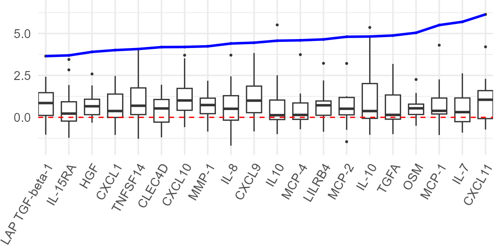
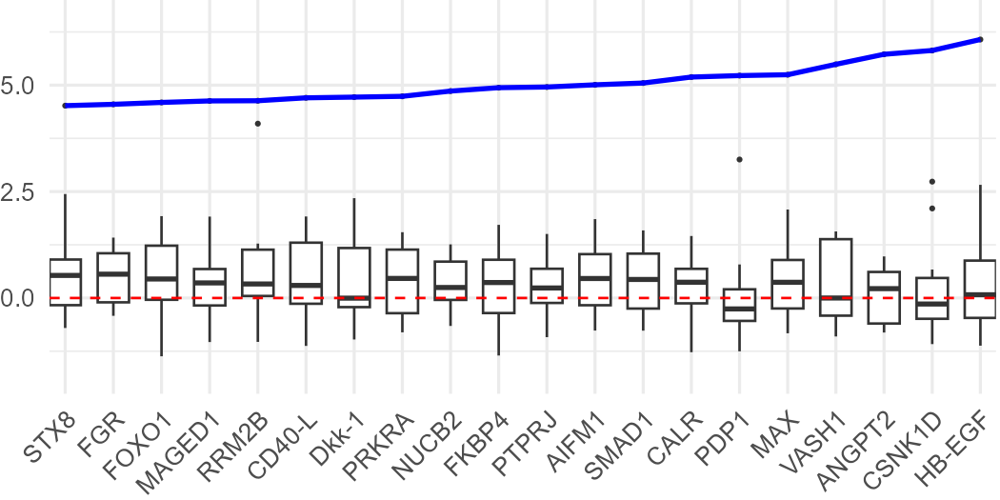
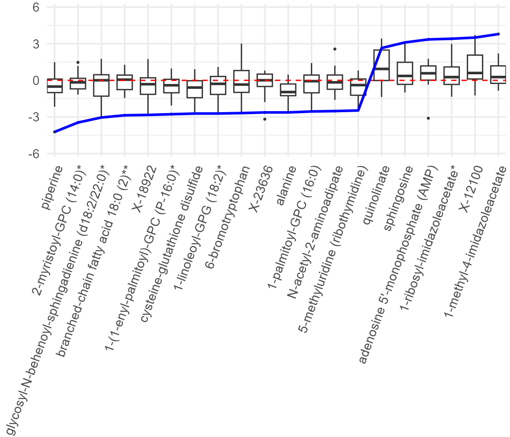
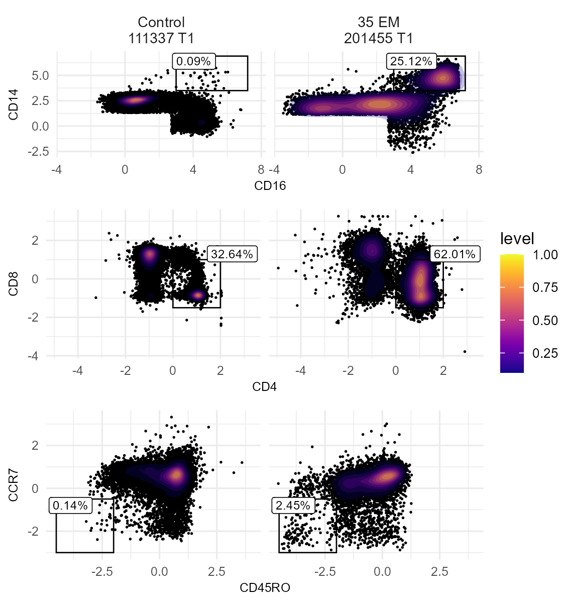
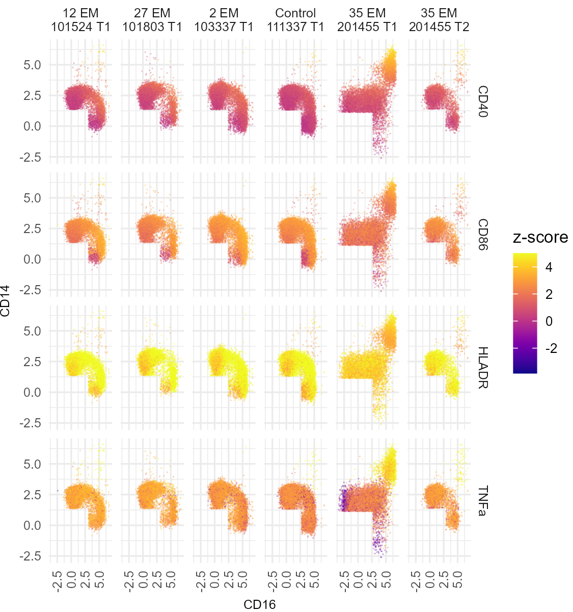

# Figure 6


``` r
gg_color_hue <- function(n) {
  hues = seq(15, 375, length = n + 1)
  hcl(h = hues, l = 65, c = 100)[1:n]
}
```

``` r
load(here::here("data", "processed", "01_proteomics_metabolomics", "Data.RData"))
```

### Panels A-C: Circulating mediators in the 35-EM patient

``` r
boxplot_samples_35em <- data$sampleData |>
  dplyr::filter(
    Condition == "Patient",
    time == "T1",
    days_of_prior_antibiotics == 0
  ) |>
  dplyr::pull(sample) |>
  as.character()

make_35em_zscore_plot <- function(
    assay_data,
    boxplot_samples,
    case_sample = "201455 T1",
    top_n = 20
) {
  assay_data <- as.matrix(assay_data)

  if (!case_sample %in% rownames(assay_data)) {
    stop(case_sample, " is absent from the assay matrix.")
  }

  boxplot_samples <- intersect(
    as.character(boxplot_samples),
    rownames(assay_data)
  )
  if (length(boxplot_samples) < 2) {
    stop("Fewer than two boxplot samples are present in the assay matrix.")
  }

  # Match the original analysis: scale across the complete assay matrix, then
  # display the antibiotic-naive T1 patient subset in the boxplots.
  z_scores <- scale(assay_data)
  case_z_scores <- z_scores[case_sample, ]
  finite_analytes <- names(case_z_scores)[is.finite(case_z_scores)]
  selected_analytes <- finite_analytes[
    order(abs(case_z_scores[finite_analytes]), decreasing = TRUE)
  ] |>
    head(top_n)
  selected_analytes <- selected_analytes[
    order(case_z_scores[selected_analytes])
  ]

  plot_data <- z_scores[boxplot_samples, selected_analytes, drop = FALSE] |>
    as.data.frame(check.names = FALSE) |>
    tibble::rownames_to_column("sample") |>
    tidyr::pivot_longer(
      cols = -sample,
      names_to = "analyte",
      values_to = "z_score"
    ) |>
    dplyr::filter(is.finite(z_score)) |>
    dplyr::mutate(
      analyte = factor(analyte, levels = selected_analytes)
    )

  case_data <- tibble::tibble(
    sample = case_sample,
    analyte = factor(selected_analytes, levels = selected_analytes),
    z_score = as.numeric(case_z_scores[selected_analytes])
  )

  ggplot(plot_data, aes(x = analyte, y = z_score)) +
    geom_boxplot(
      width = 0.65,
      fill = "white",
      colour = "grey20",
      linewidth = 0.3,
      outlier.size = 0.05
    ) +
    geom_hline(
      yintercept = 0,
      colour = "red",
      linetype = "dashed",
      linewidth = 0.3
    ) +
    geom_line(
      data = case_data,
      aes(group = 1),
      colour = "blue",
      linewidth = 0.6
    ) +
    labs(x = NULL, y = NULL) +
    theme_minimal(base_size = 8) +
    theme(
      axis.text.x = element_text(angle = 60, hjust = 1, vjust = 1),
      panel.grid.minor.x = element_blank(),
      plot.margin = margin(0, 0, 0, l = 2)
    )
}

fig_6_output_dir <- here::here("fig_6_files")
dir.create(fig_6_output_dir, recursive = TRUE, showWarnings = FALSE)

# Panel A: Olink Inflammation and Immune Response assays.
figure_06a <- make_35em_zscore_plot(
  data$assayData,
  boxplot_samples_35em
) +
  scale_y_continuous(breaks = c(0, 2.5, 5)) +
  coord_cartesian(ylim = c(-2.25, 7), expand = FALSE) + 
  theme(
      plot.margin = margin(0, 0, r = 1, l = 7)
    )

figure_06a_file <- file.path(
  fig_6_output_dir,
  "figure_06a_35em_olink_inflammation_immune_zscores.png"
)
ggsave(
  figure_06a_file,
  figure_06a,
  device = ragg::agg_png,
  width = 3.5,
  height = 1.75,
  units = "in",
  dpi = 300
)

# Panel B: Olink Metabolism, Cardiovascular II, and Organ Damage assays.
figure_06b <- make_35em_zscore_plot(
  data$olinkNew,
  boxplot_samples_35em
) +
  scale_y_continuous(breaks = c(0, 2.5, 5)) +
  coord_cartesian(ylim = c(-2.25, 7), expand = FALSE) +
  theme(
      axis.text.x = element_text(angle = 45),
      plot.margin = margin(0, 0, r = 1, l = 0)
    )

figure_06b_file <- file.path(
  fig_6_output_dir,
  "figure_06b_35em_olink_metabolism_cardiovascular_organ_damage_zscores.png"
)
ggsave(
  figure_06b_file,
  figure_06b,
  device = ragg::agg_png,
  width = 3.5,
  height = 1.75,
  units = "in",
  dpi = 300
)

# Panel C: batch-corrected metabolomics data, transposed to samples by analytes.
figure_06c <- make_35em_zscore_plot(
  t(data$metabolon$combat_data),
  boxplot_samples_35em
) +
  scale_y_continuous(breaks = seq(-6, 6, by = 3)) +
  coord_cartesian(ylim = c(-6.25, 6.25), expand = FALSE) +
  theme(
      axis.text.x = element_text(angle = 70, hjust = 1, vjust = 1),
      panel.grid.minor.x = element_blank(),
      plot.margin = margin(t = 2, 0, r = 2, l = 14)
    )

figure_06c_file <- file.path(
  fig_6_output_dir,
  "figure_06c_35em_metabolomics_zscores.png"
)
ggsave(
  figure_06c_file,
  figure_06c,
  device = ragg::agg_png,
  width = 3.5,
  height = 3,
  units = "in",
  dpi = 300
)

knitr::include_graphics(c(
  figure_06a_file,
  figure_06b_file,
  figure_06c_file
))
```







##### Gated

### Panel D: Flow Gating Scatter Plot Montage

``` r
flow_outlier_dir = here::here("data", "Flow", "outlier flow subsets")
flow_outlier_files = if (dir.exists(flow_outlier_dir)) {
  list.files(flow_outlier_dir, full.names = TRUE, pattern = "_outliers\\.RData$")
} else {
  character()
}
flow_outlier2_files = if (dir.exists(flow_outlier_dir)) {
  list.files(flow_outlier_dir, full.names = TRUE, pattern = "_outliers2\\.RData$")
} else {
  character()
}
has_flow_outliers = all(
  file.exists(file.path(
    flow_outlier_dir,
    c("monocyte_outliers.RData", "tcell_outliers.RData")
  ))
)
has_flow_outliers2 = file.exists(
  file.path(flow_outlier_dir, "monocyte_outliers2.RData")
)

fig_6_output_dir <- here::here("fig_6_files")
dir.create(fig_6_output_dir, recursive = TRUE, showWarnings = FALSE)

if (!has_flow_outliers) {
  cat("Skipping Panel D: optional Flow outlier subsets are not installed.\n")
}
if (!has_flow_outliers2) {
  cat("Skipping Panel E: optional Flow outlier subsets are not installed.\n")
}
```

``` r
load(file.path(flow_outlier_dir, "monocyte_outliers.RData"))
load(file.path(flow_outlier_dir, "tcell_outliers.RData"))
outliers = list(mono = mono, tcell = tcell)
rm(mono, tcell)

sample_labels_d <- c(
  "111337 T1" = "Control\n111337 T1",
  "201455 T1" = "35 EM\n201455 T1"
)


gatePlot = function(sce,x,y,
                    xmin,xmax,
                    ymin,ymax,
                    ids,
                    assay = 'counts',
                    orient= 'center',
                    nudge_x = .05,
                    nudge_y = .05){
  keep = sce$sample_id%in%ids
  id = sce$sample_id[keep]
  # cluster = sce@colData[keep,cluster_col]
  d = data.frame(t(SummarizedExperiment::assay(sce, assay))[keep,c(x,y)],
                 # population=cluster,
                 id=id)
  fact = factor(d$id)
  summary = lapply(split(d,fact),function(df){
    percent = sum(df[,x]>xmin&
                    df[,x]<xmax&
                    df[,y]>ymin&
                    df[,y]<ymax)/nrow(df)*100
    percent = round(percent,2)
  })
  xr = c(xmin,xmax)
  yr = c(ymin,ymax)
  if(orient =='center'){
    xo = mean(xr)
    yo = mean(yr)
  }else if(orient == 'topleft'){
    xo = xr[1]+nudge_x*(xr[2]-xr[1])
    yo = yr[2]-nudge_y*(yr[2]-yr[1])
  }else if(orient == 'topright'){
    xo = xr[2]-nudge_x*(xr[2]-xr[1])
    yo = yr[2]-nudge_y*(yr[2]-yr[1])
  }else if(orient == 'bottomleft'){
    xo = xr[1]+nudge_x*(xr[2]-xr[1])
    yo = yr[1]+nudge_y*(yr[2]-yr[1])
  }else if(orient == 'bottomleft'){
    xo = xr[2]-nudge_x*(xr[2]-xr[1])
    yo = yr[1]+nudge_y*(yr[2]-yr[1])
  }
  summary = data.frame(id = names(summary),
                       percent = paste0(as.numeric(summary),"%"),
                       x = xo,
                       y = yo)
  rect = data.frame(xmin = xmin,
                    xmax=xmax,
                    ymin=ymin,
                    ymax=ymax,
                    id = ids,
                    x=1,
                    y=1)
  colnames(rect)[6:7] = c(x,y)
  ggplot(d,aes_string(x=x,y=y))+
    geom_point(size = 0.15)+
    stat_density_2d(aes(fill = ..level..), 
                    geom = "polygon",
                    contour_var = 'ndensity',
                    alpha = .25) +
    facet_wrap(
      vars(id),
      nrow = 1,
      labeller = labeller(id = as_labeller(sample_labels_d))
    )+
    scale_fill_viridis(option = "C")+
    scale_x_continuous(expand = expansion(mult = c(0.05, 0.10)))+
    # annotate("rect",xmin=xmin,xmax=xmax,ymin=ymin,ymax=ymax)+
    geom_rect(data = rect,aes(xmin=xmin,xmax=xmax,ymin=ymin,ymax=ymax),fill=NA,col='black',linewidth=0.3)+
    geom_label(data = summary,mapping = aes(x = x,y = y,label = percent),size=6.0 / 2.845276)+
    theme_minimal(base_size = 8)+
    theme(
      legend.key.size = unit(4,'mm'),
      axis.title = element_text(size = 6),
      axis.text = element_text(size = 6),
      strip.text.x = element_text(size = 7)
    )
}


plotList = list()
# Mono CD14 CD16
sce = outliers$mono
x = "CD16"
y = "CD14"
xmin = 3
xmax = 7.2
ymin = 3.5
ymax = 6.9
ids = as.character(unique(sce$sample_id))
plotList$Monocyte = gatePlot(sce,x,y,xmin,xmax,ymin,ymax,ids,assay = 'counts',orient = 'topleft',nudge_x = .25,nudge_y = .15)

# T Cell CD4 CD8
sce = outliers$tcell
x = "CD4"
y = "CD8"
ids = as.character(unique(sce$sample_id))
xmin = 0
xmax = 2
ymin = -1.5
ymax = 1
plotList$TCell_top = gatePlot(sce,x,y,xmin,xmax,ymin,ymax,ids,assay = 'counts',orient = 'topright',nudge_x = -.25,nudge_y = -.12) +
  theme(strip.text.x = element_blank())

# T Cell CD11c CD123
sce = outliers$tcell
# keep = grep("CD4",sce@metadata$clusters$main_mem)
keep = data.frame(t(SummarizedExperiment::assay(outliers$tcell, "counts"))[,c("CD4","CD8")])
keep = keep$CD4>0&keep$CD4<2&keep$CD8>-1.5&keep$CD8<1
sce = sce[,keep]
sce@metadata$clusters = sce@metadata$clusters[keep,]
x = "CD45RO"
y = "CCR7"
ids = as.character(unique(sce$sample_id))
xmin = -4.5
xmax = -2
ymin = -3
ymax = -.5
plotList$TCell_effector = gatePlot(sce,x,y,xmin,xmax,ymin,ymax,ids,assay = 'counts',orient = 'topleft',nudge_x = .25,nudge_y = .12) +
  theme(strip.text.x = element_blank())

figure_06d = ggarrange(
  plotlist = plotList,
  nrow = length(plotList),
  common.legend = TRUE,
  legend = "right"
)

figure_06d_file <- file.path(
  fig_6_output_dir,
  "figure_06d_35em_flow_gating_comparison.png"
)

ragg::agg_png(
  filename = figure_06d_file,
  width = 3.75,
  height = 4,
  units = "in",
  res = 300
)
print(figure_06d)
grDevices::dev.off() |> invisible()

knitr::include_graphics(figure_06d_file)
```



### Panel E: Activated Subset Flow Plot Montage

``` r
load(file.path(flow_outlier_dir, "monocyte_outliers2.RData"))
outliers = list(mono = mono)
rm(mono)

sample_labels_e <- c(
  "101524 T1" = "12 EM\n101524 T1",
  "101803 T1" = "27 EM\n101803 T1",
  "103337 T1" = "2 EM\n103337 T1",
  "111337 T1" = "Control\n111337 T1",
  "201455 T1" = "35 EM\n201455 T1",
  "201455 T2" = "35 EM\n201455 T2"
)

plot_flow_activation = function(sce,x,y,z,ids,assay = 'counts',max_dev = 5){
  keep = sce$sample_id%in%ids
  id = sce$sample_id[keep]
  # cluster = sce@colData[keep,cluster_col]
  d = data.frame(t(SummarizedExperiment::assay(sce, assay))[keep,c(x,y,z)],
                 # population=cluster,
                 id=id)
  d = pivot_longer(d,z,names_to = "activation",values_to = "z")
  d$z[d$z>max_dev] = max_dev
  d$z[d$z<(-1*max_dev)] = -1*max_dev
  ggplot(d,aes_string(x=x,y=y,color="z"))+
    geom_point(stroke = 0, size = 0.35, alpha = .4)+
    scale_color_viridis("z-score",option = "C")+#,limits = c(-3, 8),begin=5/16)+
    facet_grid(
      cols = vars(id),
      rows = vars(activation),
      labeller = labeller(id = as_labeller(sample_labels_e))
    )+
    theme_minimal(base_size = 8)+
    theme(
      legend.key.size = unit(4, 'mm'),
      axis.title = element_text(size = 6),
      axis.text = element_text(size = 6),
      axis.text.x = element_text(
        size = 6,
        angle = 90,
        hjust = 1,
        vjust = 0.5
      ),
      strip.text = element_text(size = 6, lineheight = 0.9),
      legend.margin = margin(0, 0, 0, 0),
      legend.box.margin = margin(0, 0, 0, 0),
      plot.margin = margin(0, 0, 0, 0)
    )
}

plotList = list()

# Mono CD14 CD16
sce = outliers$mono
x = "CD16"
y = "CD14"
z = c("CD40","TNFa","HLADR","CD86")
ids = as.character(unique(sce$sample_id))
plotList$Monocyte = plot_flow_activation(sce,x,y,z,ids)


figure_06e = ggarrange(plotlist = plotList,nrow = length(plotList))

figure_06e_file <- file.path(
  fig_6_output_dir,
  "figure_06e_35em_monocyte_activation_markers.png"
)

ragg::agg_png(
  filename = figure_06e_file,
  width = 3.75,
  height = 4,
  units = "in",
  res = 300
)
print(figure_06e)
grDevices::dev.off() |> invisible()

knitr::include_graphics(figure_06e_file)
```



``` r
sessionInfo()
```

    R version 4.4.1 (2024-06-14 ucrt)
    Platform: x86_64-w64-mingw32/x64
    Running under: Windows 11 x64 (build 22631)

    Matrix products: default


    locale:
    [1] LC_COLLATE=English_United States.utf8 
    [2] LC_CTYPE=English_United States.utf8   
    [3] LC_MONETARY=English_United States.utf8
    [4] LC_NUMERIC=C                          
    [5] LC_TIME=English_United States.utf8    

    time zone: America/Los_Angeles
    tzcode source: internal

    attached base packages:
    [1] stats4    grid      stats     graphics  grDevices utils     datasets 
    [8] methods   base     

    other attached packages:
     [1] SingleCellExperiment_1.26.0 SummarizedExperiment_1.34.0
     [3] Biobase_2.64.0              GenomicRanges_1.56.1       
     [5] GenomeInfoDb_1.40.1         IRanges_2.38.1             
     [7] S4Vectors_0.42.1            BiocGenerics_0.50.0        
     [9] MatrixGenerics_1.16.0       matrixStats_1.4.1          
    [11] ggpubr_0.6.0                mice_3.17.0                
    [13] ggraph_2.2.2                Hmisc_5.1-3                
    [15] clusterProfiler_4.12.6      ComplexHeatmap_2.20.0      
    [17] limma_3.60.4                patchwork_1.3.0            
    [19] lubridate_1.9.3             forcats_1.0.0              
    [21] stringr_1.5.1               dplyr_1.1.4                
    [23] purrr_1.0.2                 readr_2.1.5                
    [25] tidyr_1.3.1                 tibble_3.2.1               
    [27] ggplot2_4.0.0               tidyverse_2.0.0            

    loaded via a namespace (and not attached):
      [1] splines_4.4.1           ggplotify_0.1.2         R.oo_1.27.0            
      [4] polyclip_1.10-7         rpart_4.1.23            lifecycle_1.0.4        
      [7] httr2_1.0.5             Rdpack_2.6.4            rstatix_0.7.2          
     [10] doParallel_1.0.17       rprojroot_2.0.4         lattice_0.22-6         
     [13] MASS_7.3-60.2           backports_1.5.0         magrittr_2.0.3         
     [16] rmarkdown_2.29          yaml_2.3.10             cowplot_1.1.3          
     [19] DBI_1.2.3               minqa_1.2.8             RColorBrewer_1.1-3     
     [22] abind_1.4-5             zlibbioc_1.50.0         R.utils_2.12.3         
     [25] yulab.utils_0.1.7       nnet_7.3-19             tweenr_2.0.3           
     [28] rappdirs_0.3.3          circlize_0.4.16         GenomeInfoDbData_1.2.12
     [31] enrichplot_1.24.4       ggrepel_0.9.5           tidytree_0.4.6         
     [34] DelayedArray_0.30.1     codetools_0.2-20        DOSE_3.30.5            
     [37] ggforce_0.4.2           tidyselect_1.2.1        shape_1.4.6.1          
     [40] aplot_0.2.3             UCSC.utils_1.0.0        farver_2.1.2           
     [43] lme4_2.0-1              viridis_0.6.5           base64enc_0.1-3        
     [46] jsonlite_1.8.9          GetoptLong_1.0.5        mitml_0.4-5            
     [49] tidygraph_1.3.1         Formula_1.2-5           survival_3.6-4         
     [52] iterators_1.0.14        systemfonts_1.1.0       foreach_1.5.2          
     [55] tools_4.4.1             treeio_1.28.0           ragg_1.3.2             
     [58] Rcpp_1.0.13             glue_1.8.0              SparseArray_1.4.8      
     [61] gridExtra_2.3           pan_1.9                 xfun_0.48              
     [64] here_1.0.1              qvalue_2.36.0           withr_3.0.2            
     [67] fastmap_1.2.0           boot_1.3-30             digest_0.6.37          
     [70] timechange_0.3.0        R6_2.5.1                gridGraphics_0.5-1     
     [73] textshaping_0.4.0       colorspace_2.1-1        GO.db_3.19.1           
     [76] RSQLite_2.3.7           R.methodsS3_1.8.2       generics_0.1.3         
     [79] data.table_1.15.4       S4Arrays_1.4.1          graphlayouts_1.1.1     
     [82] httr_1.4.7              htmlwidgets_1.6.4       scatterpie_0.2.4       
     [85] pkgconfig_2.0.3         gtable_0.3.6            blob_1.2.4             
     [88] S7_0.2.0                XVector_0.44.0          shadowtext_0.1.4       
     [91] htmltools_0.5.8.1       carData_3.0-5           fgsea_1.30.0           
     [94] clue_0.3-65             scales_1.4.0            png_0.1-8              
     [97] reformulas_0.4.3.1      ggfun_0.1.6             knitr_1.49             
    [100] rstudioapi_0.16.0       tzdb_0.4.0              reshape2_1.4.4         
    [103] rjson_0.2.23            checkmate_2.3.2         nlme_3.1-164           
    [106] nloptr_2.1.1            cachem_1.1.0            GlobalOptions_0.1.2    
    [109] parallel_4.4.1          foreign_0.8-86          AnnotationDbi_1.66.0   
    [112] pillar_1.10.1           vctrs_0.6.5             car_3.1-2              
    [115] jomo_2.7-6              cluster_2.1.6           htmlTable_2.4.3        
    [118] evaluate_1.0.1          isoband_0.2.7           cli_3.6.3              
    [121] compiler_4.4.1          rlang_1.1.4             crayon_1.5.3           
    [124] ggsignif_0.6.4          labeling_0.4.3          plyr_1.8.9             
    [127] fs_1.6.6                stringi_1.8.4           viridisLite_0.4.2      
    [130] BiocParallel_1.38.0     Biostrings_2.72.1       lazyeval_0.2.2         
    [133] glmnet_4.1-10           GOSemSim_2.30.2         Matrix_1.7-0           
    [136] hms_1.1.3               bit64_4.0.5             KEGGREST_1.44.1        
    [139] statmod_1.5.0           rbibutils_2.3           igraph_2.0.3           
    [142] broom_1.0.6             memoise_2.0.1           ggtree_3.12.0          
    [145] fastmatch_1.1-4         bit_4.0.5               ape_5.8                
    [148] gson_0.1.0             
