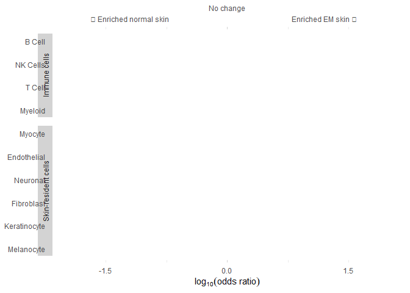
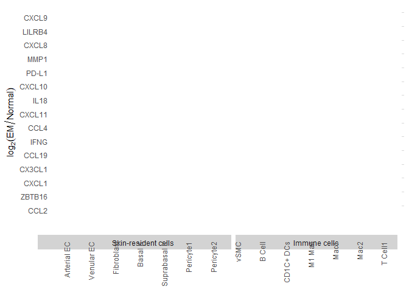
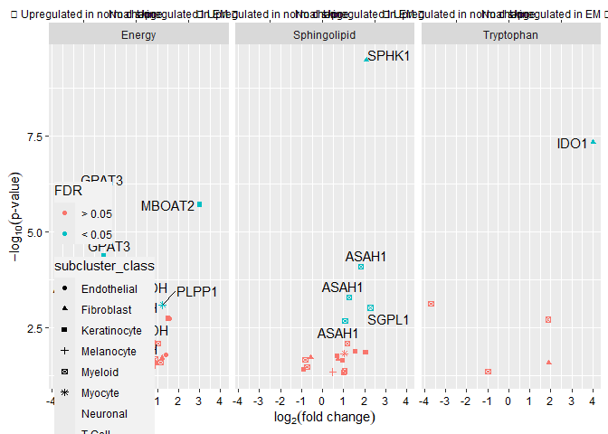
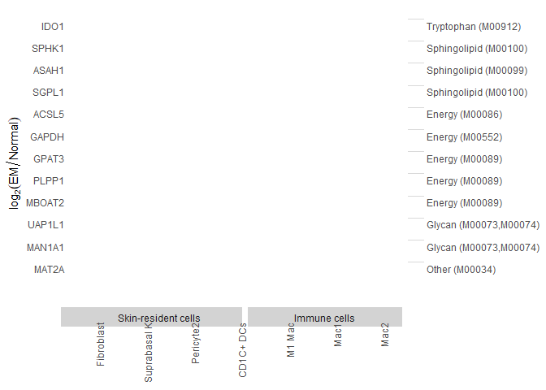
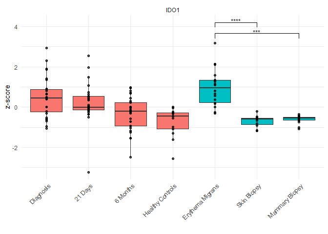

# Figure 7

# 7a

### Panel A: Skin scRNA-seq UMAP by Lesion Status

# 7b

### Panel B: Skin Cell-Type Abundance Forest Plot

# 7c

                     sub_cluster n
    1                   Dividing 3
    2                       UNKN 2
    3               Arterial ECs 1
    4                     B Cell 1
    5                      Basal 1
    6                  CD1C+ DCs 1
    7                        CD4 1
    8                  CD4 Naive 1
    9                        CD8 1
    10               CLEC9A+ DCs 1
    11 CLEC9A+ DCs - Replicating 1
    12      Dividing Venular ECs 1
    13                    Fibro1 1
    14                    Fibro2 1
    15                    Fibro3 1
    16                    Fibro4 1
    17                    Fibro5 1
    18                    Fibro6 1
    19             IRS sebaceous 1
    20                LAMP3+ DCs 1
    21          Langerhans Cells 1
    22             Lymphatic ECs 1
    23  M1 Activated Macrophages 1
    24                      Mac1 1
    25                      Mac2 1
    26                Melanocyte 1
    27               Melanocytes 1
    28                  NK Cells 1
    29                  Neuronal 1
    30         Outer Root Sheath 1
    31                 Pericyte1 1
    32                 Pericyte2 1
    33             Proliferating 1
    34                Suprabasal 1
    35                    TCell1 1
    36                     Tregs 1
    37                     UNKN1 1
    38                     UNKN2 1
    39                   Unknown 1
    40                  Unknown1 1
    41                  Unknown2 1
    42               Venular ECs 1
    43                      vSMC 1

                      sub_cluster n
    1                Arterial ECs 1
    2                      B Cell 1
    3          Basal Keratinocyte 1
    4                   CD1C+ DCs 1
    5                   CD4 Naive 1
    6                  CD4 T Cell 1
    7                  CD8 T Cell 1
    8                 CLEC9A+ DCs 1
    9   CLEC9A+ DCs - Replicating 1
    10           Dividing Myocyte 1
    11            Dividing T Cell 1
    12       Dividing Venular ECs 1
    13                 Fibroblast 1
    14              IRS sebaceous 1
    15                 LAMP3+ DCs 1
    16           Langerhans Cells 1
    17              Lymphatic ECs 1
    18   M1 Activated Macrophages 1
    19                       Mac1 1
    20                       Mac2 1
    21                 Melanocyte 1
    22                Melanocytes 1
    23                   NK Cells 1
    24                   Neuronal 1
    25          Outer Root Sheath 1
    26                  Pericyte1 1
    27                  Pericyte2 1
    28 Proliferating Keratinocyte 1
    29    Suprabasal Keratinocyte 1
    30                     TCell1 1
    31                      Tregs 1
    32               UNKN Myocyte 1
    33                      UNKN1 1
    34                      UNKN2 1
    35                    Unknown 1
    36                   Unknown1 1
    37                   Unknown2 1
    38                Venular ECs 1
    39                       vSMC 1

### Panel C: Differential Marker Heatmap Across Skin Subclusters

# 7d

### Exploratory KEGG Enzyme Differential Expression Volcano Plot

### Panel D: KEGG Enzyme Differential Expression Heatmap

# 7e

### Barplots

### Panel E: Public Skin IFN Signature Boxplot

     [1] "GDF10" "GDF11" "GDF11" "GDF11" "GDF15" "GDF15" "GDF2"  "GDF3"  "GDF5" 
    [10] "GDF9" 

    [1] "APLP1" "APLP2"

    R version 4.4.1 (2024-06-14 ucrt)
    Platform: x86_64-w64-mingw32/x64
    Running under: Windows 11 x64 (build 22631)

    Matrix products: default

    locale:
    [1] LC_COLLATE=English_United States.utf8 
    [2] LC_CTYPE=English_United States.utf8   
    [3] LC_MONETARY=English_United States.utf8
    [4] LC_NUMERIC=C                          
    [5] LC_TIME=English_United States.utf8    

    time zone: America/Los_Angeles
    tzcode source: internal

    attached base packages:
    [1] stats     graphics  grDevices utils     datasets  methods   base     

    other attached packages:
     [1] KEGGREST_1.44.1    xCell_1.1.0        lubridate_1.9.3    forcats_1.0.0     
     [5] stringr_1.5.1      purrr_1.0.2        readr_2.1.5        tidyverse_2.0.0   
     [9] Seurat_5.3.0       SeuratObject_5.0.2 sp_2.1-4           ggprism_1.0.5     
    [13] dplyr_1.1.4        tibble_3.2.1       tidyr_1.3.1        pheatmap_1.0.12   
    [17] ggpubr_0.6.0       Hmisc_5.1-3        patchwork_1.3.0    ggplotify_0.1.2   
    [21] ggplot2_4.0.0      RColorBrewer_1.1-3 venn_1.12          knitr_1.49        
    [25] limma_3.60.4      

    loaded via a namespace (and not attached):
      [1] fs_1.6.6                    matrixStats_1.4.1          
      [3] GSVA_1.52.3                 spatstat.sparse_3.1-0      
      [5] httr_1.4.7                  tools_4.4.1                
      [7] sctransform_0.4.1           backports_1.5.0            
      [9] R6_2.5.1                    HDF5Array_1.32.1           
     [11] lazyeval_0.2.2              uwot_0.2.2                 
     [13] rhdf5filters_1.16.0         withr_3.0.2                
     [15] gridExtra_2.3               progressr_0.14.0           
     [17] textshaping_0.4.0           cli_3.6.3                  
     [19] Biobase_2.64.0              pacman_0.5.1               
     [21] spatstat.explore_3.3-2      fastDummies_1.7.4          
     [23] labeling_0.4.3              S7_0.2.0                   
     [25] spatstat.data_3.1-2         ggridges_0.5.6             
     [27] pbapply_1.7-2               systemfonts_1.1.0          
     [29] yulab.utils_0.1.7           foreign_0.8-86             
     [31] parallelly_1.38.0           rstudioapi_0.16.0          
     [33] RSQLite_2.3.7               generics_0.1.3             
     [35] gridGraphics_0.5-1          ica_1.0-3                  
     [37] spatstat.random_3.3-2       car_3.1-2                  
     [39] Matrix_1.7-0                S4Vectors_0.42.1           
     [41] abind_1.4-5                 lifecycle_1.0.4            
     [43] yaml_2.3.10                 carData_3.0-5              
     [45] SummarizedExperiment_1.34.0 rhdf5_2.48.0               
     [47] SparseArray_1.4.8           Rtsne_0.17                 
     [49] grid_4.4.1                  blob_1.2.4                 
     [51] promises_1.3.0              crayon_1.5.3               
     [53] miniUI_0.1.1.1              lattice_0.22-6             
     [55] beachmat_2.20.0             cowplot_1.1.3              
     [57] annotate_1.80.0             magick_2.8.4               
     [59] pillar_1.10.1               GenomicRanges_1.56.1       
     [61] rjson_0.2.23                future.apply_1.11.2        
     [63] admisc_0.38                 codetools_0.2-20           
     [65] glue_1.8.0                  spatstat.univar_3.0-1      
     [67] data.table_1.15.4           vctrs_0.6.5                
     [69] png_0.1-8                   spam_2.10-0                
     [71] gtable_0.3.6                cachem_1.1.0               
     [73] xfun_0.48                   S4Arrays_1.4.1             
     [75] mime_0.12                   pracma_2.4.4               
     [77] survival_3.6-4              SingleCellExperiment_1.26.0
     [79] statmod_1.5.0               fitdistrplus_1.2-1         
     [81] ROCR_1.0-11                 nlme_3.1-164               
     [83] bit64_4.0.5                 RcppAnnoy_0.0.22           
     [85] GenomeInfoDb_1.40.1         rprojroot_2.0.4            
     [87] irlba_2.3.5.1               KernSmooth_2.23-24         
     [89] rpart_4.1.23                colorspace_2.1-1           
     [91] BiocGenerics_0.50.0         DBI_1.2.3                  
     [93] nnet_7.3-19                 DESeq2_1.44.0              
     [95] tidyselect_1.2.1            curl_5.2.1                 
     [97] bit_4.0.5                   compiler_4.4.1             
     [99] graph_1.82.0                htmlTable_2.4.3            
    [101] DelayedArray_0.30.1         plotly_4.11.0              
    [103] checkmate_2.3.2             scales_1.4.0               
    [105] lmtest_0.9-40               SpatialExperiment_1.14.0   
    [107] digest_0.6.37               goftest_1.2-3              
    [109] spatstat.utils_3.1-0        rmarkdown_2.29             
    [111] XVector_0.44.0              htmltools_0.5.8.1          
    [113] pkgconfig_2.0.3             base64enc_0.1-3            
    [115] sparseMatrixStats_1.16.0    MatrixGenerics_1.16.0      
    [117] fastmap_1.2.0               ggthemes_5.1.0             
    [119] rlang_1.1.4                 htmlwidgets_1.6.4          
    [121] UCSC.utils_1.0.0            shiny_1.9.1                
    [123] farver_2.1.2                zoo_1.8-12                 
    [125] jsonlite_1.8.9              BiocParallel_1.38.0        
    [127] BiocSingular_1.20.0         magrittr_2.0.3             
    [129] Formula_1.2-5               GenomeInfoDbData_1.2.12    
    [131] dotCall64_1.1-1             Rhdf5lib_1.26.0            
    [133] Rcpp_1.0.13                 reticulate_1.38.0          
    [135] stringi_1.8.4               zlibbioc_1.50.0            
    [137] MASS_7.3-60.2               org.Hs.eg.db_3.19.1        
    [139] plyr_1.8.9                  parallel_4.4.1             
    [141] listenv_0.9.1               ggrepel_0.9.5              
    [143] deldir_2.0-4                Biostrings_2.72.1          
    [145] splines_4.4.1               tensor_1.5                 
    [147] hms_1.1.3                   locfit_1.5-9.10            
    [149] igraph_2.0.3                spatstat.geom_3.3-3        
    [151] ggsignif_0.6.4              RcppHNSW_0.6.0             
    [153] reshape2_1.4.4              stats4_4.4.1               
    [155] ScaledMatrix_1.10.0         XML_3.99-0.17              
    [157] evaluate_1.0.1              tzdb_0.4.0                 
    [159] httpuv_1.6.15               RANN_2.6.2                 
    [161] polyclip_1.10-7             future_1.34.0              
    [163] scattermore_1.2             rsvd_1.0.5                 
    [165] broom_1.0.6                 xtable_1.8-4               
    [167] RSpectra_0.16-2             rstatix_0.7.2              
    [169] later_1.3.2                 ragg_1.3.2                 
    [171] viridisLite_0.4.2           memoise_2.0.1              
    [173] AnnotationDbi_1.66.0        IRanges_2.38.1             
    [175] cluster_2.1.6               timechange_0.3.0           
    [177] globals_0.16.3              GSEABase_1.66.0            
    [179] here_1.0.1                 
