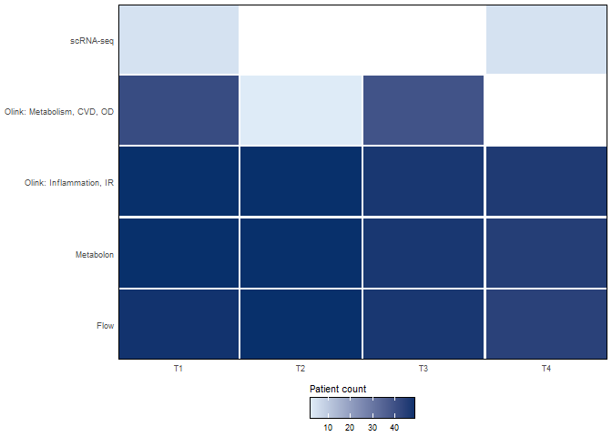
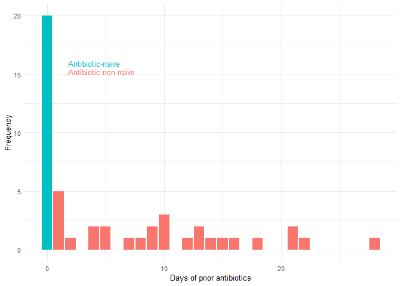
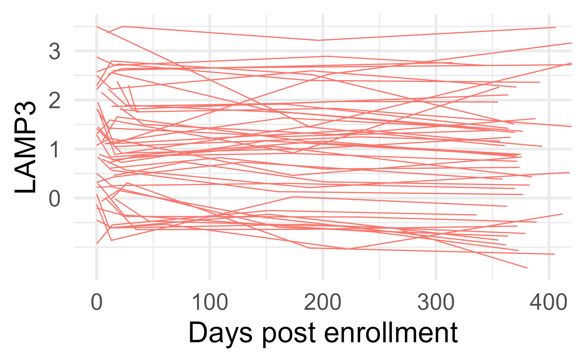
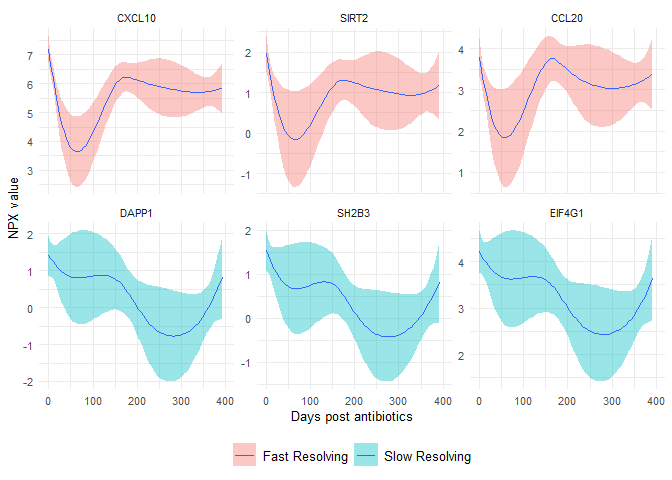
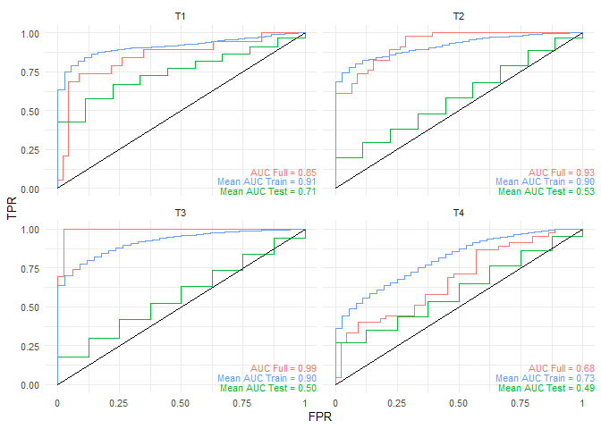
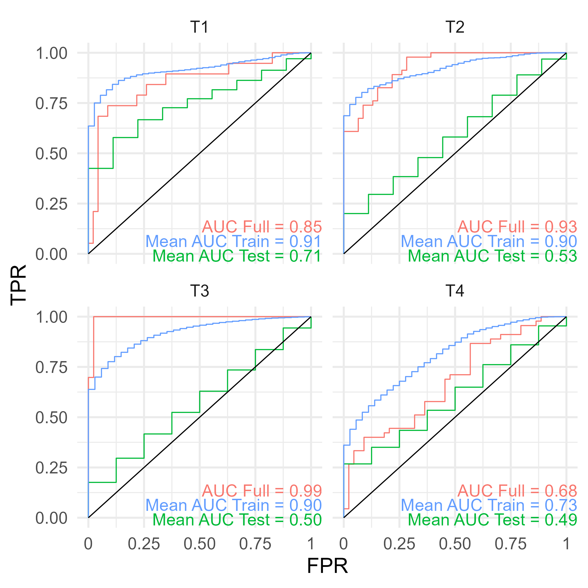

# Figure S1


## Load Functions

``` r
# Functions ---------------------------------------------------------------
general_functions <- here::here("scripts", "common", "general_functions.R")
if (file.exists(general_functions)) {
  source(file = general_functions)
}

returnSigStars = function(x){
  x2 = x
  x2[is.numeric(x) & x > 0.05] = "ns"
  x2[is.numeric(x) & x < 0.05] = "*"
  x2[is.numeric(x) & x < 0.01] = "**"
  x2[is.numeric(x) & x < 0.001] = "***"
  x2[is.numeric(x) & x < 0.0001] = "****"
  x2
}

gg_color_hue <- function(n) {
  hues = seq(15, 375, length = n + 1)
  hcl(h = hues, l = 65, c = 100)[1:n]
}

palBias = function(x){
  if(abs(x)>1){
    break("x must be between -1 and 1")
  }
  cool = rainbow(500, start=rgb2hsv(col2rgb('cyan'))[1], end=rgb2hsv(col2rgb('blue'))[1])
  warm = rainbow(500, start=rgb2hsv(col2rgb('red'))[1], end=rgb2hsv(col2rgb('yellow'))[1])
  cols = c(rev(cool), rev(warm))
  if(x<0){
    cols = cols[ceiling(abs(x)*500):1000]
  }else{
    cols = cols[1:ceiling(500+500*(1-x))]
  }
  colorRampPalette(cols)(255)
}

fixNames = function(x){
  x = gsub("\\..*","",x)
  x = gsub("-","",x)
  x = gsub("/.*","",x)
  x = gsub("\\(.*","",x)
  x = toupper(x)
  alias = alias2SymbolTable(x)
  x[!is.na(alias)] = alias[!is.na(alias)]
  x
}

cos.sim = function(x){
  res = matrix(ncol = ncol(x),nrow = ncol(x))
  dimnames(res) = list(colnames(x),colnames(x))
  x = as.data.frame(x)
  res = mapply(function(xi,i){
    mapply(function(xj,j){
      sim = xi%*%xj/(sqrt(sum((xi)^2))*sqrt(sum((xj)^2)))
      res[i,j] = sim
      res[j,i] = sim
    },x,1:ncol(x))
  },x,1:ncol(x))
  res
}

na.omit.all = function(x,MAR=c(1,2)){
  if(MAR==1){
    x[apply(x,1,function(x)sum(!is.na(x))>0),]
  }else if(MAR==2){
    x[,apply(x,2,function(x)sum(!is.na(x))>0)]
  }else{
    x[apply(x,1,function(x)sum(!is.na(x))>0),
      apply(x,2,function(x)sum(!is.na(x))>0)]
  }
}

rcorr.nodups = function(x,y,...){
  c = rcorr(x,y,...)
  rows = 1:ncol(x)
  cols = (ncol(x)+1):(ncol(x)+ncol(y))
  c$r = c$r[rows,cols]
  c$n = c$n[rows,cols]
  c$P = c$P[rows,cols]
  c
}

coord_radar <- function (theta = "x", start = 0, direction = 1) 
{
  theta <- match.arg(theta, c("x", "y"))
  r <- if (theta == "x") 
    "y"
  else "x"
  
  #dirty
  rename_data <- function(coord, data) {
    if (coord$theta == "y") {
      plyr::rename(data, c("y" = "theta", "x" = "r"), warn_missing = FALSE)
    } else {
      plyr::rename(data, c("y" = "r", "x" = "theta"), warn_missing = FALSE)
    }
  }
  theta_rescale <- function(coord, x, scale_details) {
    rotate <- function(x) (x + coord$start) %% (2 * pi) * coord$direction
    rotate(scales::rescale(x, c(0, 2 * pi), scale_details$theta.range))
  }
  
  r_rescale <- function(coord, x, scale_details) {
    scales::rescale(x, c(0, .4), scale_details$r.range)
  }
  
  ggproto("CordRadar", CoordPolar, theta = theta, r = r, start = start, 
          direction = sign(direction),
          is_linear = function(coord) TRUE,
          render_bg = function(self, scale_details, theme) {
            scale_details <- rename_data(self, scale_details)
            
            theta <- if (length(scale_details$theta.major) > 0)
              theta_rescale(self, scale_details$theta.major, scale_details)
            thetamin <- if (length(scale_details$theta.minor) > 0)
              theta_rescale(self, scale_details$theta.minor, scale_details)
            thetafine <- seq(0, 2 * pi, length.out = 100)
            
            rfine <- c(r_rescale(self, scale_details$r.major, scale_details))
            
            # This gets the proper theme element for theta and r grid lines:
            #   panel.grid.major.x or .y
            majortheta <- paste("panel.grid.major.", self$theta, sep = "")
            minortheta <- paste("panel.grid.minor.", self$theta, sep = "")
            majorr     <- paste("panel.grid.major.", self$r,     sep = "")
            
            ggplot2:::ggname("grill", grid::grobTree(
              ggplot2:::element_render(theme, "panel.background"),
              if (length(theta) > 0) ggplot2:::element_render(
                theme, majortheta, name = "angle",
                x = c(rbind(0, 0.45 * sin(theta))) + 0.5,
                y = c(rbind(0, 0.45 * cos(theta))) + 0.5,
                id.lengths = rep(2, length(theta)),
                default.units = "native"
              ),
              if (length(thetamin) > 0) ggplot2:::element_render(
                theme, minortheta, name = "angle",
                x = c(rbind(0, 0.45 * sin(thetamin))) + 0.5,
                y = c(rbind(0, 0.45 * cos(thetamin))) + 0.5,
                id.lengths = rep(2, length(thetamin)),
                default.units = "native"
              ),
              
              ggplot2:::element_render(
                theme, majorr, name = "radius",
                x = rep(rfine, each = length(thetafine)) * sin(thetafine) + 0.5,
                y = rep(rfine, each = length(thetafine)) * cos(thetafine) + 0.5,
                id.lengths = rep(length(thetafine), length(rfine)),
                default.units = "native"
              )
            ))
          })
}

### adapted from diffcyt

testDA_edgeR <- function(counts,cluster_id, design, contrast, 
                         trend_method = "none", 
                         min_cells = 3, min_samples = NULL, 
                         normalize = T, norm_factors = "TMM") {
  
  if (is.null(min_samples)) {
    min_samples <- ncol(counts) / 2
  }
  
  if(missing(cluster_id)){
    cluster_id = rownames(counts)
  }
  
  cluster_id_all = cluster_id
  
  # filtering: keep clusters with at least 'min_cells' cells in at least 'min_samples' samples
  tf <- counts >= min_cells
  ix_keep <- apply(tf, 1, function(r) sum(r) >= min_samples)
  
  counts <- counts[ix_keep, , drop = FALSE]
  cluster_id <- cluster_id[ix_keep]
  
  # edgeR pipeline
  
  # normalization factors
  if (normalize & norm_factors == "TMM") {
    norm_factors <- calcNormFactors(counts, method = "TMM")
  }
  
  # note: when using DGEList object, column sums are automatically used for library sizes
  if (normalize) {
    y <- DGEList(counts, norm.factors = norm_factors)
  } else {
    y <- DGEList(counts)
  }
  
  # estimate dispersions
  # (note: using 'trend.method = "none"' by default)
  y <- estimateDisp(y, design, trend.method = trend_method)
  
  # fit models
  fit <- glmFit(y, design)
  
  # likelihood ratio tests
  resList = list()
  for(i in 1:ncol(contrast)){
    lrt <- glmLRT(fit, contrast = contrast[,i])
    top <- edgeR::topTags(lrt, n = Inf, adjust.method = "BH", sort.by = "none")
    row_data = top$table
    if(length(cluster_id)!=length(cluster_id_all)){
      missing_clusts = cluster_id_all[!cluster_id_all%in%cluster_id]
      missing = matrix(nrow = length(missing_clusts),ncol = ncol(row_data))
      rownames(missing) = missing_clusts
      colnames(missing) = colnames(top)
      row_data = rbind(row_data,missing)
      row_data = row_data[cluster_id_all,]
    }
    resList[[i]] = row_data
  }
  names(resList) = colnames(contrast)
  
  
  logFCFrame = do.call(cbind,lapply(resList,function(x)x[,"logFC"]))
  colnames(logFCFrame) = colnames(contrast)
  rownames(logFCFrame) = cluster_id_all
  
  adjpFrame = do.call(cbind,lapply(resList,function(x)x[,"FDR"]))
  colnames(adjpFrame) = colnames(contrast)
  rownames(adjpFrame) = cluster_id_all
  
  pFrame = do.call(cbind,lapply(resList,function(x)x[,"PValue"]))
  colnames(pFrame) = colnames(contrast)
  rownames(pFrame) = cluster_id_all
  
  list(p.adjFrame = adjpFrame,pFrame = pFrame,logFCFrame = logFCFrame)
}


### Adapted from diffcyt

testDS_limma <- function(d_counts, d_medians, design, contrast, 
                         block_id = NULL, trend = TRUE, weights = TRUE, 
                         markers_to_test = NULL, 
                         min_cells = 3, min_samples = NULL, 
                         plot = FALSE, path = ".") {
  
  if (!is.null(block_id) & !is.factor(block_id)) {
    block_id <- factor(block_id, levels = unique(block_id))
  }
  
  if (is.null(min_samples)) {
    min_samples <- ncol(d_counts) / 2
  }
  
  # markers to test
  if (!is.null(markers_to_test)) {
    markers_to_test <- markers_to_test
  } else {
    # vector identifying 'cell state' markers in list of assays
    markers_to_test <- metadata(d_medians)$id_state_markers
  }
  
  # note: counts are only required for filtering
  counts <- d_counts
  cluster_id <- rownames(d_counts)
  
  # filtering: keep clusters with at least 'min_cells' cells in at least 'min_samples' samples
  tf <- counts >= min_cells
  ix_keep <- apply(tf, 1, function(r) sum(r) >= min_samples)
  
  counts <- counts[ix_keep, , drop = FALSE]
  cluster_id <- cluster_id[ix_keep]
  
  # extract medians and create concatenated matrix
  state_names <- names(assays(d_medians))[markers_to_test]
  meds <- do.call("rbind", {
    lapply(as.list(assays(d_medians)[state_names]), function(a) a[as.character(cluster_id), , drop = FALSE])
  })
  meds_all <- do.call("rbind", as.list(assays(d_medians)[state_names]))
  
  
  rownames(meds) = paste0(rep(state_names,each=length(cluster_id))," - ",rep(cluster_id,length(state_names)))
  rownames(meds_all) = paste0(rep(state_names,each=nrow(d_counts))," - ",rep(sort(rownames(d_counts)),length(state_names)))
  # limma pipeline
  
  # estimate correlation between paired samples
  # (note: paired designs only; >2 measures per sample not allowed)
  if (!is.null(block_id)) {
    dupcor <- duplicateCorrelation(meds, design, block = block_id)
  }
  
  # weights: cluster cell counts (repeat for each marker)
  if (weights) {
    weights <- counts[as.character(rep(cluster_id, length(state_names))), ]
    stopifnot(nrow(weights) == nrow(meds))
  } else {
    weights <- NULL
  }
  
  # fit models
  if (!is.null(block_id)) {
    message("Fitting linear models with random effects term for 'block_id'.")
    fit <- lmFit(meds, design, weights = weights, 
                 block = block_id, correlation = dupcor$consensus.correlation)
  } else {
    fit <- lmFit(meds, design, weights = weights)
  }
  fit <- contrasts.fit(fit, contrast)
  
  # calculate moderated tests
  efit <- eBayes(fit, trend = trend)
  
  # results
  tops = lapply(colnames(contrast),function(x)topTable(efit, coef = x, number = Inf, adjust.method = "BH", sort.by = "none"))
  names(tops) = colnames(contrast)
  
  logFCFrame = sapply(tops,function(x)x$logFC)
  rownames(logFCFrame) = rownames(tops[[1]])
  adj.pFrame = sapply(tops,function(x)x$adj.P.Val)
  rownames(adj.pFrame) = rownames(tops[[1]])
  
  list(logFCFrame = logFCFrame,adj.pFrame = adj.pFrame,meds = meds)
}

plot_pca = function(pca,color,components=c(1,2),label=F,n=10,scale = 5,draw_loadings = F,
                    legendSize = unit(3,'mm')){
  d = data.frame(comp1 = pca$x[,components[1]],
                 comp2 = pca$x[,components[2]],
                 color=color,
                 label = rownames(pca$x))
  
  vars = paste0("PC",1:ncol(pca$x)," (",round(pca$sdev^2/sum(pca$sdev^2)*100,1),"%)")
  loadings = data.frame(t(apply(pca$rotation,1,function(x)x*pca$sdev))[,components],
                        x=rep(0,nrow(pca$rotation)),
                        y=rep(0,nrow(pca$rotation)))
  loadings$label = rownames(loadings)
  keep = order(loadings[,components[1]]^2+loadings[,components[2]]^2,decreasing=T)[1:n]
  loadings = loadings[keep,]
  legendSize = unit(3,'mm')
  
  if(label){
    p = ggplot(d,aes(x=comp1,y=comp2,color=color,label=label))
    if(draw_loadings){
      labs = data.frame(x=c(d[,components[1]],scale*loadings[,1]),
                        y=c(d[,components[2]],scale*loadings[,2]+sign(scale*loadings[,2])*0.5),
                        label = c(d$label,loadings$label),
                        color = c(as.character(d$color),rep("var",nrow(loadings))))
      p = p + ggrepel::geom_label_repel(labs,
                                        mapping = aes(x=x,y=y,label=label,color=color),
                                        inherit.aes = F,
                                        col = c(gg_color_hue(length(unique(labs$color))-1),"black")[match(labs$color, c(unique(labs$color)[unique(labs$color)!="var"],"var"))],
                                        max.overlaps = 30,
                                        size = 15)+
        geom_segment(loadings,
                     mapping = aes(x=x,y=y,xend=scale*(x+PC1),yend=scale*(y+PC2)),
                     inherit.aes = F,
                     arrow = arrow(length = unit(1,"cm")),size=2)
    }
  }else{
    p = ggplot(d,aes(x=comp1,y=comp2,color=color))+geom_point(size=15)
    if(draw_loadings){
      labs = data.frame(x=c(scale*loadings[,1]),
                        y=c(scale*loadings[,2]),
                        label = c(loadings$label),
                        color = c(rep("var",nrow(loadings))))
      p = p +
        geom_segment(loadings,
                     mapping = aes(x=x,y=y,xend=scale*(x+PC1),yend=scale*(y+PC2)),
                     inherit.aes = F,
                     arrow = arrow(length = unit(1,"cm")),size=2)+
        ggrepel::geom_label_repel(labs,
                                  mapping = aes(x=x,y=y,label=label),
                                  inherit.aes = F,
                                  col = 'black',
                                  max.overlaps = 30,
                                  size = 15)
    }
  }
  
  p = p +
    xlab(vars[components[1]])+
    ylab(vars[components[2]])+
    guides(color = guide_legend(title="",byrow = TRUE))+
    theme(legend.key.size = legendSize,
          axis.text = element_blank(),
          plot.title = element_text(hjust = 0.5),
          legend.spacing.y = unit(3, 'cm'))+
    theme_minimal(base_size = 60)
}
```

``` r
load(here::here("data", "raw", "01_proteomics_metabolomics", "OlinkPreprocessed.RData"))
```

## 

### Panel A: Patient Sample Availability by Assay and Visit

``` r
patient_count_heatmap <- local({
  processed_env <- new.env()
  load(
    here::here(
      "data", "processed", "01_proteomics_metabolomics", "Data.RData"
    ),
    envir = processed_env
  )
  processed_data <- processed_env$data
  sample_data <- processed_data$sampleData

  flow_sample_ids <- purrr::reduce(
    c("bcell", "tcell", "monocyte", "dcnk"),
    function(ids, panel_name) {
      panel_env <- new.env()
      load(
        here::here(
          "data", "intermediate", "flow_gating",
          paste0(panel_name, ".RData")
        ),
        envir = panel_env
      )
      union(
        ids,
        as.character(panel_env[[panel_name]]$propsLong$id)
      )
    },
    .init = character()
  )

  samples_with_data <- function(x) {
    rownames(x)[rowSums(!is.na(x)) > 0]
  }

  assay_availability <- dplyr::bind_rows(
    sample_data |>
      dplyr::filter(sample %in% flow_sample_ids) |>
      dplyr::transmute(
        Subject_ID = as.character(Subject_ID),
        Condition,
        time,
        dataset = "Flow"
      ),
    sample_data |>
      dplyr::filter(sample %in% samples_with_data(processed_data$data)) |>
      dplyr::transmute(
        Subject_ID = as.character(Subject_ID),
        Condition,
        time,
        dataset = "Olink: Inflammation, IR"
      ),
    sample_data |>
      dplyr::filter(sample %in% samples_with_data(processed_data$olinkNew)) |>
      dplyr::transmute(
        Subject_ID = as.character(Subject_ID),
        Condition,
        time,
        dataset = "Olink: Metabolism, CVD, OD"
      ),
    sample_data |>
      dplyr::filter(
        sample %in% samples_with_data(processed_data$metabolon$pat_data)
      ) |>
      dplyr::transmute(
        Subject_ID = as.character(Subject_ID),
        Condition,
        time,
        dataset = "Metabolon"
      ),
    readr::read_csv(
      here::here("data", "metadata", "sc_sampleData.csv"),
      show_col_types = FALSE
    ) |>
      dplyr::transmute(
        Subject_ID = as.character(Subject_ID),
        Condition,
        time,
        dataset = "scRNA-seq"
      )
  ) |>
    dplyr::distinct()

  time_levels <- c("T1", "T2", "T3", "T4")
  dataset_levels <- c(
    "Flow",
    "Metabolon",
    "Olink: Inflammation, IR",
    "Olink: Metabolism, CVD, OD",
    "scRNA-seq"
  )

  heat_counts <- assay_availability |>
    dplyr::filter(
      Condition == "Patient",
      time %in% time_levels
    ) |>
    dplyr::count(dataset, time, name = "n_present") |>
    tidyr::complete(
      dataset = dataset_levels,
      time = time_levels,
      fill = list(n_present = 0)
    ) |>
    dplyr::mutate(
      dataset = factor(dataset, levels = dataset_levels),
      time = factor(time, levels = time_levels),
      n_fill = dplyr::na_if(n_present, 0L)
    )

  positive_counts <- heat_counts$n_present[heat_counts$n_present > 0]
  blues <- RColorBrewer::brewer.pal(9, "Blues")

  ggplot(heat_counts, aes(x = time, y = dataset, fill = n_fill)) +
    geom_tile(width = 0.98, height = 0.97) +
    coord_cartesian(expand = FALSE) +
    scale_fill_gradient(
      low = blues[2],
      high = blues[9],
      limits = range(positive_counts),
      na.value = "white",
      name = "Patient count"
    ) +
    labs(x = NULL, y = NULL) +
    theme_minimal(base_size = 8, base_family = "Arial") +
    theme(
      panel.border = element_rect(
        colour = "black",
        fill = NA,
        linewidth = 0.1
      ),
      panel.grid = element_blank(),
      legend.position = "bottom",
      legend.direction = "horizontal",
      legend.title.position = "top",
      legend.margin = margin(0, 0, 0, 0),
      legend.spacing.x = unit(0, "mm"),
      legend.spacing.y = unit(0, "mm")
    ) +
    guides(
      fill = guide_colourbar(
        frame.colour = "black",
        frame.linewidth = 0.1
      )
    )
})

patient_count_heatmap
```



``` r
ggsave(
  here::here("fig_s1_files", "figure_S01a_assay_sample_availability_heatmap.png"),
  patient_count_heatmap,
  device = ragg::agg_png,
  width = 3,
  height = 2,
  units = "in",
  dpi = 600
)
```

### Panel B: Prior Antibiotic Exposure Distribution

``` r
antibiotic_exposure_cols <- c(
  "Antibiotic-naive" = "#00BFC4",
  "Antibiotic non-naive" = "#F8766D"
)

antibiotic_exposure_labels <- paste0(
  "<span style='color:",
  unname(antibiotic_exposure_cols),
  ";'>",
  names(antibiotic_exposure_cols),
  "</span>"
)

prior_antibiotic_exposure <- data$sampleData |>
  filter(time == "T1", Condition == "Patient",
      Subject_ID != "201455",
      ) |>
  mutate(
    antibiotic_exposure = case_when(
      days_of_prior_antibiotics == 0 ~ "Antibiotic-naive",
      days_of_prior_antibiotics > 0 ~ "Antibiotic non-naive"
    ),
    antibiotic_exposure = factor(
      antibiotic_exposure,
      levels = names(antibiotic_exposure_cols)
    )
  ) |>
  ggplot(aes(x = days_of_prior_antibiotics, fill = antibiotic_exposure)) +
  geom_bar() +
  scale_fill_manual(
    values = antibiotic_exposure_cols,
    breaks = names(antibiotic_exposure_cols),
    labels = antibiotic_exposure_labels,
    guide = guide_legend(
      override.aes = list(alpha = 0),
      keyheight = grid::unit(0.01, "pt"),
      keywidth = grid::unit(0.01, "pt")
    )
  ) +
  xlab("Days of prior antibiotics") +
  ylab("Frequency") +
  theme_minimal(base_size = 10) +
  theme(
    legend.position = c(0.10, 0.75),
    legend.justification = c(0, 0.5),
    legend.title = element_blank(),
    legend.key = element_blank(),
    legend.key.height = grid::unit(0.01, "pt"),
    legend.key.width = grid::unit(0.01, "pt"),
    legend.text = ggtext::element_markdown(size = 10),
    legend.margin = margin(0, 0, 0, 0),
    legend.box.margin = margin(0, 0, 0, 0)
  )

prior_antibiotic_exposure
```



``` r
ggsave(
  here::here("fig_s1_files", "figure_S01b_prior_antibiotic_exposure_histogram.png"),
  prior_antibiotic_exposure,
  device = ragg::agg_png,
  width = 2,
  height = 2,
  units = "in",
  dpi = 600
)
```

### Panel C: Longitudinal Patient vs Control Volcano Plots

#### Differential Expression

``` r
# Set up factors ----------------------------------------------------------
# Exclude the 35-EM patient. Comment this block out to include them.
samples_without_35EM <- data$sampleData |>
  tibble::rownames_to_column("sample_rowname") |>
  dplyr::filter(
    as.character(Subject_ID) != "201455",
    !as.character(sample) %in% c("201455 T1", "201455 T2")
  ) |>
  dplyr::pull(sample_rowname)

data$sampleData <- data$sampleData[samples_without_35EM, , drop = FALSE]
data$assayData <- data$assayData[samples_without_35EM, , drop = FALSE]
data$data <- data$data[samples_without_35EM, , drop = FALSE]
data$directSymptoms <- data$directSymptoms[samples_without_35EM, , drop = FALSE]
data$confoundingSymptoms <- data$confoundingSymptoms[samples_without_35EM, , drop = FALSE]
data$emData <- data$emData[samples_without_35EM, , drop = FALSE]
data$symptomData <- data$symptomData[samples_without_35EM, , drop = FALSE]
data$treatmentData <- data$treatmentData[samples_without_35EM, , drop = FALSE]
data$olinkNew <- data$olinkNew[samples_without_35EM, , drop = FALSE]
data$olinkNewFail <- data$olinkNewFail[samples_without_35EM, , drop = FALSE]

# Match the original Olink preprocessing used for the S1B-C volcano plots.
Inflammation = data$assayData[, data$featureData$panel == "Inflammation"]
ImmuneResponse = data$assayData[, data$featureData$panel == "ImmuneResponse"]
Inflammation = Inflammation[apply(Inflammation, 1, function(x) sum(is.na(x)) == 0), ]
ImmuneResponse = ImmuneResponse[apply(ImmuneResponse, 1, function(x) sum(is.na(x)) == 0), ]

inf_batch = data$sampleData[rownames(Inflammation), "InflammationBatch"]
ir_batch = data$sampleData[rownames(ImmuneResponse), "ImmuneResponseBatch"]

mm1 = model.matrix(
  ~ Condition:days_post_ab + Gender + Age_at_Time_of_Study_Entry,
  data$sampleData[rownames(Inflammation), ]
)
mm2 = model.matrix(
  ~ Condition:days_post_ab + Gender + Age_at_Time_of_Study_Entry,
  data$sampleData[rownames(ImmuneResponse), ]
)

Inflammation = invisible(as.data.frame(t(sva::ComBat(t(Inflammation), inf_batch, mod = mm1))))
ImmuneResponse = invisible(as.data.frame(t(sva::ComBat(t(ImmuneResponse), ir_batch))))

data$assayData[rownames(Inflammation), colnames(Inflammation)] = Inflammation
data$assayData[rownames(ImmuneResponse), colnames(ImmuneResponse)] = ImmuneResponse

samples = gsub("_.$", "", rownames(data$assayData))
duplicated = samples[duplicated(samples)]
cat(duplicated, sep = ", ")
```

    100452 T3, 101388 T1, 101388 T3, 101388 T4, 101388 T2, 102969 T3, 102969 T1, 111395 T3, 113162 T3, 115038 T1, 115038 T3, 115038 T4, 204177 T2

``` r
data$assayData = aggregate(data$assayData, by = list(Name = samples), FUN = mean, na.remove = T)
rownames(data$assayData) = gsub("_.$", "", data$assayData$Name)
data$assayData = data$assayData[, -1]
featureData = data$featureData
data[!names(data) %in% c("featureData", "featureDataNew", "samples_to_remove")] = lapply(
  data[!names(data) %in% c("featureData", "featureDataNew", "samples_to_remove")],
  function(x) return(x[rownames(data$assayData), ])
)
data$featureData = featureData

rm(
  "duplicated", "featureData", "ImmuneResponse", "Inflammation",
  "inf_batch", "ir_batch", "mm1", "mm2", "samples"
)

factors = data$sampleData[!is.na(data$sampleData$time), c("Subject_ID","time","days_post_ab")]
colnames(factors) = c("Patient","Time","DaysPostAB")
factors$Patient = as.factor(factors$Patient)
factors$Time = as.factor(factors$Time)
factors$Type = rep("p",dim(factors)[1])
factors$Type[grep("^11|^21",rownames(factors))] = "c"
factors$Type = as.factor(factors$Type)
factors$naive = rep(F,dim(factors)[1])
factors$naive[factors$Patient%in%unique(factors$Patient[factors$DaysPostAB==0])] = T
levels(factors$Time) = c(levels(factors$Time),"TC")
factors$Time[factors$Type=="c"] = "TC"
factors$number_of_em = data$emData[rownames(factors),"Number_of_EM_at_Baseline"]
factors$em_dimension = data$emData[rownames(factors),"largest_EM_Dimension"]
factors$age = data$sampleData[rownames(factors),"Age_at_Time_of_Study_Entry"]
factors$gender = data$sampleData[rownames(factors),"Gender"]
factors$serology = data$sampleData[rownames(factors),"T1_lyme_disease_result"]
factors = cbind(factors,data$sampleData[rownames(factors),c("Systolic","Diastolic","Pulse","BMI")])
```

#### Patients vs. Controls Differential Expression

#### Volcano plots showing limma differential expression results

``` r
#T1 naive v T1 AB v control limma~~~~~~~~~~~~~~~~~~~~~~~~~~~~~~~~~~~~
levels = factor(paste(factors$Time,factors$Type,factors$naive,sep="."))
mm = model.matrix(~0+levels+factors$age+factors$gender+factors$serology)
colnames(mm) = gsub("levels|factors\\$","",colnames(mm))
groups = colnames(mm)

contrasts = c()
for(i in 1:ncol(mm)){
  for(j in 1:ncol(mm)){
    if(i!=j)
      contrasts = c(contrasts,paste0(colnames(mm)[i],"-",colnames(mm)[j]))
  }
}

fit = lmFit(t(data$assayData),mm)
conMat = makeContrasts(contrasts = contrasts,levels = groups)
fit2 = contrasts.fit(fit,conMat)
fit2 = eBayes(fit2)

n_ab_controlList = list()
for(i in 1:length(contrasts)){
  n_ab_controlList[[i]] = limma::topTable(fit2,coef = contrasts[i],adjust.method = "BH",number = Inf)
}
names(n_ab_controlList) = contrasts
n_ab_controlList = n_ab_controlList[!grepl("serology|age|gender",names(n_ab_controlList))]

# Plot params
family = "sans"
plot_text_size_pt = 8
n_highlight = 5
plot_title = element_text(hjust = 0.5, size = 10)
plot_subtitle = element_text(hjust = .5, size = 10)

thm = theme(
  text = element_text(family = family, size = plot_text_size_pt),
  axis.title = element_text(family = family, size = plot_text_size_pt),
  axis.text = element_text(family = family, size = plot_text_size_pt),
  strip.text = element_text(family = family, size = plot_text_size_pt),
  legend.title = element_text(family = family, size = 6),
  legend.text = element_text(family = family, size = 6),
  plot.title = plot_title,
  plot.subtitle = plot_subtitle
)

rm("conMat","contrasts",
   "fit","fit2","i","j","levels",
   "mm", "groups")
```

``` r
comps = c("T1.p.TRUE-TC.c.TRUE","T2.p.TRUE-TC.c.TRUE","T3.p.TRUE-TC.c.TRUE","T4.p.TRUE-TC.c.TRUE")
limmaResult = n_ab_controlList[comps]
names(limmaResult) = c("T1", "T2", "T3", "T4")
for(i in 1:length(limmaResult)){
  limmaResult[[i]]$ID = rep(names(limmaResult)[i], nrow(limmaResult[[i]]))
  limmaResult[[i]]$Protein = gsub("\\.", "", rownames(limmaResult[[i]]))
  limmaResult[[i]]$rank = rank(limmaResult[[i]]$adj.P.Val, "min")
}
limmaResult = limmaResult[c("T1", "T2", "T3", "T4")]
groupedDE = limmaResult
limmaResult = do.call(rbind, limmaResult)
limmaLabels = limmaResult |>
  dplyr::filter(rank <= n_highlight, adj.P.Val < 0.05)
naive = ggplot(limmaResult, aes(x = logFC, y = -log10(adj.P.Val), color = adj.P.Val < .05)) + 
  geom_point(size = 0.3) + 
  geom_text_repel(
    data = limmaLabels,
    aes(
      x = logFC,
      y = -log10(adj.P.Val),
      label = Protein,
      hjust = ifelse(logFC >= 0, 1, 0)
    ),
    color = "black",
    size = 5.5 / ggplot2::.pt,
    segment.color = "grey35",
    segment.size = 0.2,
    segment.alpha = 0.6,
    min.segment.length = 0,
    box.padding = 0.2,
    point.padding = 0.2,
    nudge_x = ifelse(limmaLabels$logFC >= 0, -0.6, 0.6),
    nudge_y = 0.3,
    direction = "y",
    force = 5,
    force_pull = 0.1,
    max.time = 5,
    max.iter = 50000,
    max.overlaps = Inf,
    seed = 123,
    show.legend = FALSE
  ) +
  facet_grid(cols = vars(ID)) + 
  guides(color = guide_legend(
    title = "p < 0.05",
    title.position = "top",
    title.hjust = 0.5
  )) + 
  xlab("log2 fold change") +
  ylab("-log10 adjusted p value") +
  coord_cartesian(xlim = c(-1, 2)) +
  ggtitle("Abx-naive patients vs. controls") +
  theme_minimal() +
  thm +
  theme(
    strip.text = element_text(size = 9),
    legend.title = element_text(hjust = 0.5, margin = margin(b = 1)),
    legend.text = element_text(size = 6, margin = margin(l = 1)),
    legend.margin = margin(0, 0, 0, 0),
    legend.box.margin = margin(0, 0, 0, 0),
    legend.box.spacing = unit(0, "pt"),
    legend.spacing.x = unit(0, "pt"),
    legend.spacing.y = unit(0, "pt"),
    legend.key = element_blank(),
    legend.key.height = unit(5, "pt"),
    legend.key.width = unit(5, "pt"),
    legend.position = c(0.95, 0.85),
    legend.justification = c(0.5, 0.5),
    legend.background = element_rect(fill = "grey90", color = NA),
    legend.box.background = element_rect(fill = "grey90", color = NA),
    plot.margin = margin(0, r=1, 0, 0)
  )
# naive
# 
# png("./figures_final/Olink/Volcano Controls vs AB Naive.png",width=550*3,height=250*3)
# naive
# dev.off()
# rm(naive,n_highlight)

naive
```


``` r
ggsave(
  here::here("fig_s1_files", "figure_S01c_abx_naive_patient_control_volcano.png"),
  naive,
  device = ragg::agg_png,
  width = 4,
  height = 1.9,
  units = "in",
  dpi = 600
)
```

### Panel D: Naive, Treated, and Control Volcano Plots

``` r
# Plot naive v AB v control volcano plots~~~~~~~~~~~~~~~~~~~~~~~~~~~~
limmaResult = n_ab_controlList[c("T1.p.TRUE-TC.c.TRUE", "T1.p.FALSE-TC.c.TRUE", "T1.p.TRUE-T1.p.FALSE")]
names(limmaResult) = c(
  "T1 Abx-naive\nvs. controls",
  "T1 Abx non-naive\nvs. controls",
  "T1 Abx-naive\nvs. Abx non-naive"
)
for(i in 1:length(limmaResult)){
  limmaResult[[i]]$ID = rep(names(limmaResult)[i], nrow(limmaResult[[i]]))
  limmaResult[[i]]$Protein = gsub("\\.", "", rownames(limmaResult[[i]]))
  limmaResult[[i]]$rank = rank(limmaResult[[i]]$adj.P.Val, "min")
}
limmaResult = do.call(rbind, limmaResult)
limmaLabels = limmaResult |>
  dplyr::filter(rank <= n_highlight, adj.P.Val < 0.05)


both = ggplot(limmaResult, aes(x = logFC, y = -log10(adj.P.Val), color = adj.P.Val < .05)) + 
  geom_point(size = 0.3) + 
  geom_text_repel(
    data = limmaLabels,
    aes(
      x = logFC,
      y = -log10(adj.P.Val),
      label = Protein,
      hjust = ifelse(logFC >= 0, 1, 0)
    ),
    color = "black",
    size = 5.5 / ggplot2::.pt,
    segment.color = "grey35",
    segment.size = 0.2,
    segment.alpha = 0.6,
    min.segment.length = 0,
    box.padding = 0.2,
    point.padding = 0.2,
    nudge_x = ifelse(limmaLabels$logFC >= 0, -0.6, 0.6),
    nudge_y = 0.3,
    direction = "y",
    force = 5,
    force_pull = 0.1,
    max.time = 5,
    max.iter = 50000,
    max.overlaps = Inf,
    seed = 123,
    show.legend = FALSE
  ) +
  facet_grid(cols = vars(ID)) + 
  guides(color = guide_legend(
    title = "p < 0.05",
    title.position = "top",
    title.hjust = 0.5
  )) + 
  xlab("log2 fold change") + 
  ylab("-log10 adjusted p value") + 
  coord_cartesian(xlim = c(-1, 2)) +
  theme_minimal() +
  thm +
  theme(
    strip.text = element_text(size = 9),
    legend.title = element_text(hjust = 0.5, margin = margin(b = 1)),
    legend.text = element_text(size = 6, margin = margin(l = 1)),
    legend.margin = margin(0, 0, 0, 0),
    legend.box.margin = margin(0, 0, 0, 0),
    legend.box.spacing = unit(0, "pt"),
    legend.spacing.x = unit(0, "pt"),
    legend.spacing.y = unit(0, "pt"),
    legend.key = element_blank(),
    legend.key.height = unit(5, "pt"),
    legend.key.width = unit(5, "pt"),
    legend.position = c(0.95, 0.20),
    legend.justification = c(0.5, 0.5),
    legend.background = element_rect(fill = "grey90", color = NA),
    legend.box.background = element_rect(fill = "grey90", color = NA),
    plot.margin = margin(0, r=1, 0, 0)
  )
# both
# 
# png("./figures_final/Olink/Volcano Controls AB Naive and Treated.png",width=550*3,height=250*3)
# both
# dev.off()
# 
# # Number of DEPs at diagnosis
# sum(limmaResult$adj.P.Val[limmaResult$ID=="T1 - AB Naive \nvs. Controls"]>0.05)
# 
# rm(both)

both
```


``` r
ggsave(
  here::here("fig_s1_files", "figure_S01d_abx_naive_treated_control_volcano.png"),
  both,
  device = ragg::agg_png,
  width = 4,
  height = 1.9,
  units = "in",
  dpi = 600
)
```

### Panel E: Longitudinal Protein Spaghetti Plot

``` r
dat <- data$data |>
  filter(
    Condition == "Patient",
    is.finite(days_post_ab),
    is.finite(LAMP3)
  )

LAMP3_spaghetti <- dat |>
  ggplot(aes(
    x = days_post_ab,
    y = `LAMP3`,
    group = Subject_ID,
    color = gg_color_hue(1)
  )) +
  geom_line(show.legend = FALSE, linewidth = 0.2) +
  xlab("Days post enrollment") +
  scale_y_continuous(breaks = c(0, 1, 2, 3)) +
  coord_cartesian(xlim = c(0, 400)) +
  theme_minimal(base_size = 10)

figureS1e <- here::here("fig_s1_files", "figure_S01e_lamp3_longitudinal_trajectory.png")

ragg::agg_png(
  filename = figureS1e,
  width = 2.83,
  height = 1.75,
  units = "in",
  res = 600,
  scaling = 1
)

print(LAMP3_spaghetti)

grDevices::dev.off() |> invisible()

knitr::include_graphics(figureS1e)
```



### Panel F: Representative Slow and Fast Trajectory Line Plots

``` r
# Uses the preprocessed data and factors from setUpFactors above. That chunk
# applies the original Olink preprocessing and the 35-EM exclusion.

times = c("T1", "T2", "T3", "T4")
timeComps = list()
for (i in 1:length(times)) {
  for (j in 1:length(times)) {
    if (i != j & i < j) {
      timeComps[[length(timeComps) + 1]] = c(times[i], times[j])
      names(timeComps)[length(timeComps)] = paste0(times[i], "-", times[j])
    }
  }
}

proteins = colnames(data$assayData)
pFrame = data.frame(proteins = proteins)
adj_pFrame = data.frame(proteins = proteins)
logFCFrame = data.frame(proteins = proteins)

rownames(pFrame) = proteins
rownames(adj_pFrame) = proteins
rownames(logFCFrame) = proteins

for (i in 1:length(timeComps)) {
  comparison = timeComps[[i]]
  factorSub = factors[factors$Type %in% "p" &
    factors$Time %in% comparison &
    factors$naive %in% TRUE, ]
  factorSub = lapply(factorSub, FUN = factor)
  ids = paste0(factorSub$Patient, " ", factorSub$Time)

  patient = factorSub$Patient
  time = factorSub$Time
  age = data$sampleData[ids, "Age_at_Time_of_Study_Entry"]
  sero = data$sampleData[ids, "T1_lyme_disease_result"]
  gender = data$sampleData[ids, "Gender"]

  mm = model.matrix(~0 + patient + time + age + sero + gender)
  fit <- lmFit(t(data$assayData[paste0(as.character(patient), " ", as.character(time)), ]), mm)
  fit <- eBayes(fit)

  top = topTable(fit, coef = paste0("time", comparison[2]), number = Inf)
  top = top[proteins, ]

  pFrame[, names(timeComps)[i]] = top$P.Value
  adj_pFrame[, names(timeComps)[i]] = top$adj.P.Val
  logFCFrame[, names(timeComps)[i]] = top$logFC
}
```

    Coefficients not estimable: age seroPositive genderMale 

    Coefficients not estimable: age seroPositive genderMale 

    Coefficients not estimable: age seroPositive genderMale 

    Coefficients not estimable: age seroPositive genderMale 

    Coefficients not estimable: age seroPositive genderMale 

    Coefficients not estimable: age seroPositive genderMale 

``` r
logFCFrame = logFCFrame[, -1]
pFrame = pFrame[, -1]
adj_pFrame = adj_pFrame[, -1]
pairwise = list(logFC = logFCFrame, p = pFrame, p.adj = adj_pFrame)

logFCFrame = logFCFrame[!apply(adj_pFrame, MARGIN = 1, function(x) sum(x < .05) == 0), ]
logFCFrame = logFCFrame[order(rowSums(logFCFrame, na.rm = T), decreasing = T), ]
adj_pFrame = adj_pFrame[rownames(logFCFrame), colnames(logFCFrame)]
rownames(logFCFrame) = gsub("\\.", " ", rownames(logFCFrame))
rownames(adj_pFrame) = gsub("\\.", " ", rownames(adj_pFrame))
rownames(logFCFrame) = make.unique(fixNames(rownames(logFCFrame)))
rownames(adj_pFrame) = make.unique(fixNames(rownames(adj_pFrame)))

hc1 = hclust(dist(-1 * logFCFrame), method = "ward.D2")
infimm_clust = paste0("c", cutree(hc1, 2))
infimm_clust[infimm_clust == "c1"] = "fast"
infimm_clust[infimm_clust == "c2"] = "slow"
names(infimm_clust) = rownames(logFCFrame)

pairwise$cluster = setNames(rep("none", nrow(pairwise$logFC)), rownames(pairwise$logFC))
pairwise$cluster[names(infimm_clust)] = infimm_clust

topFast = c("CXCL10", "SIRT2", "CCL20")
topSlow = c("DAPP1", "SH2B3", "EIF4G1")

dat = data$assayData[
  data$sampleData$Condition == "Patient" & data$sampleData$days_of_prior_antibiotics == 0,
  c(topFast, topSlow)
]

dat = cbind(data$sampleData[rownames(dat), c("Subject_ID", "days_post_ab", "time")], dat)
dat_long = pivot_longer(dat, cols = 4:ncol(dat), names_to = "protein", values_to = "value")
dat_long$protein = fixNames(dat_long$protein)
dat_long$protein = factor(dat_long$protein, levels = c(topFast, topSlow))
dat_long$cluster = rep("no clust", nrow(dat_long))
dat_long$cluster[dat_long$protein %in% topFast] = "Fast Resolving"
dat_long$cluster[dat_long$protein %in% topSlow] = "Slow Resolving"
dat_long$SubProt = paste0(dat_long$Subject_ID, " - ", dat_long$protein)
dat_long$cluster = factor(dat_long$cluster, levels = c("Fast Resolving", "Slow Resolving"))

slow_fast_lines <- ggplot(dat_long, aes(x = days_post_ab, y = value, fill = cluster)) +
  geom_smooth(linewidth = 0.5) +
  facet_wrap(~protein, scales = "free_y") +
  xlim(0, 400) +
  theme_minimal(base_size = 10) +
  xlab("Days post antibiotics") +
  ylab("NPX value") +
theme(
  axis.title = element_text(size = 10),
  axis.text.x = element_text(size = 8),
  axis.text.y = element_text(size = 8, margin = margin(r = -3)),
  strip.text = element_text(size = 8),
  legend.text = element_text(size = 10),
  legend.position = "bottom",
  legend.title = element_blank()
)

slow_fast_lines
```



``` r
ggsave(
  here::here("fig_s1_files", "figure_S01f_fast_slow_protein_loess_trajectories.png"),
  slow_fast_lines,
  device = ragg::agg_png,
  width = 3.8,
  height = 3.8,
  units = "in",
  dpi = 300
)
```

### Panel G: Olink ROC Curves

``` r
# Uses the 35-EM-excluded, ComBat-corrected, duplicate-collapsed Olink data
# created in setUpFactors above.
seed <- 123
set.seed(seed)
relax <- TRUE
alpha <- 1
prop_out <- 0.2
n_fold_lambda <- 5
n_sim <- 500
timepoints <- c("T1", "T2", "T3", "T4")

panel_g_cache <- here::here(
  "data",
  "intermediate",
  "04_integrative_modeling",
  "figureS1g_olink_lasso_roc_no35EM.RData"
)

run_panel_g_simulations <- FALSE
# Uncomment the next line to regenerate the 500-simulation intermediate object.
# run_panel_g_simulations <- TRUE

if (!run_panel_g_simulations && file.exists(panel_g_cache)) {
  load(panel_g_cache)
} else if (!run_panel_g_simulations) {
  stop(
    "Missing Panel G intermediate object: ",
    panel_g_cache,
    "\nUncomment `run_panel_g_simulations <- TRUE` in this chunk to regenerate it."
  )
} else {
sample_data <- data$sampleData
assay_data <- data$assayData

keep_train_test <- (
  (sample_data$time %in% c("T1", "T2") & sample_data$days_of_prior_antibiotics < 1) |
    (!sample_data$time %in% c("T1", "T2"))
) &
  !is.na(sample_data$Condition) &
  apply(data$assayData, 1, function(x) sum(is.na(x)) == 0)

d <- assay_data[keep_train_test, , drop = FALSE]
sd <- sample_data[keep_train_test, , drop = FALSE]
class <- ifelse(sd$Condition == "Patient", 1, 0)

dList <- split(d, sd$time)
classList <- split(class, sd$time)
dList <- dList[timepoints]
classList <- classList[timepoints]

# Original script adds T1 controls to the T2 classifier.
dList$T2 <- rbind(dList$T2, dList$T1[classList$T1 == 0, , drop = FALSE])
classList$T2 <- c(classList$T2, classList$T1[classList$T1 == 0])

modelRes <- list()
modelData <- list()

for (timepoint in timepoints) {
  message("Fitting train/test ", timepoint, " model")
  d_j <- dList[[timepoint]]
  class_j <- classList[[timepoint]]

  modelData[[timepoint]] <- list(
    d = d_j,
    class = class_j,
    seed = seed,
    relax = relax,
    alpha = alpha,
    prop_out = prop_out,
    n_fold_lambda = n_fold_lambda,
    n_sim = n_sim
  )

  pb <- progress::progress_bar$new(
    total = n_sim,
    format = "  running model [:bar] :percent eta: :eta",
    clear = FALSE,
    width = 60
  )

  modelList <- list()
  for (i in seq_len(n_sim)) {
    training.samples <- as.numeric(caret::createDataPartition(
      y = as.factor(class_j[seq_len(nrow(d_j))]),
      p = 1 - prop_out,
      list = FALSE
    ))

    train.data <- as.matrix(d_j[training.samples, , drop = FALSE])
    train.response <- class_j[training.samples]

    model <- glmnet::cv.glmnet(
      x = train.data,
      y = train.response,
      alpha = alpha,
      family = "binomial",
      type.measure = "auc",
      keep = TRUE,
      relax = relax,
      nfolds = n_fold_lambda
    )

    modelList[[i]] <- list(model = model, training.samples = training.samples)
    pb$tick()
  }

  modelRes[[timepoint]] <- modelList
}

set.seed(seed)

keep_full <- (
  (sample_data$time == "T1" & sample_data$days_of_prior_antibiotics < 1) |
    (sample_data$time != "T1")
) &
  !is.na(sample_data$Condition) &
  apply(data$assayData, 1, function(x) sum(is.na(x)) == 0)

d_full <- assay_data[keep_full, , drop = FALSE]
sd_full <- sample_data[keep_full, , drop = FALSE]
class_full <- ifelse(sd_full$Condition == "Patient", 1, 0)

dList_full <- split(d_full, sd_full$time)
classList_full <- split(class_full, sd_full$time)
dList_full <- dList_full[timepoints]
classList_full <- classList_full[timepoints]

dList_full$T2 <- rbind(dList_full$T2, dList_full$T1[classList_full$T1 == 0, , drop = FALSE])
classList_full$T2 <- c(classList_full$T2, classList_full$T1[classList_full$T1 == 0])

modelRes_full <- list()
modelData_full <- list()

for (timepoint in timepoints) {
  message("Fitting full-data ", timepoint, " model")
  d_j <- dList_full[[timepoint]]
  class_j <- classList_full[[timepoint]]

  modelData_full[[timepoint]] <- list(
    d = d_j,
    class = class_j,
    seed = seed,
    relax = relax,
    alpha = alpha,
    prop_out = prop_out,
    n_fold_lambda = n_fold_lambda,
    n_sim = n_sim
  )

  model <- glmnet::cv.glmnet(
    x = as.matrix(d_j),
    y = class_j,
    alpha = alpha,
    family = "binomial",
    type.measure = "auc",
    keep = TRUE,
    relax = relax,
    nfolds = n_fold_lambda
  )

  modelRes_full[[timepoint]] <- list(model = model, training.samples = seq_len(nrow(d_j)))
}

auc <- list()
roc <- list()
roc_train <- list()
avg_roc <- list()
avg_roc_train <- list()

for (timepoint in timepoints) {
  d_i <- modelData[[timepoint]]$d
  class_i <- modelData[[timepoint]]$class
  modelList <- modelRes[[timepoint]]

  rocList_train <- lapply(modelList, function(x) {
    glmnet::roc.glmnet(
      x$model,
      newx = as.matrix(d_i[x$training.samples, , drop = FALSE]),
      newy = as.numeric(class_i[x$training.samples]),
      s = "lambda.min"
    )
  })

  rocFrame_train <- lapply(seq_along(rocList_train), function(k) {
    cbind(rocList_train[[k]], rep(paste0("m", k), nrow(rocList_train[[k]])))
  })
  rocFrame_train <- as.data.frame(do.call(rbind, rocFrame_train))
  colnames(rocFrame_train) <- c("FPR", "TPR", "Model")

  fpr_train <- sort(unique(rocFrame_train$FPR))
  avg_train <- sapply(rocList_train, function(x) {
    approx(x[, 1], x[, 2], rule = 2, fpr_train, "constant", f = 0)$y
  })
  avg_train <- data.frame(FPR = fpr_train, TPR = rowMeans(avg_train))
  avg_train <- rbind(c(0, 0), avg_train, c(1, 1))
  rocFrame_train$ID <- timepoint
  avg_train$ID <- timepoint

  rocList <- lapply(modelList, function(x) {
    glmnet::roc.glmnet(
      x$model,
      newx = as.matrix(d_i[-x$training.samples, , drop = FALSE]),
      newy = as.numeric(class_i[-x$training.samples]),
      s = "lambda.min"
    )
  })

  rocFrame <- lapply(seq_along(rocList), function(k) {
    cbind(rocList[[k]], rep(paste0("m", k), nrow(rocList[[k]])))
  })
  rocFrame <- as.data.frame(do.call(rbind, rocFrame))
  colnames(rocFrame) <- c("FPR", "TPR", "Model")

  fpr <- sort(unique(rocFrame$FPR))
  avg <- sapply(rocList, function(x) {
    approx(x[, 1], x[, 2], rule = 2, fpr, "constant", f = 0)$y
  })
  avg <- data.frame(FPR = fpr, TPR = rowMeans(avg))
  avg <- rbind(c(0, 0), avg, c(1, 1))
  rocFrame$ID <- timepoint
  avg$ID <- timepoint

  auc[[timepoint]] <- data.frame(
    train = sapply(modelList, function(x) {
      glmnet::assess.glmnet(
        x$model,
        newx = as.matrix(d_i[x$training.samples, , drop = FALSE]),
        newy = as.numeric(class_i[x$training.samples]),
        s = "lambda.min"
      )$auc
    }),
    test = sapply(modelList, function(x) {
      glmnet::assess.glmnet(
        x$model,
        newx = as.matrix(d_i[-x$training.samples, , drop = FALSE]),
        newy = as.numeric(class_i[-x$training.samples]),
        s = "lambda.min"
      )$auc
    })
  )

  roc[[timepoint]] <- rocFrame
  roc_train[[timepoint]] <- rocFrame_train
  avg_roc[[timepoint]] <- avg
  avg_roc_train[[timepoint]] <- avg_train
}

roc <- do.call(rbind, roc)
roc_train <- do.call(rbind, roc_train)
avg_roc <- do.call(rbind, avg_roc)
avg_roc_train <- do.call(rbind, avg_roc_train)
auc <- do.call(rbind, auc)

auc_summary <- auc |>
  tibble::rownames_to_column("auc_row") |>
  dplyr::mutate(ID = sub("\\..*$", "", auc_row)) |>
  dplyr::group_by(ID) |>
  dplyr::summarise(
    train_auc = mean(train, na.rm = TRUE),
    test_auc = mean(test, na.rm = TRUE),
    .groups = "drop"
  )

labels <- auc_summary |>
  dplyr::transmute(
    ID,
    mean_auc = paste0("Mean AUC Test = ", sprintf("%.2f", test_auc))
  )

labels_train <- auc_summary |>
  dplyr::transmute(
    ID,
    mean_auc = paste0("Mean AUC Train = ", sprintf("%.2f", train_auc))
  )

avg_roc$type <- "Test"
avg_roc_train$type <- "Train"

roc_full <- lapply(timepoints, function(timepoint) {
  roc <- glmnet::roc.glmnet(
    modelRes_full[[timepoint]]$model,
    newx = as.matrix(modelData_full[[timepoint]]$d),
    newy = modelData_full[[timepoint]]$class,
    s = "lambda.min"
  )
  roc$ID <- timepoint
  roc$type <- "Full"
  roc
})
roc_full <- do.call(rbind, roc_full)

auc_full <- sapply(timepoints, function(timepoint) {
  glmnet::assess.glmnet(
    modelRes_full[[timepoint]]$model,
    newx = as.matrix(modelData_full[[timepoint]]$d),
    newy = modelData_full[[timepoint]]$class,
    s = "lambda.min"
  )$auc
})

labels_full <- data.frame(
  ID = timepoints,
  full_auc = paste0("AUC Full = ", sprintf("%.2f", auc_full))
)

roc_plot <- rbind(avg_roc, avg_roc_train, roc_full)

sample_ids_used <- rownames(sample_data)
feature_names_used <- colnames(assay_data)
exclude_35EM <- TRUE

dir.create(dirname(panel_g_cache), recursive = TRUE, showWarnings = FALSE)
save(
  roc_plot,
  labels,
  labels_train,
  labels_full,
  auc,
  auc_full,
  timepoints,
  seed,
  n_sim,
  alpha,
  relax,
  prop_out,
  n_fold_lambda,
  sample_ids_used,
  feature_names_used,
  exclude_35EM,
  file = panel_g_cache
)

# Uncomment to also save the full fitted model objects. This file can be large.
# save(
#   modelRes,
#   modelData,
#   modelRes_full,
#   modelData_full,
#   file = here::here(
#     "data",
#     "intermediate",
#     "04_integrative_modeling",
#     "figureS1f_olink_lasso_models_no35EM.RData"
#   )
# )
}

auc_summary_plot <- auc |>
  tibble::rownames_to_column("auc_row") |>
  dplyr::mutate(ID = sub("\\..*$", "", auc_row)) |>
  dplyr::group_by(ID) |>
  dplyr::summarise(
    train_auc = mean(train, na.rm = TRUE),
    test_auc = mean(test, na.rm = TRUE),
    .groups = "drop"
  )

labels_plot <- auc_summary_plot |>
  dplyr::transmute(ID, mean_auc = test_auc)

labels_train_plot <- auc_summary_plot |>
  dplyr::transmute(ID, mean_auc = train_auc)

labels_full_plot <- data.frame(
  ID = timepoints,
  full_auc = auc_full
)

olink_roc <- ggplot(roc_plot, aes(x = FPR, y = TPR, group = type, col = type)) +
  geom_step(direction = "vh", linewidth = 0.25) +
  geom_text(
    data = labels_full_plot,
    aes(label = paste0("AUC Full = ", format(round(full_auc, 2), nsmall = 2))),
    x = Inf,
    y = -Inf,
    hjust = 1.00,
    vjust = -2.6,
    size = 2.85,
    inherit.aes = FALSE,
    col = gg_color_hue(3)[1]
  ) +
  geom_text(
    data = labels_train_plot,
    aes(label = paste0("Mean AUC Train = ", format(round(mean_auc, 2), nsmall = 2))),
    x = Inf,
    y = -Inf,
    hjust = 1.00,
    vjust = -1.4,
    size = 2.85,
    inherit.aes = FALSE,
    col = gg_color_hue(3)[3]
  ) +
  geom_text(
    data = labels_plot,
    aes(label = paste0("Mean AUC Test = ", format(round(mean_auc, 2), nsmall = 2))),
    x = Inf,
    y = -Inf,
    hjust = 1.00,
    vjust = -0.2,
    size = 2.85,
    inherit.aes = FALSE,
    col = gg_color_hue(3)[2]
  ) +
  geom_line(
    data = data.frame(x = 0:1, y = 0:1, type = "line"),
    aes(x = x, y = y, col = type),
    col = "black",
    linewidth = 0.25
  ) +
  facet_wrap(~ID) +
  scale_x_continuous(
    labels = function(x) {
      ifelse(x %in% c(0, 1), sprintf("%.0f", x), sprintf("%.2f", x))
    }
  ) +
  guides(col = "none") +
  labs(x = "FPR", y = "TPR") +
  theme_minimal(base_size = 10)

olink_roc
```



``` r
figureS1g <- here::here("fig_s1_files", "figure_S01g_olink_lasso_roc_curves.png")

ggsave(
  figureS1g,
  olink_roc,
  device = ragg::agg_png,
  width = 3.9,
  height = 3.9,
  units = "in",
  dpi = 600
)

knitr::include_graphics(figureS1g)
```



``` r
sessionInfo()
```

    R version 4.4.1 (2024-06-14 ucrt)
    Platform: x86_64-w64-mingw32/x64
    Running under: Windows 11 x64 (build 22631)

    Matrix products: default


    locale:
    [1] LC_COLLATE=English_United States.utf8 
    [2] LC_CTYPE=English_United States.utf8   
    [3] LC_MONETARY=English_United States.utf8
    [4] LC_NUMERIC=C                          
    [5] LC_TIME=English_United States.utf8    

    time zone: America/Los_Angeles
    tzcode source: internal

    attached base packages:
    [1] grid      stats     graphics  grDevices utils     datasets  methods  
    [8] base     

    other attached packages:
     [1] progress_1.2.3         glmnet_4.1-10          Matrix_1.7-0          
     [4] caret_6.0-94           lattice_0.22-6         sva_3.52.0            
     [7] BiocParallel_1.38.0    genefilter_1.86.0      mgcv_1.9-3            
    [10] nlme_3.1-164           ggrepel_0.9.5          ggraph_2.2.2          
    [13] Hmisc_5.1-3            clusterProfiler_4.12.6 ComplexHeatmap_2.20.0 
    [16] limma_3.60.4           patchwork_1.3.0        lubridate_1.9.3       
    [19] forcats_1.0.0          stringr_1.5.1          dplyr_1.1.4           
    [22] purrr_1.0.2            readr_2.1.5            tidyr_1.3.1           
    [25] tibble_3.2.1           ggplot2_4.0.0          tidyverse_2.0.0       

    loaded via a namespace (and not attached):
      [1] splines_4.4.1           ggplotify_0.1.2         R.oo_1.27.0            
      [4] polyclip_1.10-7         hardhat_1.4.0           pROC_1.18.5            
      [7] XML_3.99-0.17           rpart_4.1.23            lifecycle_1.0.4        
     [10] httr2_1.0.5             rprojroot_2.0.4         edgeR_4.2.2            
     [13] doParallel_1.0.17       vroom_1.6.5             globals_0.16.3         
     [16] MASS_7.3-60.2           backports_1.5.0         magrittr_2.0.3         
     [19] rmarkdown_2.29          yaml_2.3.10             cowplot_1.1.3          
     [22] DBI_1.2.3               RColorBrewer_1.1-3      zlibbioc_1.50.0        
     [25] R.utils_2.12.3          BiocGenerics_0.50.0     yulab.utils_0.1.7      
     [28] nnet_7.3-19             tweenr_2.0.3            rappdirs_0.3.3         
     [31] ipred_0.9-15            circlize_0.4.16         lava_1.8.0             
     [34] GenomeInfoDbData_1.2.12 IRanges_2.38.1          S4Vectors_0.42.1       
     [37] enrichplot_1.24.4       listenv_0.9.1           tidytree_0.4.6         
     [40] annotate_1.80.0         parallelly_1.38.0       commonmark_1.9.1       
     [43] codetools_0.2-20        xml2_1.3.6              ggtext_0.1.2           
     [46] DOSE_3.30.5             ggforce_0.4.2           tidyselect_1.2.1       
     [49] shape_1.4.6.1           aplot_0.2.3             UCSC.utils_1.0.0       
     [52] farver_2.1.2            viridis_0.6.5           matrixStats_1.4.1      
     [55] stats4_4.4.1            base64enc_0.1-3         jsonlite_1.8.9         
     [58] GetoptLong_1.0.5        tidygraph_1.3.1         Formula_1.2-5          
     [61] survival_3.6-4          iterators_1.0.14        systemfonts_1.1.0      
     [64] foreach_1.5.2           tools_4.4.1             ragg_1.3.2             
     [67] treeio_1.28.0           Rcpp_1.0.13             glue_1.8.0             
     [70] prodlim_2024.06.25      gridExtra_2.3           here_1.0.1             
     [73] xfun_0.48               qvalue_2.36.0           MatrixGenerics_1.16.0  
     [76] GenomeInfoDb_1.40.1     withr_3.0.2             fastmap_1.2.0          
     [79] digest_0.6.37           timechange_0.3.0        R6_2.5.1               
     [82] gridGraphics_0.5-1      textshaping_0.4.0       colorspace_2.1-1       
     [85] GO.db_3.19.1            markdown_1.13           RSQLite_2.3.7          
     [88] R.methodsS3_1.8.2       generics_0.1.3          data.table_1.15.4      
     [91] recipes_1.1.0           class_7.3-22            prettyunits_1.2.0      
     [94] graphlayouts_1.1.1      httr_1.4.7              htmlwidgets_1.6.4      
     [97] scatterpie_0.2.4        ModelMetrics_1.2.2.2    pkgconfig_2.0.3        
    [100] gtable_0.3.6            timeDate_4041.110       blob_1.2.4             
    [103] S7_0.2.0                XVector_0.44.0          shadowtext_0.1.4       
    [106] htmltools_0.5.8.1       fgsea_1.30.0            clue_0.3-65            
    [109] scales_1.4.0            Biobase_2.64.0          png_0.1-8              
    [112] gower_1.0.1             ggfun_0.1.6             knitr_1.49             
    [115] rstudioapi_0.16.0       tzdb_0.4.0              reshape2_1.4.4         
    [118] rjson_0.2.23            checkmate_2.3.2         org.Hs.eg.db_3.19.1    
    [121] cachem_1.1.0            GlobalOptions_0.1.2     parallel_4.4.1         
    [124] foreign_0.8-86          AnnotationDbi_1.66.0    pillar_1.10.1          
    [127] vctrs_0.6.5             xtable_1.8-4            cluster_2.1.6          
    [130] htmlTable_2.4.3         evaluate_1.0.1          cli_3.6.3              
    [133] locfit_1.5-9.10         compiler_4.4.1          rlang_1.1.4            
    [136] crayon_1.5.3            future.apply_1.11.2     labeling_0.4.3         
    [139] plyr_1.8.9              fs_1.6.6                stringi_1.8.4          
    [142] viridisLite_0.4.2       Biostrings_2.72.1       lazyeval_0.2.2         
    [145] GOSemSim_2.30.2         hms_1.1.3               bit64_4.0.5            
    [148] future_1.34.0           KEGGREST_1.44.1         statmod_1.5.0          
    [151] gridtext_0.1.5          igraph_2.0.3            memoise_2.0.1          
    [154] ggtree_3.12.0           fastmatch_1.1-4         bit_4.0.5              
    [157] ape_5.8                 gson_0.1.0             
