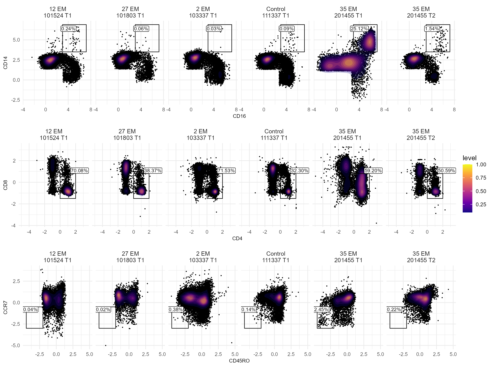

# Supplementary Figure 10


### Figure S10: Flow Gating Scatter Plot Montage

``` r
load(file.path(flow_outlier_dir, "monocyte_outliers2.RData"))
monocyte_outliers2 <- mono
rm(mono)

load(file.path(flow_outlier_dir, "tcell_outliers2.RData"))
tcell_outliers2 <- tcell
rm(tcell)

sample_labels_s10 <- c(
  "101524 T1" = "12 EM\n101524 T1",
  "101803 T1" = "27 EM\n101803 T1",
  "103337 T1" = "2 EM\n103337 T1",
  "111337 T1" = "Control\n111337 T1",
  "201455 T1" = "35 EM\n201455 T1",
  "201455 T2" = "35 EM\n201455 T2"
)

gate_plot <- function(
  sce,
  x,
  y,
  xmin,
  xmax,
  ymin,
  ymax,
  ids,
  assay = "counts",
  orient = "center",
  nudge_x = 0.05,
  nudge_y = 0.05
) {
  keep <- sce$sample_id %in% ids
  plot_data <- data.frame(
    t(SummarizedExperiment::assay(sce, assay))[keep, c(x, y)],
    id = sce$sample_id[keep],
    check.names = FALSE
  )

  gate_percent <- split(plot_data, factor(plot_data$id)) |>
    lapply(function(sample_data) {
      mean(
        sample_data[[x]] > xmin & sample_data[[x]] < xmax &
          sample_data[[y]] > ymin & sample_data[[y]] < ymax
      ) * 100
    })

  x_range <- c(xmin, xmax)
  y_range <- c(ymin, ymax)

  label_position <- switch(
    orient,
    center = c(mean(x_range), mean(y_range)),
    topleft = c(
      x_range[1] + nudge_x * diff(x_range),
      y_range[2] - nudge_y * diff(y_range)
    ),
    topright = c(
      x_range[2] - nudge_x * diff(x_range),
      y_range[2] - nudge_y * diff(y_range)
    ),
    bottomleft = c(
      x_range[1] + nudge_x * diff(x_range),
      y_range[1] + nudge_y * diff(y_range)
    ),
    bottomright = c(
      x_range[2] - nudge_x * diff(x_range),
      y_range[1] + nudge_y * diff(y_range)
    )
  )

  gate_labels <- tibble::tibble(
    id = names(gate_percent),
    percent = paste0(sprintf("%.2f", as.numeric(gate_percent)), "%"),
    label_x = label_position[1],
    label_y = label_position[2]
  )

  gate_rectangles <- tibble::tibble(
    id = ids,
    xmin = xmin,
    xmax = xmax,
    ymin = ymin,
    ymax = ymax
  )

  ggplot(plot_data, aes(x = .data[[x]], y = .data[[y]])) +
    geom_point(size = 0.15) +
    stat_density_2d(
      aes(fill = after_stat(level)),
      geom = "polygon",
      contour_var = "ndensity",
      alpha = 0.25
    ) +
    geom_rect(
      data = gate_rectangles,
      aes(xmin = xmin, xmax = xmax, ymin = ymin, ymax = ymax),
      inherit.aes = FALSE,
      fill = NA,
      colour = "black",
      linewidth = 0.3
    ) +
    geom_label(
      data = gate_labels,
      aes(x = label_x, y = label_y, label = percent),
      inherit.aes = FALSE,
      size = 6 / 2.845276,
      label.padding = unit(0.08, "lines"),
      linewidth = 0.2
    ) +
    facet_wrap(
      vars(id),
      nrow = 1,
      labeller = labeller(id = as_labeller(sample_labels_s10))
    ) +
    scale_fill_viridis_c(option = "C") +
    scale_x_continuous(expand = expansion(mult = c(0.05, 0.10))) +
    theme_minimal(base_size = 8) +
    theme(
      legend.key.size = unit(4, "mm"),
      axis.title = element_text(size = 6),
      axis.text = element_text(size = 6),
      strip.text.x = element_text(size = 7, lineheight = 0.9)
    )
}

sample_ids <- names(sample_labels_s10)

monocyte_plot <- gate_plot(
  monocyte_outliers2,
  x = "CD16",
  y = "CD14",
  xmin = 3,
  xmax = 7.2,
  ymin = 3.5,
  ymax = 6.9,
  ids = sample_ids,
  orient = "topleft",
  nudge_x = 0.25,
  nudge_y = 0.15
)

tcell_plot <- gate_plot(
  tcell_outliers2,
  x = "CD4",
  y = "CD8",
  xmin = 0,
  xmax = 2,
  ymin = -1.5,
  ymax = 0.8,
  ids = sample_ids,
  orient = "topright",
  nudge_x = -0.25,
  nudge_y = -0.12
)

cd4_cd8 <- data.frame(
  t(SummarizedExperiment::assay(tcell_outliers2, "counts"))[, c("CD4", "CD8")]
)
effector_keep <-
  cd4_cd8$CD4 > 0 & cd4_cd8$CD4 < 2 &
  cd4_cd8$CD8 > -1.5 & cd4_cd8$CD8 < 1
effector_tcells <- tcell_outliers2[, effector_keep]

effector_plot <- gate_plot(
  effector_tcells,
  x = "CD45RO",
  y = "CCR7",
  xmin = -4.5,
  xmax = -2,
  ymin = -3,
  ymax = -0.5,
  ids = sample_ids,
  orient = "topleft",
  nudge_x = 0.25,
  nudge_y = 0.12
)

figure_s10 <- ggpubr::ggarrange(
  monocyte_plot,
  tcell_plot,
  effector_plot,
  nrow = 3,
  common.legend = TRUE,
  legend = "right"
)

figure_s10_file <- file.path(
  fig_s10_output_dir,
  "figure_S10_flow_gating_scatter_plot_montage.png"
)

ragg::agg_png(
  filename = figure_s10_file,
  width = 8,
  height = 6,
  units = "in",
  res = 300
)
print(figure_s10)
grDevices::dev.off() |> invisible()

knitr::include_graphics(figure_s10_file)
```



``` r
sessionInfo()
```

    R version 4.4.1 (2024-06-14 ucrt)
    Platform: x86_64-w64-mingw32/x64
    Running under: Windows 11 x64 (build 22631)

    Matrix products: default


    locale:
    [1] LC_COLLATE=English_United States.utf8 
    [2] LC_CTYPE=English_United States.utf8   
    [3] LC_MONETARY=English_United States.utf8
    [4] LC_NUMERIC=C                          
    [5] LC_TIME=English_United States.utf8    

    time zone: America/Los_Angeles
    tzcode source: internal

    attached base packages:
    [1] stats4    stats     graphics  grDevices utils     datasets  methods  
    [8] base     

    other attached packages:
     [1] SingleCellExperiment_1.26.0 ragg_1.3.2                 
     [3] here_1.0.1                  SummarizedExperiment_1.34.0
     [5] Biobase_2.64.0              GenomicRanges_1.56.1       
     [7] GenomeInfoDb_1.40.1         IRanges_2.38.1             
     [9] S4Vectors_0.42.1            BiocGenerics_0.50.0        
    [11] MatrixGenerics_1.16.0       matrixStats_1.4.1          
    [13] ggpubr_0.6.0                lubridate_1.9.3            
    [15] forcats_1.0.0               stringr_1.5.1              
    [17] dplyr_1.1.4                 purrr_1.0.2                
    [19] readr_2.1.5                 tidyr_1.3.1                
    [21] tibble_3.2.1                ggplot2_4.0.0              
    [23] tidyverse_2.0.0            

    loaded via a namespace (and not attached):
     [1] gtable_0.3.6            xfun_0.48               rstatix_0.7.2          
     [4] lattice_0.22-6          tzdb_0.4.0              vctrs_0.6.5            
     [7] tools_4.4.1             generics_0.1.3          pacman_0.5.1           
    [10] pkgconfig_2.0.3         Matrix_1.7-0            RColorBrewer_1.1-3     
    [13] S7_0.2.0                lifecycle_1.0.4         GenomeInfoDbData_1.2.12
    [16] compiler_4.4.1          farver_2.1.2            textshaping_0.4.0      
    [19] carData_3.0-5           htmltools_0.5.8.1       yaml_2.3.10            
    [22] pillar_1.10.1           car_3.1-2               crayon_1.5.3           
    [25] MASS_7.3-60.2           DelayedArray_0.30.1     abind_1.4-5            
    [28] tidyselect_1.2.1        digest_0.6.37           stringi_1.8.4          
    [31] labeling_0.4.3          cowplot_1.1.3           rprojroot_2.0.4        
    [34] fastmap_1.2.0           grid_4.4.1              SparseArray_1.4.8      
    [37] cli_3.6.3               magrittr_2.0.3          S4Arrays_1.4.1         
    [40] broom_1.0.6             withr_3.0.2             scales_1.4.0           
    [43] UCSC.utils_1.0.0        backports_1.5.0         timechange_0.3.0       
    [46] rmarkdown_2.29          XVector_0.44.0          httr_1.4.7             
    [49] gridExtra_2.3           ggsignif_0.6.4          png_0.1-8              
    [52] hms_1.1.3               evaluate_1.0.1          knitr_1.49             
    [55] viridisLite_0.4.2       rlang_1.1.4             isoband_0.2.7          
    [58] glue_1.8.0              jsonlite_1.8.9          R6_2.5.1               
    [61] systemfonts_1.1.0       zlibbioc_1.50.0        
