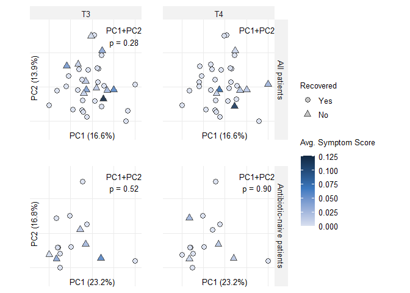

# Figure S11


``` r
load(here::here("data", "processed", "01_proteomics_metabolomics", "Data.RData"))

load(here::here("data", "intermediate", "flow_gating", "bcell.RData"))
load(here::here("data", "intermediate", "flow_gating", "tcell.RData"))
load(here::here("data", "intermediate", "flow_gating", "monocyte.RData"))
load(here::here("data", "intermediate", "flow_gating", "dcnk.RData"))
```

``` r
flow <- list()
flow$panelResults <- list(
  bcell = bcell,
  dcnk = dcnk,
  monocyte = monocyte,
  tcell = tcell
)
rm(bcell, dcnk, monocyte, tcell)

flow$propsLong <- do.call(rbind, lapply(flow$panelResults, function(x) x$propsLong))
flow$propsWide <- pivot_wider(
  flow$propsLong,
  id_cols = id,
  names_from = cluster,
  values_from = freq
) |>
  column_to_rownames("id")

flow_sample_ids <- gsub("_.*", "", rownames(flow$propsWide))
has_sample_data <- flow_sample_ids %in% rownames(data$sampleData)

flow$propsLong <- flow$propsLong[flow$propsLong$id %in% rownames(flow$propsWide)[has_sample_data], ]
flow$propsWide <- flow$propsWide[has_sample_data, ]

flow_sample_ids <- gsub("_.*", "", rownames(flow$propsWide))
sample_aligned_names <- names(data)[vapply(data, function(x) {
  (is.data.frame(x) || is.matrix(x)) &&
    !is.null(rownames(x)) &&
    all(flow_sample_ids %in% rownames(x))
}, logical(1))]

flow$data <- lapply(data[sample_aligned_names], function(x) {
  x[flow_sample_ids, , drop = FALSE]
})

flow$panel <- gsub("\\..*", "", rownames(flow$propsLong))[
  match(colnames(flow$propsWide), flow$propsLong$cluster)
]
flow$panel <- c("T Cell", "B Cell", "DCNK", "Monocyte")[
  match(flow$panel, c("tcell", "bcell", "dcnk", "monocyte"))
]
flow$panel[9:11] <- "NK"
flow$panel[12:15] <- "DC"
flow$propsLong$cluster <- gsub(" NK Cells", "", flow$propsLong$cluster)

flow$cluster <- colnames(flow$propsWide)
colnames(flow$propsWide) <- paste0(flow$panel, " - ", colnames(flow$propsWide))
colnames(flow$propsWide) <- gsub("yd", "gd", colnames(flow$propsWide))
colnames(flow$propsWide) <- gsub(" NK Cells", "", colnames(flow$propsWide))
flow$propsLong$cluster <- gsub("yd", "gd", flow$propsLong$cluster)
```

## Supplementary Figure S11

``` r
symptoms <- data$directSymptoms |>
  dplyr::rename_with(
    ~ str_replace_all(., "Feverish.Chilly", "Feverish/Chilly"),
    contains("Feverish.Chilly")
  ) |>
  dplyr::rename_with(
    ~ str_replace_all(., "Nausea.Vomiting", "Nausea/Vomiting"),
    contains("Nausea.Vomiting")
  ) |>
  dplyr::rename_with(
    ~ str_replace_all(., "Tingling.Abnormal.Sensation", "Tingling/Abnormal.Sensation"),
    contains("Tingling.Abnormal.Sensation")
  ) |>
  dplyr::rename_with(
    ~ str_replace_all(
      .,
      "Difficulty.Concentrating..Memory.Problems",
      "Difficulty.Concentrating/Memory.Problems"
    ),
    contains("Difficulty.Concentrating..Memory.Problems")
  ) |>
  dplyr::rename_with(~ str_replace_all(., "\\.", " "), contains(".")) |>
  dplyr::mutate(across(where(is.numeric), ~ . / 7.6)) |>
  tibble::rownames_to_column("sample_id") |>
  dplyr::left_join(
    data$sampleData |> dplyr::select(Subject_ID, sample, time),
    by = c("sample_id" = "sample")
  ) |>
  dplyr::rowwise() |>
  dplyr::mutate(`Avg. Symptom Score` = mean(c_across(where(is.numeric)), na.rm = TRUE)) |>
  dplyr::ungroup()

feat_keep <- !grepl(
  "Dump|Debris|DP |DN |- DN|- DP|UNKN|IL1B",
  colnames(flow$propsWide)
)
X_all <- flow$propsWide[, feat_keep, drop = FALSE]
X_all <- apply(X_all, 2, function(x) (x - mean(x, na.rm = TRUE)) / sd(x, na.rm = TRUE))

pt_meta <- flow$data$sampleData
symptoms_long_t3.t4 <- symptoms |>
  dplyr::filter(time %in% c("T3", "T4")) |>
  dplyr::select(id = Subject_ID, time, `Avg. Symptom Score`)

fit_recovery_model <- function(dat, timepoint, pcs = c("PC1", "PC2")) {
  model_data <- dat |>
    dplyr::filter(time == timepoint) |>
    dplyr::select(id, persistent_symptoms, dplyr::all_of(pcs)) |>
    tidyr::drop_na() |>
    dplyr::distinct(id, .keep_all = TRUE)

  fit_null <- glm(persistent_symptoms ~ 1, data = model_data, family = binomial())
  fit_full <- glm(
    stats::as.formula(paste("persistent_symptoms ~", paste(pcs, collapse = " + "))),
    data = model_data,
    family = binomial()
  )

  list(
    data = model_data,
    fit_null = fit_null,
    fit_full = fit_full,
    lrt = anova(fit_null, fit_full, test = "LRT")
  )
}

leave_one_out_lrt <- function(model_result) {
  model_data <- model_result$data
  pcs <- attr(stats::terms(model_result$fit_full), "term.labels")

  p_values <- vapply(seq_len(nrow(model_data)), function(i) {
    loo_data <- model_data[-i, , drop = FALSE]
    fit_null <- glm(persistent_symptoms ~ 1, data = loo_data, family = binomial())
    fit_full <- glm(
      stats::as.formula(paste("persistent_symptoms ~", paste(pcs, collapse = " + "))),
      data = loo_data,
      family = binomial()
    )
    anova(fit_null, fit_full, test = "LRT")$`Pr(>Chi)`[2]
  }, numeric(1))

  tibble::tibble(
    id_left_out = model_data$id,
    p_lrt_loo = p_values
  )
}

run_symptom_persistence_pca <- function(cohort, antibiotic_naive = FALSE) {
  rows_t1 <- with(
    pt_meta,
    Condition == "Patient" &
      !stringr::str_detect(Site_s_of_EM, "35") &
      time == "T1"
  )

  if (antibiotic_naive) {
    rows_t1 <- rows_t1 &
      !is.na(pt_meta$days_of_prior_antibiotics) &
      pt_meta$days_of_prior_antibiotics == 0
  }

  rows_t1 <- rows_t1 &
    apply(X_all, 1, function(x) sum(is.na(x)) < 12) &
    !grepl("_1", rownames(X_all))

  cohort_features <- X_all[rows_t1, , drop = FALSE]
  imputation_data <- cohort_features
  colnames(imputation_data) <- make.names(colnames(imputation_data))

  set.seed(123)
  imputed_features <- mice::mice(
    imputation_data,
    m = 1,
    seed = 123,
    printFlag = FALSE
  ) |>
    mice::complete(1)
  colnames(imputed_features) <- colnames(cohort_features)

  cohort_pca <- prcomp(imputed_features, scale. = FALSE)
  variance_explained <- cohort_pca$sdev^2 / sum(cohort_pca$sdev^2) * 100
  axis_labels <- paste0(
    "PC", seq_along(variance_explained),
    " (", round(variance_explained, 1), "%)"
  )

  scores <- as.data.frame(cohort_pca$x) |>
    tibble::rownames_to_column("sample_id") |>
    dplyr::left_join(
      data$sampleData |> dplyr::select(sample, Subject_ID),
      by = c("sample_id" = "sample")
    ) |>
    dplyr::rename(id = Subject_ID)

  outcome_data <- scores |>
    dplyr::select(id, dplyr::starts_with("PC")) |>
    dplyr::inner_join(symptoms_long_t3.t4, by = "id") |>
    dplyr::filter(!is.nan(`Avg. Symptom Score`)) |>
    dplyr::distinct(id, time, .keep_all = TRUE) |>
    dplyr::mutate(
      persistent_symptoms = `Avg. Symptom Score` > 0,
      Recovered = factor(
        dplyr::if_else(persistent_symptoms, "No", "Yes"),
        levels = c("Yes", "No")
      ),
      cohort = cohort
    )

  model_results <- purrr::map(
    c("T3", "T4"),
    ~ fit_recovery_model(outcome_data, .x)
  ) |>
    rlang::set_names(c("T3", "T4"))

  lrt_results <- purrr::imap_dfr(
    model_results,
    ~ tibble::tibble(
      cohort = cohort,
      time = .y,
      n = nrow(.x$data),
      n_persistent = sum(.x$data$persistent_symptoms),
      p_lrt = .x$lrt$`Pr(>Chi)`[2]
    )
  )

  list(
    cohort = cohort,
    data = outcome_data,
    pca = cohort_pca,
    axis_labels = axis_labels,
    lrt = lrt_results,
    loo = purrr::map(model_results, leave_one_out_lrt)
  )
}

symptom_persistence_pca <- list(
  all = run_symptom_persistence_pca("All patients"),
  naive = run_symptom_persistence_pca("Antibiotic-naive patients", antibiotic_naive = TRUE)
)

symptom_persistence_results <- purrr::map_dfr(symptom_persistence_pca, "lrt")
symptom_persistence_results
```

    # A tibble: 4 × 5
      cohort                    time      n n_persistent  p_lrt
      <chr>                     <chr> <int>        <int>  <dbl>
    1 All patients              T3       35           11 0.276 
    2 All patients              T4       34            7 0.0306
    3 Antibiotic-naive patients T3       15            5 0.524 
    4 Antibiotic-naive patients T4       15            4 0.896 

``` r
purrr::walk(symptom_persistence_pca, function(result) {
  purrr::iwalk(result$loo, function(loo_result, timepoint) {
    message(
      result$cohort, ", ", timepoint, " leave-one-out LRT p-value range: ",
      paste(signif(range(loo_result$p_lrt_loo, na.rm = TRUE), 3), collapse = "-")
    )
  })
})

symptom_persistence_plot_data <- purrr::map_dfr(symptom_persistence_pca, function(result) {
  x_range <- range(result$data$PC1, na.rm = TRUE)
  y_range <- range(result$data$PC2, na.rm = TRUE)
  x_span <- diff(x_range)
  y_span <- diff(y_range)

  result$data |>
    dplyr::mutate(
      x_panel = (PC1 - x_range[1]) / x_span,
      y_panel = (PC2 - y_range[1]) / y_span,
      cohort = factor(
        cohort,
        levels = c("All patients", "Antibiotic-naive patients")
      ),
      time = factor(time, levels = c("T3", "T4"))
    )
})

symptom_persistence_plot_labels <- symptom_persistence_results |>
  dplyr::mutate(
    cohort = factor(
      cohort,
      levels = c("All patients", "Antibiotic-naive patients")
    ),
    time = factor(time, levels = c("T3", "T4")),
    sensitivity_marker = dplyr::if_else(
      cohort == "All patients" & time == "T4",
      "\u2020",
      ""
    ),
    label = paste0(
      "PC1+PC2\np = ",
      sprintf("%.2f", p_lrt),
      sensitivity_marker
    )
  )

symptom_persistence_axis_labels <- purrr::map_dfr(symptom_persistence_pca, function(result) {
  tibble::tibble(
    cohort = factor(
      result$cohort,
      levels = c("All patients", "Antibiotic-naive patients")
    ),
    time = factor(c("T3", "T4"), levels = c("T3", "T4")),
    x_label = result$axis_labels[1],
    y_label = result$axis_labels[2]
  )
})

symptom_scale_max <- max(symptom_persistence_plot_data$`Avg. Symptom Score`, na.rm = TRUE)
figure_text_size <- 10 / ggplot2::.pt

fig_s11 <- ggplot(
  symptom_persistence_plot_data,
  aes(
    x = x_panel,
    y = y_panel,
    fill = `Avg. Symptom Score`,
    shape = Recovered
  )
) +
  geom_point(
    color = "grey25",
    alpha = 0.9,
    size = 2.8,
    stroke = 0.3
  ) +
  geom_text(
    data = symptom_persistence_plot_labels,
    aes(x = 0.87, y = 1.1, label = label),
    inherit.aes = FALSE,
    hjust = 0.5,
    vjust = 1,
    family = "Arial",
    size = figure_text_size
  ) +
  geom_text(
    data = symptom_persistence_axis_labels,
    aes(x = 0.5, y = -0.16, label = x_label),
    inherit.aes = FALSE,
    family = "Arial",
    size = figure_text_size
  ) +
  geom_text(
    data = symptom_persistence_axis_labels |>
      dplyr::filter(time == "T3"),
    aes(x = -0.18, y = 0.5, label = y_label),
    inherit.aes = FALSE,
    angle = 90,
    family = "Arial",
    size = figure_text_size
  ) +
  facet_grid(
    rows = vars(cohort),
    cols = vars(time)
  ) +
  colorspace::scale_fill_continuous_sequential(
    palette = "Oslo",
    rev = FALSE,
    begin = 0.1,
    end = 0.85,
    limits = c(0, symptom_scale_max),
    name = "Avg. Symptom Score"
  ) +
  scale_shape_manual(
    values = c("Yes" = 21, "No" = 24),
    name = "Recovered",
    drop = FALSE
  ) +
  guides(
    fill = guide_colourbar(
      title.theme = element_text(size = 10, margin = margin(b = 12))
    ),
    shape = guide_legend(override.aes = list(fill = "grey75"))
  ) +
  coord_equal(
    xlim = c(-0.22, 1.08),
    ylim = c(-0.22, 1.18),
    expand = FALSE,
    clip = "off"
  ) +
  labs(x = NULL, y = NULL) +
  theme_minimal(base_size = 10, base_family = "Arial") +
  theme(
    axis.text = element_blank(),
    axis.ticks = element_blank(),
    panel.grid.minor = element_blank(),
    panel.border = element_blank(),
    strip.background = element_rect(fill = "grey95", color = NA),
    strip.text.x = element_text(size = 10, margin = margin(3, 0, 3, 0)),
    strip.text.y.right = element_text(size = 10, margin = margin(0, 3, 0, 3)),
    strip.placement = "outside",
    panel.spacing.x = grid::unit(1.8, "lines"),
    panel.spacing.y = grid::unit(2.2, "lines"),
    legend.title = element_text(size = 10),
    legend.text = element_text(size = 10),
    legend.position = "right",
    plot.margin = margin(8, 8, 8, 8)
  )

fig_s11
```



``` r
ggsave(
  plot = fig_s11,
  filename = file.path(figure_output_dir, "figure_S11_longitudinal_proteomics_pca_recovery_symptoms.png"),
  device = ragg::agg_png,
  width = 6.24,
  height = 5.02,
  units = "in",
  dpi = 300,
  bg = "white"
)
```

sessionInfo() \`\`\`{}
