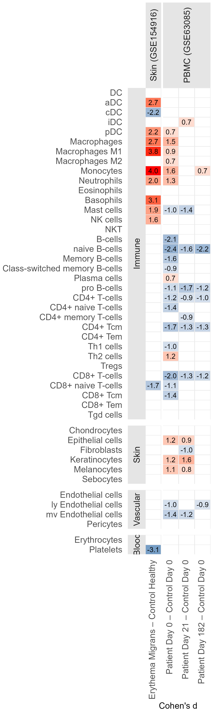

# Supplementary Figure 12


## Panel A: xCell enrichment effect sizes in public skin and PBMC datasets

``` r
public_data_environment <- new.env(parent = emptyenv())
load(
  here::here(
    "data", "processed", "03_public_skin_rna", "publicDataClean.RData"
  ),
  envir = public_data_environment
)
public_data <- public_data_environment$publicData

study_pbmc <- public_data$GSE63085
study_em <- public_data$GSE154916

meta_pbmc <- study_pbmc$meta |>
  mutate(
    type_time = forcats::fct_relevel(
      type_time,
      "control_0", "patient_182", "patient_0", "patient_21"
    )
  )

meta_em <- study_em$meta

cell_data <- readr::read_csv(
  here::here(
    "data", "processed", "03_public_skin_rna", "xCell_Labels.csv"
  ),
  show_col_types = FALSE
) |>
  dplyr::rename(cell_type = Cell, tissue = Group) |>
  dplyr::filter(tissue %in% c("Immune", "Skin", "Vascular", "Blood"))

immune_cell_types <- c(
  "DC", "aDC", "cDC", "iDC", "pDC",
  "Macrophages", "Macrophages M1", "Macrophages M2",
  "Monocytes", "Neutrophils", "Eosinophils", "Basophils",
  "Mast cells", "NK cells", "NKT", "B-cells",
  "naive B-cells", "Memory B-cells", "Class-switched memory B-cells",
  "Plasma cells", "pro B-cells", "CD4+ T-cells", "CD4+ naive T-cells",
  "CD4+ memory T-cells", "CD4+ Tcm", "CD4+ Tem", "Th1 cells",
  "Th2 cells", "Tregs", "CD8+ T-cells", "CD8+ naive T-cells",
  "CD8+ Tcm", "CD8+ Tem", "Tgd cells"
)

other_cell_types <- cell_data |>
  dplyr::filter(tissue %in% c("Skin", "Vascular", "Blood")) |>
  dplyr::arrange(tissue, cell_type) |>
  dplyr::pull(cell_type)

cell_data <- cell_data |>
  mutate(
    tissue = factor(tissue, levels = c("Immune", "Skin", "Vascular", "Blood")),
    cell_type = factor(
      cell_type,
      levels = c(
        rev(immune_cell_types),
        setdiff(rev(sort(unique(as.character(cell_type)))), immune_cell_types)
      )
    )
  )

deconv_em <- study_em$data |>
  xCell::xCellAnalysis(
    cell.types.use = as.character(cell_data$cell_type),
    rnaseq = FALSE,
    parallel.sz = 1
  )
```

    [1] "Num. of genes: 10582"
    No annotation package name available in the input data object.
    Attempting to directly match identifiers in data to gene sets.
    Estimating ssGSEA scores for 489 gene sets.
    [1] "Calculating ranks..."
    [1] "Calculating absolute values from ranks..."

      |                                                                            
      |                                                                      |   0%
      |                                                                            
      |==                                                                    |   2%
      |                                                                            
      |===                                                                   |   4%
      |                                                                            
      |=====                                                                 |   7%
      |                                                                            
      |======                                                                |   9%
      |                                                                            
      |========                                                              |  11%
      |                                                                            
      |=========                                                             |  13%
      |                                                                            
      |===========                                                           |  16%
      |                                                                            
      |============                                                          |  18%
      |                                                                            
      |==============                                                        |  20%
      |                                                                            
      |================                                                      |  22%
      |                                                                            
      |=================                                                     |  24%
      |                                                                            
      |===================                                                   |  27%
      |                                                                            
      |====================                                                  |  29%
      |                                                                            
      |======================                                                |  31%
      |                                                                            
      |=======================                                               |  33%
      |                                                                            
      |=========================                                             |  36%
      |                                                                            
      |==========================                                            |  38%
      |                                                                            
      |============================                                          |  40%
      |                                                                            
      |==============================                                        |  42%
      |                                                                            
      |===============================                                       |  44%
      |                                                                            
      |=================================                                     |  47%
      |                                                                            
      |==================================                                    |  49%
      |                                                                            
      |====================================                                  |  51%
      |                                                                            
      |=====================================                                 |  53%
      |                                                                            
      |=======================================                               |  56%
      |                                                                            
      |========================================                              |  58%
      |                                                                            
      |==========================================                            |  60%
      |                                                                            
      |============================================                          |  62%
      |                                                                            
      |=============================================                         |  64%
      |                                                                            
      |===============================================                       |  67%
      |                                                                            
      |================================================                      |  69%
      |                                                                            
      |==================================================                    |  71%
      |                                                                            
      |===================================================                   |  73%
      |                                                                            
      |=====================================================                 |  76%
      |                                                                            
      |======================================================                |  78%
      |                                                                            
      |========================================================              |  80%
      |                                                                            
      |==========================================================            |  82%
      |                                                                            
      |===========================================================           |  84%
      |                                                                            
      |=============================================================         |  87%
      |                                                                            
      |==============================================================        |  89%
      |                                                                            
      |================================================================      |  91%
      |                                                                            
      |=================================================================     |  93%
      |                                                                            
      |===================================================================   |  96%
      |                                                                            
      |====================================================================  |  98%
      |                                                                            
      |======================================================================| 100%

``` r
deconv_pbmc <- study_pbmc$data$E |>
  data.frame(check.names = FALSE) |>
  tibble::rownames_to_column("ensembl_id") |>
  dplyr::left_join(
    tibble::tibble(
      ensembl_id = study_pbmc$features$X,
      gene_symbol = study_pbmc$features$gene_symbol
    ),
    by = "ensembl_id"
  ) |>
  dplyr::filter(!is.na(gene_symbol), gene_symbol != "") |>
  dplyr::rowwise() |>
  dplyr::mutate(
    row_median = median(c_across(where(is.numeric)), na.rm = TRUE)
  ) |>
  dplyr::ungroup() |>
  dplyr::group_by(gene_symbol) |>
  dplyr::slice_max(row_median, with_ties = FALSE) |>
  dplyr::ungroup() |>
  dplyr::select(-ensembl_id, -row_median) |>
  tibble::column_to_rownames("gene_symbol") |>
  as.matrix() |>
  xCell::xCellAnalysis(
    cell.types.use = as.character(cell_data$cell_type),
    rnaseq = TRUE,
    parallel.sz = 1
  )
```

    [1] "Num. of genes: 9219"
    No annotation package name available in the input data object.
    Attempting to directly match identifiers in data to gene sets.
    Estimating ssGSEA scores for 489 gene sets.
    [1] "Calculating ranks..."
    [1] "Calculating absolute values from ranks..."

      |                                                                            
      |                                                                      |   0%
      |                                                                            
      |=                                                                     |   1%
      |                                                                            
      |=                                                                     |   2%
      |                                                                            
      |==                                                                    |   3%
      |                                                                            
      |===                                                                   |   4%
      |                                                                            
      |====                                                                  |   5%
      |                                                                            
      |====                                                                  |   6%
      |                                                                            
      |=====                                                                 |   7%
      |                                                                            
      |======                                                                |   8%
      |                                                                            
      |======                                                                |   9%
      |                                                                            
      |=======                                                               |  10%
      |                                                                            
      |========                                                              |  11%
      |                                                                            
      |=========                                                             |  12%
      |                                                                            
      |=========                                                             |  13%
      |                                                                            
      |==========                                                            |  14%
      |                                                                            
      |===========                                                           |  15%
      |                                                                            
      |============                                                          |  16%
      |                                                                            
      |============                                                          |  18%
      |                                                                            
      |=============                                                         |  19%
      |                                                                            
      |==============                                                        |  20%
      |                                                                            
      |==============                                                        |  21%
      |                                                                            
      |===============                                                       |  22%
      |                                                                            
      |================                                                      |  23%
      |                                                                            
      |=================                                                     |  24%
      |                                                                            
      |=================                                                     |  25%
      |                                                                            
      |==================                                                    |  26%
      |                                                                            
      |===================                                                   |  27%
      |                                                                            
      |===================                                                   |  28%
      |                                                                            
      |====================                                                  |  29%
      |                                                                            
      |=====================                                                 |  30%
      |                                                                            
      |======================                                                |  31%
      |                                                                            
      |======================                                                |  32%
      |                                                                            
      |=======================                                               |  33%
      |                                                                            
      |========================                                              |  34%
      |                                                                            
      |=========================                                             |  35%
      |                                                                            
      |=========================                                             |  36%
      |                                                                            
      |==========================                                            |  37%
      |                                                                            
      |===========================                                           |  38%
      |                                                                            
      |===========================                                           |  39%
      |                                                                            
      |============================                                          |  40%
      |                                                                            
      |=============================                                         |  41%
      |                                                                            
      |==============================                                        |  42%
      |                                                                            
      |==============================                                        |  43%
      |                                                                            
      |===============================                                       |  44%
      |                                                                            
      |================================                                      |  45%
      |                                                                            
      |================================                                      |  46%
      |                                                                            
      |=================================                                     |  47%
      |                                                                            
      |==================================                                    |  48%
      |                                                                            
      |===================================                                   |  49%
      |                                                                            
      |===================================                                   |  51%
      |                                                                            
      |====================================                                  |  52%
      |                                                                            
      |=====================================                                 |  53%
      |                                                                            
      |======================================                                |  54%
      |                                                                            
      |======================================                                |  55%
      |                                                                            
      |=======================================                               |  56%
      |                                                                            
      |========================================                              |  57%
      |                                                                            
      |========================================                              |  58%
      |                                                                            
      |=========================================                             |  59%
      |                                                                            
      |==========================================                            |  60%
      |                                                                            
      |===========================================                           |  61%
      |                                                                            
      |===========================================                           |  62%
      |                                                                            
      |============================================                          |  63%
      |                                                                            
      |=============================================                         |  64%
      |                                                                            
      |=============================================                         |  65%
      |                                                                            
      |==============================================                        |  66%
      |                                                                            
      |===============================================                       |  67%
      |                                                                            
      |================================================                      |  68%
      |                                                                            
      |================================================                      |  69%
      |                                                                            
      |=================================================                     |  70%
      |                                                                            
      |==================================================                    |  71%
      |                                                                            
      |===================================================                   |  72%
      |                                                                            
      |===================================================                   |  73%
      |                                                                            
      |====================================================                  |  74%
      |                                                                            
      |=====================================================                 |  75%
      |                                                                            
      |=====================================================                 |  76%
      |                                                                            
      |======================================================                |  77%
      |                                                                            
      |=======================================================               |  78%
      |                                                                            
      |========================================================              |  79%
      |                                                                            
      |========================================================              |  80%
      |                                                                            
      |=========================================================             |  81%
      |                                                                            
      |==========================================================            |  82%
      |                                                                            
      |==========================================================            |  84%
      |                                                                            
      |===========================================================           |  85%
      |                                                                            
      |============================================================          |  86%
      |                                                                            
      |=============================================================         |  87%
      |                                                                            
      |=============================================================         |  88%
      |                                                                            
      |==============================================================        |  89%
      |                                                                            
      |===============================================================       |  90%
      |                                                                            
      |================================================================      |  91%
      |                                                                            
      |================================================================      |  92%
      |                                                                            
      |=================================================================     |  93%
      |                                                                            
      |==================================================================    |  94%
      |                                                                            
      |==================================================================    |  95%
      |                                                                            
      |===================================================================   |  96%
      |                                                                            
      |====================================================================  |  97%
      |                                                                            
      |===================================================================== |  98%
      |                                                                            
      |===================================================================== |  99%
      |                                                                            
      |======================================================================| 100%

``` r
cohen_em <- deconv_em |>
  as.data.frame() |>
  tibble::rownames_to_column("cell_type") |>
  tidyr::pivot_longer(
    cols = -cell_type,
    names_to = "sample_id",
    values_to = "score"
  ) |>
  dplyr::left_join(
    meta_em |>
      tibble::rownames_to_column("sample_id") |>
      dplyr::select(sample_id, type, batch),
    by = "sample_id"
  ) |>
  dplyr::group_by(cell_type) |>
  dplyr::group_modify(~ {
    model <- stats::lm(score ~ type + batch, data = .x)
    emmeans::emmeans(model, pairwise ~ type, adjust = "none")$contrasts |>
      as.data.frame() |>
      dplyr::transmute(
        contrast = stringr::str_remove_all(contrast, "[()]"),
        cohens_d = estimate / stats::sigma(model),
        p_value = p.value
      )
  }) |>
  dplyr::ungroup()

cohen_pbmc <- deconv_pbmc |>
  as.data.frame() |>
  tibble::rownames_to_column("cell_type") |>
  tidyr::pivot_longer(
    cols = -cell_type,
    names_to = "sample_id",
    values_to = "score"
  ) |>
  dplyr::left_join(
    meta_pbmc |>
      tibble::rownames_to_column("sample_id") |>
      dplyr::select(sample_id, id, type_time),
    by = "sample_id"
  ) |>
  dplyr::group_by(cell_type) |>
  dplyr::group_modify(~ {
    model <- lme4::lmer(
      score ~ type_time + (1 | id),
      data = .x
    )
    emmeans::emmeans(model, revpairwise ~ type_time, adjust = "none")$contrasts |>
      as.data.frame() |>
      dplyr::transmute(
        contrast = contrast,
        cohens_d = estimate / stats::sigma(model),
        p_value = p.value
      )
  }) |>
  dplyr::ungroup()

xcell_plot_data <- dplyr::bind_rows(cohen_pbmc, cohen_em) |>
  dplyr::inner_join(cell_data, by = "cell_type") |>
  dplyr::mutate(
    contrast = contrast |>
      stringr::str_replace_all("erythema migrans", "Erythema Migrans") |>
      stringr::str_replace_all("skin- control", "Control Healthy") |>
      stringr::str_replace_all("skin control- surgical", "Control Mammary") |>
      stringr::str_replace_all("patient_0", "Patient Day 0") |>
      stringr::str_replace_all("patient_21", "Patient Day 21") |>
      stringr::str_replace_all("patient_182", "Patient Day 182") |>
      stringr::str_replace_all("control_0", "Control Day 0") |>
      stringr::str_replace_all(" - ", " \u2013 ")
  ) |>
  dplyr::filter(
    contrast %in% c(
      "Erythema Migrans \u2013 Control Healthy",
      "Patient Day 0 \u2013 Control Day 0",
      "Patient Day 21 \u2013 Control Day 0",
      "Patient Day 182 \u2013 Control Day 0"
    )
  ) |>
  dplyr::mutate(
    contrast = factor(
      contrast,
      levels = c(
        "Erythema Migrans \u2013 Control Healthy",
        "Patient Day 0 \u2013 Control Day 0",
        "Patient Day 21 \u2013 Control Day 0",
        "Patient Day 182 \u2013 Control Day 0"
      )
    ),
    sample_type = if_else(
      stringr::str_detect(contrast, "Erythema"),
      "Skin (GSE154916)",
      "PBMC (GSE63085)"
    ) |>
      factor(levels = c("Skin (GSE154916)", "PBMC (GSE63085)")),
    cell_type = factor(cell_type, levels = levels(cell_data$cell_type))
  )

figure_s12a_plot <- ggplot(
  xcell_plot_data,
  aes(
    x = contrast,
    y = cell_type,
    fill = if_else(p_value < 0.05, cohens_d, NA_real_)
  )
) +
  geom_tile(height = 0.95, width = 0.95, position = position_nudge(x = -0.5, y = - 0.5)) +
  geom_text(
    aes(
      label = if_else(
        p_value < 0.05,
        sprintf("%.1f", cohens_d),
        NA_character_
      )
    ),
            size = 2, 
            nudge_x = -0.5, 
            nudge_y = -0.5
  ) +
  scale_fill_gradient2(
    low = "#4682B4",
    mid = "white",
    high = "#FF0000",
    midpoint = 0,
    na.value = "white",
    guide = "none"
  ) +
  facet_grid(
    tissue ~ sample_type,
    scales = "free",
    space = "free",
    switch = "y"
  ) +
  labs(x = "Cohen's d", y = NULL) +
  theme(
  axis.text.x = element_text(angle = 90, vjust = -1, hjust = 1, size = 7),
  axis.text.y = element_text(vjust = 1.25, size = 7),
    axis.title.x = element_text(size = 7),
    strip.background = element_rect(fill = "grey90", colour = NA),
    strip.text = element_text(size = 7),
    strip.text.x.top = element_text(angle = 90),
    panel.spacing.x = unit(0.1, "lines"),
    panel.grid.minor = element_blank(),
    plot.margin = margin(2, 2, 2, 2)
  )  +
  coord_cartesian(expand = FALSE) 

figure_s12a <- here::here(
  "fig_s12_files",
  "figure_S12a_xcell_cohens_d_heatmap.png"
)

ragg::agg_png(
  filename = figure_s12a,
  width = 2.4,
  height = 8,
  units = "in",
  res = 600
)
print(figure_s12a_plot)
grDevices::dev.off() |> invisible()

knitr::include_graphics(figure_s12a)
```



## Panel B: fine cell-type abundance in public skin single-cell RNA-seq

``` r
skin_abundance <- readr::read_csv(
  here::here(
    "data", "processed", "03_public_skin_rna",
    "GSE169440_subpopulation_abundance.csv"
  ),
  show_col_types = FALSE
)

# B cells, NK cells, neuronal cells, and melanocytes were not subdivided in
# the fine annotation and are therefore retained from the broad annotation.
selected_skin_abundance <- dplyr::bind_rows(
  skin_abundance |>
    dplyr::filter(
      type == "subPop",
      !stringr::str_detect(Identity, regex("unkn|unknown", ignore_case = TRUE))
    ),
  skin_abundance |>
    dplyr::filter(
      type == "mainPop",
      Identity %in% c("B Cell", "NK Cells", "Neuronal", "Melanocyte")
    )
)

skin_samples <- skin_abundance |>
  dplyr::distinct(orig.ident, id, condition, total_cells_all)

# Restore explicit zero counts so every cell type is tested in every sample,
# as in the original cell-level binary logistic regression.
skin_abundance_complete <- tidyr::crossing(
  Identity = sort(unique(selected_skin_abundance$Identity)),
  skin_samples
) |>
  dplyr::left_join(
    selected_skin_abundance |>
      dplyr::select(Identity, orig.ident, count),
    by = c("Identity", "orig.ident")
  ) |>
  dplyr::mutate(
    count = tidyr::replace_na(count, 0),
    condition = relevel(factor(condition), ref = "Unaffected Skin")
  )

skin_cell_abundance_results <- skin_abundance_complete |>
  dplyr::group_by(Identity) |>
  dplyr::group_modify(~ {
    model <- stats::glm(
      cbind(count, total_cells_all - count) ~ factor(id) + condition,
      data = .x,
      family = stats::binomial()
    )

    broom::tidy(model, conf.int = TRUE) |>
      dplyr::filter(stringr::str_detect(term, "^condition"))
  }) |>
  dplyr::ungroup() |>
  dplyr::mutate(
    dplyr::across(
      c(estimate, conf.low, conf.high),
      ~ .x / log(10)
    ),
    `FDR < 0.05` = p.adjust(p.value, method = "BH") < 0.05,
    residence = if_else(
      Identity %in% c(
        "B Cell", "Mac1", "NK Cells", "Mac2", "CD8", "Dividing",
        "CLEC9A+ DCs", "CD4", "TCell1", "LAMP3+ DCs", "CD4 Naive",
        "CLEC9A+ DCs - Replicating", "Tregs", "CD1C+ DCs",
        "M1 Activated Macrophages"
      ),
      "Immune cells",
      "Skin-resident cells"
    ),
    cell = dplyr::recode(
      Identity,
      "CD8" = "CD8 T Cell",
      "Dividing" = "Dividing T Cell",
      "CD4" = "CD4 T Cell",
      "TCell1" = "T Cell1",
      "CD4 Naive" = "CD4 T Cell Naive",
      "vSMC" = "VSMC"
    )
  ) |>
  dplyr::arrange(estimate) |>
  dplyr::mutate(
    cell = factor(cell, levels = unique(cell)),
    residence = factor(
      residence,
      levels = c("Immune cells", "Skin-resident cells")
    )
  )

figure_s12b_plot <- ggplot(
  skin_cell_abundance_results,
  aes(y = cell, x = estimate, xmin = conf.low, xmax = conf.high)
) +
  geom_linerange(
    aes(colour = `FDR < 0.05`),
    linewidth = 0.5,
    alpha = 0.5
  ) +
  geom_point(
    aes(colour = `FDR < 0.05`),
    size = 1
  ) +
  geom_vline(xintercept = 0, colour = "grey70", linewidth = 0.4) +
  scale_colour_manual(
    values = c(`FALSE` = "#F8766D", `TRUE` = "#00BFC4"),
    name = "FDR",
    breaks = c(FALSE, TRUE),
    labels = c("> 0.05", "< 0.05")
  ) +
  scale_x_continuous(
    breaks = c(-1.75, -1, 0, 1, 1.75),
    sec.axis = sec_axis(
      transform = ~ .,
      breaks = c(-1.2, 0, 1.2),
      labels = c(
        "\u27f5 Enriched in normal skin",
        "No change",
        "Enriched in EM skin \u27f6"
      )
    )
  ) +
  coord_cartesian(xlim = c(-1.75, 1.75), clip = "on") +
  facet_grid(
    residence ~ .,
    scales = "free_y",
    space = "free_y",
    switch = "y"
  ) +
  labs(x = expression(log[10](odds~ratio)), y = NULL) +
  theme(
    axis.text = element_text(size = 7),
    axis.title.x = element_text(size = 7),
    axis.text.x.top = element_text(size = 7),
    strip.background = element_rect(fill = "grey85", colour = NA),
    strip.text.y.left = element_text(angle = 90, size = 7),
    legend.position = c(0.98, 0.05),
    legend.justification = c(1, 0),
    legend.background = element_rect(fill = NA, colour = NA),
    legend.title = element_text(size = 7),
    legend.text = element_text(size = 7),
    legend.key.height = unit(4, "mm"),
    legend.key.width = unit(8, "mm"),
    panel.grid.minor = element_blank(),
    panel.spacing.y = unit(0.12, "in"),
    plot.margin = margin(2, 2, 2, 2)
  )

figure_s12b <- here::here(
  "fig_s12_files",
  "figure_S12b_fine_cell_abundance_forest_plot.png"
)

ragg::agg_png(
  filename = figure_s12b,
  width = 4.8,
  height = 4.5,
  units = "in",
  res = 300
)
print(figure_s12b_plot)
grDevices::dev.off() |> invisible()

knitr::include_graphics(figure_s12b)
```


``` r
sessionInfo()
```

    R version 4.4.1 (2024-06-14 ucrt)
    Platform: x86_64-w64-mingw32/x64
    Running under: Windows 11 x64 (build 22631)

    Matrix products: default


    locale:
    [1] LC_COLLATE=English_United States.utf8 
    [2] LC_CTYPE=English_United States.utf8   
    [3] LC_MONETARY=English_United States.utf8
    [4] LC_NUMERIC=C                          
    [5] LC_TIME=English_United States.utf8    

    time zone: America/Los_Angeles
    tzcode source: internal

    attached base packages:
    [1] stats     graphics  grDevices utils     datasets  methods   base     

    other attached packages:
     [1] limma_3.60.4    ragg_1.3.2      here_1.0.1      broom_1.0.6    
     [5] lme4_2.0-1      Matrix_1.7-0    emmeans_1.10.4  xCell_1.1.0    
     [9] lubridate_1.9.3 forcats_1.0.0   stringr_1.5.1   dplyr_1.1.4    
    [13] purrr_1.0.2     readr_2.1.5     tidyr_1.3.1     tibble_3.2.1   
    [17] ggplot2_4.0.0   tidyverse_2.0.0

    loaded via a namespace (and not attached):
      [1] RColorBrewer_1.1-3          jsonlite_1.8.9             
      [3] magrittr_2.0.3              TH.data_1.1-2              
      [5] estimability_1.5.1          magick_2.8.4               
      [7] farver_2.1.2                nloptr_2.1.1               
      [9] rmarkdown_2.29              zlibbioc_1.50.0            
     [11] vctrs_0.6.5                 memoise_2.0.1              
     [13] minqa_1.2.8                 htmltools_0.5.8.1          
     [15] S4Arrays_1.4.1              Rhdf5lib_1.26.0            
     [17] SparseArray_1.4.8           rhdf5_2.48.0               
     [19] pracma_2.4.4                pbkrtest_0.5.3             
     [21] sandwich_3.1-0              zoo_1.8-12                 
     [23] cachem_1.1.0                lifecycle_1.0.4            
     [25] pkgconfig_2.0.3             rsvd_1.0.5                 
     [27] R6_2.5.1                    fastmap_1.2.0              
     [29] GenomeInfoDbData_1.2.12     rbibutils_2.3              
     [31] MatrixGenerics_1.16.0       digest_0.6.37              
     [33] AnnotationDbi_1.66.0        S4Vectors_0.42.1           
     [35] rprojroot_2.0.4             irlba_2.3.5.1              
     [37] textshaping_0.4.0           GenomicRanges_1.56.1       
     [39] RSQLite_2.3.7               beachmat_2.20.0            
     [41] timechange_0.3.0            httr_1.4.7                 
     [43] abind_1.4-5                 compiler_4.4.1             
     [45] bit64_4.0.5                 withr_3.0.2                
     [47] S7_0.2.0                    backports_1.5.0            
     [49] BiocParallel_1.38.0         DBI_1.2.3                  
     [51] HDF5Array_1.32.1            MASS_7.3-60.2              
     [53] DelayedArray_0.30.1         rjson_0.2.23               
     [55] tools_4.4.1                 glue_1.8.0                 
     [57] quadprog_1.5-8              nlme_3.1-164               
     [59] rhdf5filters_1.16.0         grid_4.4.1                 
     [61] generics_0.1.3              gtable_0.3.6               
     [63] tzdb_0.4.0                  hms_1.1.3                  
     [65] BiocSingular_1.20.0         ScaledMatrix_1.10.0        
     [67] XVector_0.44.0              BiocGenerics_0.50.0        
     [69] pillar_1.10.1               vroom_1.6.5                
     [71] GSVA_1.52.3                 splines_4.4.1              
     [73] lattice_0.22-6              survival_3.6-4             
     [75] bit_4.0.5                   annotate_1.80.0            
     [77] tidyselect_1.2.1            SingleCellExperiment_1.26.0
     [79] Biostrings_2.72.1           knitr_1.49                 
     [81] reformulas_0.4.3.1          IRanges_2.38.1             
     [83] SummarizedExperiment_1.34.0 stats4_4.4.1               
     [85] xfun_0.48                   Biobase_2.64.0             
     [87] statmod_1.5.0               matrixStats_1.4.1          
     [89] stringi_1.8.4               UCSC.utils_1.0.0           
     [91] yaml_2.3.10                 boot_1.3-30                
     [93] evaluate_1.0.1              codetools_0.2-20           
     [95] graph_1.82.0                cli_3.6.3                  
     [97] xtable_1.8-4                systemfonts_1.1.0          
     [99] Rdpack_2.6.4                Rcpp_1.0.13                
    [101] GenomeInfoDb_1.40.1         coda_0.19-4.1              
    [103] png_0.1-8                   XML_3.99-0.17              
    [105] parallel_4.4.1              blob_1.2.4                 
    [107] sparseMatrixStats_1.16.0    SpatialExperiment_1.14.0   
    [109] mvtnorm_1.2-6               GSEABase_1.66.0            
    [111] scales_1.4.0                crayon_1.5.3               
    [113] rlang_1.1.4                 KEGGREST_1.44.1            
    [115] multcomp_1.4-26            
