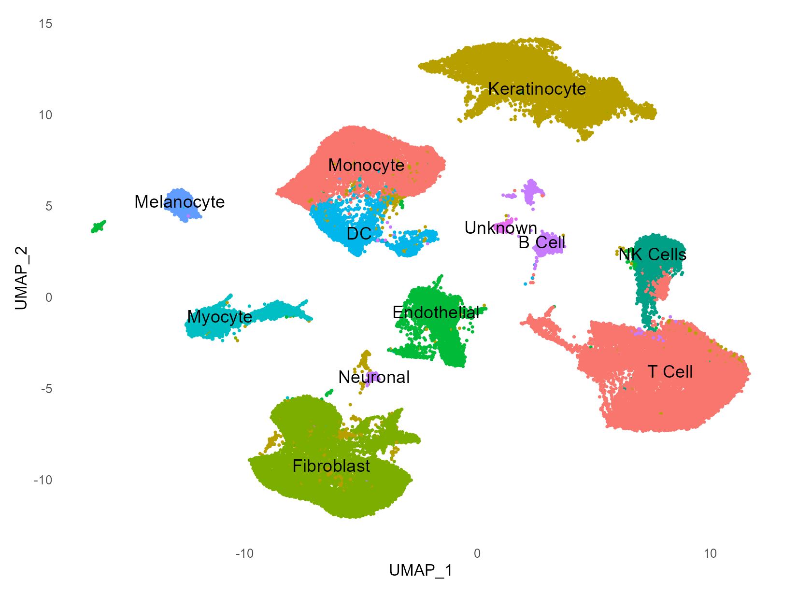
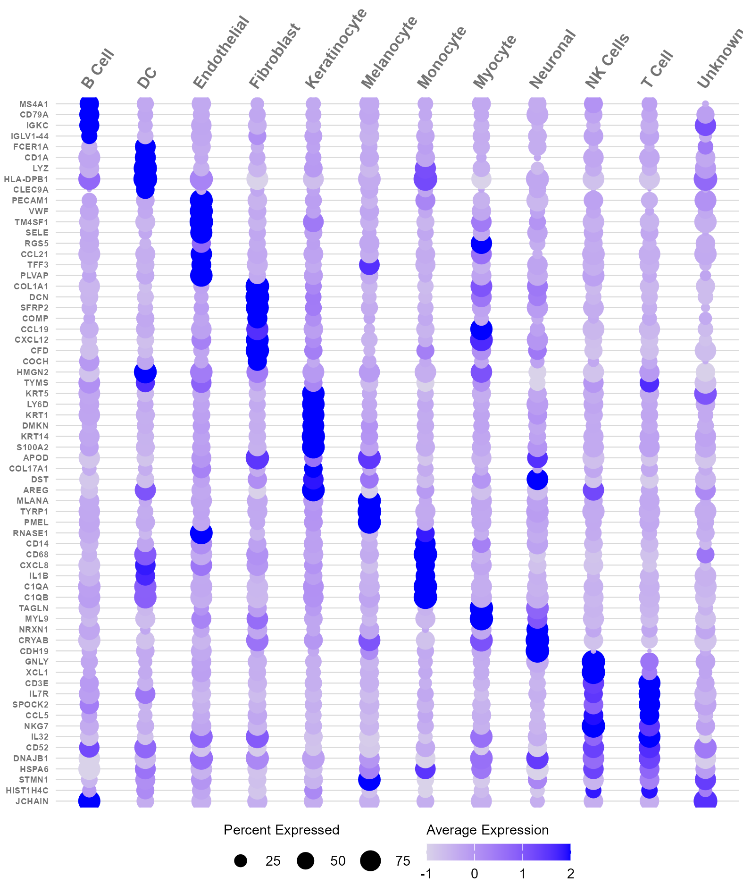
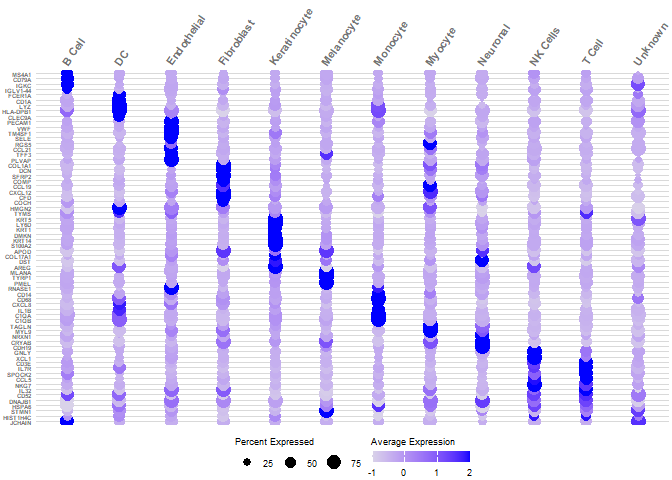

# Figure S13


``` r
# Functions ---------------------------------------------------------------

# DESeq wrapper. Matrix.utils is loaded in the libraries chunk above; package
# installation is intentionally kept outside the render workflow.
DESeq_wrapper = function(sub){
  # Subset metadata to only include the cluster and sample IDs to aggregate across
  groups <- sub@meta.data[, c("Identity", "orig.ident")]
  # Aggregate across cluster-sample groups
  pb <- Matrix.utils::aggregate.Matrix(t(sub@assays$RNA@counts),
                         groupings = groups, fun = "sum")
  splitf <- sapply(stringr::str_split(rownames(pb),
                                      pattern = "_",
                                      n = 2),`[`, 1)
  pb <- split.data.frame(pb, factor(splitf)) %>% lapply(function(u)
    set_colnames(t(u), stringr::str_extract(rownames(u), "(?<=_)[:alnum:]+")))
  get_sample_ids <- function(x){
    pb[[x]] %>%
      colnames()
  }
  de_samples <- map(1:length(unique(sub$Identity)), get_sample_ids) %>%
    unlist()
  samples_list <- map(1:length(unique(sub$Identity)), get_sample_ids)
  
  get_cluster_ids <- function(x){
    rep(names(pb)[x],
        each = length(samples_list[[x]]))
  }
  de_cluster_ids <- map(1:length(unique(sub$Identity)), get_cluster_ids) %>%
    unlist()
  gg_df <- data.frame(cluster_id = de_cluster_ids,
                      sample_id = de_samples)
  ## Turn named vector into a numeric vector of number of cells per sample
  n_cells <- table(sub$orig.ident)
  sids = names(n_cells)
  n_cells = as.numeric(n_cells)
  ## Determine how to reoder the samples (rows) of the metadata to match the order of sample names in sids vector
  m <- match(sids, sub$orig.ident)
  ## Create the sample level metadata by combining the reordered metadata with the number of cells corresponding to each sample.
  ei <- data.frame(sub@meta.data[m, ],
                   n_cells, row.names = NULL)
  gg_df <- cbind(gg_df, ei[match(gg_df$sample_id,ei$orig.ident), ])
  metadata <- gg_df %>% dplyr::select(cluster_id, sample_id, condition, id)
  metadata$cluster_id = as.factor(metadata$cluster_id)
  clusters <- levels(metadata$cluster_id)
  de_samples <- map(1:length(unique(sub$Identity)), get_sample_ids) %>%
    unlist()
  
  resList = list()
  ddsList = list()
  for(i in 1:length(clusters)){
    message(paste0(i,': DE Testing on population: ',clusters[i]))
    if(min(table(metadata$condition[metadata$cluster_id==clusters[i]]))<2){
      message(i,': DEGs not computed for ',clusters[i],'. Cluster does not have enough cells.')
      ddsList[[i]] = NULL
      resList[[i]] = NULL
    }else if(length(table(metadata$condition[metadata$cluster_id==clusters[i]]))!=2){
      message(i,': DEGs not computed for ',clusters[i],'. Cluster only exists for one group.')
      ddsList[[i]] = NULL
      resList[[i]] = NULL
    }else{
      # Subset the metadata
      cluster_metadata <- metadata[which(metadata$cluster_id == clusters[i]), ]
      cluster_metadata$condition = factor(cluster_metadata$condition,levels=c('Unaffected Skin','EM Lesion'))
      # Assign the rownames of the metadata to be the sample IDs
      rownames(cluster_metadata) <- cluster_metadata$sample_id
      # Subset the counts
      counts <- pb[[clusters[i]]]
      cluster_counts <- data.frame(counts[, which(colnames(counts) %in% rownames(cluster_metadata))])
      dds <- DESeqDataSetFromMatrix(cluster_counts,
                                    colData = cluster_metadata,
                                    design = ~ id + condition) ##NOTE the id + condition this is the big change
      message('conducting degs for cluster ',clusters[i])
      dds <- DESeq(dds,quiet = T)
      ddsList[[i]] = dds
      # resultsNames(dds) # lists the coefficients
      resList[[i]] <- results(dds, name="condition_EM.Lesion_vs_Unaffected.Skin")
    }
  }
  names(resList) = clusters
  names(ddsList) = clusters
  return(list(res = resList,dds=ddsList))
}
```

``` r
# SubPopulations ------------------------------------------------------------------

load(here::here("data", "intermediate", "03_public_skin_rna", "ncells.RData"))
files = list.files(
  here::here("data", "intermediate", "03_public_skin_rna"),
  full.names = TRUE,
  pattern = "^Labeled.*\\.RData$"
)
pops = gsub(".*led_(.*)\\.RD.*","\\1",files)

resList = list()
daList = list()
```

### Panels S13A-B: Skin scRNA-seq Cluster UMAP and Marker Dot Plot

``` r
# Top Clusters ------------------------------------------------------------

load(here::here("data", "intermediate", "03_public_skin_rna", "ncells.RData"))

# Differential Expression
load(here::here("data", "processed", "03_public_skin_rna", "combined3.RData"))
labs = labels$Manual
names(labs) = labels$cluster
combined <- RenameIdents(combined, labs)
combined$Identity = Idents(combined)
# DefaultAssay(combined) = 'RNA'
# res = DESeq_wrapper(combined)

#Sub-population Summary Plots
DefaultAssay(combined) = 'integrated'

dir.create(here::here("fig_s13_files"), showWarnings = FALSE, recursive = TRUE)

population_levels <- c(
  "B Cell", "DC", "Endothelial", "Fibroblast", "Keratinocyte",
  "Melanocyte", "Monocyte", "Myocyte", "Neuronal", "NK Cells",
  "T Cell", "Unknown"
)

population_cols <- c(
  "B Cell" = "#c77cff",
  "DC" = "#00b6eb",
  "Endothelial" = "#00ba38",
  "Fibroblast" = "#7CAE00",
  "Keratinocyte" = "#B79F00",
  "Melanocyte" = "#619CFF",
  "Monocyte" = "#F8766D",
  "Myocyte" = "#00BFC4",
  "Neuronal" = "#C77CFF",
  "NK Cells" = "#00A087",
  "T Cell" = "#F8766D",
  "Unknown" = "#E76BF3"
)

combined$Identity <- factor(as.character(combined$Identity), levels = population_levels)
Idents(combined) <- combined$Identity

umap_label_df <- Seurat::Embeddings(combined, "umap") |>
  as.data.frame() |>
  setNames(c("UMAP_1", "UMAP_2")) |>
  tibble::rownames_to_column("cell") |>
  mutate(Identity = combined$Identity[cell]) |>
  filter(!is.na(Identity)) |>
  group_by(Identity) |>
  summarise(
    UMAP_1 = median(UMAP_1),
    UMAP_2 = median(UMAP_2),
    .groups = "drop"
  )

dim_plot <- DimPlot(
  combined,
  group.by = "Identity",
  label = FALSE,
  cols = population_cols,
  pt.size = 0.01,
  raster = FALSE
) +
  geom_text(
    data = umap_label_df,
    aes(UMAP_1, UMAP_2, label = Identity),
    inherit.aes = FALSE,
    color = "black",
    size = 3.1
  ) +
  NoLegend() +
  theme_minimal(base_size = 8) +
  theme(
    panel.grid = element_blank(),
    legend.position = "none",
    plot.title = element_blank(),
    plot.margin = margin(2, 2, 2, 2)
  )

figure_s13a <- here::here(
  "fig_s13_files",
  "s13a_skin_scrnaseq_broad_cluster_umap.png"
)

ggsave(
  figure_s13a,
  dim_plot,
  device = ragg::agg_png,
  width = 5.5,
  height = 4.1,
  units = "in",
  dpi = 300
)

knitr::include_graphics(figure_s13a)
```



``` r
dotplot_population_levels <- population_levels
combined_s13b <- subset(combined, idents = dotplot_population_levels)
combined_s13b$Identity <- factor(
  as.character(combined_s13b$Identity),
  levels = dotplot_population_levels
)

markers_small <- markers %>%
  group_by(cluster) %>%
  slice_max(order_by = avg_log2FC, n = 2, with_ties = FALSE) %>%
  ungroup()

marker_cluster_order <- tibble(cluster = names(markers_broad)) %>%
  mutate(
    Identity = labels$Manual[match(cluster, as.character(labels$cluster))],
    Identity = factor(Identity, levels = dotplot_population_levels),
    cluster_order = as.numeric(cluster)
  ) %>%
  filter(!is.na(Identity)) %>%
  arrange(Identity, cluster_order)

marker_lookup <- split(markers_small$gene, markers_small$cluster)

feat <- lapply(marker_cluster_order$cluster, function(cluster_id) {
  top_genes <- marker_lookup[[cluster_id]]
  if (is.null(top_genes)) top_genes <- character()
  unique(c(markers_broad[[cluster_id]], top_genes))
}) %>%
  unlist() %>%
  as.character()

feat <- unique(feat[!is.na(feat) & nzchar(feat) & feat != "NA"])
feat <- feat[feat %in% rownames(combined_s13b[[DefaultAssay(combined_s13b)]])]

dp <- DotPlot(
  combined_s13b,
  features = rev(feat),
  group.by = "Identity",
  dot.scale = 5.2
) +
  coord_flip() +
  scale_y_discrete(limits = dotplot_population_levels, position = "right") +
  scale_color_gradient(
    low = "#d9d2e9",
    high = "blue",
    name = "Average Expression",
    limits = c(-1, 2),
    breaks = c(-1, 0, 1, 2),
    oob = scales::squish
  ) +
  scale_size(
    range = c(0, 5.2),
    name = "Percent Expressed",
    limits = c(0, 100),
    breaks = c(25, 50, 75)
  ) +
  labs(x = NULL, y = NULL) +
  theme_minimal(base_size = 8) +
  theme(
    panel.grid.major.x = element_blank(),
    panel.grid.minor = element_blank(),
    panel.grid.major.y = element_line(colour = "grey85", linewidth = 0.25),
    axis.text.x.top = element_text(
      colour = "grey45",
      angle = 55,
      hjust = 0,
      vjust = 0,
      size = 8,
      face = "bold"
    ),
    axis.text.x.bottom = element_text(
      colour = "grey45",
      angle = 55,
      hjust = 0,
      vjust = 0.5,
      size = 8,
      face = "bold"
    ),
    axis.text.y = element_text(colour = "grey45", size = 4.5, face = "bold"),
    axis.ticks = element_blank(),
    legend.position = "bottom",
    legend.box = "horizontal",
    legend.text = element_text(size = 7),
    legend.title = element_text(size = 7),
    legend.margin = margin(0, 0, 0, 0),
    plot.margin = margin(2, 2, 2, 2)
  ) +
  guides(
    size = guide_legend(
      title.position = "top",
      order = 1,
      override.aes = list(color = "black")
    ),
    color = guide_colorbar(
      title.position = "top",
      order = 2,
      barwidth = unit(26, "mm"),
      barheight = unit(3, "mm")
    )
  )

figure_s13b <- here::here(
  "fig_s13_files",
  "s13b_skin_scrnaseq_broad_cluster_marker_dotplot.png"
)

ggsave(
  figure_s13b,
  dp,
  device = ragg::agg_png,
  width = 5.25,
  height = 6.25,
  units = "in",
  dpi = 300
)

knitr::include_graphics(figure_s13b)
```



``` r
# Subpopulation differential abundance
meta = combined@meta.data %>% group_by(orig.ident,Identity) %>% mutate(count = n())
meta = meta %>% group_by(orig.ident) %>% mutate(total_cells_sub = n())
meta_sub = meta[!duplicated(paste0(meta$orig.ident,meta$Identity)),c('orig.ident','id','Identity','condition','count','total_cells_sub')]
meta_sub$total_cells_all = n_cells$total_cells[match(meta_sub$orig.ident,n_cells$orig.ident)]
meta_sub$pop = meta_sub$count/meta_sub$total_cells_sub
meta_sub$pot = meta_sub$count/meta_sub$total_cells_all
meta_split = split(meta_sub,meta_sub$Identity)
wilcox_parent = list()
wilcox_total = list()
for(j in 1:length(meta_split)){
  ids = names(table(meta_split[[j]]$id)==2)[table(meta_split[[j]]$id)==2]
  meta_split[[j]] = meta_split[[j]][meta_split[[j]]$id%in%ids,]
  meta_split[[j]] = meta_split[[j]][order(meta_split[[j]]$id),]
  if(nrow(meta_split[[j]])>1){
    meta_split_split = split(meta_split[[j]],meta_split[[j]]$condition)
    x = meta_split_split$`EM Lesion`$pop
    y = meta_split_split$`Unaffected Skin`$pop
    wilcox_parent[[j]] = data.frame(p = wilcox.test(x,y,
                                                    alternative = 'two.sided',
                                                    paired = T)$p.value,
                                    `Fold Change` = mean(x/y))
    x = meta_split_split$`EM Lesion`$pot
    y = meta_split_split$`Unaffected Skin`$pot
    wilcox_total[[j]] = data.frame(p = wilcox.test(x,y,
                                                   alternative = 'two.sided',
                                                   paired = T)$p.value,
                                   `Fold Change` = mean(x/y))
  }else{
    wilcox_parent[[j]] = NA
    wilcox_total[[j]] = NA
  }
}
names(wilcox_parent) = names(meta_split)
names(wilcox_total) = names(meta_split)
meta_sub = do.call(rbind,meta_split)
da = list(parent = wilcox_parent, total = wilcox_total, plotting_data = meta_sub)

dp
```



``` r
sessionInfo()
```

    R version 4.4.1 (2024-06-14 ucrt)
    Platform: x86_64-w64-mingw32/x64
    Running under: Windows 11 x64 (build 22631)

    Matrix products: default


    locale:
    [1] LC_COLLATE=English_United States.utf8 
    [2] LC_CTYPE=English_United States.utf8   
    [3] LC_MONETARY=English_United States.utf8
    [4] LC_NUMERIC=C                          
    [5] LC_TIME=English_United States.utf8    

    time zone: America/Los_Angeles
    tzcode source: internal

    attached base packages:
    [1] grid      stats4    stats     graphics  grDevices utils     datasets 
    [8] methods   base     

    other attached packages:
     [1] conflicted_1.2.0            datapasta_3.1.0            
     [3] here_1.0.1                  scCATCH_3.2.2              
     [5] Seurat_5.3.0                SeuratObject_5.0.2         
     [7] sp_2.1-4                    Matrix.utils_0.9.7         
     [9] Matrix_1.7-0                metap_1.12                 
    [11] multtest_2.60.0             factoextra_1.0.7           
    [13] UpSetR_1.4.0                VennDiagram_1.7.3          
    [15] futile.logger_1.4.3         pheatmap_1.0.12            
    [17] ComplexHeatmap_2.20.0       GEOquery_2.72.0            
    [19] DESeq2_1.44.0               SummarizedExperiment_1.34.0
    [21] Biobase_2.64.0              MatrixGenerics_1.16.0      
    [23] matrixStats_1.4.1           GenomicRanges_1.56.1       
    [25] GenomeInfoDb_1.40.1         IRanges_2.38.1             
    [27] S4Vectors_0.42.1            BiocGenerics_0.50.0        
    [29] ggplotify_0.1.2             ggpubr_0.6.0               
    [31] Hmisc_5.1-3                 RColorBrewer_1.1-3         
    [33] camcorder_0.1.0             cowplot_1.1.3              
    [35] patchwork_1.3.0             geomtextpath_0.1.4         
    [37] ggnewscale_0.5.1            gghighlight_0.4.1          
    [39] ggstance_0.3.7              ggrepel_0.9.5              
    [41] lubridate_1.9.3             forcats_1.0.0              
    [43] stringr_1.5.1               dplyr_1.1.4                
    [45] purrr_1.0.2                 readr_2.1.5                
    [47] tidyr_1.3.1                 tibble_3.2.1               
    [49] ggplot2_4.0.0               tidyverse_2.0.0            

    loaded via a namespace (and not attached):
      [1] spatstat.sparse_3.1-0   fs_1.6.6                httr_1.4.7             
      [4] doParallel_1.0.17       numDeriv_2016.8-1.1     sctransform_0.4.1      
      [7] tools_4.4.1             backports_1.5.0         R6_2.5.1               
     [10] uwot_0.2.2              lazyeval_0.2.2          sn_2.1.1               
     [13] GetoptLong_1.0.5        withr_3.0.2             prettyunits_1.2.0      
     [16] gridExtra_2.3           progressr_0.14.0        cli_3.6.3              
     [19] textshaping_0.4.0       pacman_0.5.1            formatR_1.14           
     [22] spatstat.explore_3.3-2  fastDummies_1.7.4       sandwich_3.1-0         
     [25] labeling_0.4.3          spatstat.data_3.1-2     mvtnorm_1.2-6          
     [28] S7_0.2.0                ggridges_0.5.6          pbapply_1.7-2          
     [31] systemfonts_1.1.0       yulab.utils_0.1.7       foreign_0.8-86         
     [34] svglite_2.1.3           parallelly_1.38.0       plotrix_3.8-4          
     [37] limma_3.60.4            rstudioapi_0.16.0       generics_0.1.3         
     [40] gridGraphics_0.5-1      shape_1.4.6.1           spatstat.random_3.3-2  
     [43] ica_1.0-3               car_3.1-2               abind_1.4-5            
     [46] lifecycle_1.0.4         multcomp_1.4-26         yaml_2.3.10            
     [49] carData_3.0-5           mathjaxr_1.6-0          SparseArray_1.4.8      
     [52] Rtsne_0.17              promises_1.3.0          crayon_1.5.3           
     [55] miniUI_0.1.1.1          lattice_0.22-6          magick_2.8.4           
     [58] pillar_1.10.1           knitr_1.49              rjson_0.2.23           
     [61] future.apply_1.11.2     codetools_0.2-20        mutoss_0.1-13          
     [64] glue_1.8.0              spatstat.univar_3.0-1   data.table_1.15.4      
     [67] gifski_1.12.0-2         vctrs_0.6.5             png_0.1-8              
     [70] spam_2.10-0             Rdpack_2.6.4            gtable_0.3.6           
     [73] cachem_1.1.0            xfun_0.48               rbibutils_2.3          
     [76] S4Arrays_1.4.1          mime_0.12               survival_3.6-4         
     [79] iterators_1.0.14        statmod_1.5.0           fitdistrplus_1.2-1     
     [82] TH.data_1.1-2           ROCR_1.0-11             nlme_3.1-164           
     [85] progress_1.2.3          RcppAnnoy_0.0.22        rprojroot_2.0.4        
     [88] irlba_2.3.5.1           KernSmooth_2.23-24      rpart_4.1.23           
     [91] colorspace_2.1-1        nnet_7.3-19             mnormt_2.1.1           
     [94] tidyselect_1.2.1        compiler_4.4.1          htmlTable_2.4.3        
     [97] xml2_1.3.6              TFisher_0.2.0           DelayedArray_0.30.1    
    [100] plotly_4.11.0           checkmate_2.3.2         scales_1.4.0           
    [103] lmtest_0.9-40           goftest_1.2-3           digest_0.6.37          
    [106] spatstat.utils_3.1-0    rmarkdown_2.29          XVector_0.44.0         
    [109] htmltools_0.5.8.1       pkgconfig_2.0.3         base64enc_0.1-3        
    [112] fastmap_1.2.0           rlang_1.1.4             GlobalOptions_0.1.2    
    [115] htmlwidgets_1.6.4       UCSC.utils_1.0.0        shiny_1.9.1            
    [118] farver_2.1.2            zoo_1.8-12              jsonlite_1.8.9         
    [121] BiocParallel_1.38.0     magrittr_2.0.3          Formula_1.2-5          
    [124] GenomeInfoDbData_1.2.12 dotCall64_1.1-1         Rcpp_1.0.13            
    [127] reticulate_1.38.0       stringi_1.8.4           zlibbioc_1.50.0        
    [130] MASS_7.3-60.2           plyr_1.8.9              parallel_4.4.1         
    [133] listenv_0.9.1           deldir_2.0-4            splines_4.4.1          
    [136] tensor_1.5              hms_1.1.3               circlize_0.4.16        
    [139] locfit_1.5-9.10         qqconf_1.3.2            igraph_2.0.3           
    [142] spatstat.geom_3.3-3     ggsignif_0.6.4          RcppHNSW_0.6.0         
    [145] reshape2_1.4.4          futile.options_1.0.1    evaluate_1.0.1         
    [148] lambda.r_1.2.4          tzdb_0.4.0              foreach_1.5.2          
    [151] httpuv_1.6.15           polyclip_1.10-7         grr_0.9.5              
    [154] RANN_2.6.2              scattermore_1.2         future_1.34.0          
    [157] clue_0.3-65             broom_1.0.6             xtable_1.8-4           
    [160] rsvg_2.6.0              RSpectra_0.16-2         rstatix_0.7.2          
    [163] later_1.3.2             ragg_1.3.2              viridisLite_0.4.2      
    [166] memoise_2.0.1           cluster_2.1.6           timechange_0.3.0       
    [169] globals_0.16.3         
