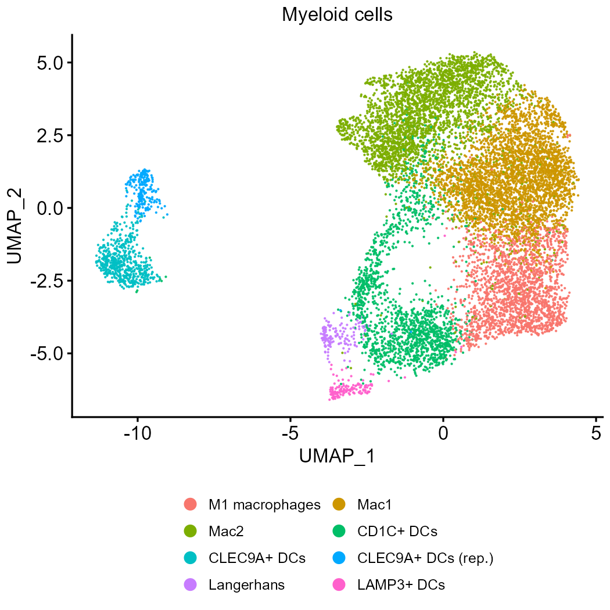
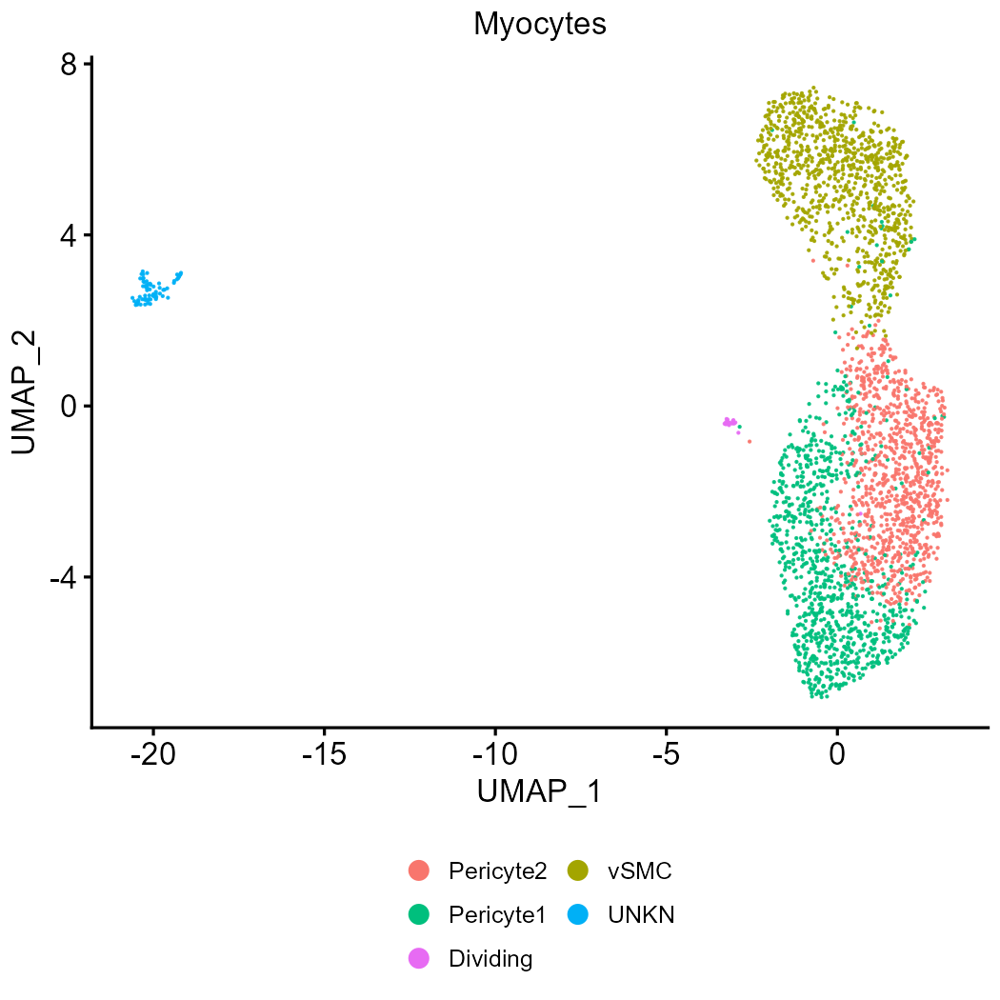
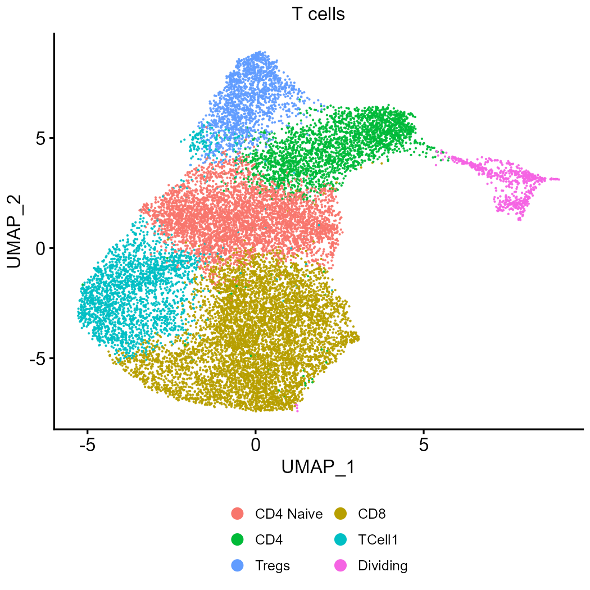

# Figure S14


### Panel S14A: Myeloid Subclusters

``` r
figure_s14a_dotplot <- here::here(
  "fig_s14_files",
  "figure_S14a_myeloid_subcluster_markers_dotplot.png"
)

figure_s14a_umap <- here::here(
  "fig_s14_files",
  "figure_S14a_myeloid_subclusters_umap.png"
)

figure_s14a_data <- load_subcluster_plot_data("myeloid")
figure_s14a_dotplot_plot <- plot_subcluster_dotplot(figure_s14a_data)
figure_s14a_umap_plot <- plot_subcluster_umap(figure_s14a_data, "Myeloid cells")

ggplot2::ggsave(
  figure_s14a_dotplot,
  figure_s14a_dotplot_plot,
  device = ragg::agg_png,
  width = 3.5,
  height = 3.5,
  units = "in",
  dpi = 300
)

ggplot2::ggsave(
  figure_s14a_umap,
  figure_s14a_umap_plot,
  device = ragg::agg_png,
  width = 3.5,
  height = 3.5,
  units = "in",
  dpi = 300
)

knitr::include_graphics(c(figure_s14a_dotplot, figure_s14a_umap))
```




### Panel S14B: Myocyte Subclusters

``` r
figure_s14b_dotplot <- here::here(
  "fig_s14_files",
  "figure_S14b_myocyte_subcluster_markers_dotplot.png"
)

figure_s14b_umap <- here::here(
  "fig_s14_files",
  "figure_S14b_myocyte_subclusters_umap.png"
)

figure_s14b_data <- load_subcluster_plot_data("myocyte")
figure_s14b_dotplot_plot <- plot_subcluster_dotplot(figure_s14b_data)
figure_s14b_umap_plot <- plot_subcluster_umap(figure_s14b_data, "Myocytes")

ggplot2::ggsave(
  figure_s14b_dotplot,
  figure_s14b_dotplot_plot,
  device = ragg::agg_png,
  width = 3.5,
  height = 3.5,
  units = "in",
  dpi = 300
)

ggplot2::ggsave(
  figure_s14b_umap,
  figure_s14b_umap_plot,
  device = ragg::agg_png,
  width = 3.5,
  height = 3.5,
  units = "in",
  dpi = 300
)

knitr::include_graphics(c(figure_s14b_dotplot, figure_s14b_umap))
```




### Panel S14C: T-cell Subclusters

``` r
figure_s14c_dotplot <- here::here(
  "fig_s14_files",
  "figure_S14c_t_cell_subcluster_markers_dotplot.png"
)

figure_s14c_umap <- here::here(
  "fig_s14_files",
  "figure_S14c_t_cell_subclusters_umap.png"
)

figure_s14c_data <- load_subcluster_plot_data("t_cell")
figure_s14c_dotplot_plot <- plot_subcluster_dotplot(figure_s14c_data)
figure_s14c_umap_plot <- plot_subcluster_umap(figure_s14c_data, "T cells")

ggplot2::ggsave(
  figure_s14c_dotplot,
  figure_s14c_dotplot_plot,
  device = ragg::agg_png,
  width = 3.5,
  height = 3.5,
  units = "in",
  dpi = 300
)

ggplot2::ggsave(
  figure_s14c_umap,
  figure_s14c_umap_plot,
  device = ragg::agg_png,
  width = 3.5,
  height = 3.5,
  units = "in",
  dpi = 300
)

knitr::include_graphics(c(figure_s14c_dotplot, figure_s14c_umap))
```




``` r
sessionInfo()
```

    R version 4.4.1 (2024-06-14 ucrt)
    Platform: x86_64-w64-mingw32/x64
    Running under: Windows 11 x64 (build 22631)

    Matrix products: default


    locale:
    [1] LC_COLLATE=English_United States.utf8 
    [2] LC_CTYPE=English_United States.utf8   
    [3] LC_MONETARY=English_United States.utf8
    [4] LC_NUMERIC=C                          
    [5] LC_TIME=English_United States.utf8    

    time zone: America/Los_Angeles
    tzcode source: internal

    attached base packages:
    [1] stats     graphics  grDevices utils     datasets  methods   base     

    other attached packages:
     [1] conflicted_1.2.0   Seurat_5.3.0       SeuratObject_5.0.2 sp_2.1-4          
     [5] here_1.0.1         ragg_1.3.2         ggrepel_0.9.5      lubridate_1.9.3   
     [9] forcats_1.0.0      stringr_1.5.1      dplyr_1.1.4        purrr_1.0.2       
    [13] readr_2.1.5        tidyr_1.3.1        tibble_3.2.1       ggplot2_4.0.0     
    [17] tidyverse_2.0.0   

    loaded via a namespace (and not attached):
      [1] RColorBrewer_1.1-3     jsonlite_1.8.9         magrittr_2.0.3        
      [4] spatstat.utils_3.1-0   farver_2.1.2           rmarkdown_2.29        
      [7] vctrs_0.6.5            ROCR_1.0-11            memoise_2.0.1         
     [10] spatstat.explore_3.3-2 htmltools_0.5.8.1      sctransform_0.4.1     
     [13] parallelly_1.38.0      KernSmooth_2.23-24     htmlwidgets_1.6.4     
     [16] ica_1.0-3              plyr_1.8.9             plotly_4.11.0         
     [19] zoo_1.8-12             cachem_1.1.0           igraph_2.0.3          
     [22] mime_0.12              lifecycle_1.0.4        pkgconfig_2.0.3       
     [25] Matrix_1.7-0           R6_2.5.1               fastmap_1.2.0         
     [28] fitdistrplus_1.2-1     future_1.34.0          shiny_1.9.1           
     [31] digest_0.6.37          patchwork_1.3.0        rprojroot_2.0.4       
     [34] tensor_1.5             RSpectra_0.16-2        irlba_2.3.5.1         
     [37] textshaping_0.4.0      labeling_0.4.3         progressr_0.14.0      
     [40] spatstat.sparse_3.1-0  timechange_0.3.0       httr_1.4.7            
     [43] polyclip_1.10-7        abind_1.4-5            compiler_4.4.1        
     [46] withr_3.0.2            S7_0.2.0               fastDummies_1.7.4     
     [49] MASS_7.3-60.2          tools_4.4.1            lmtest_0.9-40         
     [52] httpuv_1.6.15          future.apply_1.11.2    goftest_1.2-3         
     [55] glue_1.8.0             nlme_3.1-164           promises_1.3.0        
     [58] grid_4.4.1             Rtsne_0.17             cluster_2.1.6         
     [61] reshape2_1.4.4         generics_0.1.3         gtable_0.3.6          
     [64] spatstat.data_3.1-2    tzdb_0.4.0             data.table_1.15.4     
     [67] hms_1.1.3              spatstat.geom_3.3-3    RcppAnnoy_0.0.22      
     [70] RANN_2.6.2             pillar_1.10.1          spam_2.10-0           
     [73] RcppHNSW_0.6.0         later_1.3.2            splines_4.4.1         
     [76] lattice_0.22-6         survival_3.6-4         deldir_2.0-4          
     [79] tidyselect_1.2.1       miniUI_0.1.1.1         pbapply_1.7-2         
     [82] knitr_1.49             gridExtra_2.3          scattermore_1.2       
     [85] xfun_0.48              matrixStats_1.4.1      stringi_1.8.4         
     [88] lazyeval_0.2.2         yaml_2.3.10            pacman_0.5.1          
     [91] evaluate_1.0.1         codetools_0.2-20       cli_3.6.3             
     [94] uwot_0.2.2             xtable_1.8-4           reticulate_1.38.0     
     [97] systemfonts_1.1.0      Rcpp_1.0.13            globals_0.16.3        
    [100] spatstat.random_3.3-2  png_0.1-8              spatstat.univar_3.0-1 
    [103] parallel_4.4.1         dotCall64_1.1-1        listenv_0.9.1         
    [106] viridisLite_0.4.2      scales_1.4.0           ggridges_0.5.6        
    [109] rlang_1.1.4            cowplot_1.1.3         
