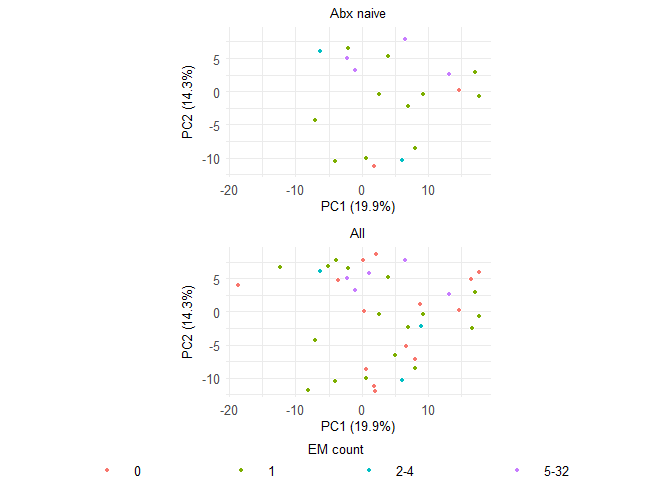
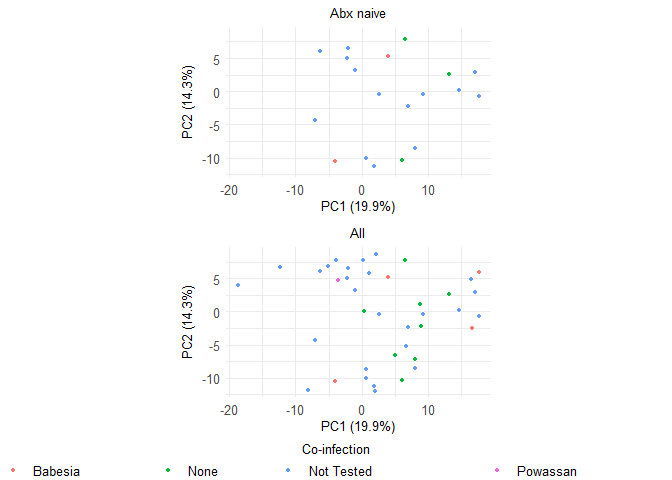

# Figure S3


## Load Functions

``` r
# Functions ---------------------------------------------------------------
general_functions <- here::here("scripts", "common", "general_functions.R")
if (file.exists(general_functions)) {
  source(file = general_functions)
}

returnSigStars = function(x){
  x2 = x
  x2[is.numeric(x) & x > 0.05] = "ns"
  x2[is.numeric(x) & x < 0.05] = "*"
  x2[is.numeric(x) & x < 0.01] = "**"
  x2[is.numeric(x) & x < 0.001] = "***"
  x2[is.numeric(x) & x < 0.0001] = "****"
  x2
}

gg_color_hue <- function(n) {
  hues = seq(15, 375, length = n + 1)
  hcl(h = hues, l = 65, c = 100)[1:n]
}

palBias = function(x){
  if(abs(x)>1){
    break("x must be between -1 and 1")
  }
  cool = rainbow(500, start=rgb2hsv(col2rgb('cyan'))[1], end=rgb2hsv(col2rgb('blue'))[1])
  warm = rainbow(500, start=rgb2hsv(col2rgb('red'))[1], end=rgb2hsv(col2rgb('yellow'))[1])
  cols = c(rev(cool), rev(warm))
  if(x<0){
    cols = cols[ceiling(abs(x)*500):1000]
  }else{
    cols = cols[1:ceiling(500+500*(1-x))]
  }
  colorRampPalette(cols)(255)
}

fixNames = function(x){
  x = gsub("\\..*","",x)
  x = gsub("-","",x)
  x = gsub("/.*","",x)
  x = gsub("\\(.*","",x)
  x = toupper(x)
  alias = alias2SymbolTable(x)
  x[!is.na(alias)] = alias[!is.na(alias)]
  x
}

cos.sim = function(x){
  res = matrix(ncol = ncol(x),nrow = ncol(x))
  dimnames(res) = list(colnames(x),colnames(x))
  x = as.data.frame(x)
  res = mapply(function(xi,i){
    mapply(function(xj,j){
      sim = xi%*%xj/(sqrt(sum((xi)^2))*sqrt(sum((xj)^2)))
      res[i,j] = sim
      res[j,i] = sim
    },x,1:ncol(x))
  },x,1:ncol(x))
  res
}

na.omit.all = function(x,MAR=c(1,2)){
  if(MAR==1){
    x[apply(x,1,function(x)sum(!is.na(x))>0),]
  }else if(MAR==2){
    x[,apply(x,2,function(x)sum(!is.na(x))>0)]
  }else{
    x[apply(x,1,function(x)sum(!is.na(x))>0),
      apply(x,2,function(x)sum(!is.na(x))>0)]
  }
}

rcorr.nodups = function(x,y,...){
  c = rcorr(x,y,...)
  rows = 1:ncol(x)
  cols = (ncol(x)+1):(ncol(x)+ncol(y))
  c$r = c$r[rows,cols]
  c$n = c$n[rows,cols]
  c$P = c$P[rows,cols]
  c
}

coord_radar <- function (theta = "x", start = 0, direction = 1) 
{
  theta <- match.arg(theta, c("x", "y"))
  r <- if (theta == "x") 
    "y"
  else "x"
  
  #dirty
  rename_data <- function(coord, data) {
    if (coord$theta == "y") {
      plyr::rename(data, c("y" = "theta", "x" = "r"), warn_missing = FALSE)
    } else {
      plyr::rename(data, c("y" = "r", "x" = "theta"), warn_missing = FALSE)
    }
  }
  theta_rescale <- function(coord, x, scale_details) {
    rotate <- function(x) (x + coord$start) %% (2 * pi) * coord$direction
    rotate(scales::rescale(x, c(0, 2 * pi), scale_details$theta.range))
  }
  
  r_rescale <- function(coord, x, scale_details) {
    scales::rescale(x, c(0, .4), scale_details$r.range)
  }
  
  ggproto("CordRadar", CoordPolar, theta = theta, r = r, start = start, 
          direction = sign(direction),
          is_linear = function(coord) TRUE,
          render_bg = function(self, scale_details, theme) {
            scale_details <- rename_data(self, scale_details)
            
            theta <- if (length(scale_details$theta.major) > 0)
              theta_rescale(self, scale_details$theta.major, scale_details)
            thetamin <- if (length(scale_details$theta.minor) > 0)
              theta_rescale(self, scale_details$theta.minor, scale_details)
            thetafine <- seq(0, 2 * pi, length.out = 100)
            
            rfine <- c(r_rescale(self, scale_details$r.major, scale_details))
            
            # This gets the proper theme element for theta and r grid lines:
            #   panel.grid.major.x or .y
            majortheta <- paste("panel.grid.major.", self$theta, sep = "")
            minortheta <- paste("panel.grid.minor.", self$theta, sep = "")
            majorr     <- paste("panel.grid.major.", self$r,     sep = "")
            
            ggplot2:::ggname("grill", grid::grobTree(
              ggplot2:::element_render(theme, "panel.background"),
              if (length(theta) > 0) ggplot2:::element_render(
                theme, majortheta, name = "angle",
                x = c(rbind(0, 0.45 * sin(theta))) + 0.5,
                y = c(rbind(0, 0.45 * cos(theta))) + 0.5,
                id.lengths = rep(2, length(theta)),
                default.units = "native"
              ),
              if (length(thetamin) > 0) ggplot2:::element_render(
                theme, minortheta, name = "angle",
                x = c(rbind(0, 0.45 * sin(thetamin))) + 0.5,
                y = c(rbind(0, 0.45 * cos(thetamin))) + 0.5,
                id.lengths = rep(2, length(thetamin)),
                default.units = "native"
              ),
              
              ggplot2:::element_render(
                theme, majorr, name = "radius",
                x = rep(rfine, each = length(thetafine)) * sin(thetafine) + 0.5,
                y = rep(rfine, each = length(thetafine)) * cos(thetafine) + 0.5,
                id.lengths = rep(length(thetafine), length(rfine)),
                default.units = "native"
              )
            ))
          })
}

### adapted from diffcyt

testDA_edgeR <- function(counts,cluster_id, design, contrast, 
                         trend_method = "none", 
                         min_cells = 3, min_samples = NULL, 
                         normalize = T, norm_factors = "TMM") {
  
  if (is.null(min_samples)) {
    min_samples <- ncol(counts) / 2
  }
  
  if(missing(cluster_id)){
    cluster_id = rownames(counts)
  }
  
  cluster_id_all = cluster_id
  
  # filtering: keep clusters with at least 'min_cells' cells in at least 'min_samples' samples
  tf <- counts >= min_cells
  ix_keep <- apply(tf, 1, function(r) sum(r) >= min_samples)
  
  counts <- counts[ix_keep, , drop = FALSE]
  cluster_id <- cluster_id[ix_keep]
  
  # edgeR pipeline
  
  # normalization factors
  if (normalize & norm_factors == "TMM") {
    norm_factors <- calcNormFactors(counts, method = "TMM")
  }
  
  # note: when using DGEList object, column sums are automatically used for library sizes
  if (normalize) {
    y <- DGEList(counts, norm.factors = norm_factors)
  } else {
    y <- DGEList(counts)
  }
  
  # estimate dispersions
  # (note: using 'trend.method = "none"' by default)
  y <- estimateDisp(y, design, trend.method = trend_method)
  
  # fit models
  fit <- glmFit(y, design)
  
  # likelihood ratio tests
  resList = list()
  for(i in 1:ncol(contrast)){
    lrt <- glmLRT(fit, contrast = contrast[,i])
    top <- edgeR::topTags(lrt, n = Inf, adjust.method = "BH", sort.by = "none")
    row_data = top$table
    if(length(cluster_id)!=length(cluster_id_all)){
      missing_clusts = cluster_id_all[!cluster_id_all%in%cluster_id]
      missing = matrix(nrow = length(missing_clusts),ncol = ncol(row_data))
      rownames(missing) = missing_clusts
      colnames(missing) = colnames(top)
      row_data = rbind(row_data,missing)
      row_data = row_data[cluster_id_all,]
    }
    resList[[i]] = row_data
  }
  names(resList) = colnames(contrast)
  
  
  logFCFrame = do.call(cbind,lapply(resList,function(x)x[,"logFC"]))
  colnames(logFCFrame) = colnames(contrast)
  rownames(logFCFrame) = cluster_id_all
  
  adjpFrame = do.call(cbind,lapply(resList,function(x)x[,"FDR"]))
  colnames(adjpFrame) = colnames(contrast)
  rownames(adjpFrame) = cluster_id_all
  
  pFrame = do.call(cbind,lapply(resList,function(x)x[,"PValue"]))
  colnames(pFrame) = colnames(contrast)
  rownames(pFrame) = cluster_id_all
  
  list(p.adjFrame = adjpFrame,pFrame = pFrame,logFCFrame = logFCFrame)
}


### Adapted from diffcyt

testDS_limma <- function(d_counts, d_medians, design, contrast, 
                         block_id = NULL, trend = TRUE, weights = TRUE, 
                         markers_to_test = NULL, 
                         min_cells = 3, min_samples = NULL, 
                         plot = FALSE, path = ".") {
  
  if (!is.null(block_id) & !is.factor(block_id)) {
    block_id <- factor(block_id, levels = unique(block_id))
  }
  
  if (is.null(min_samples)) {
    min_samples <- ncol(d_counts) / 2
  }
  
  # markers to test
  if (!is.null(markers_to_test)) {
    markers_to_test <- markers_to_test
  } else {
    # vector identifying 'cell state' markers in list of assays
    markers_to_test <- metadata(d_medians)$id_state_markers
  }
  
  # note: counts are only required for filtering
  counts <- d_counts
  cluster_id <- rownames(d_counts)
  
  # filtering: keep clusters with at least 'min_cells' cells in at least 'min_samples' samples
  tf <- counts >= min_cells
  ix_keep <- apply(tf, 1, function(r) sum(r) >= min_samples)
  
  counts <- counts[ix_keep, , drop = FALSE]
  cluster_id <- cluster_id[ix_keep]
  
  # extract medians and create concatenated matrix
  state_names <- names(assays(d_medians))[markers_to_test]
  meds <- do.call("rbind", {
    lapply(as.list(assays(d_medians)[state_names]), function(a) a[as.character(cluster_id), , drop = FALSE])
  })
  meds_all <- do.call("rbind", as.list(assays(d_medians)[state_names]))
  
  
  rownames(meds) = paste0(rep(state_names,each=length(cluster_id))," - ",rep(cluster_id,length(state_names)))
  rownames(meds_all) = paste0(rep(state_names,each=nrow(d_counts))," - ",rep(sort(rownames(d_counts)),length(state_names)))
  # limma pipeline
  
  # estimate correlation between paired samples
  # (note: paired designs only; >2 measures per sample not allowed)
  if (!is.null(block_id)) {
    dupcor <- duplicateCorrelation(meds, design, block = block_id)
  }
  
  # weights: cluster cell counts (repeat for each marker)
  if (weights) {
    weights <- counts[as.character(rep(cluster_id, length(state_names))), ]
    stopifnot(nrow(weights) == nrow(meds))
  } else {
    weights <- NULL
  }
  
  # fit models
  if (!is.null(block_id)) {
    message("Fitting linear models with random effects term for 'block_id'.")
    fit <- lmFit(meds, design, weights = weights, 
                 block = block_id, correlation = dupcor$consensus.correlation)
  } else {
    fit <- lmFit(meds, design, weights = weights)
  }
  fit <- contrasts.fit(fit, contrast)
  
  # calculate moderated tests
  efit <- eBayes(fit, trend = trend)
  
  # results
  tops = lapply(colnames(contrast),function(x)topTable(efit, coef = x, number = Inf, adjust.method = "BH", sort.by = "none"))
  names(tops) = colnames(contrast)
  
  logFCFrame = sapply(tops,function(x)x$logFC)
  rownames(logFCFrame) = rownames(tops[[1]])
  adj.pFrame = sapply(tops,function(x)x$adj.P.Val)
  rownames(adj.pFrame) = rownames(tops[[1]])
  
  list(logFCFrame = logFCFrame,adj.pFrame = adj.pFrame,meds = meds)
}

plot_pca = function(pca,color,components=c(1,2),label=F,n=10,scale = 5,draw_loadings = F,
                    legendSize = unit(3,'mm')){
  d = data.frame(comp1 = pca$x[,components[1]],
                 comp2 = pca$x[,components[2]],
                 color=color,
                 label = rownames(pca$x))
  
  vars = paste0("PC",1:ncol(pca$x)," (",round(pca$sdev^2/sum(pca$sdev^2)*100,1),"%)")
  loadings = data.frame(t(apply(pca$rotation,1,function(x)x*pca$sdev))[,components],
                        x=rep(0,nrow(pca$rotation)),
                        y=rep(0,nrow(pca$rotation)))
  loadings$label = rownames(loadings)
  keep = order(loadings[,components[1]]^2+loadings[,components[2]]^2,decreasing=T)[1:n]
  loadings = loadings[keep,]
  legendSize = unit(3,'mm')
  
  if(label){
    p = ggplot(d,aes(x=comp1,y=comp2,color=color,label=label))
    if(draw_loadings){
      labs = data.frame(x=c(d[,components[1]],scale*loadings[,1]),
                        y=c(d[,components[2]],scale*loadings[,2]+sign(scale*loadings[,2])*0.5),
                        label = c(d$label,loadings$label),
                        color = c(as.character(d$color),rep("var",nrow(loadings))))
      p = p + ggrepel::geom_label_repel(labs,
                                        mapping = aes(x=x,y=y,label=label,color=color),
                                        inherit.aes = F,
                                        col = c(gg_color_hue(length(unique(labs$color))-1),"black")[match(labs$color, c(unique(labs$color)[unique(labs$color)!="var"],"var"))],
                                        max.overlaps = 30,
                                        size = 15)+
        geom_segment(loadings,
                     mapping = aes(x=x,y=y,xend=scale*(x+PC1),yend=scale*(y+PC2)),
                     inherit.aes = F,
                     arrow = arrow(length = unit(1,"cm")),size=2)
    }
  }else{
    p = ggplot(d,aes(x=comp1,y=comp2,color=color))+geom_point(size=15)
    if(draw_loadings){
      labs = data.frame(x=c(scale*loadings[,1]),
                        y=c(scale*loadings[,2]),
                        label = c(loadings$label),
                        color = c(rep("var",nrow(loadings))))
      p = p +
        geom_segment(loadings,
                     mapping = aes(x=x,y=y,xend=scale*(x+PC1),yend=scale*(y+PC2)),
                     inherit.aes = F,
                     arrow = arrow(length = unit(1,"cm")),size=2)+
        ggrepel::geom_label_repel(labs,
                                  mapping = aes(x=x,y=y,label=label),
                                  inherit.aes = F,
                                  col = 'black',
                                  max.overlaps = 30,
                                  size = 15)
    }
  }
  
  p = p +
    xlab(vars[components[1]])+
    ylab(vars[components[2]])+
    guides(color = guide_legend(title="",byrow = TRUE))+
    theme(legend.key.size = legendSize,
          axis.text = element_blank(),
          plot.title = element_text(hjust = 0.5),
          legend.spacing.y = unit(3, 'cm'))+
    theme_minimal(base_size = 60)
}
```

``` r
load(here::here("data", "processed", "01_proteomics_metabolomics", "Data.RData"))

# Exclude the 35-EM patient. Comment this block out to include them.
samples_without_35EM <- data$sampleData |>
  tibble::rownames_to_column("sample_rowname") |>
  dplyr::filter(
    as.character(Subject_ID) != "201455",
    !as.character(sample) %in% c("201455 T1", "201455 T2")
  ) |>
  dplyr::pull(sample_rowname)

data$sampleData <- data$sampleData[samples_without_35EM, , drop = FALSE]
data$assayData <- data$assayData[samples_without_35EM, , drop = FALSE]
data$data <- data$data[samples_without_35EM, , drop = FALSE]
data$directSymptoms <- data$directSymptoms[samples_without_35EM, , drop = FALSE]
data$confoundingSymptoms <- data$confoundingSymptoms[samples_without_35EM, , drop = FALSE]
data$emData <- data$emData[samples_without_35EM, , drop = FALSE]
data$symptomData <- data$symptomData[samples_without_35EM, , drop = FALSE]
data$treatmentData <- data$treatmentData[samples_without_35EM, , drop = FALSE]
data$olinkNew <- data$olinkNew[samples_without_35EM, , drop = FALSE]
data$olinkNewFail <- data$olinkNewFail[samples_without_35EM, , drop = FALSE]
```

### Panel A: Fever-Associated Protein PCA

``` r
sams = data$sampleData$time%in%c("T1")&
  data$sampleData$Condition=="Patient"&
  data$sampleData$days_of_prior_antibiotics==0&
  as.character(data$sampleData$Subject_ID) != "201455"&
  !as.character(data$sampleData$sample) %in% c("201455 T1", "201455 T2")

d = data$assayData
d = apply(d,2,function(x)(x-mean(x,na.rm=T))/sd(x,na.rm=T))
d = na.omit(d[sams,])
colnames(d) = make.unique(fixNames(colnames(d)))
colnames(d) <- colnames(d) |>
  stringr::str_replace("^IFNGAMMA$", "IFN-γ") |>
  stringr::str_replace("^MIP1 ALPHA$", "MIP-1α") |> 
  stringr::str_replace("^LAP TGFBETA1$", "LAP TGF-β1")
pca = prcomp(d,scale. = F)

d2 = data.frame(cbind(names = rownames(pca$x),
                      pca$x,data$assayData[rownames(pca$x),],
                      data$directSymptoms[rownames(pca$x),],
                      data$emData[rownames(pca$x),]))
load = as.data.frame(get_pca_var(pca)$coord[,1:2]*10)
load$contrib = get_pca_var(pca)$cos2[,1] * 100 / sum(get_pca_var(pca)$cos2[,1]) 
load$name = rownames(load)
vars = paste0("PC",1:ncol(pca$x)," (",round(pca$sdev^2/sum(pca$sdev^2)*100,1),"%)")
legendSize = unit(3,'mm')
base_size = 8
point_size = 2
label_size = 2.5
lims = list(c(0,7.2))

load_lab = load[order(load$contrib,decreasing = T)[1:10],]
load_lab$Dim.1 = as.numeric(load_lab$Dim.1)
load_lab$Dim.2 = as.numeric(load_lab$Dim.2)

# Arc: labels placed on a circular arc just past all arrow tips.
# theta is mapped from each label's Dim.2 (preserving top-to-bottom order).
# nudge_x/y push from arrow tip to arc position; direction="y" lets ggrepel
# spread vertically to resolve overlap while keeping all labels right of tips.
load_lab_vars = load_lab |>
  dplyr::mutate(
    theta   = (25 * pi / 180) + ((-5 * pi / 180) - (25 * pi / 180)) *
                (Dim.2 - max(Dim.2)) / (min(Dim.2) - max(Dim.2)),
    label_x = (max(Dim.1) / cos(40 * pi / 180) + 6) * 0.75 * cos(theta),
    label_y = (max(Dim.1) / cos(40 * pi / 180) + 6) * 0.75 * sin(theta),
    nudge_x = label_x - Dim.1,
    nudge_y = label_y - Dim.2
  )

patient_labels = d2 |>
  dplyr::mutate(
    PC1 = as.numeric(PC1),
    PC2 = as.numeric(PC2),
    Feverish.Chilly = as.numeric(Feverish.Chilly)
  ) |>
  dplyr::arrange(dplyr::desc(Feverish.Chilly)) |>
  dplyr::slice_head(n = 2)

fever_pca_lhs <- ggplot(d2, aes(x = as.numeric(PC1), y = as.numeric(PC2), color = as.numeric(Feverish.Chilly))) +
  geom_point(size = point_size) +
  theme_minimal(base_size = base_size) +
  xlab(vars[1]) + ylab(vars[2]) +
  theme(
    legend.key.size    = legendSize,
    legend.title       = element_text(size = 8),
    legend.text        = element_text(size = 8),
    axis.text          = element_blank(),
    legend.position    = "inside",
    legend.position.inside = c(0.90, 0.05),
    legend.justification   = c(1, 0),
    legend.direction   = "horizontal",
    legend.background  = element_rect(fill = "white", color = "black"),
    legend.margin      = margin(2, 2, 2, 2),
    plot.title         = element_blank()
  ) +
  labs(color = "Feverish/chilly symptom score") +
  scale_color_gradient(
    low    = "#56B1F7",
    high   = "#132B43",
    limits = lims[[1]],
    oob    = scales::squish,
    guide  = guide_colorbar(
      direction      = "horizontal",
      title.position = "top",
      title.hjust    = 0.5,
      barwidth       = unit(24, "mm"),
      barheight      = unit(3, "mm")
    )
  ) +
  new_scale(new_aes = "color") +
  geom_segment(
    data = load_lab_vars,
    aes(x = 0, y = 0, xend = Dim.1, yend = Dim.2),
    inherit.aes = FALSE,
    show.legend = FALSE,
    color = "grey15",
    linewidth = 0.35,
    lineend = "round",
    arrow = arrow(length = unit(0.03, "npc"))
  ) +
  ggrepel::geom_text_repel(
    data          = load_lab_vars,
    aes(x = Dim.1, y = Dim.2, label = name),
    nudge_x       = load_lab_vars$nudge_x,
    nudge_y       = load_lab_vars$nudge_y,
    inherit.aes   = FALSE,
    show.legend   = FALSE,
    size          = label_size,
    alpha         = 0.75,
    segment.color = "grey55",
    segment.size  = 0.25,
    min.segment.length = 0,
    direction     = "y",
    box.padding   = 0.3,
    point.padding = 0.1,
    max.overlaps  = 100
  ) +
  ggrepel::geom_label_repel(
    data = d2 |>
      dplyr::mutate(
        PC1 = as.numeric(PC1),
        PC2 = as.numeric(PC2),
        Feverish.Chilly = as.numeric(Feverish.Chilly)
      ) |>
      dplyr::arrange(dplyr::desc(Feverish.Chilly)) |>
      dplyr::slice_head(n = 2),
    aes(x = PC1, y = PC2, label = names),
    inherit.aes   = FALSE,
    show.legend   = FALSE,
    size          = label_size,
    alpha         = 0.9,
    color         = "black",
    fill          = "white",
    label.padding = unit(0.08, "lines"),
    segment.color = NA,
    box.padding   = 0.15,
    point.padding = 0.1,
    max.overlaps  = Inf
  )

fever_pca_rhs = ggplotify::as.ggplot(
  fviz_contrib(pca, choice = "var", top = 25,
               ggtheme = theme_minimal(base_size = base_size) +
                theme(plot.title = element_blank()
                ) 

    ) + ylab("Contribution to PC1 (%)")
)

fever_pca <- ggarrange(fever_pca_lhs, fever_pca_rhs,
                      ncol = 2,
                      widths = c(1,1)
                      )

ggsave(
  here::here("fig_s3_files", "figure_S03a_fever_associated_protein_pca.png"),
  fever_pca,
  device = ragg::agg_png,
  width = 7,
  height = 4.25,
  units = "in",
  dpi = 600
)
```

### Panel B: Erythema Migrans Burden PCA

``` r
s3_historical_env <- new.env(parent = baseenv())
load(
  here::here(
    "data",
    "raw",
    "01_proteomics_metabolomics",
    "OlinkPreprocessed.RData"
  ),
  envir = s3_historical_env
)
s3_historical_data <- s3_historical_env$data

s3_complete_samples <- base::intersect(
  rownames(s3_historical_data$assayData),
  rownames(s3_historical_data$olinkNew)
)

s3_pca_matrix <- cbind(
  s3_historical_data$assayData[s3_complete_samples, , drop = FALSE],
  s3_historical_data$olinkNew[
    s3_complete_samples,
    colnames(s3_historical_data$olinkNew) != "CALR",
    drop = FALSE
  ]
)

s3_pca_matrix <- s3_pca_matrix[
  complete.cases(s3_pca_matrix),
  ,
  drop = FALSE
]

# Exclude the 35-EM patient before PCA. Comment this block out to include them.
s3_pca_matrix <- s3_pca_matrix[
  !rownames(s3_pca_matrix) %in% c(
    "201455 T1",
    "201455 T2",
    s3_historical_data$emData |>
      dplyr::filter(Number_of_EM_at_Baseline == 35) |>
      dplyr::pull(samples)
  ),
  ,
  drop = FALSE
]

pca = prcomp(s3_pca_matrix, scale. = TRUE)

s3_pca_scores <- pca$x |>
  data.frame() |>
  tibble::rownames_to_column("names") |>
  dplyr::left_join(
    s3_historical_data$sampleData |>
      dplyr::select(sample, time, Condition, prior_antibiotics),
    by = c("names" = "sample")
  ) |>
  dplyr::filter(time == "T1", Condition == "Patient") |>
  dplyr::mutate(
    PC1 = -PC1,
    PC2 = -PC2,
    antibiotic_naive = prior_antibiotics == "No"
  )

n_em = s3_historical_data$emData[
  s3_pca_scores$names,
  "Number_of_EM_at_Baseline"
]
em_group = rep("0", nrow(s3_pca_scores))
em_group[n_em==1] = '1'
em_group[n_em>1&n_em<5] = '2-4'
em_group[n_em>4] = '5-32'
em_group[n_em>30] = '35'

d2_all = s3_pca_scores |>
  dplyr::mutate(
    em_group = factor(
      em_group,
      levels = c("0", "1", "2-4", "5-32", "35"),
      ordered = TRUE
    )
  )

s3_pca_vars = paste0("PC",1:ncol(pca$x)," (",round(pca$sdev^2/sum(pca$sdev^2)*100,1),"%)")
s3_pca_x_limits = range(s3_pca_scores$PC1, finite = TRUE)
s3_pca_y_limits = range(s3_pca_scores$PC2, finite = TRUE)

em_colors <- c(
  "0" = "#F8766D",
  "1" = "#7CAE00",
  "2-4" = "#00BFC4",
  "5-32" = "#C77CFF",
  "35" = "#E76BF3"
)

em_naive_pca <- d2_all |>
  dplyr::filter(antibiotic_naive) |>
  ggplot(aes(x = PC1, y = PC2, fill = em_group)) +
  geom_point(shape = 21, size = 2, stroke = 0.25, color = "white") +
  scale_fill_manual(values = em_colors, drop = FALSE) +
  coord_equal(xlim = s3_pca_x_limits, ylim = s3_pca_y_limits) +
  labs(title = "Abx naive", x = s3_pca_vars[1], y = s3_pca_vars[2]) +
  theme_minimal(base_size = 10) +
  theme(
    text = element_text(size = 10),
    plot.title = element_text(size = 10, hjust = 0.5),
    axis.title = element_text(size = 10),
    axis.text = element_text(size = 10),
    legend.position = "none"
  )

em_all_pca <- ggplot(d2_all, aes(x = PC1, y = PC2, fill = em_group)) +
  geom_point(shape = 21, size = 2, stroke = 0.25, color = "white") +
  scale_fill_manual(values = em_colors, drop = FALSE) +
  coord_equal(xlim = s3_pca_x_limits, ylim = s3_pca_y_limits) +
  labs(title = "All", x = s3_pca_vars[1], y = s3_pca_vars[2]) +
  theme_minimal(base_size = 10) +
  theme(
    text = element_text(size = 10),
    plot.title = element_text(size = 10, hjust = 0.5),
    axis.title = element_text(size = 10),
    axis.text = element_text(size = 10),
    legend.position = "none"
  )

em_legend_data <- tibble::tibble(
  em_group = factor(
    c("0", "1", "2-4", "5-32"),
    levels = names(em_colors)
  ),
  point_x = c(0.16, 0.36, 0.55, 0.77),
  label_x = c(0.20, 0.40, 0.59, 0.81)
)

em_legend <- ggplot(em_legend_data) +
  geom_point(
    aes(x = point_x, y = 0.25, fill = em_group),
    shape = 21,
    size = 2,
    stroke = 0.25,
    color = "white"
  ) +
  geom_text(
    aes(x = label_x, y = 0.25, label = em_group),
    hjust = 0,
    size = 10 / ggplot2::.pt
  ) +
  annotate(
    "text",
    x = 0.5,
    y = 0.82,
    label = "EM count",
    size = 10 / ggplot2::.pt
  ) +
  scale_fill_manual(values = em_colors, guide = "none") +
  scale_x_continuous(limits = c(0, 1), expand = c(0, 0)) +
  scale_y_continuous(limits = c(0, 1), expand = c(0, 0)) +
  coord_cartesian(clip = "off") +
  theme_void() +
  theme(plot.margin = margin(0, 0, 0, 0))

em_burden_pca <- cowplot::plot_grid(
  em_naive_pca,
  em_all_pca,
  em_legend,
  ncol = 1,
  rel_heights = c(1, 1, 0.18)
)

em_burden_pca
```



``` r
ggsave(
  here::here("fig_s3_files", "figure_S03b_em_burden_protein_pca.png"),
  em_burden_pca,
  device = ragg::agg_png,
  width = 3,
  height = 4.5,
  units = "in",
  dpi = 600,
  bg = "white"
)
```

### Panel C: Coinfection-Stratified Protein PCA

``` r
t1_coinfection_raw <- as.character(
  s3_historical_data$sampleData$T1_coinfection_result
)

negative_coinfection_results <- c(
  "anaplasma neg.; B miyamotoi neg.",
  "Babesia neg. (see comment)",
  "Babesia PCR neg",
  "neg for RBC smear, babesia PCR",
  "Negative (Babesia, H6A Abs, Powassan Abs)",
  "Negative (RBC smear, Babesia PCR)",
  "see comment"
)

t1_coinfection <- dplyr::case_when(
  is.na(t1_coinfection_raw) |
    stringr::str_squish(t1_coinfection_raw) == "" |
    t1_coinfection_raw == "ND" ~ "Not Tested",
  t1_coinfection_raw == "Powassan/deer tick virus Ab+" ~ "Powassan",
  t1_coinfection_raw %in% negative_coinfection_results ~ "None",
  stringr::str_detect(
    t1_coinfection_raw,
    stringr::regex("babesia|babesiosis", ignore_case = TRUE)
  ) ~ "Babesia",
  TRUE ~ NA_character_
)

unmapped_coinfection_results <- unique(
  t1_coinfection_raw[
    is.na(t1_coinfection) &
      !is.na(t1_coinfection_raw) &
      stringr::str_squish(t1_coinfection_raw) != ""
  ]
)

if (length(unmapped_coinfection_results) > 0) {
  stop(
    "Unmapped T1 co-infection result(s): ",
    paste(unmapped_coinfection_results, collapse = "; ")
  )
}

t1_coinfection <- factor(
  t1_coinfection,
  levels = c("Babesia", "None", "Not Tested", "Powassan")
)
names(t1_coinfection) <- rownames(s3_historical_data$sampleData)

coinfection_scores <- s3_pca_scores |>
  dplyr::mutate(coinfection = t1_coinfection[as.character(names)])

coinfection_colors <- c(
  "Babesia" = "#F8766D",
  "None" = "#00BA38",
  "Not Tested" = "#619CFF",
  "Powassan" = "#F564E3"
)

coinfection_naive_pca <- coinfection_scores |>
  dplyr::filter(antibiotic_naive) |>
  ggplot(aes(x = PC1, y = PC2, fill = coinfection)) +
  geom_point(shape = 21, size = 2, stroke = 0.25, color = "white") +
  scale_fill_manual(
    values = coinfection_colors,
    breaks = c("Babesia", "None", "Not Tested", "Powassan"),
    drop = FALSE
  ) +
  coord_equal(xlim = s3_pca_x_limits, ylim = s3_pca_y_limits) +
  labs(title = "Abx naive", x = s3_pca_vars[1], y = s3_pca_vars[2], fill = "Co-infection") +
  theme_minimal(base_size = 10) +
  theme(
    text = element_text(size = 10),
    plot.title = element_text(size = 10, hjust = 0.5),
    axis.title = element_text(size = 10),
    axis.text = element_text(size = 10),
    legend.position = "bottom",
    legend.title = element_text(size = 10, hjust = 0.5),
    legend.text = element_text(
      size = 10,
      margin = margin(t = 0, r = 0.8, b = 0, l = 0, unit = "mm")
    ),
    legend.key.size = unit(1.5, "mm"),
    legend.key.spacing.x = unit(1, "mm"),
    legend.margin = margin(0, 0, 0, 0),
    legend.spacing.x = unit(0, "mm")
  ) +
  guides(fill = guide_legend(nrow = 1, byrow = TRUE, title.position = "top"))

coinfection_all_pca <- ggplot(coinfection_scores, aes(x = PC1, y = PC2, fill = coinfection)) +
  geom_point(shape = 21, size = 2, stroke = 0.25, color = "white") +
  scale_fill_manual(
    values = coinfection_colors,
    breaks = c("Babesia", "None", "Not Tested", "Powassan"),
    drop = TRUE
  ) +
  coord_equal(xlim = s3_pca_x_limits, ylim = s3_pca_y_limits) +
  labs(title = "All", x = s3_pca_vars[1], y = s3_pca_vars[2], fill = "Co-infection") +
  theme_minimal(base_size = 10) +
  theme(
    text = element_text(size = 10),
    plot.title = element_text(size = 10, hjust = 0.5),
    axis.title = element_text(size = 10),
    axis.text = element_text(size = 10),
    legend.position = "bottom",
    legend.title = element_text(size = 10, hjust = 0.5),
    legend.text = element_text(
      size = 10,
      margin = margin(t = 0, r = 0.8, b = 0, l = 0, unit = "mm")
    ),
    legend.key.size = unit(1.5, "mm"),
    legend.key.spacing.x = unit(1, "mm"),
    legend.margin = margin(0, 0, 0, 0),
    legend.spacing.x = unit(0, "mm")
  ) +
  guides(fill = guide_legend(nrow = 1, byrow = TRUE, title.position = "top"))

coinfection_legend_data <- tibble::tibble(
  coinfection = factor(
    c("Babesia", "None", "Not Tested", "Powassan"),
    levels = names(coinfection_colors)
  ),
  point_x = c(0.02, 0.25, 0.43, 0.74),
  label_x = c(0.05, 0.28, 0.46, 0.77)
)

coinfection_legend <- ggplot(coinfection_legend_data) +
  geom_point(
    aes(x = point_x, y = 0.25, fill = coinfection),
    shape = 21,
    size = 2,
    stroke = 0.25,
    color = "white"
  ) +
  geom_text(
    aes(x = label_x, y = 0.25, label = coinfection),
    hjust = 0,
    size = 10 / ggplot2::.pt
  ) +
  annotate(
    "text",
    x = 0.5,
    y = 0.82,
    label = "Co-infection",
    size = 10 / ggplot2::.pt
  ) +
  scale_fill_manual(values = coinfection_colors, guide = "none") +
  scale_x_continuous(limits = c(0, 1), expand = c(0, 0)) +
  scale_y_continuous(limits = c(0, 1), expand = c(0, 0)) +
  coord_cartesian(clip = "off") +
  theme_void() +
  theme(plot.margin = margin(0, 0, 0, 0))

coinfection_pca <- cowplot::plot_grid(
  coinfection_naive_pca + theme(legend.position = "none"),
  coinfection_all_pca + theme(legend.position = "none"),
  coinfection_legend,
  ncol = 1,
  rel_heights = c(1, 1, 0.18)
)

coinfection_pca
```



``` r
ggsave(
  here::here("fig_s3_files", "figure_S03c_coinfection_protein_pca.png"),
  coinfection_pca,
  device = ragg::agg_png,
  width = 3,
  height = 4.5,
  units = "in",
  dpi = 600,
  bg = "white"
)
```

``` r
sessionInfo()
```

    R version 4.4.1 (2024-06-14 ucrt)
    Platform: x86_64-w64-mingw32/x64
    Running under: Windows 11 x64 (build 22631)

    Matrix products: default


    locale:
    [1] LC_COLLATE=English_United States.utf8 
    [2] LC_CTYPE=English_United States.utf8   
    [3] LC_MONETARY=English_United States.utf8
    [4] LC_NUMERIC=C                          
    [5] LC_TIME=English_United States.utf8    

    time zone: America/Los_Angeles
    tzcode source: internal

    attached base packages:
    [1] stats4    stats     graphics  grDevices utils     datasets  methods  
    [8] base     

    other attached packages:
     [1] SummarizedExperiment_1.34.0 Biobase_2.64.0             
     [3] GenomicRanges_1.56.1        GenomeInfoDb_1.40.1        
     [5] IRanges_2.38.1              S4Vectors_0.42.1           
     [7] BiocGenerics_0.50.0         MatrixGenerics_1.16.0      
     [9] matrixStats_1.4.1           edgeR_4.2.2                
    [11] limma_3.60.4                factoextra_1.0.7           
    [13] ggnewscale_0.5.1            ggpubr_0.6.0               
    [15] ggrepel_0.9.5               lubridate_1.9.3            
    [17] forcats_1.0.0               stringr_1.5.1              
    [19] dplyr_1.1.4                 purrr_1.0.2                
    [21] readr_2.1.5                 tidyr_1.3.1                
    [23] tibble_3.2.1                ggplot2_4.0.0              
    [25] tidyverse_2.0.0            

    loaded via a namespace (and not attached):
     [1] DBI_1.2.3               conflicted_1.2.0        rlang_1.1.4            
     [4] magrittr_2.0.3          compiler_4.4.1          RSQLite_2.3.7          
     [7] systemfonts_1.1.0       png_0.1-8               vctrs_0.6.5            
    [10] pkgconfig_2.0.3         crayon_1.5.3            fastmap_1.2.0          
    [13] backports_1.5.0         XVector_0.44.0          labeling_0.4.3         
    [16] rmarkdown_2.29          tzdb_0.4.0              UCSC.utils_1.0.0       
    [19] ragg_1.3.2              bit_4.0.5               xfun_0.48              
    [22] zlibbioc_1.50.0         cachem_1.1.0            jsonlite_1.8.9         
    [25] blob_1.2.4              DelayedArray_0.30.1     broom_1.0.6            
    [28] R6_2.5.1                stringi_1.8.4           RColorBrewer_1.1-3     
    [31] car_3.1-2               Rcpp_1.0.13             knitr_1.49             
    [34] pacman_0.5.1            Matrix_1.7-0            timechange_0.3.0       
    [37] tidyselect_1.2.1        abind_1.4-5             yaml_2.3.10            
    [40] lattice_0.22-6          withr_3.0.2             KEGGREST_1.44.1        
    [43] S7_0.2.0                evaluate_1.0.1          gridGraphics_0.5-1     
    [46] Biostrings_2.72.1       pillar_1.10.1           carData_3.0-5          
    [49] generics_0.1.3          rprojroot_2.0.4         hms_1.1.3              
    [52] scales_1.4.0            glue_1.8.0              tools_4.4.1            
    [55] locfit_1.5-9.10         ggsignif_0.6.4          fs_1.6.6               
    [58] cowplot_1.1.3           grid_4.4.1              AnnotationDbi_1.66.0   
    [61] GenomeInfoDbData_1.2.12 cli_3.6.3               textshaping_0.4.0      
    [64] S4Arrays_1.4.1          gtable_0.3.6            rstatix_0.7.2          
    [67] yulab.utils_0.1.7       digest_0.6.37           SparseArray_1.4.8      
    [70] ggplotify_0.1.2         org.Hs.eg.db_3.19.1     farver_2.1.2           
    [73] memoise_2.0.1           htmltools_0.5.8.1       lifecycle_1.0.4        
    [76] httr_1.4.7              here_1.0.1              statmod_1.5.0          
    [79] bit64_4.0.5            
