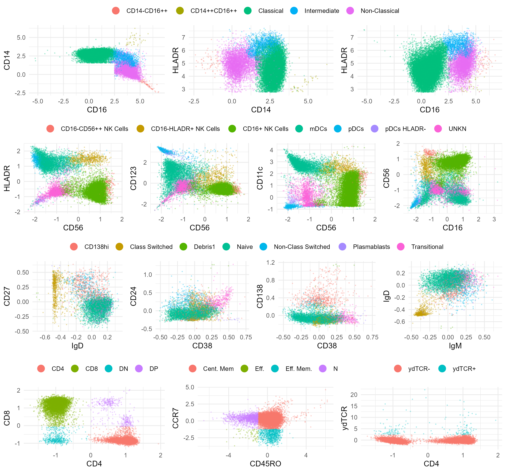
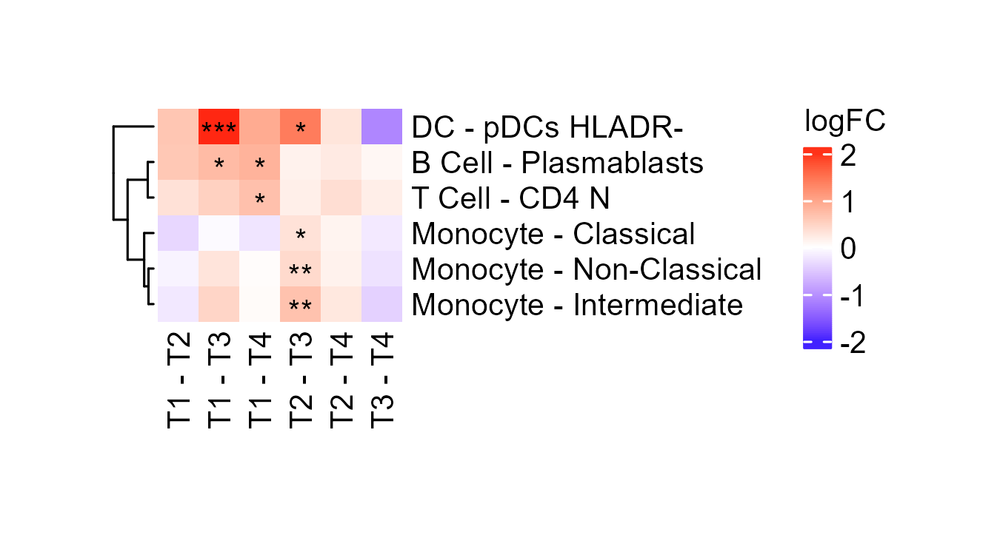

# Figure S7


### Representative Flow Cytometry Clusters

``` r
pacman::p_load(flowCore, SingleCellExperiment, flowStats,
               dplyr, tidyr, tibble, ggplot2, ggpubr, rasterpdf,
               edgeR, limma, ComplexHeatmap, circlize, grid, ragg,
               systemfonts)

dir.create("fig_s7_files", showWarnings = FALSE, recursive = TRUE)

#functions
gg_color_hue <- function(n) {
  hues = seq(15, 375, length = n + 1)
  hcl(h = hues, l = 65, c = 100)[1:n]
}

representative_flow_dir = here::here("data", "Flow", "representative clustering")
representative_flow_files = if (dir.exists(representative_flow_dir)) {
  list.files(representative_flow_dir, full.names = TRUE)
} else {
  character()
}
has_representative_flow = length(representative_flow_files) > 0

if (!has_representative_flow) {
  cat("Skipping representative Flow cytometry clusters: optional Flow data are not installed.\n")
}
```

``` r
for(i in seq_along(representative_flow_files)){
  load(representative_flow_files[i])
}
rep = list(mono=mono,dcnk=dcnk,bcell=bcell,tcell=tcell)
rm(mono,dcnk,bcell,tcell)


plot_flow = function(sce,x,y,ids,cluster_col='clust',assay = 'counts',title = 'Population'){
  keep = sce$sample_id%in%ids
  id = sce$sample_id[keep]
  cluster = sce@colData[keep,cluster_col]
  d = data.frame(t(SummarizedExperiment::assay(sce))[keep,c(x,y)],
                 population=cluster,
                 id=id)
  ggplot(d,aes_string(x=x,y=y,color="population"))+
    geom_point(cex=.2,alpha=.25)+
    guides(colour = guide_legend(override.aes = list(size=4,alpha=1),
                                 nrow = 1,
                                 title = title))+
    # facet_wrap(vars(id),nrow=1)+
    # stat_density_2d(aes(fill = ..level..), geom = "polygon",contour_var = 'ndensity') +
    # scale_fill_viridis_c(alpha = .25)+
    # geom_density_2d_filled(contour_var = "ndensity",adjust=2,alpha=.5)+
    # scale_fill_distiller(palette = "Blues", direction = 1) +
    theme_minimal(base_size = 10)+
    theme(legend.position="top")
}


sam = as.character(unique(rep$mono$sample_id))[1]

mono = list()
title = ''
mono[[1]] = plot_flow(sce = rep$mono,
                      x = 'CD16',
                      y = 'CD14',
                      ids = sam,
                      cluster_col = 'clust',
                      title = title)
mono[[2]] = plot_flow(sce = rep$mono,
                      x = 'CD14',
                      y = 'HLADR',
                      ids = sam,
                      cluster_col = 'clust',
                      title = title)
mono[[3]] = plot_flow(sce = rep$mono,
                      x = 'CD16',
                      y = 'HLADR',
                      ids = sam,
                      cluster_col = 'clust',
                      title = title)
mono = ggarrange(plotlist = mono,nrow = 1,common.legend = T)

dcnk = list()
title = ""
dcnk[[1]] = plot_flow(sce = rep$dcnk,
                      x="CD56",
                      y="HLADR",
                      ids = sam,
                      cluster_col = 'clust',
                      title = title)
dcnk[[2]] = plot_flow(sce = rep$dcnk,
                      x="CD56",
                      y="CD123",
                      ids = sam,
                      cluster_col = 'clust',
                      title = title)
dcnk[[3]] = plot_flow(sce = rep$dcnk,
                      x="CD56",
                      y="CD11c",
                      ids = sam,
                      cluster_col = 'clust',
                      title = title)
dcnk[[4]] = plot_flow(sce = rep$dcnk,
                      x="CD16",
                      y="CD56",
                      ids = sam,
                      cluster_col = 'clust',
                      title = title)
dcnk = ggarrange(plotlist = dcnk,nrow = 1,common.legend = T)


bcell = list()
title = ''
bcell[[1]] = plot_flow(sce = rep$bcell,
                       x="IgD",
                       y="CD27",
                       ids = sam,
                       cluster_col = 'clust',
                       title = title)
bcell[[2]] = plot_flow(sce = rep$bcell,
                       x="CD38",
                       y="CD24",
                       ids = sam,
                       cluster_col = 'clust',
                       title = title)
bcell[[3]] = plot_flow(sce = rep$bcell,
                       x="CD38",
                       y="CD138",
                       ids = sam,
                       cluster_col = 'clust',
                       title = title)
bcell[[4]] = plot_flow(sce = rep$bcell,
                       x="IgM",
                       y="IgD",
                       ids = sam,
                       cluster_col = 'clust',
                       title = title)
bcell = ggarrange(plotlist = bcell,nrow = 1,common.legend = T)

tcell = list()
title = ''
rep$tcell$clust = rep$tcell@metadata$clusters$main
tcell[[1]] = plot_flow(sce = rep$tcell,
                       x="CD4",
                       y="CD8",
                       ids = sam,
                       cluster_col = 'clust',
                       title = title)
# rep$tcell$clust = rep$tcell@metadata$clusters$mem
rep$tcell$clust = c("Cent. Mem","Eff. Mem.", "Naive", "Eff.")[match(rep$tcell@metadata$clusters$mem,unique(rep$tcell@metadata$clusters$mem))]
tcell[[2]] = plot_flow(sce = rep$tcell,
                       x="CD45RO",
                       y="CCR7",
                       ids = sam,
                       cluster_col = 'clust',
                       title = title)
rep$tcell$clust = rep$tcell@metadata$clusters$ydTCR
tcell[[3]] = plot_flow(sce = rep$tcell,
                       x="CD4",
                       y="ydTCR",
                       ids = sam,
                       cluster_col = 'clust',
                       title = title)
tcell = ggarrange(plotlist = tcell,nrow = 1,common.legend = F,legend = 'top')
p = ggarrange(mono,dcnk,bcell,tcell,ncol=1)

figureS7a <- here::here(
  "fig_s7_files",
  "figure_S07a_representative_flow_cytometry_clusters.png"
)

ggsave(
  figureS7a,
  p,
  device = ragg::agg_png,
  width = 9,
  height = 8.4,
  units = "in",
  dpi = 300,
  bg = "white"
)

knitr::include_graphics(figureS7a)
```



### Antibiotic-naive Pairwise Differential Abundance

``` r
options(stringsAsFactors = FALSE, bitmapType = "cairo")

if (!"Arial" %in% systemfonts::system_fonts()$family) {
  systemfonts::register_font(
    name = "Arial",
    plain = "C:/Windows/Fonts/arial.ttf",
    bold = "C:/Windows/Fonts/arial.ttf",
    italic = "C:/Windows/Fonts/arial.ttf",
    bolditalic = "C:/Windows/Fonts/arial.ttf"
  )
}
grDevices::pdfFonts(
  Arial = grDevices::Type1Font(
    "Arial",
    c(
      "ArialMT.afm",
      "ArialMT-Bold.afm",
      "ArialMT-Italic.afm",
      "ArialMT-BoldItalic.afm"
    )
  )
)

heatmap_font = "Arial"
heatmap_font_size = 10
heatmap_font_gp = grid::gpar(
  fontsize = heatmap_font_size,
  fontfamily = heatmap_font,
  fontface = "plain"
)

return_threshold_stars = function(x, threshold = 0.05) {
  x2 = x
  x2[is.numeric(x) & x >= threshold] = "ns"
  x2[is.numeric(x) & x < threshold] = "*"
  x2[is.numeric(x) & x < 0.01] = "**"
  x2[is.numeric(x) & x < 0.001] = "***"
  x2[is.numeric(x) & x < 0.0001] = "****"
  x2
}

# Adapted from diffcyt and the original "AB Naive Pairwise DA.png" source.
testDA_edgeR = function(counts, cluster_id, design, contrast,
                        trend_method = "none",
                        min_cells = 3, min_samples = NULL,
                        normalize = TRUE, norm_factors = "TMM") {
  if (is.null(min_samples)) {
    min_samples = ncol(counts) / 2
  }

  if (missing(cluster_id)) {
    cluster_id = rownames(counts)
  }

  cluster_id_all = cluster_id

  tf = counts >= min_cells
  ix_keep = apply(tf, 1, function(r) sum(r) >= min_samples)

  counts = counts[ix_keep, , drop = FALSE]
  cluster_id = cluster_id[ix_keep]

  if (normalize && norm_factors == "TMM") {
    norm_factors = edgeR::calcNormFactors(counts, method = "TMM")
  }

  if (normalize) {
    y = edgeR::DGEList(counts, norm.factors = norm_factors)
  } else {
    y = edgeR::DGEList(counts)
  }

  y = edgeR::estimateDisp(y, design, trend.method = trend_method)
  fit = edgeR::glmFit(y, design)

  res_list = vector("list", ncol(contrast))

  for (i in seq_len(ncol(contrast))) {
    lrt = edgeR::glmLRT(fit, contrast = contrast[, i])
    top = edgeR::topTags(lrt, n = Inf, adjust.method = "BH", sort.by = "none")
    row_data = top$table

    if (length(cluster_id) != length(cluster_id_all)) {
      missing_clusts = cluster_id_all[!cluster_id_all %in% cluster_id]
      missing = matrix(nrow = length(missing_clusts), ncol = ncol(row_data))
      rownames(missing) = missing_clusts
      colnames(missing) = colnames(row_data)
      row_data = rbind(row_data, missing)
      row_data = row_data[cluster_id_all, ]
    }

    res_list[[i]] = row_data
  }

  names(res_list) = colnames(contrast)

  log_fc_frame = do.call(cbind, lapply(res_list, function(x) x[, "logFC"]))
  colnames(log_fc_frame) = colnames(contrast)
  rownames(log_fc_frame) = cluster_id_all

  adjp_frame = do.call(cbind, lapply(res_list, function(x) x[, "FDR"]))
  colnames(adjp_frame) = colnames(contrast)
  rownames(adjp_frame) = cluster_id_all

  p_frame = do.call(cbind, lapply(res_list, function(x) x[, "PValue"]))
  colnames(p_frame) = colnames(contrast)
  rownames(p_frame) = cluster_id_all

  list(p.adjFrame = adjp_frame, pFrame = p_frame, logFCFrame = log_fc_frame)
}

is_35_em_subject = function(sample_data) {
  subject_id = tidyr::replace_na(as.character(sample_data$Subject_ID), "")
  sample = if ("sample" %in% names(sample_data)) {
    tidyr::replace_na(as.character(sample_data$sample), "")
  } else {
    tidyr::replace_na(rownames(sample_data), "")
  }
  em_site = if ("Site_s_of_EM" %in% names(sample_data)) {
    tidyr::replace_na(as.character(sample_data$Site_s_of_EM), "")
  } else {
    rep("", nrow(sample_data))
  }

  subject_id == "201455" |
    sample %in% c("201455 T1", "201455 T2") |
    grepl("35 EM", em_site, fixed = TRUE)
}

flow_env = new.env(parent = emptyenv())
load(here::here("data", "intermediate", "flow_gating", "bcell.RData"), envir = flow_env)
load(here::here("data", "intermediate", "flow_gating", "tcell.RData"), envir = flow_env)
load(here::here("data", "intermediate", "flow_gating", "monocyte.RData"), envir = flow_env)
load(here::here("data", "intermediate", "flow_gating", "dcnk.RData"), envir = flow_env)

flow_da = list()
flow_da$panelResults = list(
  bcell = flow_env$bcell,
  dcnk = flow_env$dcnk,
  monocyte = flow_env$monocyte,
  tcell = flow_env$tcell
)

flow_da$propsLong = do.call(rbind, lapply(flow_da$panelResults, function(x) x$propsLong))
flow_da$propsWide = flow_da$propsLong |>
  tidyr::pivot_wider(
    id_cols = id,
    names_from = cluster,
    values_from = freq
  ) |>
  tibble::column_to_rownames("id")

flow_da$panel = gsub("\\..*", "", rownames(flow_da$propsLong))[
  match(colnames(flow_da$propsWide), flow_da$propsLong$cluster)
]
flow_da$panel = c("T Cell", "B Cell", "DCNK", "Monocyte")[
  match(flow_da$panel, c("tcell", "bcell", "dcnk", "monocyte"))
]
flow_da$panel[9:11] = "NK"
flow_da$panel[12:15] = "DC"
flow_da$propsLong$cluster = gsub(" NK Cells", "", flow_da$propsLong$cluster)

flow_da$cluster = colnames(flow_da$propsWide)
colnames(flow_da$propsWide) = paste0(flow_da$panel, " - ", colnames(flow_da$propsWide))
colnames(flow_da$propsWide) = gsub("yd", "gd", colnames(flow_da$propsWide))
colnames(flow_da$propsWide) = gsub(" NK Cells", "", colnames(flow_da$propsWide))
flow_da$propsLong$cluster = gsub("yd", "gd", flow_da$propsLong$cluster)

all_panels = c("bcell", "dcnk", "monocyte", "tcell")
da_res = vector("list", length(all_panels))
names(da_res) = all_panels

excluded_35_em = lapply(all_panels, function(panel) {
  sample_data = flow_da$panelResults[[panel]]$sampleData
  sample_data[is_35_em_subject(sample_data), c("Subject_ID", "sample", "time"), drop = FALSE]
})
names(excluded_35_em) = all_panels

for (i in seq_along(all_panels)) {
  panel_name = all_panels[[i]]
  sample_data = flow_da$panelResults[[panel_name]]$sampleData

  keep = sample_data$Condition == "Patient" &
    sample_data$days_of_prior_antibiotics == 0 &
    !duplicated(sample_data$sample) &
    !is.na(sample_data$sample) &
    !is.na(sample_data$days_of_prior_antibiotics) &
    !is.na(sample_data$sample_id) &
    !is_35_em_subject(sample_data)

  counts = t(flow_da$panelResults[[panel_name]]$ncells)
  keep = keep &
    apply(counts, 2, function(x) sum(is.na(x)) < length(x)) &
    !is.na(keep)

  counts = counts[, keep]
  counts[is.na(counts)] = 0

  time = sample_data$time[keep]
  id = sample_data$Subject_ID[keep]
  design = model.matrix(~ 0 + time + id)
  contrast = limma::makeContrasts(
    timeT1 - timeT2,
    timeT1 - timeT3,
    timeT1 - timeT4,
    timeT2 - timeT3,
    timeT2 - timeT4,
    timeT3 - timeT4,
    levels = design
  )

  da_res[[i]] = testDA_edgeR(
    counts,
    design = design,
    contrast = contrast,
    min_cells = 3
  )
}

p_fdr_all = do.call(rbind, lapply(da_res, function(x) x[["p.adjFrame"]]))
p_nominal_all = do.call(rbind, lapply(da_res, function(x) x[["pFrame"]]))
d_all = do.call(rbind, lapply(da_res, function(x) x[["logFCFrame"]]))

d_all = na.omit(d_all)
d_all = d_all[!grepl("Dump|Debris|DP |DN ", rownames(d_all)), , drop = FALSE]
p_fdr_all = p_fdr_all[rownames(d_all), , drop = FALSE]
p_nominal_all = p_nominal_all[rownames(d_all), , drop = FALSE]

prepare_heatmap_values = function(log_fc, p_values, threshold = 0.05) {
  keep_rows = apply(p_values, 1, function(x) any(x < threshold, na.rm = TRUE))
  log_fc = log_fc[keep_rows, , drop = FALSE]
  p_values = p_values[keep_rows, , drop = FALSE]

  if (nrow(log_fc) < 2) {
    stop("Fewer than two significant populations remained after BH filtering.")
  }

  colnames(log_fc) = gsub("time", "", colnames(log_fc))
  rownames(log_fc) = paste0(
    flow_da$panel[match(rownames(log_fc), flow_da$cluster)],
    " - ",
    rownames(log_fc)
  )

  colnames(p_values) = gsub("time", "", colnames(p_values))
  rownames(p_values) = rownames(log_fc)

  list(logFC = log_fc, p_values = p_values)
}

fdr_heatmap = prepare_heatmap_values(d_all, p_fdr_all)
fdr_075_heatmap = prepare_heatmap_values(d_all, p_fdr_all, threshold = 0.075)
fdr_10_heatmap = prepare_heatmap_values(d_all, p_fdr_all, threshold = 0.1)
nominal_heatmap = prepare_heatmap_values(d_all, p_nominal_all)
col_fun = circlize::colorRamp2(c(-2.15, 0, 2.15), c("blue", "white", "red"))

make_cell_fun = function(p_values, threshold = 0.05) {
  force(p_values)
  force(threshold)
  function(j, i, x, y, width, height, fill) {
    txt = return_threshold_stars(p_values[i, j], threshold = threshold)
    if (is.na(txt) || txt == "ns") txt = ""
    grid::grid.text(txt, x, y, gp = heatmap_font_gp, vjust = 0.8)
  }
}

output_file = file.path("fig_s7_files", "figure_S07b_abx_naive_flow_differential_abundance_no35em.png")
dir.create(dirname(output_file), recursive = TRUE, showWarnings = FALSE)
dir.create(file.path("data", "intermediate", "flow_gating"), recursive = TRUE, showWarnings = FALSE)

ragg::agg_png(
  output_file,
  width = 4.5,
  height = 2.5,
  units = "in",
  res = 300,
  background = "white"
)

log_fc = fdr_heatmap$logFC
p_values = fdr_heatmap$p_values
hc1 = hclust(dist(log_fc), method = "ward.D2")

hm = ComplexHeatmap::Heatmap(
  matrix = log_fc,
  cluster_columns = FALSE,
  cell_fun = make_cell_fun(p_values),
  col = col_fun,
  cluster_rows = hc1,
  name = "logFC",
  width = grid::unit(1.1, "in"),
  height = grid::unit(max(0.95, nrow(log_fc) * 0.16), "in"),
  row_dend_width = grid::unit(0.18, "in"),
  column_names_rot = 90,
  row_names_gp = heatmap_font_gp,
  column_names_gp = heatmap_font_gp,
  heatmap_legend_param = list(
    title = "logFC",
    direction = "vertical",
    legend_height = grid::unit(0.9, "in"),
    labels_gp = heatmap_font_gp,
    grid_height = grid::unit(0.12, "in"),
    grid_width = grid::unit(0.12, "in"),
    title_gp = heatmap_font_gp
  )
)

ComplexHeatmap::draw(
  hm,
  padding = grid::unit(c(1, 1, 1, 1), "mm"),
  heatmap_legend_side = "right"
)
dev.off()
```

    png 
      2 

``` r
saveRDS(
  list(
    logFC = fdr_heatmap$logFC,
    p_adj = fdr_heatmap$p_values,
    p_nominal = nominal_heatmap$p_values,
    logFC_fdr_heatmap = fdr_heatmap$logFC,
    logFC_fdr_075_heatmap = fdr_075_heatmap$logFC,
    logFC_fdr_10_heatmap = fdr_10_heatmap$logFC,
    logFC_nominal_heatmap = nominal_heatmap$logFC,
    p_adj_fdr_075 = fdr_075_heatmap$p_values,
    p_adj_fdr_10 = fdr_10_heatmap$p_values,
    p_adj_all = p_fdr_all,
    p_nominal_all = p_nominal_all,
    logFC_all = d_all,
    da_results = da_res,
    excluded_35_em = excluded_35_em
  ),
  file.path("data", "intermediate", "flow_gating", "ab_naive_pairwise_da_no35em.rds")
)

knitr::include_graphics(output_file)
```



``` r
sessionInfo()
```

    R version 4.4.1 (2024-06-14 ucrt)
    Platform: x86_64-w64-mingw32/x64
    Running under: Windows 11 x64 (build 22631)

    Matrix products: default


    locale:
    [1] LC_COLLATE=English_United States.utf8 
    [2] LC_CTYPE=English_United States.utf8   
    [3] LC_MONETARY=English_United States.utf8
    [4] LC_NUMERIC=C                          
    [5] LC_TIME=English_United States.utf8    

    time zone: America/Los_Angeles
    tzcode source: internal

    attached base packages:
    [1] grid      stats4    stats     graphics  grDevices utils     datasets 
    [8] methods   base     

    other attached packages:
     [1] systemfonts_1.1.0           ragg_1.3.2                 
     [3] circlize_0.4.16             ComplexHeatmap_2.20.0      
     [5] edgeR_4.2.2                 limma_3.60.4               
     [7] rasterpdf_0.1.1             ggpubr_0.6.0               
     [9] ggplot2_4.0.0               tibble_3.2.1               
    [11] tidyr_1.3.1                 dplyr_1.1.4                
    [13] flowStats_4.16.0            SingleCellExperiment_1.26.0
    [15] SummarizedExperiment_1.34.0 Biobase_2.64.0             
    [17] GenomicRanges_1.56.1        GenomeInfoDb_1.40.1        
    [19] IRanges_2.38.1              S4Vectors_0.42.1           
    [21] BiocGenerics_0.50.0         MatrixGenerics_1.16.0      
    [23] matrixStats_1.4.1           flowCore_2.16.0            

    loaded via a namespace (and not attached):
      [1] RColorBrewer_1.1-3      jsonlite_1.8.9          shape_1.4.6.1          
      [4] magrittr_2.0.3          magick_2.8.4            rainbow_3.8            
      [7] farver_2.1.2            rmarkdown_2.29          GlobalOptions_0.1.2    
     [10] zlibbioc_1.50.0         vctrs_0.6.5             RCurl_1.98-1.16        
     [13] rstatix_0.7.2           htmltools_0.5.8.1       S4Arrays_1.4.1         
     [16] broom_1.0.6             deSolve_1.40            SparseArray_1.4.8      
     [19] hdrcde_3.4              pracma_2.4.4            KernSmooth_2.23-24     
     [22] lifecycle_1.0.4         iterators_1.0.14        pkgconfig_2.0.3        
     [25] Matrix_1.7-0            R6_2.5.1                fastmap_1.2.0          
     [28] GenomeInfoDbData_1.2.12 clue_0.3-65             digest_0.6.37          
     [31] colorspace_2.1-1        rprojroot_2.0.4         textshaping_0.4.0      
     [34] labeling_0.4.3          cytolib_2.16.0          httr_1.4.7             
     [37] abind_1.4-5             compiler_4.4.1          here_1.0.1             
     [40] withr_3.0.2             doParallel_1.0.17       S7_0.2.0               
     [43] backports_1.5.0         carData_3.0-5           hexbin_1.28.5          
     [46] ggsignif_0.6.4          MASS_7.3-60.2           DelayedArray_0.30.1    
     [49] rjson_0.2.23            corpcor_1.6.10          tools_4.4.1            
     [52] rrcov_1.7-7             glue_1.8.0              IDPmisc_1.1.21         
     [55] cluster_2.1.6           generics_0.1.3          gtable_0.3.6           
     [58] fda_6.3.0               data.table_1.15.4       car_3.1-2              
     [61] XVector_0.44.0          foreach_1.5.2           pillar_1.10.1          
     [64] robustbase_0.99-4-1     splines_4.4.1           lattice_0.22-6         
     [67] deldir_2.0-4            ks_1.14.3               RProtoBufLib_2.16.0    
     [70] tidyselect_1.2.1        locfit_1.5-9.10         fds_1.8                
     [73] knitr_1.49              gridExtra_2.3           flowWorkspace_4.16.0   
     [76] xfun_0.48               statmod_1.5.0           DEoptimR_1.1-3-1       
     [79] UCSC.utils_1.0.0        ncdfFlow_2.50.0         yaml_2.3.10            
     [82] pacman_0.5.1            evaluate_1.0.1          codetools_0.2-20       
     [85] interp_1.1-6            Rgraphviz_2.48.0        graph_1.82.0           
     [88] cli_3.6.3               flowViz_1.68.0          Rcpp_1.0.13            
     [91] png_0.1-8               XML_3.99-0.17           parallel_4.4.1         
     [94] mclust_6.1.1            latticeExtra_0.6-30     jpeg_0.1-10            
     [97] bitops_1.0-8            mvtnorm_1.2-6           scales_1.4.0           
    [100] pcaPP_2.0-5             purrr_1.0.2             crayon_1.5.3           
    [103] GetoptLong_1.0.5        rlang_1.1.4             cowplot_1.1.3          
    [106] mnormt_2.1.1           
