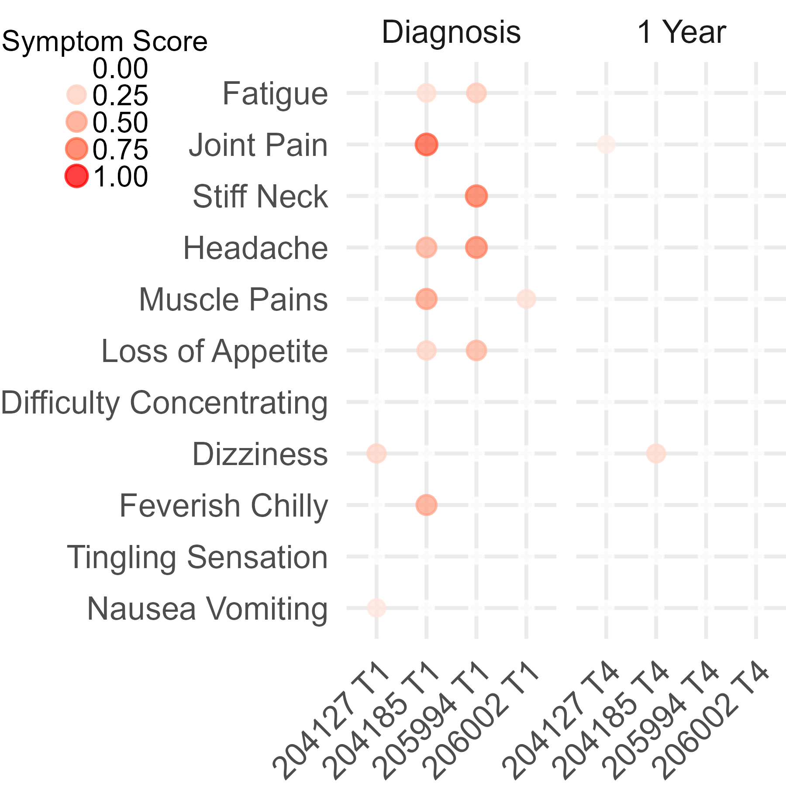
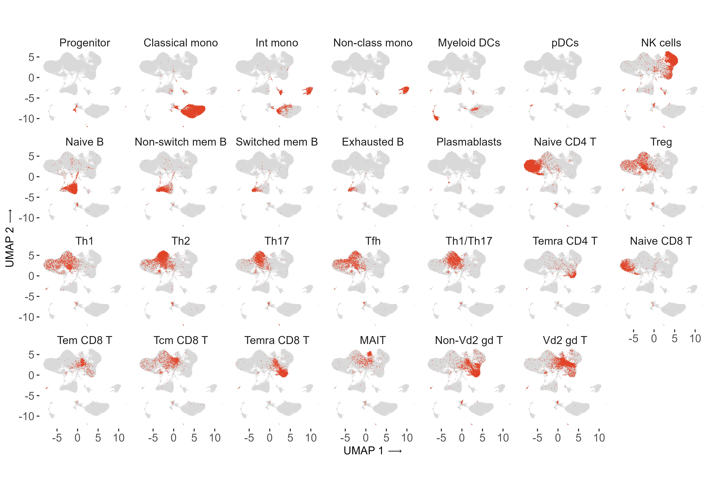
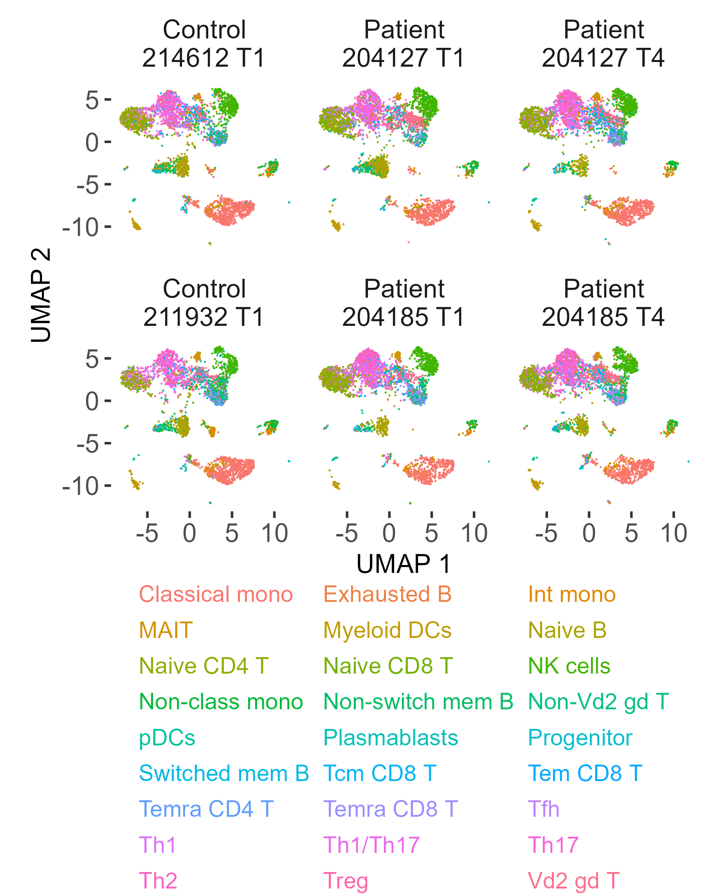

# Figure S8


### Panel S8A: Symptom Plot

``` r
load(here::here("data", "raw", "01_proteomics_metabolomics", "OlinkPreprocessed.RData"))

## ---------------------------
## 1. Subset samples
## ---------------------------
sams <- data$sampleData$time %in% c("T1","T3","T4") &
        data$sampleData$days_of_prior_antibiotics == 0 &
        data$sampleData$Condition == "Patient"

direct <- data$directSymptoms[sams, , drop = FALSE]
time <- data$sampleData[sams, "time"]

## ---------------------------
## 2. Clean symptom matrix
## ---------------------------
d <- direct
colnames(d)[grep("Difficult", colnames(d))] <- "Difficulty Concentrating"
colnames(d) <- gsub("\\.", " ", colnames(d))

d <- d / 7.6
d <- d[order(time), , drop = FALSE]
time <- sort(time)

rn <- rownames(d)

d <- split(as.data.frame(d), time)
d <- lapply(d, function(x) {
  x$`Avg. Symptom Score` <- rowMeans(x, na.rm = TRUE)
  x
})

d2 <- as.data.frame(do.call(rbind, d))
rownames(d2) <- rn
d2[is.na(d2)] <- 0

## ---------------------------
## 3. Ordering (rows / cols)
## ---------------------------
hc1 <- rownames(d2)[time == "T1"][hclust(dist(d2[time == "T1", ]))$order]

hc3 <- na.omit(
  rownames(d2)[time == "T3"][
    match(gsub(" T.*","", hc1),
          gsub(" T.*","", rownames(d2)[time == "T3"]))
  ]
)

hc4 <- na.omit(
  rownames(d2)[time == "T4"][
    match(gsub(" T.*","", hc1),
          gsub(" T.*","", rownames(d2)[time == "T4"]))
  ]
)

hc1 <- c(hc1, hc3, hc4)

symptom_levels <- c(
  "Fatigue",
  "Joint Pain",
  "Stiff Neck",
  "Headache",
  "Muscle Pains",
  "Loss of Appetite",
  "Difficulty Concentrating",
  "Dizziness",
  "Feverish Chilly",
  "Tingling Sensation",
  "Nausea Vomiting"
)

## ---------------------------
## 4. Long format + factors
## ---------------------------
d2_long <- data.frame(
  id = rownames(d2),
  time = c("Diagnosis","6 Months","1 Year")[match(time, unique(time))],
  dplyr::select(d2, -`Avg. Symptom Score`),
  check.names = FALSE
) %>%
  pivot_longer(cols = 3:ncol(.), values_to = "Symptom Score")

d2_long$name <- gsub("\\.([A-Z])", " \\1", d2_long$name)
d2_long$name[d2_long$name == "Tingling Abnormal Sensation"] <- "Tingling Sensation"

d2_long <- d2_long |>
  filter(name %in% symptom_levels)

d2_long$id <- factor(d2_long$id, levels = hc1, ordered = TRUE)
d2_long$name <- factor(
  d2_long$name,
  levels = rev(symptom_levels),
  ordered = TRUE
)
d2_long$time <- factor(
  d2_long$time,
  levels = c("Diagnosis","6 Months","1 Year"),
  ordered = TRUE
)

## ---------------------------
## 5. Join with sc_sampleData
## ---------------------------

sc_sampleData <- readr::read_csv(
  here::here("data", "metadata", "sc_sampleData.csv"),
  show_col_types = FALSE
)

sc_sampleData <- sc_sampleData |>
  mutate(
        sample = sample |>
          str_replace_all("^L", "") |>
          str_replace_all("_", " ") |>
          str_squish()
      ) |> 
  select(-time)

pdat <- d2_long |>
  rename(sample = id) |>
  inner_join(
    sc_sampleData,
    by = "sample"
  )

stopifnot(nrow(pdat) > 0)

## ---------------------------
## 6. Plot
## ---------------------------

symptom_plot <- pdat |> 
  ggplot(
    aes(
      x = sample,
      y = name,
      size = `Symptom Score`,
      colour = `Symptom Score`
    )
  ) +
    geom_point(alpha = 0.75) +
    scale_color_gradient(low = "white", high = "red", limits = c(0,1), breaks=seq(0, 1, by=0.25)) +
  guides(
    color = guide_legend(
      theme = theme(
        legend.title.position = "top",
        legend.title = element_text(hjust = 0.5)
      )
    ),
    size = guide_legend(
      theme = theme(
        legend.title.position = "top",
        legend.title = element_text(hjust = 0.5)
      )
    )
  ) +
    scale_size_continuous(range = c(1.5,2.5),limits = c(0,1), breaks=seq(0, 1, by=0.25))+
    facet_wrap(vars(time), nrow = 1, scales = "free_x") +
    theme(
      axis.text.x = element_text(angle = 45, hjust = 1),
            # axis.text.x = element_blank(),
        # axis.text.y = element_text(size = 7),
      axis.title = element_blank(),
      legend.position = c(-0.55,0.92),
      # legend.position = "bottom",
      # legend.location = "plot",
      # legend.justification = "center",
      # legend.box.just = "center",
      legend.margin = margin(0, 0, 0, 0),
      legend.title = element_text(margin = margin(0, 0, 0, 0), size = 8, hjust = 0.5),
      legend.text = element_text(margin = margin(0, 0, 0, 0), size = 8),
      # legend.spacing.x = unit(0, "mm"),
      legend.key.width = unit(3, "mm"),
      legend.key.height =  unit(0, "mm"),
      # legend.key.spacing.x = unit(2, "mm"),
      legend.key.spacing.y = unit(0, "mm"),
      # legend.background = element_rect(fill = "grey85", color = NA),
      plot.margin = margin(0, 0, 0, 0))

figureS8a <- here::here(
  "fig_s8_files",
  "figure_S08a_pbmc_symptom_scores.png"
)

ggsave(
  figureS8a,
  symptom_plot,
  device = ragg::agg_png,
  width = 3,
  height = 3,
  units = "in",
  dpi = 600
)

knitr::include_graphics(figureS8a)
```



### Panel S8C: PBMC Small-multiples Cell-type UMAP

``` r
umap_embeddings <- Seurat::Embeddings(res_0.9, "umap") |>
  as_tibble(rownames = "cell") |>
  setNames(c("cell", "umap_1", "umap_2"))

fine_multiple_df <- res_0.9@meta.data |>
  tibble::rownames_to_column("cell") |>
  dplyr::select(cell, cell_type_fine) |>
  left_join(umap_embeddings, by = "cell") |>
  filter(!is.na(cell_type_fine), cell_type_fine != "LD basophils")

facet_levels <- setdiff(levels(fine_multiple_df$cell_type_fine), "LD basophils")

fine_multiple_background <- fine_multiple_df |>
  dplyr::select(cell, umap_1, umap_2) |>
  tidyr::crossing(
    facet_cell_type = factor(facet_levels, levels = facet_levels)
  )

fine_multiple_highlight <- fine_multiple_df |>
  mutate(facet_cell_type = factor(cell_type_fine, levels = facet_levels))

fine_multiple <- ggplot() +
  geom_point(
    data = fine_multiple_background,
    aes(x = umap_2, y = umap_1),
    size = 0.2,
    stroke = 0,
    shape = 19,
    color = "grey85"
  ) +
  geom_point(
    data = fine_multiple_highlight,
    aes(x = umap_2, y = umap_1),
    size = 0.2,
    stroke = 0,
    shape = 19,
    color = "#e14327"
  ) +
  facet_wrap(~ facet_cell_type, ncol = 7) + 
  coord_equal() +
  ggthemes::theme_tufte(base_size = 8, base_family = "Arial") + 
  xlab("UMAP 1 \u27f6") +
  ylab(expression("UMAP 2 \u27f6")) +
  umap_arial_text_min_8 +
  theme(
    legend.position = "none",
    strip.clip = "off",
    strip.text = element_text(
      family = "Arial",
      margin = margin(0, 0, 0, 0),
      size = 8
    )
  )

figureS8c <- here::here(
  "fig_s8_files",
  "figure_S08c_pbmc_cell_type_umap_small_multiples.png"
)

ggsave(
  figureS8c,
  fine_multiple,
  height = 5,
  width = 7.2,
  units = "in",
  dpi = 600,
  device = "png",
  bg = "white"
)

knitr::include_graphics(figureS8c)
```



### Panel S8B: PBMC UMAP by Condition and Time

``` r
FigS8B_df <- res_0.9@meta.data |> 
  base::cbind(res_0.9@reductions$umap@cell.embeddings)

table(FigS8B_df$Condition, FigS8B_df$patient)
```

             
              204127 204185 205994 206002 211932 214612 218247 219519
      Control      0      0      0      0   5403   5026   6352   5789
      Patient   8511  10309     85    413      0      0      0      0

``` r
table(FigS8B_df$time, FigS8B_df$patient)
```

        
         204127 204185 205994 206002 211932 214612 218247 219519
      T1   4610   4571     85    233   5403   5026   6352   5789
      T4   3901   5738      0    180      0      0      0      0

``` r
table(FigS8B_df$time, FigS8B_df$Condition)
```

        
         Control Patient
      T1   22570    9499
      T4       0    9819

``` r
# Time and patient----

set.seed(111)

fig_s8b_cell_type_levels <- c(
  "Classical mono",
  "Exhausted B",
  "Int mono",
  "MAIT",
  "Myeloid DCs",
  "Naive B",
  "Naive CD4 T",
  "Naive CD8 T",
  "NK cells",
  "Non-class mono",
  "Non-switch mem B",
  "Non-Vd2 gd T",
  "pDCs",
  "Plasmablasts",
  "Progenitor",
  "Switched mem B",
  "Tcm CD8 T",
  "Tem CD8 T",
  "Temra CD4 T",
  "Temra CD8 T",
  "Tfh",
  "Th1",
  "Th1/Th17",
  "Th17",
  "Th2",
  "Treg",
  "Vd2 gd T"
)

fig_s8b_cell_type_colors <- scales::hue_pal()(length(fig_s8b_cell_type_levels)) |>
  setNames(fig_s8b_cell_type_levels)

fig_s8b_cell_type_color_labels <- sprintf(
  "<span style='color:%s'>%s</span>",
  fig_s8b_cell_type_colors,
  names(fig_s8b_cell_type_colors)
) |>
  setNames(names(fig_s8b_cell_type_colors))

condition_patient_time_levels <- c(
  "Control_214612_T1",
  "Patient_204127_T1",
  "Patient_204127_T4",
  "Control_211932_T1",
  "Patient_204185_T1",
  "Patient_204185_T4"
)

condition_patient_time_labels <- str_replace_all(
  condition_patient_time_levels,
  "_",
  " "
) |>
  str_replace("^(Control|Patient) ", "\\1\n")

set.seed(111)

FigS8B_df <- res_0.9@meta.data |>
  base::cbind(res_0.9@reductions$umap@cell.embeddings) |>
  filter(Condition == "Patient" | sample %in% c("L211932_T1", "L214612_T1")) |>
  unite(col = "condition_patient_time", c(Condition, Subject_ID, time), remove = FALSE) |>
  mutate(
    condition_patient_time = factor(
      condition_patient_time,
      levels = condition_patient_time_levels
    )
  ) |>
  filter(cell_type_fine %in% fig_s8b_cell_type_levels, !is.na(condition_patient_time)) |>
  mutate(cell_type_fine = factor(cell_type_fine, levels = fig_s8b_cell_type_levels))

fig_s8b_target_n <- FigS8B_df |>
  count(condition_patient_time) |>
  pull(n) |>
  min()

FigS8B_df <- FigS8B_df |>
  group_by(condition_patient_time) |>
  slice_sample(n = fig_s8b_target_n) |>
  ungroup() |>
  mutate(
    condition_patient_time = factor(
      str_replace_all(as.character(condition_patient_time), "_", " ") |>
        str_replace("^(Control|Patient) ", "\\1\n"),
      levels = condition_patient_time_labels
    )
  )

fig_s8b <- ggplot(FigS8B_df, aes(umap_2, umap_1, color = cell_type_fine)) +
  geom_point(size = 0.3, stroke = 0, shape = 19, key_glyph = ggplot2::draw_key_blank) +
  facet_wrap(~ condition_patient_time, nrow = 2) +
  coord_equal() +
  scale_color_manual(
    values = fig_s8b_cell_type_colors,
    breaks = fig_s8b_cell_type_levels,
    labels = fig_s8b_cell_type_color_labels
  ) +
  ggthemes::theme_tufte(base_size = 8, base_family = "Arial") +
  xlab("UMAP 1") +
  ylab("UMAP 2") +
  guides(
    color = guide_legend(
      title = NULL,
      ncol = 3,
      byrow = TRUE,
      keywidth = unit(0, "pt"),
      keyheight = unit(7, "pt"),
      override.aes = list(size = 0, alpha = 0)
    )
  ) +
  umap_arial_text_min_8 +
  theme(
    legend.position = "bottom",
    legend.location = "panel",
    legend.direction = "horizontal",
    legend.box = "horizontal",
    legend.title = element_blank(),
    legend.text = ggtext::element_markdown(
      family = "Arial",
      size = 7,
      margin = margin(0, 0, 0, 0)
    ),
    legend.key = element_blank(),
    legend.key.width = unit(0, "pt"),
    legend.key.height = unit(7, "pt"),
    legend.spacing.x = unit(3, "pt"),
    legend.spacing.y = unit(0, "pt"),
    legend.margin = margin(t = 2, r = 0, b = 0, l = 0),
    legend.box.margin = margin(0, 0, 0, 0),
    legend.box.spacing = unit(0, "pt"),
    plot.margin = margin(2, 2, 0, 2)
  )

figureS8b <- here::here(
  "fig_s8_files",
  "figure_S08b_pbmc_umap_condition_time.png"
)

ggsave(
  figureS8b,
  fig_s8b,
  height = 3.8,
  width = 3.1,
  units = "in",
  dpi = 600,
  device = ragg::agg_png,
  bg = "white"
)

knitr::include_graphics(figureS8b)
```



``` r
sessionInfo()
```

    R version 4.4.1 (2024-06-14 ucrt)
    Platform: x86_64-w64-mingw32/x64
    Running under: Windows 11 x64 (build 22631)

    Matrix products: default


    locale:
    [1] LC_COLLATE=English_United States.utf8 
    [2] LC_CTYPE=English_United States.utf8   
    [3] LC_MONETARY=English_United States.utf8
    [4] LC_NUMERIC=C                          
    [5] LC_TIME=English_United States.utf8    

    time zone: America/Los_Angeles
    tzcode source: internal

    attached base packages:
    [1] grid      stats     graphics  grDevices utils     datasets  methods  
    [8] base     

    other attached packages:
     [1] Seurat_5.3.0           SeuratObject_5.0.2     sp_2.1-4              
     [4] ggpubr_0.6.0           mice_3.17.0            ggraph_2.2.2          
     [7] Hmisc_5.1-3            clusterProfiler_4.12.6 ComplexHeatmap_2.20.0 
    [10] limma_3.60.4           conflicted_1.2.0       patchwork_1.3.0       
    [13] here_1.0.1             readxl_1.4.3           lubridate_1.9.3       
    [16] forcats_1.0.0          stringr_1.5.1          dplyr_1.1.4           
    [19] purrr_1.0.2            readr_2.1.5            tidyr_1.3.1           
    [22] tibble_3.2.1           ggplot2_4.0.0          tidyverse_2.0.0       

    loaded via a namespace (and not attached):
      [1] ggtext_0.1.2            spatstat.sparse_3.1-0   fs_1.6.6               
      [4] matrixStats_1.4.1       enrichplot_1.24.4       httr_1.4.7             
      [7] RColorBrewer_1.1-3      doParallel_1.0.17       sctransform_0.4.1      
     [10] tools_4.4.1             backports_1.5.0         R6_2.5.1               
     [13] uwot_0.2.2              lazyeval_0.2.2          jomo_2.7-6             
     [16] GetoptLong_1.0.5        withr_3.0.2             gridExtra_2.3          
     [19] progressr_0.14.0        textshaping_0.4.0       cli_3.6.3              
     [22] Biobase_2.64.0          spatstat.explore_3.3-2  fastDummies_1.7.4      
     [25] scatterpie_0.2.4        labeling_0.4.3          spatstat.data_3.1-2    
     [28] S7_0.2.0                pbapply_1.7-2           ggridges_0.5.6         
     [31] commonmark_1.9.1        systemfonts_1.1.0       yulab.utils_0.1.7      
     [34] gson_0.1.0              foreign_0.8-86          DOSE_3.30.5            
     [37] R.utils_2.12.3          parallelly_1.38.0       rstudioapi_0.16.0      
     [40] RSQLite_2.3.7           generics_0.1.3          gridGraphics_0.5-1     
     [43] shape_1.4.6.1           vroom_1.6.5             spatstat.random_3.3-2  
     [46] ica_1.0-3               car_3.1-2               GO.db_3.19.1           
     [49] Matrix_1.7-0            S4Vectors_0.42.1        abind_1.4-5            
     [52] R.methodsS3_1.8.2       lifecycle_1.0.4         yaml_2.3.10            
     [55] carData_3.0-5           qvalue_2.36.0           Rtsne_0.17             
     [58] blob_1.2.4              promises_1.3.0          crayon_1.5.3           
     [61] mitml_0.4-5             miniUI_0.1.1.1          lattice_0.22-6         
     [64] cowplot_1.1.3           KEGGREST_1.44.1         pillar_1.10.1          
     [67] knitr_1.49              fgsea_1.30.0            rjson_0.2.23           
     [70] boot_1.3-30             future.apply_1.11.2     codetools_0.2-20       
     [73] fastmatch_1.1-4         pan_1.9                 glue_1.8.0             
     [76] spatstat.univar_3.0-1   ggfun_0.1.6             data.table_1.15.4      
     [79] vctrs_0.6.5             png_0.1-8               treeio_1.28.0          
     [82] spam_2.10-0             Rdpack_2.6.4            cellranger_1.1.0       
     [85] gtable_0.3.6            cachem_1.1.0            xfun_0.48              
     [88] mime_0.12               rbibutils_2.3           tidygraph_1.3.1        
     [91] reformulas_0.4.3.1      survival_3.6-4          iterators_1.0.14       
     [94] statmod_1.5.0           fitdistrplus_1.2-1      ROCR_1.0-11            
     [97] nlme_3.1-164            ggtree_3.12.0           bit64_4.0.5            
    [100] RcppAnnoy_0.0.22        GenomeInfoDb_1.40.1     rprojroot_2.0.4        
    [103] irlba_2.3.5.1           KernSmooth_2.23-24      rpart_4.1.23           
    [106] colorspace_2.1-1        BiocGenerics_0.50.0     DBI_1.2.3              
    [109] nnet_7.3-19             tidyselect_1.2.1        bit_4.0.5              
    [112] compiler_4.4.1          glmnet_4.1-10           httr2_1.0.5            
    [115] htmlTable_2.4.3         xml2_1.3.6              plotly_4.11.0          
    [118] shadowtext_0.1.4        checkmate_2.3.2         scales_1.4.0           
    [121] lmtest_0.9-40           rappdirs_0.3.3          goftest_1.2-3          
    [124] digest_0.6.37           spatstat.utils_3.1-0    minqa_1.2.8            
    [127] rmarkdown_2.29          XVector_0.44.0          htmltools_0.5.8.1      
    [130] pkgconfig_2.0.3         base64enc_0.1-3         lme4_2.0-1             
    [133] fastmap_1.2.0           ggthemes_5.1.0          rlang_1.1.4            
    [136] GlobalOptions_0.1.2     htmlwidgets_1.6.4       UCSC.utils_1.0.0       
    [139] shiny_1.9.1             farver_2.1.2            zoo_1.8-12             
    [142] jsonlite_1.8.9          BiocParallel_1.38.0     GOSemSim_2.30.2        
    [145] R.oo_1.27.0             magrittr_2.0.3          Formula_1.2-5          
    [148] GenomeInfoDbData_1.2.12 ggplotify_0.1.2         dotCall64_1.1-1        
    [151] Rcpp_1.0.13             reticulate_1.38.0       ape_5.8                
    [154] viridis_0.6.5           stringi_1.8.4           zlibbioc_1.50.0        
    [157] MASS_7.3-60.2           plyr_1.8.9              parallel_4.4.1         
    [160] listenv_0.9.1           ggrepel_0.9.5           deldir_2.0-4           
    [163] Biostrings_2.72.1       graphlayouts_1.1.1      splines_4.4.1          
    [166] gridtext_0.1.5          tensor_1.5              hms_1.1.3              
    [169] circlize_0.4.16         igraph_2.0.3            spatstat.geom_3.3-3    
    [172] markdown_1.13           ggsignif_0.6.4          RcppHNSW_0.6.0         
    [175] reshape2_1.4.4          stats4_4.4.1            evaluate_1.0.1         
    [178] nloptr_2.1.1            tzdb_0.4.0              foreach_1.5.2          
    [181] tweenr_2.0.3            httpuv_1.6.15           RANN_2.6.2             
    [184] polyclip_1.10-7         scattermore_1.2         future_1.34.0          
    [187] clue_0.3-65             ggforce_0.4.2           xtable_1.8-4           
    [190] broom_1.0.6             RSpectra_0.16-2         tidytree_0.4.6         
    [193] rstatix_0.7.2           later_1.3.2             ragg_1.3.2             
    [196] viridisLite_0.4.2       aplot_0.2.3             memoise_2.0.1          
    [199] AnnotationDbi_1.66.0    IRanges_2.38.1          cluster_2.1.6          
    [202] timechange_0.3.0        globals_0.16.3         
