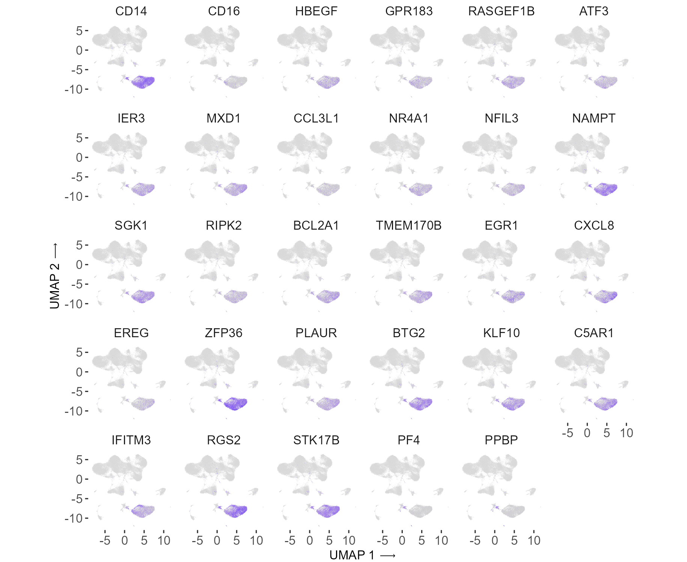
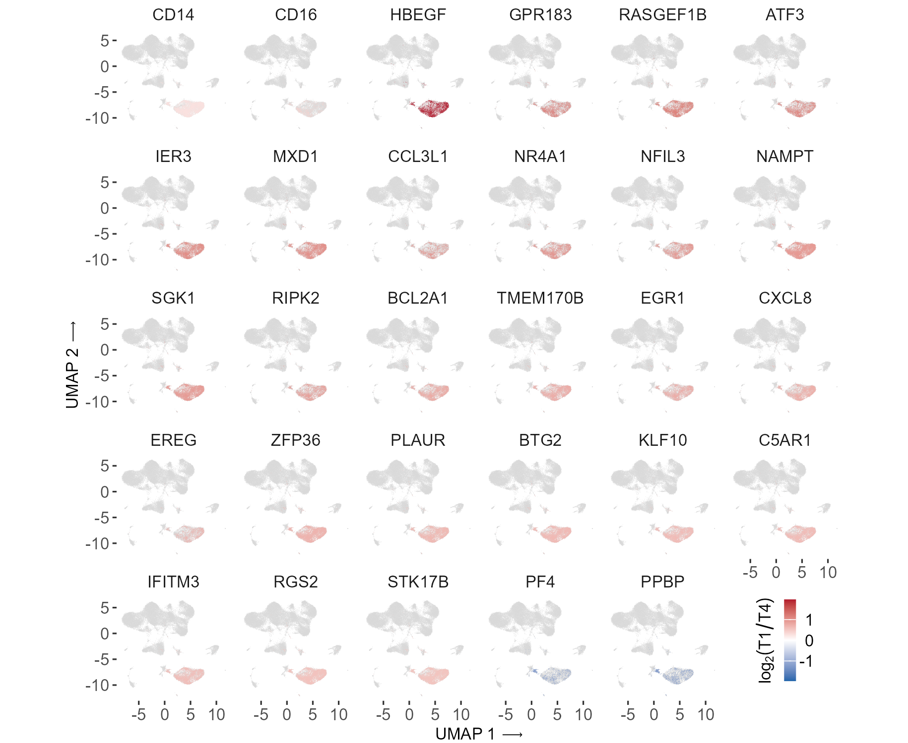

# Figure S9


### Panel S9A: Classical Monocyte Gene Expression UMAP

``` r
res_0.9 <- readRDS(
  here::here(
    "data", "processed", "02_internal_pbmc_scrna",
    "seurat.integrated2_monaco_umap_res0.9.rds"
  )
)

# Classical Monocytes with gene list ----
DefaultAssay(res_0.9) = 'originalexp'

# subset to classical monocytes
Idents(res_0.9) <- res_0.9$cell_type_fine
classical_monocytes <- subset(res_0.9, idents = "Classical mono")

plot_genes <- c("CD14", "FCGR3A", "HBEGF", "GPR183", "RASGEF1B", "ATF3", "IER3", "MXD1", "CCL3L1", "NR4A1", "NFIL3", "NAMPT", "SGK1", "RIPK2", "BCL2A1", "TMEM170B", "EGR1", "CXCL8", "EREG", "ZFP36", "PLAUR", "BTG2", "KLF10", "C5AR1", "IFITM3", "RGS2", "STK17B", "PF4", "PPBP")

annot <- AnnotationDbi::select(
      org.Hs.eg.db::org.Hs.eg.db, # the database
      keys = plot_genes, # which genes to look up in the database
      keytype = "SYMBOL", # type of identifier in the previous argument 
      columns = c("ENSEMBL") # the info to get from the database
    )
annot <- annot[!annot$ENSEMBL %in% c("ENSG00000237155", "ENSG00000230128", "ENSG00000227231", "ENSG00000235030", "ENSG00000206478", "ENSG00000277796", "ENSG00000277768", "ENSG00000277336"),]

annot$SYMBOL <- gsub("FCGR3A", "CD16", annot$SYMBOL)

missing_plot_genes <- setdiff(annot$ENSEMBL, rownames(classical_monocytes))
stopifnot(length(missing_plot_genes) == 0)

all_umap_df <- res_0.9@meta.data |>
  rownames_to_column("cell") |>
  filter(!is.na(cell_type_fine), cell_type_fine != "LD basophils") |>
  dplyr::select(cell) |>
  left_join(
    Seurat::Embeddings(res_0.9, "umap") |>
      as_tibble(rownames = "cell") |>
      setNames(c("cell", "umap_1", "umap_2")),
    by = "cell"
  )

classic_mono_umap_df <- Seurat::Embeddings(classical_monocytes, "umap") |>
  as_tibble(rownames = "cell") |>
  setNames(c("cell", "umap_1", "umap_2"))

classic_mono_expression_df <- Seurat::FetchData(
  classical_monocytes,
  vars = annot$ENSEMBL
) |>
  rownames_to_column("cell") |>
  pivot_longer(
    cols = -cell,
    names_to = "ENSEMBL",
    values_to = "expression"
  ) |>
  left_join(annot, by = "ENSEMBL") |>
  left_join(classic_mono_umap_df, by = "cell") |>
  mutate(SYMBOL = factor(SYMBOL, levels = annot$SYMBOL)) |>
  group_by(SYMBOL) |>
  mutate(
    max_expression = max(expression, na.rm = TRUE),
    expression_scaled = if_else(
      max_expression > 0,
      expression / max_expression,
      0
    )
  ) |>
  ungroup() |>
  dplyr::select(-max_expression)

classic_mono_background_df <- tidyr::expand_grid(
  all_umap_df,
  SYMBOL = factor(annot$SYMBOL, levels = annot$SYMBOL)
)

s9_umap_point_size <- 0.03767612
s9_umap_point_stroke <- 0

classic_mono_umap <- ggplot() +
  geom_point(
    data = classic_mono_background_df,
    aes(x = umap_2, y = umap_1),
    size = s9_umap_point_size,
    stroke = s9_umap_point_stroke,
    shape = 19,
    color = "grey85"
  ) +
  geom_point(
    data = classic_mono_expression_df,
    aes(x = umap_2, y = umap_1, color = expression_scaled),
    size = s9_umap_point_size,
    alpha = 1,
    stroke = s9_umap_point_stroke,
    shape = 19
  ) +
  facet_wrap(~ SYMBOL, ncol = 6) +
  scale_color_gradientn(colors = c("lightgrey", "blue"), limits = c(0, 1)) +
  coord_equal() +
  ggthemes::theme_tufte(base_size = 8, base_family = "Arial") +
  xlab("UMAP 1 \u27f6") +
  ylab(expression("UMAP 2 \u27f6")) +
  umap_arial_text_min_8 +
  theme(
    legend.position = "none",
    strip.text = element_text(family = "Arial", size = 8),
    plot.margin = margin(0, 0, 0, 0, unit = "pt")
  )

figureS9a <- here::here(
  "fig_s9_files",
  "figure_S09a_classical_monocyte_gene_expression_umap.png"
)

ggsave(
  figureS9a,
  classic_mono_umap,
  height = 5,
  width = 6.1,
  units = "in",
  dpi = 300,
  device = ragg::agg_png,
  bg = "white"
)

knitr::include_graphics(figureS9a)
```



### Panel S9B: Classical monocyte pseudobulk differential expression

``` r
# Pseudobulk T1-vs-T4 differential expression using the same paired samples
# and sign convention as Fig. 5E/5F: positive log2FC means higher at T1.
classical_mono_counts <- Seurat::AggregateExpression(
  classical_monocytes,
  group.by = "sample",
  slot = "counts",
  assays = "originalexp",
  return.seurat = FALSE
)$originalexp

de_samples <- c("L204127_T1", "L204127_T4", "L204185_T1", "L204185_T4")

colnames(classical_mono_counts) <- str_replace_all(
  colnames(classical_mono_counts),
  "-",
  "_"
)

classical_mono_counts <- classical_mono_counts[, de_samples]

classical_mono_coldata <- classical_monocytes@meta.data |>
  as_tibble() |>
  filter(sample %in% de_samples) |>
  distinct(sample, Subject_ID, time) |>
  mutate(
    Subject_ID = factor(Subject_ID),
    time = relevel(factor(time), ref = "T4")
  ) |>
  arrange(match(sample, de_samples)) |>
  column_to_rownames("sample")

stopifnot(identical(colnames(classical_mono_counts), rownames(classical_mono_coldata)))

classical_mono_dds <- DESeq2::DESeqDataSetFromMatrix(
  countData = round(classical_mono_counts),
  colData = classical_mono_coldata,
  design = ~ Subject_ID + time
)

classical_mono_dds <- DESeq2::DESeq(classical_mono_dds)

classical_mono_de <- DESeq2::results(
  classical_mono_dds,
  contrast = c("time", "T1", "T4")
) |>
  as.data.frame() |>
  rownames_to_column("ENSEMBL") |>
  inner_join(annot, by = "ENSEMBL") |>
  mutate(SYMBOL = factor(SYMBOL, levels = annot$SYMBOL))

classic_mono_detected_expression_df <- classic_mono_expression_df |>
  filter(expression > 0)

classic_mono_de_overlay_df <- classic_mono_detected_expression_df |>
  inner_join(
    classical_mono_de |>
      dplyr::select(ENSEMBL, SYMBOL, log2FoldChange, padj),
    by = c("ENSEMBL", "SYMBOL")
  )

stopifnot(all(classic_mono_de_overlay_df$expression > 0))

de_limit <- max(abs(classical_mono_de$log2FoldChange), na.rm = TRUE)

classic_mono_de_umap <- ggplot() +
  geom_point(
    data = classic_mono_background_df,
    aes(x = umap_2, y = umap_1),
    size = s9_umap_point_size,
    stroke = s9_umap_point_stroke,
    shape = 19,
    color = "grey85"
  ) +
  geom_point(
    data = classic_mono_de_overlay_df,
    aes(x = umap_2, y = umap_1, color = log2FoldChange),
    size = s9_umap_point_size,
    alpha = 1,
    stroke = s9_umap_point_stroke,
    shape = 19
  ) +
  facet_wrap(~ SYMBOL, ncol = 6) +
     scale_color_gradient2(
    low = "#2166AC",
    mid = "white",
    high = "#B2182B",
    midpoint = 0,
    limits = c(-de_limit, de_limit),
    name = expression(log[2](T1/T4)),
    guide = guide_colorbar(
      direction = "vertical",
      title.position = "left",
      label.position = "right",
      label.hjust = 1,
      barheight = grid::unit(0.55, "in"),
      barwidth = grid::unit(0.08, "in")
    )
  ) +
  coord_equal() +
  ggthemes::theme_tufte(base_size = 8, base_family = "Arial") +
  xlab("UMAP 1 \u27f6") +
  ylab(expression("UMAP 2 \u27f6")) +
  umap_arial_text_min_8 +
  theme(
    strip.text = element_text(family = "Arial", size = 8),
    legend.position = c(0.92, 0.09),
    legend.justification = c(0.5, 0.5),
    legend.background = element_blank(),
    legend.box.background = element_blank(),
    legend.margin = margin(0, 0, 0, 0),
    legend.title = element_text(
      family = "Arial",
      size = 8,
      angle = 90,
      hjust = 0.5
    ),
    legend.text = element_text(
      family = "Arial",
      size = 8,
      hjust = 1,
      margin = margin(l = 1.5)
    ),
    plot.margin = margin(0, 0, 0, 0, unit = "pt")
  )

figureS9b <- here::here(
  "fig_s9_files",
  "figure_S09b_classical_monocyte_pseudobulk_fold_change_umap.png"
)

ggsave(
  figureS9b,
  classic_mono_de_umap,
  height = 5,
  width = 6.1,
  units = "in",
  dpi = 300,
  device = ragg::agg_png,
  bg = "white"
)

knitr::include_graphics(figureS9b)
```



``` r
sessionInfo()
```

    R version 4.4.1 (2024-06-14 ucrt)
    Platform: x86_64-w64-mingw32/x64
    Running under: Windows 11 x64 (build 22631)

    Matrix products: default


    locale:
    [1] LC_COLLATE=English_United States.utf8 
    [2] LC_CTYPE=English_United States.utf8   
    [3] LC_MONETARY=English_United States.utf8
    [4] LC_NUMERIC=C                          
    [5] LC_TIME=English_United States.utf8    

    time zone: America/Los_Angeles
    tzcode source: internal

    attached base packages:
    [1] grid      stats     graphics  grDevices utils     datasets  methods  
    [8] base     

    other attached packages:
     [1] Seurat_5.3.0           SeuratObject_5.0.2     sp_2.1-4              
     [4] ggpubr_0.6.0           mice_3.17.0            ggraph_2.2.2          
     [7] Hmisc_5.1-3            clusterProfiler_4.12.6 ComplexHeatmap_2.20.0 
    [10] limma_3.60.4           conflicted_1.2.0       patchwork_1.3.0       
    [13] here_1.0.1             readxl_1.4.3           lubridate_1.9.3       
    [16] forcats_1.0.0          stringr_1.5.1          dplyr_1.1.4           
    [19] purrr_1.0.2            readr_2.1.5            tidyr_1.3.1           
    [22] tibble_3.2.1           ggplot2_4.0.0          tidyverse_2.0.0       

    loaded via a namespace (and not attached):
      [1] spatstat.sparse_3.1-0       fs_1.6.6                   
      [3] matrixStats_1.4.1           enrichplot_1.24.4          
      [5] httr_1.4.7                  RColorBrewer_1.1-3         
      [7] doParallel_1.0.17           sctransform_0.4.1          
      [9] tools_4.4.1                 backports_1.5.0            
     [11] R6_2.5.1                    uwot_0.2.2                 
     [13] lazyeval_0.2.2              jomo_2.7-6                 
     [15] GetoptLong_1.0.5            withr_3.0.2                
     [17] gridExtra_2.3               progressr_0.14.0           
     [19] textshaping_0.4.0           cli_3.6.3                  
     [21] Biobase_2.64.0              spatstat.explore_3.3-2     
     [23] fastDummies_1.7.4           scatterpie_0.2.4           
     [25] labeling_0.4.3              spatstat.data_3.1-2        
     [27] S7_0.2.0                    pbapply_1.7-2              
     [29] ggridges_0.5.6              systemfonts_1.1.0          
     [31] yulab.utils_0.1.7           gson_0.1.0                 
     [33] foreign_0.8-86              DOSE_3.30.5                
     [35] R.utils_2.12.3              parallelly_1.38.0          
     [37] rstudioapi_0.16.0           RSQLite_2.3.7              
     [39] generics_0.1.3              gridGraphics_0.5-1         
     [41] shape_1.4.6.1               spatstat.random_3.3-2      
     [43] ica_1.0-3                   car_3.1-2                  
     [45] GO.db_3.19.1                Matrix_1.7-0               
     [47] S4Vectors_0.42.1            abind_1.4-5                
     [49] R.methodsS3_1.8.2           lifecycle_1.0.4            
     [51] yaml_2.3.10                 carData_3.0-5              
     [53] SummarizedExperiment_1.34.0 SparseArray_1.4.8          
     [55] qvalue_2.36.0               Rtsne_0.17                 
     [57] blob_1.2.4                  promises_1.3.0             
     [59] crayon_1.5.3                mitml_0.4-5                
     [61] miniUI_0.1.1.1              lattice_0.22-6             
     [63] cowplot_1.1.3               KEGGREST_1.44.1            
     [65] pillar_1.10.1               knitr_1.49                 
     [67] GenomicRanges_1.56.1        fgsea_1.30.0               
     [69] rjson_0.2.23                boot_1.3-30                
     [71] future.apply_1.11.2         codetools_0.2-20           
     [73] fastmatch_1.1-4             pan_1.9                    
     [75] glue_1.8.0                  spatstat.univar_3.0-1      
     [77] ggfun_0.1.6                 data.table_1.15.4          
     [79] vctrs_0.6.5                 png_0.1-8                  
     [81] treeio_1.28.0               spam_2.10-0                
     [83] Rdpack_2.6.4                cellranger_1.1.0           
     [85] gtable_0.3.6                cachem_1.1.0               
     [87] xfun_0.48                   S4Arrays_1.4.1             
     [89] mime_0.12                   rbibutils_2.3              
     [91] tidygraph_1.3.1             reformulas_0.4.3.1         
     [93] survival_3.6-4              iterators_1.0.14           
     [95] statmod_1.5.0               fitdistrplus_1.2-1         
     [97] ROCR_1.0-11                 nlme_3.1-164               
     [99] ggtree_3.12.0               bit64_4.0.5                
    [101] RcppAnnoy_0.0.22            GenomeInfoDb_1.40.1        
    [103] rprojroot_2.0.4             irlba_2.3.5.1              
    [105] KernSmooth_2.23-24          rpart_4.1.23               
    [107] colorspace_2.1-1            BiocGenerics_0.50.0        
    [109] DBI_1.2.3                   nnet_7.3-19                
    [111] DESeq2_1.44.0               tidyselect_1.2.1           
    [113] bit_4.0.5                   compiler_4.4.1             
    [115] glmnet_4.1-10               httr2_1.0.5                
    [117] htmlTable_2.4.3             DelayedArray_0.30.1        
    [119] plotly_4.11.0               shadowtext_0.1.4           
    [121] checkmate_2.3.2             scales_1.4.0               
    [123] lmtest_0.9-40               rappdirs_0.3.3             
    [125] goftest_1.2-3               digest_0.6.37              
    [127] spatstat.utils_3.1-0        minqa_1.2.8                
    [129] rmarkdown_2.29              XVector_0.44.0             
    [131] htmltools_0.5.8.1           pkgconfig_2.0.3            
    [133] base64enc_0.1-3             lme4_2.0-1                 
    [135] MatrixGenerics_1.16.0       fastmap_1.2.0              
    [137] ggthemes_5.1.0              rlang_1.1.4                
    [139] GlobalOptions_0.1.2         htmlwidgets_1.6.4          
    [141] UCSC.utils_1.0.0            shiny_1.9.1                
    [143] farver_2.1.2                zoo_1.8-12                 
    [145] jsonlite_1.8.9              BiocParallel_1.38.0        
    [147] GOSemSim_2.30.2             R.oo_1.27.0                
    [149] magrittr_2.0.3              Formula_1.2-5              
    [151] GenomeInfoDbData_1.2.12     ggplotify_0.1.2            
    [153] dotCall64_1.1-1             Rcpp_1.0.13                
    [155] reticulate_1.38.0           ape_5.8                    
    [157] viridis_0.6.5               stringi_1.8.4              
    [159] zlibbioc_1.50.0             MASS_7.3-60.2              
    [161] org.Hs.eg.db_3.19.1         plyr_1.8.9                 
    [163] parallel_4.4.1              listenv_0.9.1              
    [165] ggrepel_0.9.5               deldir_2.0-4               
    [167] Biostrings_2.72.1           graphlayouts_1.1.1         
    [169] splines_4.4.1               tensor_1.5                 
    [171] hms_1.1.3                   circlize_0.4.16            
    [173] locfit_1.5-9.10             igraph_2.0.3               
    [175] spatstat.geom_3.3-3         ggsignif_0.6.4             
    [177] RcppHNSW_0.6.0              reshape2_1.4.4             
    [179] stats4_4.4.1                evaluate_1.0.1             
    [181] nloptr_2.1.1                tzdb_0.4.0                 
    [183] foreach_1.5.2               tweenr_2.0.3               
    [185] httpuv_1.6.15               RANN_2.6.2                 
    [187] polyclip_1.10-7             scattermore_1.2            
    [189] future_1.34.0               clue_0.3-65                
    [191] ggforce_0.4.2               xtable_1.8-4               
    [193] broom_1.0.6                 RSpectra_0.16-2            
    [195] tidytree_0.4.6              rstatix_0.7.2              
    [197] later_1.3.2                 ragg_1.3.2                 
    [199] viridisLite_0.4.2           aplot_0.2.3                
    [201] memoise_2.0.1               AnnotationDbi_1.66.0       
    [203] IRanges_2.38.1              cluster_2.1.6              
    [205] timechange_0.3.0            globals_0.16.3             
